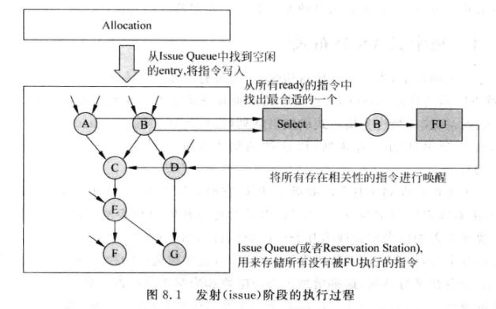

# 0x00. 导读

# 0x01. 简介

简单来说，发射 就是将符合一定条件的指令从发射队列(IssueQueue)中选出来，并送到 FU 中执行的过程。

对于一个 4-way 的超标量处理器来说，在寄存器重命名阶段每周期可以同时处理四条指令，重命名之后的指令被写到重排序缓存(ROB)的同时，也会被写到发射队列中，此时已经到达了超标量流水线的发射(issue)阶段，而发射队列正是这个流水段的关键部件。

发射队列也可以叫做 保留站(Reservation Station，RS)，不同的设计中称呼不同而已，在书中，统一称为发射队列，简称为 IQ。发射队列会按照一定的规则，选择那些源操作数都已经准备好的指令，将其送到 FU 中执行，这个过程称为发射。

对于简单的顺序执行(in-order)的处理器，指令按照程序中原始的顺序写到发射队列中，此时发射队列就相当于是一个 FIFO，只有最旧的那条指令的源操作数都准备好了，这条指令才会被发射，而这条指令如果没有发射，它后面的指令也无法继续发射，因此，这种设计是比较简单的。但是对于乱序执行(out-of-order)的超标量处理器来说，只有少数指令，例如 store 指令或分支指令，才会使用这种顺序执行的方法，而对于大多数的指令，都是按照乱序的方式进行发射，这种方式的设计难度相对是比较大的，是我们的重点内容。

指令到了发射队列中之后，就不会再按照程序中指定的顺序在处理器中流动，只要发射队列中的一条指令的操作数都准备好了，且满足了发射的条件(具体的条件下面会介绍)，就可以送到相应的 FU 中去执行。因此，发射队列的作用就是使用硬件保存一定数量的指令，然后从这些指令中找出可以执行的指令，而不管指令之间原始的顺序，这就是指令的乱序执行。正是由于发射队列在这个过程中起到了关键的作用，因此它设计的好坏直接决定着处理器能够获得的并行度。

在超标量处理器的流水线中，发射阶段的硬件比较复杂，一般它的时序都处于处理器当中的关键路径上，直接影响着处理器的周期时间，这个阶段的设计需要一定的折中，才能够在性能和复杂度之间找到一个可以接受的平衡点。从发射阶段的作用可以看出，它是处理器从顺序执行转到乱序执行的分界线，在发射阶段之前的所有指令都在流水线中按照程序中指定的顺序流动，而在发射阶段之后，所有的指令都是乱序执行的，直到流水线最后的提交(Commit)阶段，才利用重排序缓存(ROB)将这些指令又拉回到程序中指定的原始顺序。

# 0x02. 发射

## 2.1 硬件组成



上图中的发射阶段涉及的硬件有：

- 发射队列（Issue queue）：用来存储已经被寄存器重命名，但是没有被送到FU执行的指令，通常也被称为保留站(Reservation Station)。

- 分配电路（Allocation）：用来从发射队列中找到空闲的空间，将寄存器重命名之后的指令存储到其中，不同的发射队列的设计方法，会直接影响这部分电路的实现。

- 选择电路（Select）：也称为仲裁(Arbiter)电路，如果在发射队列中存在多条指令的操作数都已经准备好了，那么这个电路会按照一定的规则，从其中找出最合适的指令，送到FU中去执行。

- 唤醒电路（Wake-up）：当一条指令经过FU执行而得到结果数据时，会将其通知给发射队列中所有等待这个数据的指令，这些指令中对应的源寄存器就会被设置为有效的状态，这个过程就是唤醒。如果发射队列中一条指令的所有源操作数都有效了，则这个指令就处于准备好(ready)的状态，可以向选择电路发出申请。

上图中，发射队列中存储着 A~G 这七条指令，指令 A 和 B 都已经处于准备好的状态，经过选择电路的仲裁，选择指令 B 送到 FU 中进行运算，它运算完成后，会将发射队列中 和B指令的结果寄存器相同 的所有源寄存器(位于指令 C 和 D 中)也置为有效，这样就将相关的指令进行了唤醒。

## 2.2 发射阶段的实现方式

1. 集中式（Centralized）和分布式（Distributed）
2. 压缩式（Compressing）和非压缩式（Non-compressing）
3. 数据捕捉式（Data-capture）和非数据捕捉式（Non-data-capture）

### 2.2.1 集中式 VS. 分布式

集中式：所有 FU 公用一个发射队列（Centralized Issue Queue, CIQ）
- 优势：容量大，利用效率高
- 劣势：选择和唤醒电路会变得复杂
  
分布式：每个 FU 都有一个单独的发射队列（Distributed Issue Queue, DIQ）
- 优势：容量小，选择电路简单（每个FU对应一个选择电路即可）
- 劣势：
    - 指令分布较为分散，唤醒电路需要较多布线资源；
    - 效率低，会有“木桶效应”，只要一个队列满，就不能写入新指令，需要将发射之前的流水线都暂停。

实际现代处理器会结合上述两个方法，有些FU公用一个发射队列。其他用各自的发射队列。

### 2.2.2 数据捕捉 VS. 非数据捕捉

数据捕捉式：在流水线发射阶段之前读取寄存器，强调确保指令所需的数据输入已准备好后再发射指令，涉及数据依赖性和输入准备。

非数据捕捉式：在发射阶段之后读取物理寄存器，关注发射过程中的控制逻辑，可以在不考虑输入数据的情况下发射指令，以提高处理器的并行性和效率。

假设有以下指令：
```
ADD R1, R2, R3（需要输入）
NOP（无操作，不需要输入）
SUB R4, R1, R5（需要依赖于 ADD 的结果）
```
- 在发射阶段，处理器首先进行数据捕捉，确认 ADD 指令的输入 R2 和 R3 可用，然后发射 ADD。
- 接着，NOP 可以在执行单元空闲时立即发射，因为它不依赖于任何输入。
- 最后，SUB 指令必须等待 ADD 指令完成，并写回结果后，才能进行数据捕捉，然后发射。

### 2.2.3  压缩 VS. 非压缩
