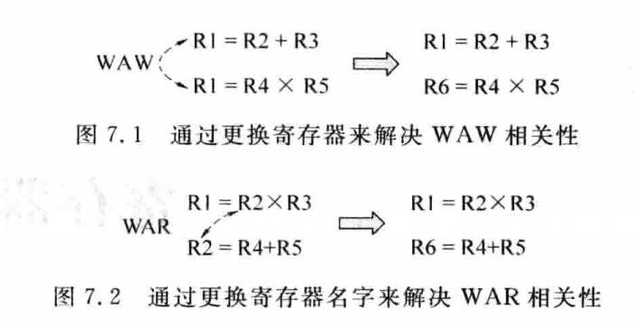
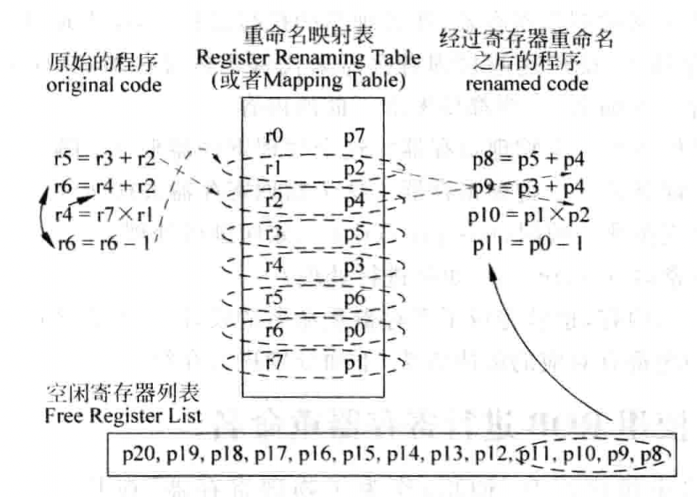

# 0x00. 导读

数据相关性。

# 0x01. 简介

在一个程序的不同指令之间，存在很多的相关性(dependency)，所谓相关性，是指一条指令的执行依赖于另外一条指令的结果，可以将相关性分为下面的几类：
- 数据相关性 (DataDependence)，包括以下几种。
    - Output dependence，又称为 先写后写(Write After Write，WAW) 相关性，表示两条指令都将结果写到同一个目的寄存器中；A 要等 B 写完了才能写。
    - Anti-dependence，又称为 先读后写(Write After Read，WAR) 相关性，表示一条指令的目的寄存器和它前面的某条指令的源寄存器是一样的；A 要等 B 读完了才能写。
    - True dependence，又称为 先写后读(Read After Write，RAW) 相关性，表示一条指令的源寄存器来自于它前面的某条指令计算的结果。A 要等 B 写完了才能读。

- 存储器数据的相关性(Memory Data Dependence)，表示访问存储器的指令(即 load和store指令)之间存在的相关性，这些相关性是和访问存储器的地址相关的，也可以分为 先写后写(WAW)、先读后写(WAR) 和 先写后读(RAW) 三种类型，例如一条 load 指令的地址和它之前的一条 store 指令的地址相等，则它们之间就存在 RAW 相关性。
  
- 控制相关性(ControlDependence)，由于分支指令而引起的相关性，使用分支预测
可以解决。

- 结构相关性(StructureDependence)，指令必须等到处理器当中某些部件(structure)可以使用的时候才可以继续执行，例如需要等到 发射队列(Issue Queue) 和 重排序缓存(ROB) 中有空闲的空间，或者 功能单元(FU) 的计算资源是空闲的等。
  
数据相关性 的三种类型 WAW、WAR 和 RAW，只有 RAW 是真的相关性，其他两种相关性都是和寄存器的名字有关的，可以通过使用不同的寄存器名字而解决。



通过更换寄存器的名字，就可以解决 WAW 和 WAR 相关性了，因此这两种相关性也称为假的相关性，它之所以存在，是由于下述的原因：
- 有限个数的寄存器，导致必须在某些地方重复地使用寄存器。
- 程序中的循环体(loop)，如果在一个循环体中向寄存器 R1 写入了值，那么每次循环的时候都会向 R1 中写人值，这就产生了大量的 WAW 类型的相关性，虽然可以使用拆解循环体(loopunrolling)的方法来解决这个问题，但是由于有限个数的寄存器，在循环体拆解到某一个时刻，总会有寄存器都用完的那个时候，此时出现WAW相关性就是不可避免的了，而且这样还会导致程序变得很大，需要占用更多的存储空间，也导致了 I-Cache 缺失率的升高。
- 代码重用(code reuse)，例如一些很小的函数(function)，在一段时间内被频繁调用的话，那么这就和上述的循环体中的情况是一样的了，例如在函数中，向寄存器 R1 写人了值，那么如果频繁地调用这个函数，处理器中就存在大量的指令都向 R1 寄存器中写入值即存在WAW相关性。虽然可以通过将函数程序嵌入到调用程序中(即inlining)的方法来解决这个问题，但是仍旧会遇到上述的情况，寄存器会在某个时刻被用光，此时WAW相关性就不可避免，而且程序会变得很大，占用更多的存储空间，也导致了 I-Cache 缺失率的升高。

说到底都是寄存器个数有限，可以增加寄存器，但是会导致兼容问题，而且不停的加也总有用完的时候，最好的解决办法就是使用硬件管理的寄存器重命名（Resigter Renaming）。

# 0x02. 寄存器重命名（Resigter Renaming）

处理器中实际存在的寄存器个数要多于指令集中定义的通用寄存器的个数，这些在处理器内部实际存在的寄存器称为 **物理寄存器(PhysicalRegister)**，与之对应的，指令集中定义的寄存器称为 **逻辑寄存器(LogicalRegister，或 ArchitectureRegister)**。逻辑寄存器指的是在指令集中定义的通用寄存器，例如 MIPS 处理器定义了 R0~R31 这 32 个通用寄存器，它们就是逻辑寄存器，而物理寄存器是指经过寄存器重命名之后使用的寄存器，它才是在处理器中真正存在的寄存器。

一般情况下，物理寄存器的个数要多于逻辑寄存器的个数，这样才可以使寄存器命名得以发挥作用（因为寄存器重命名需要把逻辑寄存器和物理寄存器对应起来）。

处理器在进行寄存器重命名的时候，会动态地将逻辑寄存器映射到物理寄存器，这样可以解决 WAW 和 WAR 的相关性，如图。



上图中，有 r0~r7 共 8 个逻辑寄存器，有 p0~p20 共 21 个物理寄存器。在编写程序的时候(或者编译器编译的时候)，会直接使用指令集中定义的逻辑寄存器，如图中给出的原始程序，箭头表示了指令之间存在的 WAW 和 WAR 相关性，这些假的相关性制约了原始的程序可以获得的并行性，需要通过寄存器重命名的方法将它们消除掉。

图中的 重命名映射表(RegisterRenamingTable，Intel也将其称为Register AliasTable，RAT) 和 空闲寄存器列表(Free Register List) 用来完成这个过程，其中重命名映射表用来保存已经存在的映射关系，例如一个逻辑寄存器映射到了哪个物理寄存器。对于程序中的指令来说，它的源寄存器通过读取重命名映射表，就可以得到它们对应的物理寄存器了，顾名思义，重命名映射表是一个表格，它可以基于 SRAM 来实现，也可以基于 CAM 来实现；空闲寄存器列表用来记录哪些物理寄存器是空闲的，在进行寄存器重命名时，会通过这个表格来获得空闲的物理寄存器的编号。图中的右边部分就是将原始程序经过寄存器重命名之后得到的程序，这个程序将真正地在处理器内部被执行，经过重命名之后的程序已经不存在 WAW 和 WAR 的相关性了，因此在超标量处理器中，这个程序可以获得最大的并行性，从而尽快地执行完毕。

## 2.1 实现方式

寄存器重命名(RegisterRenaming)只是提出了一个概念，具体的实现方式是有很多种的，这就像 ISA 只是定义了处理器的一种行为，具体如何实现是千差万别的，同样是基于 x86 指令集， Intel 和 AMD 的处理器就是截然不同的。对于寄存器重命名来说，概括起来有三种方式都可以实现它，这三种方式分别如下：

- 将 逻辑寄存器(Architecture Register File, ARF) 扩展来实现寄存器重命名;
- 使用统一的 物理寄存器(Physical RegisterFie, PRF) 来实现寄存器重命名;
- 使用 ROB 来实现寄存器重命名。

上面的三种寄存器重命名的实现方式，各有其优点和缺点，在现代的处理器中均有采用，例如 Intel 多采用第 3 种方法，而 MIPS 则采用第 2 种方法等。

这三种方法的本质都是要将指令集中定义的逻辑寄存器，在处理器的执行过程中，动态地映射到处理器内部实际使用的物理寄存器上，使用这些物理寄存器来代替逻辑寄存器，从而可以增加寄存器的个数。要实现寄存器重命名，一般都要考虑下面的内容：
- 什么时候占用一个物理寄存器？这个物理寄存器来自于哪里？
- 什么时候释放一个物理寄存器？这个物理寄存器去往何处？
- 发生分支预测失败时(mis-prediction)，如何进行处理？
- 发生异常时(exception)，如何进行处理？
  
解决了上面的内容，也就完成了寄存器重命名的设计，上面讲述的三种寄存器重命名的方法对这几个问题都有对应的解决方法，下面分别进行介绍。

## 2.2 使用 ROB 来实现寄存器重命名

ROB（Reorder Buffer，重排序缓冲区）是一个用于存放未完成指令的缓冲区。每个指令在解码后，都会被送入 ROB 中等待执行。ROB 中的指令可以按照不同的顺序执行，而不一定要按照程序中的顺序。这为乱序执行提供了基础。

具体工作流程如下：

- 指令进入ROB： 当一条指令被取出来时，它会被放入 ROB 中。
- 寄存器重命名： 指令在进入 ROB 时，会进行寄存器重命名。即为指令的目的寄存器分配一个物理寄存器，并将这个映射关系记录在 ROB 中。
- 乱序执行： 只要指令的所有操作数准备就绪，它就可以从 ROB 中取出并执行，无需等待前面的指令执行完成。
- 结果写入： 指令执行完成后，其结果会写回到 ROB 中对应的位置。
- 指令提交： 当一条指令成为 ROB 中最老的指令，且其所有相关的指令都已经完成时，它就会从 ROB 中提交，并将结果写入实际的寄存器中。

例如，假设有三条指令：
```
1. ADD R1, R2 -> R3   // 将 R1 和 R2 相加，结果存储在 R3
2. SUB R3, R4 -> R5   // 将 R3 减去 R4，结果存储在 R5
3. MUL R1, R3 -> R6   // 将 R1 和 R3 相乘，结果存储在 R6
```

通过寄存器重命名和 ROB，我们可以：

- 重命名 R3 为 P5（物理寄存器 5），R5 为 P6，R6 为 P7。
- ADD 指令会执行，并将结果写入 P5（而不是直接写到 R3）。
- SUB 指令继续执行，结果暂存在 P6（而不是 R5）。
- 在 MUL 指令执行时，它会使用之前重命名的 P5（而不是 R3），避免了依赖冲突。
- 最终，ROB 确保这些指令的提交顺序正确，将 P5 的结果写回到 R3，P6 写回到 R5，P7 写回到 R6。

## 2.3 使用 ARF 扩展来实现寄存器重命名

在 使用 ROB 来实现寄存器重命名 上更进一步。

## 2.4 使用统一的 PRF 实现寄存器重命名

在 使用 ARF 扩展来实现寄存器重命名 上更进一步。