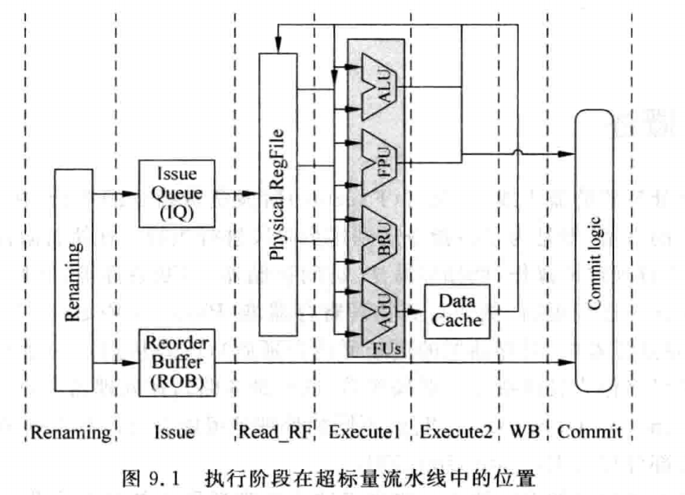
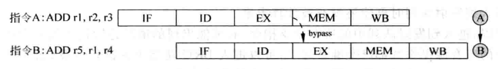

# 0x00. 导读

# 0x01. 简介

在超标量处理器的流水线中，执行(Execute) 阶段负责指令的执行，在流水线的之前阶段做了那么多的事情，就是为了将指令送到这个阶段进行执行。

在执行阶段，接收指令的源操作数，对其进行规定的操作，例如加减法、访问存储器、判断条件等，然后这个执行的结果会对处理器的状态进行更新，例如写到物理寄存器堆(Physical Register File)中，写到存储器中，或者从指定的地址取指令等，同时这个执行结果可以作为其他指令的源操作数(这就是**旁路**)，在处理器中，负责执行的部件称为 **Function Unit(FU)**。当然，不同的处理器可能会对此有不同的称呼，例如 Intel 就将这些执行部件称为 ExecuteUnit(EU)。

一个处理器中包括的 FU 的类型取决于这个处理器所支持的指令集，在指令集中定义了各种需要的运算，概括来讲，一般的 RISC 指令集都包括下面的操作类型：
- 算术运算，例如加减法、乘除法、逻辑运算和移位运算等。
- 访问存储器的操作，例如从存储器中读取数据(即load指令)和写数据到存储器中(即 store指令)。
- 控制程序流的操作，包括分支(branch)、跳转(jump)、子程序调用(CALL)、子程序返回(Return)等类型的指令，主要是对PC的控制。
- 特殊的指令，用来实现一些特殊功能的指令，例如现代的处理器为了保证访问存储器指令的正确执行，还使用了 memory barrier 类型的指令。

# 0x02.

不同类型的指令有着不同的复杂度，因此在 FU 中的执行时间也是不同的，这称做不同的 latency ，并且在现代的处理器当中，为了获得更大的并行度，一般都会同时使用几个 FU 进行并行的运算，例如有的FU进行算术运算、有的FU进行存储器的访问、有的FU控制程序流的方向、有的FU进行浮点运算等。

每个FU都有不同的延迟时间，FU 的个数决定了每周期最大可以并行执行的指令个数，也就是前文中所说的 **issue width**。FU在运算完成后，并不会使用它的结果马上对处理器的状态进行更新(这个状态称为 Architecture State)，例如它不会马上将结果写到逻辑寄存器堆(ARF)中，而是将结果写到临时的地方，例如写到物理寄存器堆(Physical Register File, PRF)中，这些状态称为 推测状态(Speculative State)，等到一条指令顺利地离开流水线的时候(也就是退休的时候)，它才会真正地对处理器的状态进行更新不同的处理器，在流水线的执行阶段的设计也是大不相同的，不过有一条可以确定的是，不管是顺序执行(in-order)还是乱序执行(out-of-order)的处理器，都会使用多个 FU 来提高程序执行的并行度。

上图的执行阶段包括了所有的 FU，是处理器中可以使用的计算资源：
- FPU(Floating-Point Unit) 用来对浮点数进行运算; 
- ALU(Arithmetic Logic Unit) 用来对整数进行算术和逻辑运算;
- AGU(AddressGenerationUnit) 用来计算访问存储器的地址，当使用虚拟存储器时，AGU 计算的地址只是虚拟地址，还需要将它转换为物理地址;
- BRU(BranchUnit)用来对控制程序流的指令计算目标地址。

当然，这些都是很典型的FU，在现实的处理器中还有很多其他功能的FU，用来处理各种千奇百怪的指令。

执行阶段另一个重要的部分就是 **旁路网络(bypassing network)**，它负责将 FU 的运算结果马上送到需要它的地方，例如物理寄存器堆、所有FU的输入端、Store Buffer 中等。在现代的超标量处理器中，如果想要背靠背地执行相邻的相关指令，旁路网络是必需的，但是随着每周期可以并行执行的指令个数的增多，旁路网络变得越来越复杂，已经成为处理器中制约速度提升的一个关键部分。

假设先不考虑旁路网络，那么指令的操作数可以来自物理寄存器堆(对应于非数据捕捉的结构)，也可以来自于 payload RAM (对应于数据捕捉的结构)，那么此处仍需要考虑的一个问题是:每个 FU 和物理寄存器堆(或者 payload RAM)的各个读端口之间是怎样对应起来的呢？答案是仲裁电路。

# 0x03. 旁路网络

一条指令经过 FU 计算之后，就可以得到结果了，但是由于超标量处理器中的指令是乱序执行的，而且存在分支预测，所以这条指令的结果未必是正确的，此时称这个计算结果是推测状态的(speculative)，一条指令只有在顺利地离开流水线的时候（即退休的时候），才会被允许将它的结果对处理器进行更新，此时这条指令的状态就变为了正确状态（在处理器中，这称为Architecture State），此时可能距离这个结果被计算出来已经很久了（例如这条指令之前存在一条D-Cache缺失的load指令），后续的指令不可能等到这条指令顺利地离开流水线的时候才使用它的结果，这样虽然能够保证正确性，但是执行效率太低；如果等到指令将结果写到物理寄存器堆之后(假设采用统一的 PRE 进行重命名)，后续相关的指令才从物理寄存器堆中读取数据，这样会提高一些执行效率，但是仍然不是完美的解决方法。

事实上，一条指令只有到了流水线的执行阶段才真正需要操作数，到了执行阶段的末尾就可以得到它的结果，因此只需要从FU的输出端到输入端之间架起一个通路，就可以将FU的结果送到所有FU的输入端。当然，在处理器内部的很多其他地方可能也需要这个结果，例如物理寄存器堆、payloadRAM等，因此需要将FU的结果也送到这些地方，这些通路是由连线和多路选择器组成的，通常被称为 旁路网络(bypassing network)，它是超标量处理器能够在如此深的流水线情况下，可以背靠背执行相邻的相关指令的关键技术。

