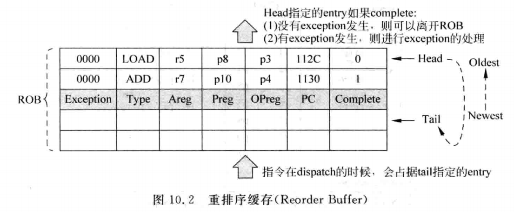

# 0x00. 导读

# 0x01. 简介

在程序员编写程序的时候，认为程序的执行都是按照串行的顺序进行的，只有前面的一条指令执行完了，后面的指令才可以执行，因此处理器在执行程序的时候，也必须要保证这种串行的结果，否则就会和程序最初的预想不一致了。

但是在现代的超标量处理器中，指令在处理器内部执行的时候，是不会按照这种严格的串行方式执行的，例如在流水线的处理器中，在同一个时刻其实是有很多条指令都存在于处理器中。但是，如果处理器想要正确地执行程序，就必须要维持程序当中的串行顺序，尤其是对于超标量处理器来说，由于它按照乱序(out-of-order)的方式执行指令，为了保持程序执行结果的串行性，一般在超标量处理器的流水线中增加最后一级阶段，称为**提交(Commit)**阶段，当一条指令到达流水线的这个阶段后，会将这条指令在重排序缓存(ROB)中标记为已完成的(complete)状态，需要注意的是，这个状态只表示这条指令已经计算完毕，并不表示它可以离开流水线。在前面已经提到过，流水线中所有的指令都按照进入流水线的顺序在 ROB 中进行了记录，只有在 ROB 中最旧的那条指令变为已完成的状态时，这条指令才允许离开流水线，并使用它的结果对处理器的状态进行更新，此时称这条指令退休(retire)了，从这个过程可以看出，一条指令可能需要在流水线的提交阶段等待一段时间，才可以从流水线中退休，而 ROB 正是完成这个功能的关键部件，因此它也是流水线的提交阶段最重要的一个部件。一条指令到达流水线的提交阶段并不一定代表这条指令就一定是正确的，由于分支预测失败(misprediction)和异常(exception)等原因，一条处于已完成状态的指令很可能还会从流水线中被抹掉，只有在这条指令之前进入到流水线中的所有指令都已经退休了，并且这条指令已经处于已完成状态的时候，它才可以退休而离开流水线，这样可以使程序在超标量处理器中执行的时候有串行的效果。

当一条指令没有退休之前，它的状态都是推测的(speculative)，只有当这条指令真正退休而离开流水线的时候，才可以将它的结果更新到处理器的状态中，这样即使有分支预测失败或者异常，也不会将错误的状态暴露给程序员。在前文讲过，流水线的分发(Dispatch)阶段是处理器从顺序执行(in-order)到乱序执行(out-of-order)的分界点，那么现在，流水线的提交阶段又将处理器从乱序的状态拉回到顺序执行的状态。不管超标量处理器内部发生了怎样的事情，从处理器外部看起来，它总是按照程序中指定的顺序执行的，任何预测技术所产生的错误，在处理器内部都会解决掉，不会将这些错误的状态表现出来，从这个角度来看，超标量处理器堪称是一个伪装高手。

同时，维持程序执行的串行性，也是精确的异常(preciseexception)所要求的，**精确异常的定义是：当一条指令发现异常时，这条指令前面的所有指令都已经完成，而这条指令及其后面的所有指令都不应该改变处理器的状态**。处理器当中的异常有很多种，这取决于 ISA 的定义，例如当程序出现 Page Fault、除零等异常时，都需要进行处理。如果能够维持精确的异常，会降低处理器对异常处理的难度，在超标量处理器中，流水线的提交阶段的一个重要任务就是要对异常进行处理。

还需要注意的是，对于一个 N-way 的超标量处理器来说，因为每周期最少可以取得 N 条指令送入到流水线中，流水线的提交阶段每周期也最少需要将 N 条指令退休，这样才能保证流水线不会被堵塞，所有顺利地离开流水线的指令要根据程序中原始的顺序来更新处理器的状态。

# 0x02. ROB， Reorder Buffer

在流水线的提交(Commit)阶段，之所以能够将乱序执行的指令变回程序中指定的顺序状态，主要是通过重排序缓存(Reorder Buffer，ROB)来实现的，ROB 本质上是一个FIFO，在它当中存储了一条指令的相关信息，例如这条指令的类型、结果、目的寄存器和异常的类型等，如图所示

ROB 的容量决定了流水线中最多可同时执行的指令个数。

ROB表项的内容包括:

- Complete : 表示指令是否执行完毕
- Areg: 指令在原始程序中指定的目的寄存器， 以逻辑寄存器形式给出
- Preg: 指令的 Areg 经过寄存器重命名后对应的物理寄存器编号
- OPre: 指令的 Areg 被重命名为 Preg 之前， 对应的旧的 Preg， 当指令发生异常进行状态恢复时会用到
- PC: 指令对应的 PC
- Exception: 如果发生异常， 会将类型写到这里， 当指令退休时会处理
- Type: 指令类型， 退休时根据不同指令有不同的动作

在流水线的分发(Dispatch)阶段，指令会按照进入流水线的顺序写到 ROB 中，同时 ROB 中对应的 complete 状态位会被置为0，表示这些指令没有执行完毕，在以后的某个时间，当某条指令执行结束了，它就变为了 complete 状态，此时会将 ROB 中对应的 complete 状态位置为 1，这条指令的计算结果可以放在 ROB 中，也可以放在物理寄存器堆(PRF)中，这取决于架构的实现。一条指令在执行的过程中如果发生了异常，也会将异常的类型记录在 ROB 中，异常的处理会统一放在流水线的提交阶段。指令一旦在流水线的分发阶段占据了 ROB 中的一个表项，这个表项的编号会一直随着这条指令在流水线中流动，这样指令在之后的任何时刻，都可以知道如何在 ROB 中找到自己。

一条指令一旦变为 ROB 中最旧的指令(在上图中，使用 head pointer 来指示最旧的指令)并且它的 complete 状态位也为1，就表示这条指令已经具备退休(retire)的条件了如果这条指令在之前没有发生过异常，也就是它在 ROB 中对应的 exception 部分为 0，则这条指令可以顺利地离开流水线，它的结果可以对处理器的状态进行更新；如果这条指令发生过异常，那么就要启动异常的处理过程。