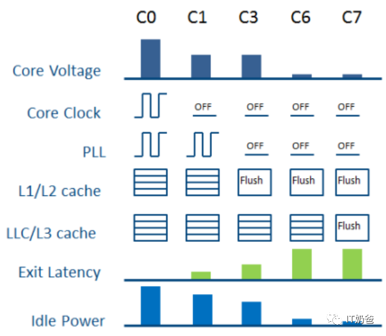

# 0x00. 导读

[CPU_frequency_scaling](https://wiki.archlinux.org/title/CPU_frequency_scaling)  
[中文](https://wiki.archlinuxcn.org/wiki/CPU_%E8%B0%83%E9%A2%91)

# 0x01. 简介

C-State P-State

# 0x02. C-State

为了在 CPU 空闲时节约能源，可以使用命令让 CPU 进入低功耗模式。每个 CPU 都有几种功耗模式，它们统称为 C-State 。

这些模式的工作原理是降低 CPU 内空闲单元的时钟信号和功率。通过降低时钟信号和电压停止（甚至完全关闭）的 CPU 单元越多，功耗就越低。但是，要从休眠模式中完全唤醒CPU，需要花费更长时间。

这些模式 C-State 从 C0 开始，C0 表示正常的 CPU 运行模式（CPU 已 100% 激活）。C 后的数字越大，表示 CPU 进入休眠模式的程度越深。换言之，关闭的电路和时钟信号越多，完全唤醒 CPU 进入 C0 模式需要的时间越长。

## 2.1 Thread C-states

软件可以在线程级别请求进入 C-states 。当一个线程进入线程 C-state 时，如果没有引发 core C-state ，那么通常不会产生可见的功耗节省效果，或者节省的功耗非常有限。在支持 SMT 的 CPU 上，线程 C-states 实际上是进入 core C-states 的一个中间步骤。而在不支持 SMT 的 CPU 上，线程 C-states 和 core C-states 实际上是相同的。 

通过将线程级别的 C-states 和 core 级别的 C-states 结合起来管理，我们可以更精确地控制 CPU 的功耗和性能。在一些高性能应用场景中，我们可以让某些线程进入较浅的 C-states ，以保持高性能，而其他较空闲的线程则可以进入更深的 C-states ，以实现节能效果。这种精细的管理方式可以使得CPU在兼顾性能的同时，最大限度地降低功耗。

## 2.2 Core C-States

在 C-states 中， Core C-states 的作用是确定core是处于开启还是关闭状态。在正常执行中，core 通常处于 C0 状态，即活跃状态。当软件（通常是操作系统）指示逻辑处理器进入空闲状态时，它将进入一个 C-state。

各种唤醒事件可能触发 core 重新开始执行代码（常见的例子是中断和定时器）。软件向CPU提供关于应该进入的状态的提示。 MWAIT 指令用于告诉 CPU 进入 C-state，并包含有关所需状态的参数。然而，CPU的电源管理子系统有权执行其认为最佳的状态（这称为 C-state 降级 C-state demotion），也就是说将在外，君命有所不受。操作系统可以建议 CPU 休息，但是CPU表示我还可以继续肝！

# 0x03. P-State

P-state 是 performance state ， 当 CPU 处于 C0-state 的时候，可以按照 P-state 来细分。P0 是最高频，越往后频越低。