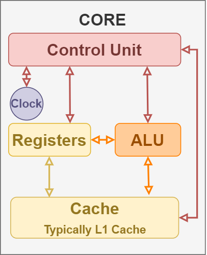
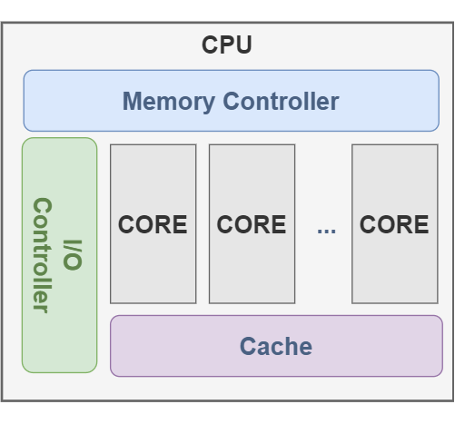
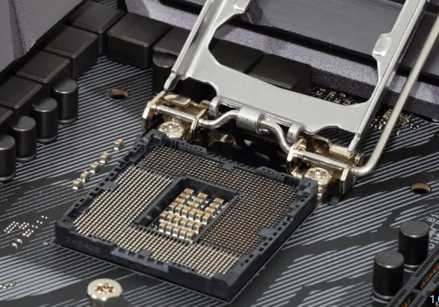
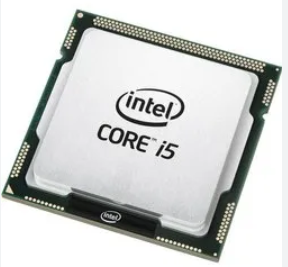
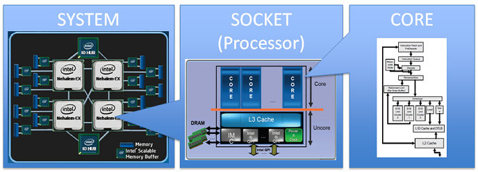

# 0x00. 导读

# 0x01. 简介

# 0x02. 

- core: CPU 的基本计算单元，用来运行程序，维护程序的状态、寄存器、指令，通过 ALUs(算数逻辑单元) 来执行相应的操作。如果支持硬件线程(hardware thread)的话(例如 Intel 的超线程(hyperthreading))，就可以同时运行多个程序。

- CPU: 包含一个或者多个 core 用来执行任务。最多可以同时运行 X 个任务，X = number cores * number of hardware threads per core. 如果超过了 X ，其余的就需要等 OS 调度。当存在多个 core 的时候，就需要内存控制器、IO 控制器等，以前这些东西都是在 CPU 的外面，现在大多数都会集成在 CPU 里面了。（很多文章中用到的名词 CPU 其实是一个模糊的概念，可以指 processor, core, 超线程）

- Processor: 处理器，也有称为 socket ，就是我们经常看到的那个很值钱的小玩意，上面包含一个或者多个 core. **注意，这并不与 CPU 冲突，CPU 其实是一个软件层面的概念，而 Processor 是硬件层面的。**

- 超线程: 相当于一个逻辑核心，在硬件角度上来说，实际上是添加了计算单元和逻辑单元，但是没有分配缓存和控制器的逻辑核心。这个逻辑核心可以进行独立的计算，但是缓存【无论是指令缓存还是数据缓存】是和 core 是共享的，也就是说 core 分出了一部分 L1 和 L2 给超线程的逻辑核心。

    > The following resources are shared between two threads running in the same core:
    - Cache
    - Branch prediction resources
    - Instruction fetch and decoding
    - Execution units

软件的角度：




socket 的样子，固定 CPU 的插座，如下图。一般个人电脑主板上只有一个 socket，服务器主板可能有多个 socket。



processor 的样子



硬件的角度：



# 0x03. 命令

## 3.1 查看 CPU 型号和频率 - model

```bash
# CPU型号
$ cat /proc/cpuinfo | grep "model name" | uniq
model name      : Intel(R) Xeon(R) CPU E5-2640 v4 @ 2.40GHz

# CPU频率
$ cat /proc/cpuinfo | grep "cpu MHz" | uniq
cpu MHz         : 1547.537
cpu MHz         : 1250.590
cpu MHz         : 2183.637
```

## 3.2 查看物理 CPU 个数 - chip

主板上实际插入的 CPU 数量，可以数不重复的 physical id 字段有几个，即可。
```bash
# 物理CPU数量
$ cat /proc/cpuinfo | grep "physical id" | sort | uniq | wc -l
2
```

## 3.3 查看每个物理 CPU 中 core 的个数 - core - 核数

单块 CPU 上面能处理数据的芯片组的数量，如双核、四核等，成为 cpu cores。
```bash
# CPU核数
$ cat /proc/cpuinfo | grep "cpu cores" | uniq
cpu cores       : 10
```

## 3.4 查看逻辑 CPU 的个数 - processor

一般情况下，逻辑 CPU = 物理 CPU 个数 × 每颗核数，如果不相等的话，则表示服务器的 CPU 支持超线程技术。超线程技术(HTT)：简单来说，它可使处理器中的 1 颗内核如 2 颗内核那样在操作系统中发挥作用。这样一来，操作系统可使用的执行资源扩大了一倍，大幅提高了系统的整体性能，此时逻辑 CPU = 物理 CPU 个数 × 每颗核数 × 2。
```bash
# 逻辑CPU数
$ cat /proc/cpuinfo | grep "processor" | wc -l
40
```

## 3.5 查询系统 CPU 是否启用超线程 - HTT

```bash
# 查询方式
$ cat /proc/cpuinfo | grep -e "cpu cores"  -e "siblings" | sort | uniq
cpu cores       : 10
siblings        : 20
```