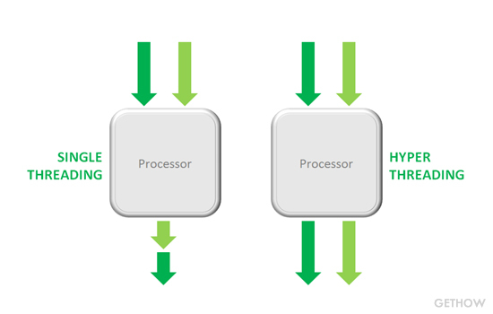
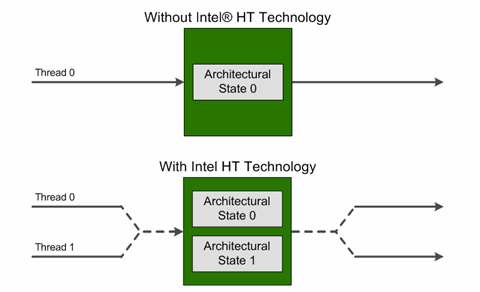
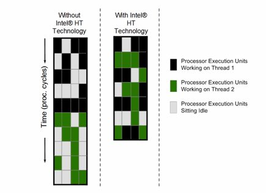

# 0x00. 导读

# 0x01. 简介

# 0x02. core CPU Processor

- core: CPU 的基本计算单元，用来运行程序，维护程序的状态、寄存器、指令，通过 ALUs(算数逻辑单元) 来执行相应的操作。如果支持硬件线程( hardware thread )的话(例如 Intel 的超线程( hyperthreading ))，就可以同时运行多个程序。

- CPU: 包含一个或者多个 core 用来执行任务。最多可以同时运行 X 个任务，X = number cores * number of hardware threads per core. 如果超过了 X ，其余的就需要等 OS 调度。当存在多个 core 的时候，就需要内存控制器、IO 控制器等，以前这些东西都是在 CPU 的外面，现在大多数都会集成在 CPU 里面了。（很多文章中用到的名词 CPU 其实是一个模糊的概念，可以指 processor, core, 超线程）

- Processor: 处理器，也有称为 socket ，就是我们经常看到的那个很值钱的小玩意，上面包含一个或者多个 core. **注意，这并不与 CPU 冲突，CPU 其实是一个软件层面的概念，而 Processor 是硬件层面的。**

- 超线程: 相当于一个逻辑核心，在硬件角度上来说，实际上是添加了计算单元和逻辑单元，但是没有分配缓存和控制器的逻辑核心。这个逻辑核心可以进行独立的计算，但是缓存【无论是指令缓存还是数据缓存】是和 core 是共享的，也就是说 core 分出了一部分 L1 和 L2 给超线程的逻辑核心。  
它的原理很简单，就是把一颗CPU当成两颗来用，将一颗具有超线程功能的物理CPU变成两颗逻辑CPU，而逻辑CPU对操作系统来说，跟物理CPU并没有什么区别。因此，操作系统会把工作线程分派给这两颗（逻辑）CPU上去执行，让（多个或单个）应用程序的多个线程，能够同时在同一颗CPU上被执行。  
超线程( hyper-threading )其实就是同时多线程( simultaneous multi-theading ),是一项允许一个CPU执行多个控制流的技术。  
[Hyper-threading](https://en.wikipedia.org/wiki/Hyper-threading): Hyper-Threading Technology is a form of simultaneous multithreading technology introduced by Intel, while the concept behind the technology has been patented(专利) by Sun Microsystems.



    > The following resources are shared between two threads running in the same core:
    - Cache
    - Branch prediction resources
    - Instruction fetch and decoding
    - Execution units

软件的角度：


硬件的角度：


socket 的样子，固定 CPU 的插座，如下图。一般个人电脑主板上只有一个 socket，服务器主板可能有多个 socket。


processor 的样子


## 2.1 超线程(Hyper Threading)

[Will Hyper-Threading Improve Processing Performance?](https://www.dasher.com/will-hyper-threading-improve-processing-performance/)

> Intel Hyper-Threading Technology can boost processing performance of a system by up to 30%.  Hyper-threading creates two logical processors from one physical processor core.  It does so by providing two sets of registers (called architectural states) on each core.    
> 英特尔超线程技术可将系统处理性能提升高达 30%。超线程从一个物理处理器核心创建两个逻辑处理器。它通过在每个核心上提供两组寄存器（称为架构状态）来实现这一点。

> When hyper-threading is enabled on an Intel socket, the second architectural state on each core can accept threads from the operating system (or hypervisor).  These two threads will still share internal microarchitecture components called execution units.  This can result in up to 30% more processing performance in a single socket system.  In dual socket systems, hyper-threading can provide up to a 15% improvement.   
> 当在英特尔插槽上启用超线程时，每个内核上的第二架构状态可以接受来自操作系统（或虚拟机管理程序）的线程。这两个线程仍将共享称为执行单元的内部微架构组件。这可以使单插槽系统的处理性能提高多达 30%。在双插槽系统中，超线程可以提供高达 15% 的改进。





缺点一：  

该技术允许一个物理处理器内核在操作系统调度器层面上充当两个逻辑处理器。 虽然一些执行资源，如缓存、执行单元和总线是共享的，但每个逻辑处理器都有自己的架构状态，有自己的一组“通用寄存器”和“控制寄存器”。

需要注意，有资源的共享，意味着，有“锁”和有“锁争用”的不确定性。

缺点二：  

> [缓存抖动(cache thrashing)](https://link.zhihu.com/?target=https%3A//www.cs.uaf.edu/2011/spring/cs641/proj1/rltorgerson/%23%3A~%3Atext%3DSMT%2520processor%2520will%2520have%2520%252242%2525%2520more%2520cache%2520thrashing%2522%2520over%2520the%2520SMP%2520design)  
They also state that while there(SMT) will be greater efficiency in the pipeline over the SMP processor, they have found that an SMT processor will have "42% more cache thrashing" over the SMP design.  
他们还指出，虽然 SMT 的处理器的流水线效率比 SMP 更高，但他们发现 SMT 处理器比 SMP多出 42% 的缓存抖动。

缺点三：  

[Hyperthreading, L1/L2 caching, cache busting, thread trashing, and priority bumping!](https://link.zhihu.com/?target=https%3A//www.javapubhouse.com/2013/05/episode-38-hyperthreading-l1l2-caching.html) 超线程、L1/L2 缓存、缓存破坏、优先级碰撞！

Linux 在为线程选择执行 Core 时，也会考虑到上面 Cache 的复用优化。  
而同一 物理 Core 上的两个逻辑 Core 可能会相互干扰 Cache。试想如果两个不同应用执行于同一物理 Core，干扰将放大。

# 0x03. 命令

## 3.1 查看 CPU 型号和频率 - model

```bash
# CPU型号
$ cat /proc/cpuinfo | grep "model name" | uniq
model name      : Intel(R) Xeon(R) CPU E5-2640 v4 @ 2.40GHz

# CPU频率
$ cat /proc/cpuinfo | grep "cpu MHz" | uniq
cpu MHz         : 1547.537
cpu MHz         : 1250.590
cpu MHz         : 2183.637
```

## 3.2 查看物理 CPU 个数 - chip

主板上实际插入的 CPU 数量，可以数不重复的 physical id 字段有几个，即可。
```bash
# 物理CPU数量
$ cat /proc/cpuinfo | grep "physical id" | sort | uniq | wc -l
2
```

## 3.3 查看每个物理 CPU 中 core 的个数 - core - 核数

单块 CPU 上面能处理数据的芯片组的数量，如双核、四核等，成为 cpu cores。
```bash
# CPU核数
$ cat /proc/cpuinfo | grep "cpu cores" | uniq
cpu cores       : 10
```

## 3.4 查看逻辑 CPU 的个数 - processor

一般情况下，逻辑 CPU = 物理 CPU 个数 × 每颗核数，如果不相等的话，则表示服务器的 CPU 支持超线程技术。超线程技术(HTT)：简单来说，它可使处理器中的 1 颗内核如 2 颗内核那样在操作系统中发挥作用。这样一来，操作系统可使用的执行资源扩大了一倍，大幅提高了系统的整体性能，此时逻辑 CPU = 物理 CPU 个数 × 每颗核数 × 2。
```bash
# 逻辑CPU数
$ cat /proc/cpuinfo | grep "processor" | wc -l
40
```

## 3.5 查询系统 CPU 是否启用超线程 - HTT

```bash
# 查询方式
$ cat /proc/cpuinfo | grep -e "cpu cores"  -e "siblings" | sort | uniq
cpu cores       : 10
siblings        : 20
```

# 0x04. CPU 参数相关术语

- 时钟速度

    时钟速度(clock speed)衡量 CPU 每秒执行的周期数，以 GHz（千兆赫）为单位。

    时钟速度为 3.2 GHz 的 CPU 每秒执行 32 亿个周期。有时，多个指令在单个时钟周期内完成；有时，一条指令可能需要多个时钟周期来处理。

- 主频

    主频就是控制 CPU 工作的时钟信号的频率，目前通常为单位 GHz，厂商标注的主频是 CPU 的默认运行频率（也叫 默频），就是 CPU 在正常运行时通常优先使用的频率。也称为 **处理器基本频率(Processor Base Frequency)**

- 外频 倍频

    CPU 的性能太高、运行速度太快，外部设备如主板、内存等速度跟不上 CPU 的频率，外部设备采用较低的时钟信号频率叫做 **外频**（也叫 **系统总线频率**），CPU 的主频相对于外频的倍数叫做 **倍频**（也叫 **倍频系数**）。

- 睿频 睿频加速技术

    现在的 CPU 更加智能化，可以根据 CPU 任务的强度等进行灵活调整工作：比如 CPU 温度过高就自动降频以避免过热烧毁；任务量大了就适当提高频率快速完成；对于多核 CPU 还可以智能关闭一些空闲的核心，把动力给正在使用的核心使它们更高频率运行以提升性能等。

    总之，运行轻量任务时降频以降低功耗，运行重负荷任务时提升频率以保证流畅，这种智能调节可以兼顾性能、功耗与CPU的健康稳定等因素。

    这种技术叫 **睿频加速技术**（Intel 称之为 Turbo Boost ，AMD 称为 Turbo Core ），就是通过 CPU 的智能控制，使频率可以在一范围内根据任务进行自动调整。

    这种睿频加速技术能达到的最高频率厂家标注为该 CPU 的 **睿频**。有时候商标上的最大睿频就是这个意思，甚至还有 英特尔睿频加速max技术3.0频率 ，可能比最大睿频还大，因为睿频加速技术更先进了，明白原理就好。

    知乎例子：例如睿频到 3.6 是怎么理解呢？首先假设主频是 3 ，指的是 intel 在正常可控情况下，cpu 所有核心同时可以稳定工作的最大频率(定义为 情况1)。  
    但在实际应用中，并非所有的应用都会把所有内核都用满。由于 intel 现在的 cpu cores 的频率都可以独立调整，这时候就会把使用率高的核心调整到主频，其他空闲核心调整到低频率(现在一般是 0.8G )。这种情况下相比于之前所有核心同时工作在 3G(情况1) 相比，功耗和发热肯定更低(因为大多数核心处于低功耗状态)。这个时候睿频起的作用就是把高负载的核心频率提升到某个值(情况2)，使这个时候 cpu 的功耗和发热与所有核心同时工作的时候(情况1)相近。这里 情况2 的最大核心频率就是标称的睿频值 3.6G 。  
    如果有某个程序占用两个 cpu 核心并且跑满，另外的核心处于低功耗状态，这时候睿频同样可以让两个高负载的核心提升频率，但显然，这时候有两个内核满负载，如果同样跑在 情况2 所在的频率上，功耗和发热肯定更高，所以两个核心可以睿频的频率就比 情况2 的情况更低，同样达到一个平衡值(情况3)，这时候可能两个内核跑 3.4G，另两个跑 0.8G。三个核心满载的情况类似。

- 超频(Over Clock) 锁频

    厂家出厂时按 CPU 不同的体质标注 CPU 的主频、睿频，从而同一系列 CPU 划分为不同的型号。 其实这是官方认定的能保证稳定运行的频率，但可能并未完全达到该 CPU 的极限能力，因此一些爱折腾的电脑硬件 DIY 玩家为了发掘 CPU 的潜力、实现超过官方发布的性能，人为通过各种手段、调整一些指标（如调整电压、倍频、外频、散热方式、电源供电、刷BIOS等），通过提高 CPU 的主频或睿频，达到价格更高型号的CPU性能叫做 **超频**。

    但用户如果人为将 CPU 超频到未经官方认可的频率，难以保证 CPU 和系统的稳定运行，甚至有可能烧毁 CPU ，所以厂家在有些 CPU 出厂时将其倍频锁定在固定数值，使倍频系数不能变化，这叫做 **锁频**。

- LFM HFM

    HFM = High Frequency mode = P0 时的频率
    LFM = Low Frequency Mode = P15 时的频率，不一定是 15 ，反正是最低