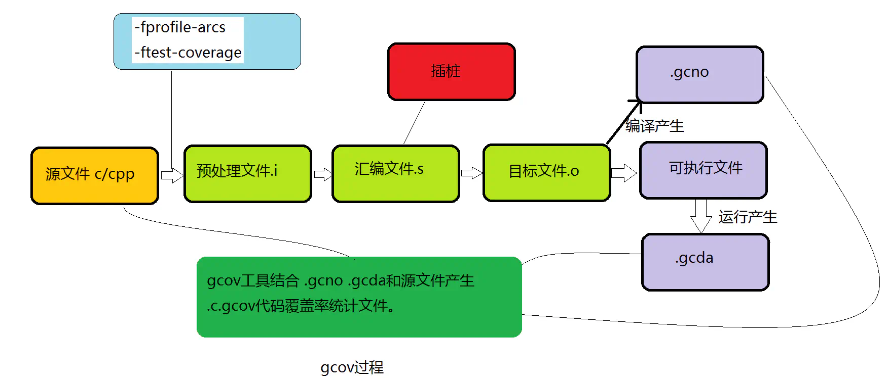
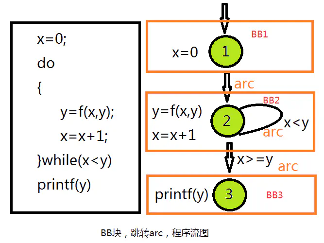
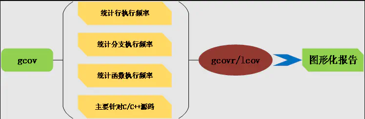

# 0x00. 导读

[gcov代码覆盖率测试-原理和实践总结](http://www.wl119.club/ng-hugo/admin/ng-vditor/publish/public/posts/20221104155607201733474653112530_89db7caa4dc97377f2837ac46275dacd/)

# 0x01. 简介

gcov 是什么

- gcov(gcc coverage) 是一个测试代码覆盖率的工具。与 GCC 一起使用来分析程序，以帮助创建更高效、更快的运行代码，并发现程序的未测试部分
- 是一个命令行方式的控制台程序。需要结合 lcov, gcovr 等前端图形工具才能实现统计数据图形化
- 伴随 GCC 发布，不需要单独下载gcov工具。配合GCC共同实现对c/c++文件的语句覆盖和分支覆盖测试
- 与程序概要分析工具（profiling tool，例如gprof）一起工作，可以估计程序中哪段代码最耗时

gcov能做什么

- 每一行代码执行的频率是多少。
- 实际执行了哪些行代码，配合测试用例达到满意的覆盖率和预期工作。
- 每段代码使用了多少计算时间，从而找到热点优化代码。
- gcov 创建一个 sourcefile.gcov 的日志文件，此文件标识源文件 sourcefile.c 每一行执行的次数,您可以与 gprof 一起使用这些日志文件来帮助优化程序的性能。gprof提供了您可以使用的时间信息以及从gcov获得的信息。

# 0x02. 原理与使用



主要工作流

- 编译前，在编译器中加入编译器参数 -fprofile-arcs -ftest-coverage；
- 源码经过编译预处理，然后编译成汇编文件，在生成汇编文件的同时完成插桩。**插桩是在生成汇编文件的阶段完成的**，因此插桩是汇编时候的插桩，每个桩点插入3~4条汇编语句，直接插入生成的*.s文件中，最后汇编文件汇编生成目标文件，生成可执行文件；并且生成关联 BB 和 ARC 的 .gcno 文件；
- 执行可执行文件，在运行过程中之前插入桩点负责收集程序的执行信息。所谓桩点，其实就是一个变量，内存中的一个格子，对应的代码执行一次，则其值增加一次；
- 生成.gcda文件，其中有 [BB 和 ARC](https://gcc.gnu.org/onlinedocs/gcc-3.3.6/gcc/Gcov-Data-Files.html) 的执行统计次数等，由此经过加工可得到覆盖率。

## 2.1 使用

gcov 是 gcc 自带的，需要两个编译选项和一个链接选项:

- 指定编译 flag 加上 -fprofile-arcs -ftest-coverage 
    - .gcno 是由 -ftest-coverage 产生的，它包含了重建基本块图和相应的块的源码的行号的信息。
    - .gcda 是由加了 -fprofile-arcs 编译参数的编译后的文件 运行 所产生的，它包含了弧跳变的次数和其他的概要信息（gcda只能在程序运行完毕后才能产生的）。
- 链接 flag 加上 lgcov

## 2.1.1 gcov 使用

gcov 常用参数:
```
参数	描述
-a	输出每个基本块的运行计数, 此选项可用于统计在同一行中的若干语句的各自运行次数
-b	输出分支语句频率信息到输出文件, 以及概要信息到标准输出, 但不显示无条件分支
-c	以数字而不是百分比显示分支频率
-n	不创建输出文件
-l	创建的输出文件名中包含头文件名, 这对于头文件中包含代码并被多个源文件使用时有用
-p	在 .gocv 文件名中加入完整的路径信息, 此时路径中的 '/' 用 '#' 表示, '..' 用 '^' 表示
-f	输出每个函数的概要信息
```

gcov 要求运行时在目标系统中有相同的编译时的绝对目录路径, 为了支持交叉编译, 可使用下面两个环境变量重定位数据文件 :
```
GCOV_PREFIX	指定加入到目标文件中的绝对路径前缀, 默认没有前缀
GCOV_PREFIX_STRIP	指示要跳过的目录层次
```

比如编译后目标文件在 /user/build/foo.o, 编译后的程序执行时会创建 /user/build/foo.gcda 文件. 但若把程序拷贝到目标系统中运行时, 可能并没有这个目录, 此时设置环境变量.
```
GCOV_PREFIX=/target/run
GCOV_PREFIX_STRIP=1
```

这样, 运行时将输出到 /target/run/build/foo.gcda 文件. user 被 GCOV_PREFIX 对应的目录替换了。

## 2.2 cmake

选项可以参看 [gcc Instrumentation-Options](https://gcc.gnu.org/onlinedocs/gcc-10.1.0/gcc/Instrumentation-Options.html)

cmake 组织:
```cmake
if(USE_GCOV)
	message(STATUS "using gcov")
    set(PROF_DIR "/home/alfred/tab/gcov/record_%p")
	SET(CMAKE_CXX_FLAGS "${CMAKE_CXX_FLAGS} -fprofile-arcs -ftest-coverage -fprofile-dir=${PROF_DIR} -fprofile-generate" )
#   SET(GCC_COVERAGE_LINK_FLAGS "-lgcov")
#   SET(CMAKE_EXE_LINKER_FLAGS "${CMAKE_LINKER_FLAGS} ${GCC_COVERAGE_LINK_FLAGS}" )               
endif(USE_GCOV)

target_link_libraries(my-app-name ${GCOV_LINK}) 

# 其中两行 set 和下面的 target_link_libraries 是一个意思，set写法需要把所有的link管理都放在CMAKE_EXE_LINKER_FLAGS里。

# cmake 生成 makefile 指定一下 USE_GCOV 就可以了，比如 cmake -DUSE_GCOV=1
```

### 2.2.1 进程不退出问题

**问题是很多时候，程序并不会主动退出：**
- 若用户进程并非调用 exit 正常退出，覆盖率统计数据就无法输出，也就无从生成报告了。
- 后台服务程序一旦启动就很少主动退出，用 kill 杀死进程强制退出时就不会调用 exit，因此没有覆盖率统计结果产生。

为了解决这个问题，我们可以给待测程序增加一个 signal handler，拦截 SIGHUP、SIGINT、SIGQUIT、SIGTERM 等常见强制退出信号，并在 signal handler 中主动调用 exit 或 __gcov_flush 函数输出统计结果即可。

[gcov_test.cpp](./gcov_test.cpp)

该方案仍然需要修改待测程序代码，不过借用动态库预加载技术和 gcc 扩展的 constructor 属性，我们可以将 signalhandler 和其注册过程都封装到一个独立的动态库中，并在预加载动态库时实现信号拦截注册。这样，就可以简单地通过如下命令行来实现异常退出时的统计结果输出了：

```
LD_PRELOAD=./libgcov_preload.so ./helloworld_server

#或者：
echo "/sbin/gcov_preload.so" >/etc/ld.so.preload
./helloworld_server
```

[gcov_preload.c](./gcov_preload.c)

## 2.3 实操

1. 编译完成后，在 build 目录找到 `*.gcno` 文件，拷贝到对应的源代码目录，例如:
`build-release/src/#data#work_sp#SkyRoadPro#build-release#src#CMakeFiles#SRMUAtpSseStock.dir#connector_atp.cpp.gcno`
2. 运行程序，产生 gcda 文件，也拷贝到对应的源代码目录，例如 `tmp/test_9379/#data#work_sp#SkyRoadPro#build-release#src#CMakeFiles#SRMUAtpSseStock.dir#connector_atp.cpp.gcda`
3. 切换到源代码目录，运行 `gcov xxx.cpp`，例如 `gcov connector_atp.cpp`. 如果出现 `cannot open notes file` 错误，可是改为 `gcov xxx.cpp.gcno`
4. 然后产生很多 gcov 文件，就是我们要的覆盖率数据文件。

说明:

- .gcov 文件的基本格式是：执行次数:行号:该行代码  
    其中执行次数中：
    - 数字 表示行运行的次数，
    - \- 表示该行没代码,
    - \##### 表示该行从未执行过
- 上述生成的文件可视化成都较低，需要借助 lcov，genhtml 工具直接生成 html 报告。

# 0x03. 原理

Gcc 中指定 -ftest-coverage 等覆盖率测试选项后，gcc 会：

- 在输出目标文件中留出一段存储区保存统计数据
- 在源代码中每行可执行语句生成的代码之后附加一段更新覆盖率统计结果的代码,也就是前文说的插桩
- 在最终可执行文件中进入用户代码 main 函数之前调用 `gcov_init` 内部函数初始化统计数据区，并将 `gcov_exit` 内部函数注册为 exit handlers 用户代码调用 exit 正常结束时，gcov_exit 函数得到调用，其继续调用 __gcov_flush 函数输出统计数据到 *.gcda 文件中。

## 3.1 gcov 数据统计原理（即：gcov怎么计算统计数据的）

gcov是使用 基本块BB 和 跳转ARC 计数，结合程序流图来实现代码覆盖率统计的:

- 基本块 BB

    如果一段程序的第一条语句被执行过一次，这段程序中的每一个都要执行一次，称为基本块。一个BB中的所有语句的执行次数一定是相同的。一般由多个顺序执行语句后边跟一个跳转语句组成。所以一般情况下BB的最后一条语句一定是一个跳转语句，跳转的目的地是另外一个BB的第一条语句，如果跳转时有条件的，就产生了分支，该BB就有两个BB作为目的地。

- 跳转ARC

    从一个BB到另外一个BB的跳转叫做一个 arc,要想知道程序中的每个语句和分支的执行次数，就必须知道每个BB和ARC的执行次数。

如果把BB作为一个节点，这样一个函数中的所有BB就构成了一个有向图。,要想知道程序中的每个语句和分支的执行次数，就必须知道每个BB和ARC的执行次数。根据图论可以知道有向图中BB的入度和出度是相同的，所以只要知道了部分的BB或者arc大小，就可以推断所有的大小。



# 0x04. genhtml 和 lcov



## 4.1 lcov

lcov 是用 perl 语言写的，[源码仓库](https://github.com/linux-test-project/lcov)，其包含了命令：
- lcov
- genhtml
- geninfo
- gendesc
- genpng

```bash
$ sudo yum install lcov
```
运行如果报错 `Can't locate xxxx.pm in @INC` ，参考 [lcov-error](https://shenxianpeng.github.io/2021/09/lcov-error/)

```
lcov 常用的参数
-d 项目路径，即. gcda .gcno 所在的路径
-a 合并（归并）多个 lcov 生成的 info 文件
-c 捕获，也即收集代码运行后所产生的统计计数信息
--external 捕获其它目录产生的统计计数文件
-i/--initial 初始化所有的覆盖率信息，作为基准数据
-o 生成处理后的文件
-r/--remove 移除不需要关注的覆盖率信息文件
-z 重置所有执行程序所产生的统计信息为 0
```

## 4.2 实践

```
# 来自 man lcov 的推荐步骤

1. 创建基础数据（可有可无）
    # lcov -c -i -d appdir -o app_base.info

2. 运行程序
    # appdir/test

3. 创建覆盖率文件
    # lcov -c -d appdir -o app_test.info

4. 组合 1 3 数据
    # lcov -a app_base.info -a app_test.info -o app_total.info
```

开始实操：

1. 创建一个目录，假设是 gcov_test ，里面包含如下文件
    ```
    test.cpp       - 源代码
    test.gcno      - 编译产生的统计数据，最好是 debug 编译，更准
    test           - 可执行程序
    test.gcda      - 运行程序后产生的统计数据
    test.cpp.gcov  - gcov 工具产生文件，例如执行 gcov test.cpp
    ```

2. lcov 开始登场（以下皆在目录 gcov_test 中进行）
    ```
    使用lcov生成LCOV覆盖率数据文件：
    $ lcov --directory ./ --capture --output-file test.info

    删除LCOV覆盖率数据中统计到的库文件：
    $ lcov --remove test.info '/usr/local/*' --output-file test.info

    --directory     - .gcda文件所在目录, -d
    --capture       - 统计覆盖率数据, -c
    --output-file   - 输出LCOV覆盖率数据的文件名, -o
    --remove        - 删除LCOV覆盖率数据中不需要统计的文件名, -r
    ```

3. 使用 genhtml 工具生成 html 页面：
    ```
    $ genhtml test.info --output-directory result
    --output-directory - 生成html文件夹名，也可以用 -o
    ```
    用浏览器打开 result/index.html, 里面是各个文件中 行、函数 的覆盖统计。

# 0x05. PGO

反馈编译优化（Profile-guided optimization，PGO）是一种编译优化技术，通过利用程序的运行时信息指导编译器进行更好的分支选择、函数内联、循环展开等优化，以获取更好的性能。

增加编译选项 `-fprofile-use=dir -Wno-missing-profile -fprofile-correction`, 其中 dir 就是 gcda 文件的目录，若涉及多次采样则为最终 merge 后的目录

```
-Wno-missing-profile:

-Wno- 前缀表示抑制某种警告。
当使用 -fprofile-use 或 -fprofile-arcs 进行配置文件引导优化时，如果缺少所需的配置文件数据，GCC 通常会发出警告。使用 -Wno-missing-profile 可以抑制这些警告。

-fprofile-correction:

该选项用于启用配置文件数据的自动校正。
配置文件引导优化 (PGO, Profile-Guided Optimization) 过程中，生成的配置文件数据有时可能包含不准确或不一致的信息。启用 -fprofile-correction 后，GCC 会尝试自动修正这些数据，从而提高配置文件引导优化的可靠性和效果。
```