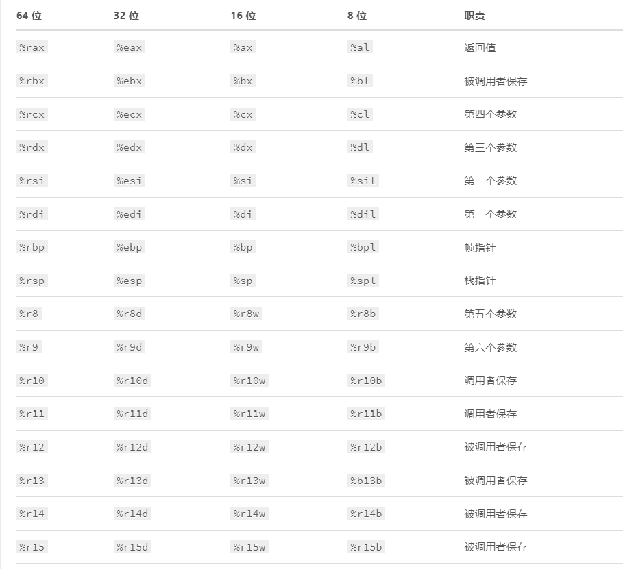

# 0x00. 导读

# 0x01. 简介

# 0x02. 寄存器

- 被调用者保存：汇编指令虽然实现函数的功能，但是它唯一的数据存储地就是寄存器，换句话说，所有的函数实现过程共享寄存器。随着函数调用层次越深，要保存的本地变量就更多，但是寄存器的数量有限，怎么办？为了解决这个问题，汇编指令把寄存器分类成 **被调用者保存** 和 **调用者保存** 。
被调用者保存的意思就是，过程 P 调用 Q 时，P 可以不用考虑 被调用者保存 类的寄存器里面的值被修改了，因为 Q 这个被调用者有职责保证里面的值不会变。

- 调用者保存：和 被调用者保存 相反，P 在调用 Q 后，Q 可能会改变这些寄存器的值，所以 P 这个调用者有职责保存里面的值。

- 返回值： 属于调用者保存。一个函数有没有返回值，返回值是什么，不是取决于 %rax 里面的值，而是取决于后面的汇编指令怎么用它。如果从某个函数调用返回后，没有读取 %rax 里面的值，则说明函数没有返回值。**如果读取的是 %eax, 说明返回的是 32 位的数据类型，%al 则说明返回的是 8 位的数据，如果读取的是 (%rax) 则说明返回的是指针，在从内存里面读取值。**

- 参数：属于调用者保存。最多可以通过寄存器保存 6 个参数。和 %rax 一样，汇编指令本身是没有参数的概念的，所以用几个参数、参数类型是什么，取决于后面的汇编指令怎么用它。如果参数数量超过 6 个，就需要保存到栈帧里面了。

- 栈指针：既不属于调用者保存，也不属于被调用者保存，每次 call 和 ret 指令都会自动操作这个寄存器。用来保存函数栈顶的内存位置，而内存里面这个位置上的值通常为函数返回后要执行的下一条指令的位置。每次调用一个过程，%rbp 的值就会减 8(64 bits)，从一个过程返回，就会加 8。

- 帧指针：属于被调用者保存。用来保存函数栈帧空间的起始地址。有时候过程需要保存的数据超过了寄存器的数量，就要在栈内存上开辟空间。一般的做法是，把 %rbp 的旧值保存到栈上，把 %rsp 栈顶的值保存到 %rbp 上，把 %rsp 减去适当的值 X，减多少取决于需要分配多少的栈帧空间。根据 %rbp 的偏移量来使用栈帧空间内的其它内存位置，进行数据操作。结束后把 %rsp 的值添加 X, 从 %rbp 里面恢复 栈顶 %rsp，从栈上恢复 %rbp 的旧值。

## 2.1 条件码寄存器

条件码寄存器总共有 4 个，用来描述最近的那个数据操作所产生的结果的属性。

- CF：进位标志，用来说明最近的操作是否使最高位产生了进位(无符号)
- ZF：零标志，用来说明最近的操作结果是否为 0
- SF：符号标志，用来说明最近的操作结果是否为负数
- OF：溢出标志，用来说明最近的操作结果是否导致补码溢出(有符号)

基于条件码寄存器，我们就能做溢出检测和大小比较。

## 2.2 PC 寄存器

PC 寄存器 %rip 里面保存的是正要执行的指令的内存位置。 所以，改变 PC 寄存器的值，就是改变要执行的命令。  
不过，这个值一般不能直接修改，而是在执行 call 和 ret 或者 je 等指令的时候自动改的。