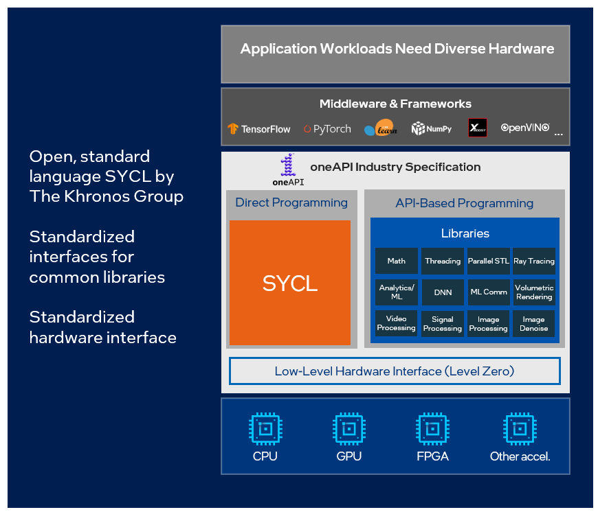

# 0x00. 导读

# 0x01. 简介

[Intel C++ Compiler](https://en.wikipedia.org/wiki/Intel_C%2B%2B_Compiler)

Intel 编译器编译 C 和 C++ 源程序的编译命令分别为 icc 和 icpc; 编译 Fortran 源程序的命令为 ifort。这个版本称为经典版本 (Intel C++ Compiler Classic)。后面升级到了基于 LLVM 开发的 Intel oneAPI DPC++/C++ Compiler 编译器 (icx/icpx)。[从ICC到ICX移植指南](https://www.intel.com/content/www/us/en/developer/articles/guide/porting-guide-for-icc-users-to-dpcpp-or-icx.html)

- 1999 ~ 2009.06.23, Intel C/C++ Compiler 4.0 ~ Intel C/C++ Compiler 11.1  
- 2010.11.07 出现 Intel C++ Composer XE, 里面包含 Intel C/C++ Compiler 12.0  
- 2015.08.25 出现了 Intel Parallel Studio XE, Intel System Studio, 里面包含 Intel C/C++ Compiler 16.0  
- 2020.12.08 出现 Intel oneAPI DPC++ / C++ Compiler 2021

# 0x02.

Intel 自家已经弃用 ICC 编译器，他们正在过渡到基于 LLVM/Clang 的现代英特尔 DPC++ 编译器，老版 ICC 编译器则被称为 “英特尔 C++ 编译器经典版”。

## 2.x Intel oneAPI

Intel oneAPI 是一种统一的跨架构的的编程模型，提供了CPU、GPU、FPGA、专用加速器的产品。

2020年12月，Intel发布了 oneAPI 软件开发套装，免费、并且代替了之前需要许可(购买)的Intel Parallel Studio。

Intel oneAPI toolkits 包含了六大工具包：

- Intel oneAPI Base Toolkit( 包含了Intel Parallel Studio中常用的软件以及 icc、MPI、DPCPP、MKL等 )
- Intel oneAPI HPC Toolkit( 提供可扩展的快速C ++、Fortran、OpenMP和MPI应用程序 )
- Intel oneAPI IoT Toolkit
- Intel oneAPI Rendering Toolkit
- Intel AI Analytics Toolkit
- Intel Distribution of OpenVINO™ Toolkit

对于我们来说 [Intel oneAPI Base Toolkit](https://www.intel.com/content/www/us/en/developer/tools/oneapi/base-toolkit.html) + [Intel oneAPI HPC Toolkit](https://www.intel.com/content/www/us/en/developer/tools/oneapi/hpc-toolkit.html#gs.jugqzk) 基本就包含 Intel Parallel Studio XE 的功能了，关键还免费。