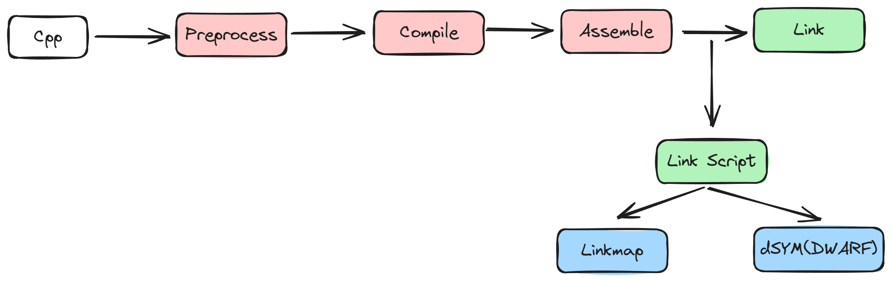
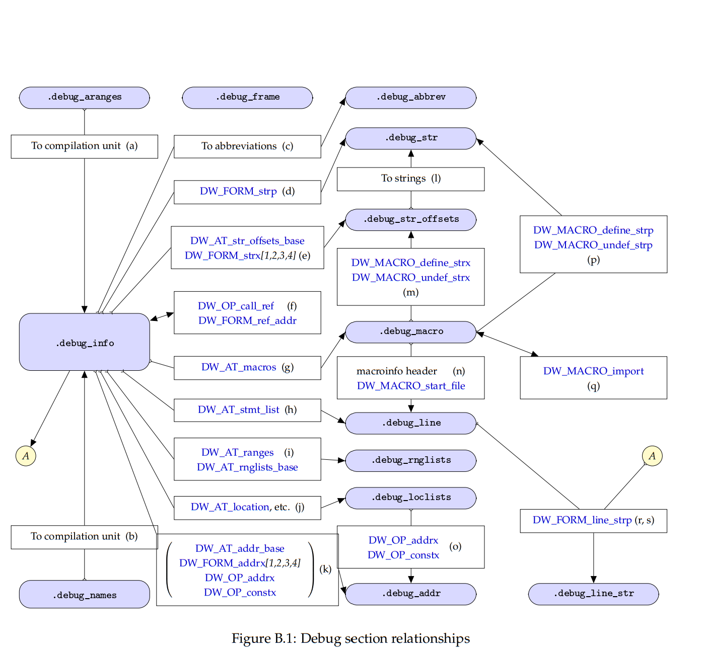

# 0x00. 导读

[C++调试（1）—— 认识Dwarf格式](https://devillove084.xyz/2024/06/15/Debug-1/)

编译器将人类可读的源代码转换为由计算机直接执行的一系列指令。一个常见的问题是 调试器和错误处理程序如何报告源代码中处理器当前所在的位置？并且随着编译器优化代码，将指令映射回源代码也存在一些复杂性。

调试信息是由编译器在编译机器代码时一起生成的，**它是可执行文件和源代码之间关系的一种描述。调试信息根据预定义的格式被编码到机器代码中。**

在过去的年代，对应于各种架构，有很多格式被发明了出来。最经典和广泛使用的格式（stabs(symbol table strings)，COFF，PE-COFF，OMF，IEEE-695）就是 `DWARF` ，在 Linux 平台和类 Unix(Unix-y) 平台上，`DWARF` 被用来描述 `ELF` 格式可执行文件的调试信息，可以说，它无处不在。

# 0x01. 简介

DWARF 很复杂，它建立于对其他格式的多年研究经验之上,这些格式可以运用于各种架构。

DWARF 必然是复杂的，因为它需要解决一个很难办的问题--向调试器展示任何高级语言代码的调试信息,为各种架构和 ABIs(application binary interface) 提供支持。

# 0x02. 查看 dwarf

查看的前提是 程序编译的时候需要指定 `-gdwarf-4`, 编译过程会产生很多 .dSYM 文件 。

生成时机：

dSYM 文件和 DWARF 文件在编译时生成是根据链接动作中链接脚本下的符号解析与重定位构建。

Q: DWARF 信息在 ELF 文件内部何处？  

DWARF 调试信息根据描述对象的不同，在最终存储到不同的 section, section 名称均以前缀 .debug_ 开头。:  

```bash
$ objdump -h a.out      # or readelf -S a.out
...
 25 .debug_aranges 00000030  0000000000000000  0000000000000000  000030bd  2**0
                  CONTENTS, READONLY, DEBUGGING
 26 .debug_info   00002b98  0000000000000000  0000000000000000  000030ed  2**0
                  CONTENTS, READONLY, DEBUGGING
 27 .debug_abbrev 00000665  0000000000000000  0000000000000000  00005c85  2**0
                  CONTENTS, READONLY, DEBUGGING
 28 .debug_line   000003cb  0000000000000000  0000000000000000  000062ea  2**0
                  CONTENTS, READONLY, DEBUGGING
 29 .debug_str    00001962  0000000000000000  0000000000000000  000066b5  2**0
                  CONTENTS, READONLY, DEBUGGING
```



如果想查看各个调试 section 的内容，可以用 `readelf -w* a.out` ，* 是调试 section 的第一个字母，例如 -wi 是查看 .debug_info 的内容，-wl 是查看 .debug_line 的内容。

常见的ELF sections及其存储的内容如下:

- .debug_abbrev, 存储.debug_info中使用的缩写信息；
- .debug_arranges, 存储一个加速访问的查询表，通过内存地址查询对应编译单元信息；
- .debug_frame, 存储调用栈帧信息；
- .debug_info, 存储核心DWARF数据，包含了描述变量、代码等的DIEs；
- .debug_line, 存储行号表程序 (程序指令由行号表状态机执行，执行后构建出完整的行号表)
- .debug_loc, 存储location描述信息；
- .debug_macinfo, 存储宏相关描述信息；
- .debug_pubnames, 存储一个加速访问的查询表，通过名称查询全局对象和函数；
- .debug_pubtypes, 存储一个加速访问的查询表，通过名称查询全局类型；
- .debug_ranges, 存储DIEs中引用的address ranges；
- .debug_str, 存储.debug_info中引用的字符串表，也是通过偏移量来引用；
- .debug_types, 存储描述数据类型相关的DIEs；

# 0x04.总结

调试信息理论上是一个很简单的概念。它的实现细节可能错综复杂，重要的是现在我们知道了调试器如何找出可执行文件中的相关信息。有了这些调试信息，调试器架起了一道用户和可执行文件之间的桥梁，用户从源代码和数据结构的角度思考，而可执行文件是一堆机器指令加上内存或寄存器中的数据。