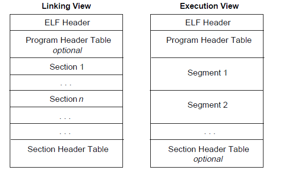
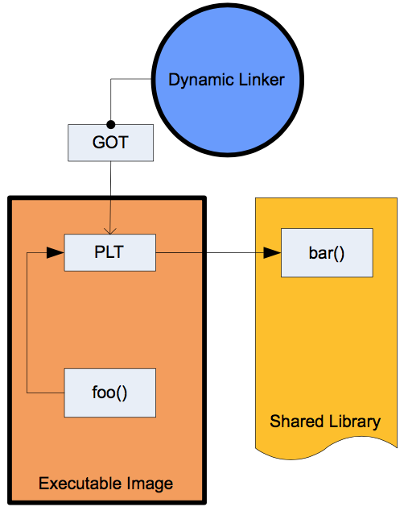

# 0x00. 导读

ELF（Executable and Linkable Format）是一种行业标准的二进制数据封装格式，主要用于封装可执行文件、动态库、object 文件和 core dumps 文件。用 readelf 可以查看 ELF 文件的基本信息，用 objdump 可以查看 ELF 文件的反汇编输出。

ELF 格式的概述可以参考 [这里](https://en.wikipedia.org/wiki/Executable_and_Linkable_Format)，完整定义可以参考 [这里](https://refspecs.linuxbase.org/elf/elf.pdf)。其中最重要的部分是：ELF 文件头、SHT（section header table）、PHT（program header table）。

ELF (Executable and Linking Format)，即“可执行可连接格式”，作为一种可移植的格式，有比较广泛的适用性，通用的二进制接口定义使之可以平滑地移植到多种不同的操作环境上。  
这样，不需要为每一种操作系统都定义一套不同的接口，因此减少了软件的重复编码与编译，加强了软件的可移植性。

ELF 规范中把 ELF 文件宽泛地称为 **目标文件 (object file)**，这与我们平时的理解不同。  
一般地，我们把经过编译但没有连接的文件(比如 Unix/Linux 上的.o 文件)称为目标文件，而 ELF 文件仅指连接好的可执行文件；在 ELF 规范中，所有符合 ELF 格式规范的都称为 ELF 文件，也称为目标文件，这两个名字是相同的，而经过编译但没有连接的文件则称为 **可重定位文件 (relocatable file)** 或 **待重定位文件 (relocatable file)**。

参考：  
[Understanding_ELF.pdf](https://paper.seebug.org/papers/Archive/refs/elf/Understanding_ELF.pdf)  
[elf-introduce](http://chuquan.me/2018/05/21/elf-introduce/)  
`man elf`

[Android PLT hook 概述](https://github.com/iqiyi/xHook/blob/master/docs/overview/android_plt_hook_overview.zh-CN.md)

# 0x01. 简介

ELF (Executable and Linkable Format) 文件，也就是在 Linux 中的目标文件，主要有以下三种类型：

- `可重定位文件` (Relocatable File)   
    用于与其它目标文件进行连接以构建可执行文件或动态链接库。
    可重定位文件就是常说的目标文件，由源文件编译而成，但还没有连接成可执行文件。在 UNIX 系统下，一般有扩展名”.o”。
    之所以称其为“可重定位”，是因为在这些文件中，如果引用到其它目标文件或库文件中定义的符号（变量或者函数）的话，只是给出一个名字，这里还并不知道这个符号在哪里，其具体的地址是什么。需要在连接的过程中，把对这些外部符号的引用重新定位到其真正定义的位置上，所以称目标文件为“可重定位”或者“待重定位”的。

- `可执行文件` (Executable File)  
    就是我们通常在 Linux 中执行的程序。

- `共享目标文件` (Shared Object File)   
    包含代码和数据，这种文件是我们所称的库文件，一般以 .so 结尾。一般情况下，它有以下两种使用情景：

    - 链接器 (Link eDitor, ld) 可能会处理它和其它可重定位文件以及共享目标文件，生成另外一个目标文件。
    - 动态链接器 (Dynamic Linker) 将它与可执行文件以及其它共享目标组合在一起生成进程镜像。

# 0x02. 文件格式

目标文件既会参与程序链接又会参与程序执行。出于方便性和效率考虑，根据过程的不同，目标文件格式提供了其内容的两种并行视图，如下



**注意1**：段（Segment）与节（Section）的区别（上图中的条框粗细有表明）。段是程序执行的必要组成，当多个目标文件链接成一个可执行文件时，会将相同权限的节合并到一个段中。相比而言，节的粒度更小。

**注意2**：前面的图中是按照 ELF 头，程序头部表，节区，节区头部表的顺序排列的。但实际上除了 ELF 头部表以外，其它部分都没有严格的顺序。

完整格式可以用 `readelf -a Bifrost-dmastk` 查看。

## 2.1 链接视图

readelf 可以配合 -W 选项，使得输出尽量在一行

### 2.1.1. ELF Header 

作用：文件开始处是 ELF 头部 (ELF Header) ，它给出了整个文件的组织情况。ELF 文件的起始处，有一个固定格式的定长的文件头（32 位架构为 52 字节，64 位架构为 64 字节）。ELF 文件头以 magic number `0x7F 0x45 0x4C 0x46` 开始（其中后 3 个字节分别对应可见字符 `E L F`）。

`readelf -h Bifrost-dmastk` 可以查看。

### 2.1.2. Program Header Table, PHT

作用：告诉系统如何创建进程。  
**用于生成进程的目标文件必须具有程序头部表，但是重定位文件不需要这个表。**  

`readelf -l Bifrost-dmastk` or `-h` 可以查看。

```
-h --file-header       Display the ELF file header, 看 ELF 文件头
-l --program-headers   Display the program headers, 看 PHT
```

1. PHDR，描述了 program header table 自身的信息。  
    从这里的内容看出，示例程序的 program header table 在文件中的偏移为 0x40 ，即 64 号字节处；  
    该段映射到进程空间的虚拟地址 (VirtAddr) 为 0x400040；  
    PhysAddr 暂时不用，其保持和 VirtAddr 一致；  
    该段占用的文件大小为 00x1f8；  
    运行时占用进程空间内存大小 MemSiz 也为 0x1f8；  
    Flags 标记表示该段的读写权限，这里”R E”表示可读可执行，说明本段属于代码段；  
    Align 对齐为 8，表明本段按 8 字节对齐。  

2. INTERP，描述了一个特殊内存段，该段内存记录了动态加载解析器的访问路径字符串。  
    示例程序中，该段内存位于文件偏移 0x238 处，即紧跟 program header table；  
    映射的进程虚拟地址空间地址为 0x400238；  
    文件长度和内存映射长度均为 0x1c，即 28 个字符，具体内容为 /lib64/ld-linux-x86-64.so.2 ；  
    段属性为只读，并按字节对齐；

3. LOAD，描述了可加载到进程空间的代码段或数据段：  
    第三项为代码段，文件内偏移为 0，映射到进程地址 0x400000 处，代码段长度为 0x764 个字节，属性为只读可执行，段地址按 2M 边界对齐；  
    第四段为数据段，文件内偏移为 0xe10，映射到进程地址为 0x600e10 处(按2M对齐移动)，文件大小为 0x230，内存大小为 0x238 (因为其内部包含了 8 字节的 bss 段，即未初始化数据段，该段内容不占文件空间，但在运行时需要为其分配空间并清零)，属性为读写，段地址也按 2M 边界对齐。

4. DYNAMIC，描述了动态加载段，其内部通常包含了一个名为 .dynamic 的动态加载区；  
    这也是一个数组，每个元素描述了与动态加载相关的各方面信息。该段是从文件偏移 0xe28 处开始，长度为 0x1d0 ，并映射到进程的 0x600e28 ；可见该段和上一个数据段是有重叠的。

**输出的下半部分给出了各段(segment)和各区(section)之间的包含关系**，INTERP段只包含了”.interp”区；代码段包含”.interp”、”.plt”、”.text”等区；数据段包含”.dynamic”、”.data”、”.bss”等区；DYNAMIC段包含”.dynamic”区。从这里可以看出，有些区被包含在多个段中。

### 2.1.3. section

作用：指令、数据、符号表、重定位信息等等。
```
.shstrtab: 节名字表，它包含所有节的名字。  
.strtab: 变量名和函数名。

.symtab: Symbol Table, 符号表。包含了定位、重定位符号定义和引用时需要的信息。
每个目标文件都会有一个符号表，熟悉编译原理的就会知道，在编译程序时，必须有相应的结构来管理程序中的符号以便于对函数和变量进行重定位。
此外，链接本质就是把多个不同的目标文件相互“粘”在一起，实际上，目标文件相互粘合是目标文件之间对地址的引用，即函数和变量的地址的相互引用。而在粘合的过程中，符号就是其中的粘合剂。

.dynamic: 保存 依赖于哪些动态库、动态符号节信息、动态字符串节信息。
.dynstr: 包含了动态链接用的字符串，通常是和符号表中的符号关联的字符串。
.dynsym: 运行时所需的，ELF 文件中 export/import 的符号信息全在这里。
.symtab: 存储的信息是编译时的符号信息，它们在 strip 之后会被删除掉。

.plt: 过程链接表（Procedure Linkage Table）
.relNAME: 包含重定位信息。
```

`readelf -s Bifrost-dmastk` 可以查看 符号表 信息。
```
-s --syms              Display the symbol table
-S --section-headers   Display the sections' header
```

### 2.1.4. Section Header Table

作用：节区头部表 (Section Header Table) 是一个节头数组，包含了描述 section 的信息，每个 section 在表中都有一个表项，会给出名称、大小等信息。编译器、链接器、装载器都是通过节头表来定位和访问各个 section 的属性的。   
**用于链接的目标文件必须有节区头部表，其它目标文件则无所谓，可以有，也可以没有。**  

`readelf -S Bifrost-dmastk` 可以查看。然后可以使用 `readelf -x 24 Bifrost-dmastk` 将对应的 section 数据打印出来，一般对于 STRTAB 有用。

比较重要，且和 hook 关系比较大的几个 section 是：

- .dynstr: 保存了所有的字符串常量信息。
- .dynsym: 保存了符号（symbol）的信息（符号的类型、起始地址、大小、符号名称在 .dynstr 中的索引编号等）。函数也是一种符号。
- .text: 程序代码经过编译后生成的机器指令。
- .dynamic: 供动态链接器使用的各项信息，记录了当前 ELF 的外部依赖，以及其他各个重要 section 的起始位置等信息。
- .got: Global Offset Table。用于记录外部调用的入口地址。动态链接器（linker）执行重定位（relocate）操作时，这里会被填入真实的外部调用的绝对地址。
- .plt: Procedure Linkage Table。外部调用的跳板，主要用于支持 lazy binding 方式的外部调用重定位。（Android 目前只有 MIPS 架构支持 lazy binding）
- .rel.plt: 对外部函数直接调用的重定位信息。
- .rel.dyn: 除 .rel.plt 以外的重定位信息。（比如通过全局函数指针来调用外部函数）



## 2.2 执行视图

其主要的不同点在于没有了 section，而有了多个 segment。其实这里的 segment 大都是来源于链接视图中的 section。
