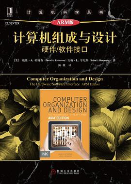

# 0x00. 导读

# 0x01. 简介

# 0x02. Linux 内核书籍

```
Linux 内核设计与实现
Linux设备驱动程序(Linux Device Drivers)
深入理解LINUX内核(Understanding the Linux Kernel)
深入理解LINUX网络技术内幕
Linux/UNIX系统编程手册
深入Linux内核架构

告诉我你要做什么，但不要告诉我你是怎么做的。代码是最好的注释。
```

# 0x03. 体系结构


  
circuits: 电子电路


[想自学《计算机体系结构：量化研究方法》这本书，有什么配套网络课程？](https://www.zhihu.com/question/427089616)

[github: Computer-Science-Textbooks](https://github.com/kaitoukito/Computer-Science-Textbooks)

目前准备看的书籍：
1. 计算机组成与设计：硬件/软件接口( Computer Organization and Design, Hardware/Software Interface ) 
   
    ```
    豆瓣汇总版本: https://book.douban.com/works/1028302

    5th: https://github.com/kaitoukito/Computer-Science-Textbooks/blob/master/Computer-Organization-and-Design-The-Hardware-Software-Interface-5th-Edition.pdf
    中文: https://github.com/apachecn/huazhang-cs-books/blob/master/%E8%AE%A1%E7%AE%97%E6%9C%BA%E7%BB%84%E6%88%90%E4%B8%8E%E8%AE%BE%E8%AE%A1%EF%BC%9A%E7%A1%AC%E4%BB%B6%E8%BD%AF%E4%BB%B6%E6%8E%A5%E5%8F%A3%E5%8E%9F%E4%B9%A6%E7%AC%AC5%E7%89%88.pdf

    risc-v 版本: https://www.aming.work:8083/book/22184

    MIPS，RISC-V，ARM 这三个版本的的内容差别不大，仅仅是修改了指令系统相关的内容，绝大部分内容是一样的。
    ```
2. 计算机体系结构：量化研究方法( Computer Architecture: A Quantitative Approach )

    ```
    6th: https://github.com/kaitoukito/Computer-Science-Textbooks/blob/master/Computer-Architecture-A-Quantitative-Approach-6th-Edition.pdf
    ```

可以看的视频：

1. 前导课程： [CS 61C 计算机组成原理 20200816](https://www.bilibili.com/video/BV1fC4y147iZ/?spm_id_from=333.337.search-card.all.click&vd_source=55019cf38cd2bfef2ff9bcd83a1f91df), 这是 summer 版本，[[CS61C SU20] Great Ideas in Computer Architecture](https://www.bilibili.com/video/BV1PV411U7Hv?vd_source=55019cf38cd2bfef2ff9bcd83a1f91df&spm_id_from=333.788.videopod.episodes&p=85) 这两个视频可以交叉看，互相弥补生成字幕问题。还有一个版本，可能是 2020 fall 版本 [伯克利大学《计算机体系结构》(2020)](https://www.bilibili.com/video/BV17b42177VG/?spm_id_from=333.788.recommend_more_video.0&vd_source=55019cf38cd2bfef2ff9bcd83a1f91df)

2. 继续： [Princeton] ELE 475 or  [UCB] CS 152(151 是 digital system design, 152 是 hardware design)，推荐前者

    cs152 252A Computer Architecture and Engineering 有几个版本:  
    - [Spring 2021](https://www.bilibili.com/video/BV1pK4y1d7ff/?p=1&vd_source=24a420d00426dd75084e83baa33680ab)  
    - [Spring 2023 Sophia Shao](https://www.bilibili.com/video/BV1yP411U7xh?p=1&vd_source=55019cf38cd2bfef2ff9bcd83a1f91df)

    ELE 475:
    - [Prof. David Wentzlaff 的 Computer Architecture](https://www.coursera.org/learn/comparch/lecture/Ouq7L/course-introduction)

3. 一枝独秀，[苏黎世联邦理工（ETH Zurich）的 Onur Mutlu 教授的计算机系统结构, 2019](https://www.youtube.com/watch?v=UC_ROevjIuM&list=PL5Q2soXY2Zi-DyoI3HbqcdtUm9YWRR_z-&ab_channel=OnurMutluLectures)
   
    2019 版本挺好的，主页还有很多资料参考。
    [主页](https://safari.ethz.ch/architecture/fall2019/doku.php?id=schedule)
    ```
        1.简介和基础知识
        2.内存刷新
        3.内存的趋势、挑战和机遇
        4.内存的机会&RowHammer
        5.加速基因组分析（不是在讲生物）
        6.RowHammer II & 内存计算方式
        7.内存计算方式 II
        8.内存计算方式 III
        9.仿真 & 低延迟内存
        10.低延迟内存
        11.近期DRAM研究 I
        12.近期DRAM研究 II
        13.内存控制器 & 内存干扰和服务质量
        14.SIMD处理器和GPU
        15.内存干扰和服务质量 II
        16.内存干扰和服务质量总结 & 新兴存储技术
        17.GPU程序设计
        18.预取
    ```

## 3.1 计算机组成与设计的各个版本备忘

### 3.1.1 MIPS

[计算机组成与设计 4th](https://book.douban.com/subject/10441748/)  


[计算机组成与设计（原书第5版）](https://book.douban.com/subject/26604008/)  


**最新**[计算机组成与设计（MIPS版·原书第6版）](https://book.douban.com/subject/35998323/)  


### 3.1.2 RISC-V

[计算机组成与设计：硬件/软件接口](https://book.douban.com/subject/35088440/)  


**最新**[计算机组成与设计：硬件/软件接口 RISC-V版（原书第2版）](https://book.douban.com/subject/36490912/)  


### 3.1.3 ARM

**最新**[计算机组成与设计](https://book.douban.com/subject/30443432/)  
