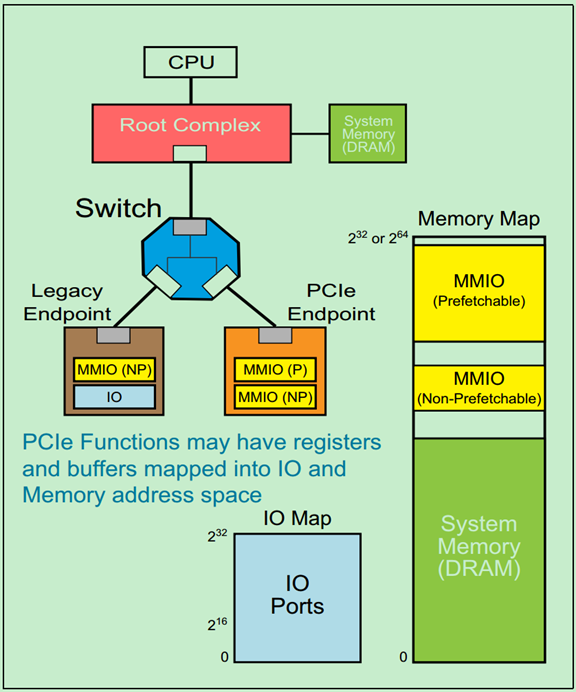
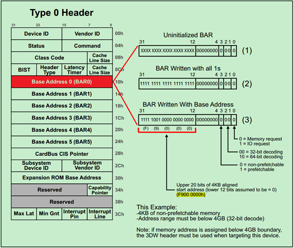
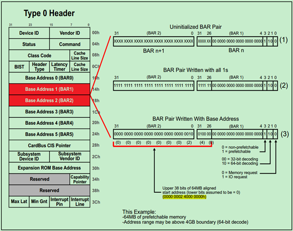
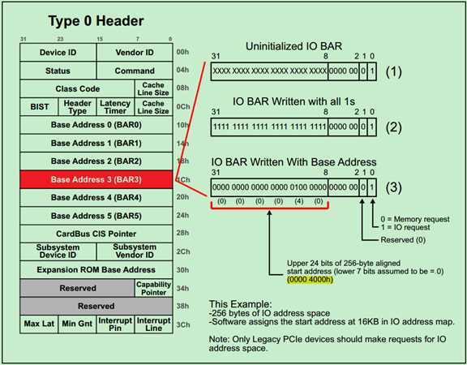

# 0x00. 导读

# 0x01. 简介

通常我们是以三段编码来区分PCI设备，即 Bus Number, Device Number 和 Function Number, 以后我们简称他们为 `BDF` 。有了 BDF 我们既可以唯一确定某一PCI设备。

```bash
$ lspci
01:00.0 VGA compatible controller: NVIDIA Corporation GK110B [GeForce GTX TITAN Black] (rev a1)
|  |  |_Function Number
|  |_PCI Device Number
|_PCI Bus Number
```

# 0x02. 

基于 Linux 下一切皆文件的设计理念，驱动设备也需要有对应的文件节点，在 Linux 系统中设备类型分为字符设备和块设备两类。

字符设备文件有两个要素：**设备号**、**file_operations**。其中，设备号是字符设备文件在系统中的唯一标识，file_operations 对应设备文件各种操作方法。

表示字符设备的数据结构 struct cdev 就是上述两个要素的超集:
```c
struct cdev {
    ...
    const struct file_operations *ops;  ---file_operations
    dev_t dev;             ---  字符设备的起始设备号
    unsigned int count;    ---  子设备号个数
} __randomize_layout;
```

# 0x03. BAR(Basic Address Register)

每个 PCIe 设备，有这么一段空间，Host 软件可以读取它获得该设备的一些信息，也可以通过它来配置该设备，这段空间就叫做 PCIe 的 **配置空间（Configuuraiton Space）**。不同于每个设备的其它空间，PCIe 设备的配置空间是协议规定好的，哪个地方放什么内容，都是有定义的。这块空间的大小是 4096 字节，其中头部和 PCI3.0 保持兼容，有64个字节，这块空间的大小是固定的，不会随着设备的类型或者系统的重启而改变。PCIE设备发展向前兼容PCI，每个设备的配置空间的前256个Byte是PCI空间，后（4k-256）个Byte的空间是PCIE扩展空间。


## 3.1 地址空间

MMIO, 串起内存地址与IO设备。

早期的PC中，所有的IO设备（除了存储设备之外的设备）的内部存储或者寄存器都只能通过 **IO地址空间** 进行访问。但是这种方式局限性很大，而且效率低，于是乎，软件开发者和硬件厂商都不能忍了……然后一种新的东西就出来了——MMIO。MMIO，即Memory Mapped IO，也就是说把这些IO设备中的内部存储和寄存器都映射到统一的存储地址空间（Memory Address Space）中。但是，为了兼容一些之前开发的软件，PCIe仍然支持IO地址空间，只是建议在新开发的软件中采用MMIO。

注：PCIe Spec中明确指出，IO地址空间只是为了兼容早期的PCI设备（Legacy Device），在新设计中都应当使用MMIO，因为IO地址空间可能会被新版本的PCI Spec所抛弃。

IO地址空间的大小是4GB（32bits），而MMIO则取决于处理器（和操作系统），并且由处理器进行统一分配管理。

如下图所示，PCIe总线中有两种MMIO：P-MMIO和NP-MMIO。



P-MMIO，即可预取的MMIO（Prefetchable MMIO）；NP-MMIO，即不可预取的MMIO（Non-Prefetchable MMIO）。其中P-MMIO读取数据并不会改变数据的值。

注：P-MMIO和NP-MMIO主要是为了兼容早期的PCI设备，因为PCIe请求中明确包含了每次的传输的大小（Transfer Size），而PCI并没有这些信息。

## 3.x 例子

例子1，32-bit Memory Address Space Request：

请求一个4KB的 NP-MMIO(Non-Prefetchable Memory Mapped IO) 一般需要以下三个步骤：



Step1：如图中（1）所示，未初始化的BAR的低比特（11~4）都是0，高比特（31~12）都是不确定的值。所谓初始化，就是系统（软件）向整个BAR都写1，来确定BAR的可操作的最低位是哪一位。当前可操作的最低位为12，因此当前BAR可申请的（最小）地址空间大小为4KB（2^12）。如果可操作的最低位为20，则该BAR可申请的（最小）地址空间大小为1MB（2^20）。

Step2：完成初始化（写1操作）之后，软件便开始读取BAR的值，来确定每一个BAR对应的地址空间大小和类型。其中操作的类型一般由最低四位所决定，具体如上图右侧部分所示。

Step3：最后一步是，软件向BAR的高比特写入地址空间的起始地址（Start Address）。如图中所示，为0xF9000000。

例子2，64-bit Memory Address Space Request

下面是一个申请64MB P-MMIO(Prefetchable Memory Mapped IO) 地址空间的例子，由于采用的是64-bit的地址，因此需要两个BAR。



例子3，IO Address Space Request

下面是一个申请IO地址空间的例子，



注：需要特别注意的是，软件对BAR的检测与操作（Evaluating）必须是顺序执行的，即先BAR0，然后BAR1，……，直到BAR5。当软件检测到那些被硬件设置为全0的BAR，则认为这个BAR没有被使用。

注：无论是PCI还是PCIe，都没有明确规定，第一个使用的BAR必须是BAR0。事实上，只要设计者原意，完全可以将BAR4作为第一个BAR，并将BAR0~BAR3都设置为不使用。