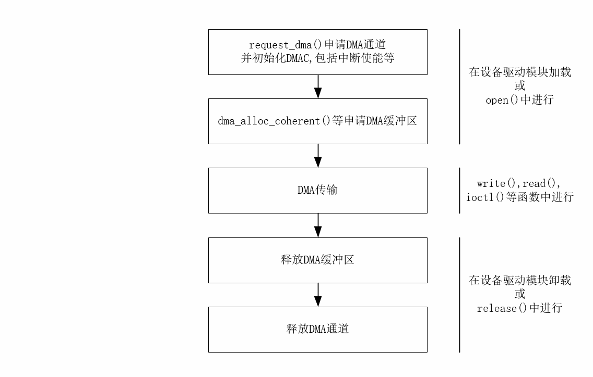

# 0x00. 导读

# 0x01. 简介

# 0x02.

内核程序中使用DMA内存的流程：


# 0x0.

一致性 DMA 和流式 DMA, 前者内核已经考虑到了一致性，后者需要自己解决DMA和Cache一致性。以下 api 是内核提供的已经考虑到一致性的API:

```c
/**
 * request_dma - 申请DMA通道
 * On certain platforms, we have to allocate an interrupt as well...
 */
int request_dma(unsigned int chan, const char *device_id);


/**
 * dma_alloc_coherent - allocate consistent memory for DMA
 * @dev: valid struct device pointer, or NULL for ISA and EISA-like devices
 * @size: required memory size
 * @handle: bus-specific DMA address *
 * Allocate some memory for a device for performing DMA.  This function
 * allocates pages, and will return the CPU-viewed address, and sets @handle
 * to be the device-viewed address.
 */
void * dma_alloc_coherent(struct device *dev, size_t size, dma_addr_t *dma_handle, gfp_t flag)

//申请PCI设备的DMA缓冲区
void *pci_alloc_consistent(struct pci_dev *hwdev, size_t size, dma_addr_t *dma_handle)


//释放DMA缓冲区
void dma_free_coherent(struct device *dev, size_t size, void *cpu_addr, dma_addr_t dma_handle )

//释放PCI设备的DMA缓冲区
void pci_free_consistent()

/**
 * free_dma - 释放DMA通道
 * On certain platforms, we have to free interrupt as well...
 */
void free_dma(unsigned int chan); 
```