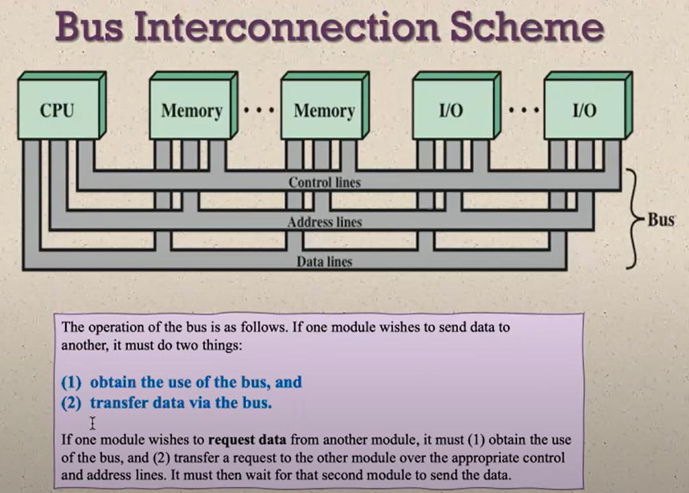
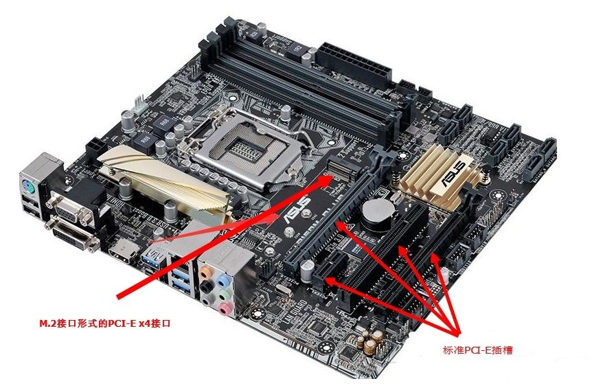
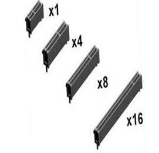
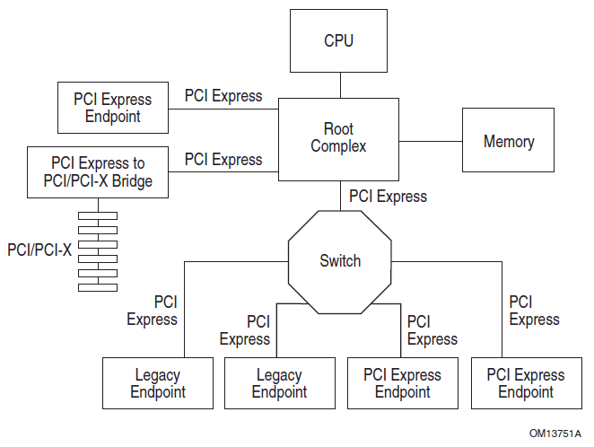
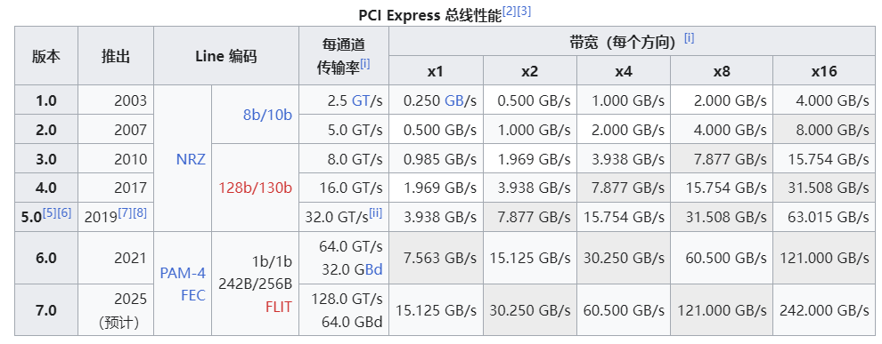
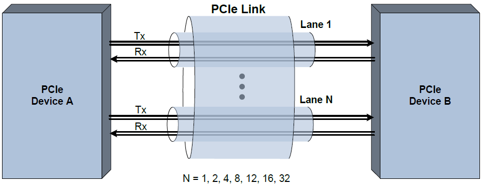

# 0x00. 导读

基础介绍，PCIe 物理世界长什么样，软件世界长什么样。

# 0x01. 简介

# 0x02.

PCIe 的全称是 Peripheral Component Interconnect Express, 是一种用于连接外设的总线。它于 2003 年提出来，作为替代 PCI 和 PCI-X 的方案，现在已经成了现代CPU和其他几乎所有外设交互的标准或者基石。

## 2.0 

以下内容来自 [请问 PCIe 在计算机内部究竟扮演怎样的角色？ 老狼的回答](https://www.zhihu.com/question/565711215/answer/2867667249)

PCIe 在现代 x86 体系中除了传统的连接外部设备（真的有硬连线）的作用，更多的是充当 IP 粘合剂的作用。

现代冯诺依曼计算机系统，除了 CPU 内核外，还有大量的设备。其中就有很多列为 PCI/PCIe 设备。其中绝大多数，并不存在真实的实体 PCIe 板卡或者外部设备，而是 CPU 或桥片内部集成的控制逻辑，我们叫它们是一个个 **IP**。我们可以将物理 CPU 抽象成一个容器（Chassis），它由一些内核和很多独立的 IP 组成，这些 IP 可以在 SOC 中，也可以在分离的 CPU 和桥片中。IP 中除了传统的集成控制器（如 USB、SATA、iGPU、MAC 等），还有内存控制器、各种 PHY、PCIe RootComplex 等等。

这些 IP 相对 CPU 内核，是独立的存在。这种分离设计在 CPU 模块化设计的当下已经成为主流，谁不想减少 IP 之间、IP 和内核之间的耦合性，最终像搭积木一样搭出一个 CPU 呢？说 IP 独立，是它们都有独立的控制逻辑电路，甚至复杂的有独立的 MCU 和固件。但它们又不是完全独立，还需要和带内内核进行互操作，甚至 IP 之间也可能互操作，这就需要暴露一些操作接口给对方。怎么暴露呢？

熟悉 CPU 原理的应该知道答案了，就是一组寄存器，准确的说是一组 CSR（Control and Status Register）。接下来唯一的问题是这些 CSR 如何暴露给带内内核了。在 ARM 传统体系中，这些 CSR 往往作为 MMIO 映射到地址空间中，某个 IP CSR MMIO 起始地址在 SOC 设计地址规划阶段就需要定下来，定好后一般后期不能改变。在 x86 体系中，传统上，南桥的设备映射到 PCIe 地址空间中，而北桥和 CPU 内部的设备映射到 MMIO 中。但后期随着北桥的功能被移入 CPU，和 CPU 中加入越来越多的 IP，传统做法让 MMIO 地址冲突越来越严重。更重要的是，MMIO 的映射关系不是 PnP 的，也就是不可以枚举的，而是在 ACPI 中列举的，这在系统整合和 SKU 越来越多的时候，造成很大麻烦。为什么不和南桥设备一样，统一映射到 PCIe 地址空间呢？

Intel 的架构师也有一样的想法，如果我们仔细跟踪 Intel CPU 中设备 CSR 的映射关系，就会发现有越来越多的设备 IP 从 MMIO 空间移入了 PCIe 空间（配置寄存器空间或者 BAR 上），有了自己的 Device 和 Func 号。在 BIOS 启动阶段设备甚至比在操作系统阶段可以看到的设备多得多，很多不需要终端用户关心的设备在启动最后阶段被隐藏了。那么这种迁移是如何做到的呢？是不是通过在芯片内部连接了无数 PCIe 总线呢？

并不是。这要归功于 IOSF（Intel On-Chip System Fabric）总线，它提供 Die 内 backbone Fabric（可以跨 DMI），将各个 IP 整合在一起。IOSF 总线包括两种接口（Interface）：Primary Interface 和 Sideband Interface。主接口提供 PCIe 抽象，方便各个 IP CSR 映射到 PCIe 空间中；而简化的旁路接口是传统的 index/value 接口，提供轻量级的访问，方便一些简单的 IP 的 CSR 映射到带外 IO 空间中，缺点是速度慢。

借助于 IOSF 总线，大量的集成 IP 通过 Primary Interface 将自己的 CSR 暴露给带内 CPU，从而在独立和互操作上取得平衡。它们在软件逻辑上，看起来和 PCIe 没有什么不同，其实原理大不相同。正因为这样，我们今天，才能在 x86 PC 和服务器中，看到如此多的 PCIe 设备，它们不仅仅是传统的外部 PCIe 设备，还有很多是抽象的内部 IP。

## 2.1 总线

在电脑里，不同的设备要想交互数据，就必须要经过一定的通道，就好像现实当中，两个城市要交换货物，就必须要修路，这里的路就和计算机里的总线概念一样，总线就是计算机里，用于走数据的路，CPU核心和cache缓存交互数据的时候，使用的就是内部总线，这个总线只在CPU内交互数据，但是CPU不可能就自己在那空算数吧，他总要和其他设备交互数据，就需要用到外部总线了，CPU会通过外部总线和其他的设备比如硬盘，网卡，声卡，USB设备沟通，PCI-E 就是外部总线的一种（外部是相对于 CPU 来说，实际还是计算机内部的一种高速总线）。

维基百科：
> 总线（Bus）是指计算机组件间规范化的交换数据（data）的方式，即以一种通用的方式为各组件提供数据传送和控制逻辑。  
> 从另一个角度来看，如果说主板（Mother Board）是一座城市，那么总线就像是城市里的公共汽车（bus），能按照固定行车路线，传输来回不停运作的比特（bit）。这些线路在同一时间内都仅能负责传输一个比特。因此，必须同时采用多条线路才能发送更多资料，而总线可同时传输的资料数就称为宽度（width），以比特为单位，总线宽度愈大，传输性能就愈佳。总线的带宽（即单位时间内可以传输的总资料数）为：总线带宽 = 频率×宽度（Bytes/sec）。

> PC上一般有五种总线：  
> - 数据总线（Data Bus）：在CPU与RAM之间来回传送需要处理或是需要储存的数据。  
> - 地址总线（Address Bus）：用来指定在RAM（Random Access Memory）之中储存的数据的地址。  
> - 控制总线（Control Bus）：将微处理器控制单元（Control Unit）的信号，传送到周边设备，一般常见的为USB Bus和1394 Bus。  
> - 扩展总线（Expansion Bus）：可连接扩展槽和电脑。  
> - 局部总线（Local Bus）：取代更高速数据传输的扩展总线。  

## 2.2 基础概念

首先，PCIe 硬件外观上，长这样，统一了江湖，不像之前一样，每个器件每个厂商各有各的长相

对内，自然就要实现一个架构来和操作系统交互。

## 2.3 速率

GT/s 即 Giga Transmission per second （千兆传输 / 秒），每一秒内传输的次数。  
Gbps 即 Giga Bits Per Second （千兆位/秒）。1 千兆比特每秒等于 100 万比特每秒。换算成 GB/s 的话需要除以 8.  
GT/s 与 Gbps 之间不存在成比例的换算关系。

例如：PCI-e2.0 协议支持 5.0 GT/s，即每一条 Lane 上支持每秒钟内传输 5G 个 bit（因为每条 lane 每次只能传一个 bit ，串行传输嘛）；但这并不意味着 PCIe 2.0 协议的每一条 Lane 支持 5Gbps 的速率，因为 PCIe 2.0 的物理层协议中使用的是 8b/10b 的编码方案。 即每传输 8 个 bit，需要发送 10 个 bit；这多出的 2 个 bit 并不是对上层有意义的信息。

那么， PCIe 2.0 协议的每一条 Lane 支持 5 * 8 / 10 = 4 Gbps = 0.5 GB/s = 500 MB/s 的速率，PCIe 2.0 x8 的通道为例，x8 的可用或者说有效带宽为 4Gbps * 8 = 32 Gbps = 4 GB/s。

PCIe采用了端到端的全双工的传输设计，基于数据包的传输，设备之间通过link相连，link支持1到32个lane：

# 0x. 其它

