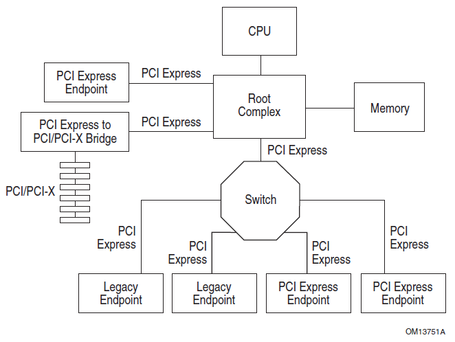

# 0x00. 导读

PCIe 架构详解。

TODO: lspci 查看各个组件

# 0x01. 简介

PCIe的架构主要由五个部分组成：Root Complex，PCIe Bus，Endpoint，Port and Bridge，Switch。




# 0x02. 


## 2.1 Root Complex（RC）

Root Complex 是整个 PCIe 设备树的根节点，CPU通过它与PCIe的总线相连，并最终连接到所有的PCIe设备上。

虽然是根节点，但是系统里面可以存在不只一个 Root Complex。随着 PCIe Lane 的增加， PCIe 控制器和 Root Complex 的数量也随之增加。

RC的内部实现很复杂，PCIe Spec也没有规定RC该做什么，还是不该做什么。我们也不需要知道那么多，只需清楚：它一般实现了一条内部PCIe总线（BUS 0），以及通过若干个PCIe bridge，扩展出一些PCIe Port，如上图所示


## 2.2 PCIe 总线（Bus）

PCIe 上的设备通过 PCIe 总线互相连接。

## 2.3 PCIe Device

PCIe 上连接的设备可以分为两种类型：

- Type 0：它表示一个PCIe上最终端的设备，比如我们常见的显卡，声卡，网卡等等。
- Type 1：它表示一个 PCIe Switch 或者 Root Port。和终端设备不同，它的主要作用是用来连接其他的PCIe设备，其中PCIe的Switch和网络中的交换机类似。

### 2.3.1 BDF（Bus Number, Device Number, Function Number）

PCIe 上所有的设备，无论是 Type 0 还是 Type 1，在系统启动的时候，都会被分配一个唯一的地址，它有三个部分组成：

- Bus Number：8 bits，也就是最多256条总线
- Device Number：5 bits，也就是最多32个设备
- Function Number：3 bits，也就是最多8个功能

这就是我们常说的 BDF，它类似于网络中的IP地址，一般写作 BB:DD.F 的格式。

在我们知道了任何一个设备的BDF之后，我们就可以通过它查看到这个设备的详细信息了
```bash
$ lspci -s 00:14.0 -vv 
00:14.0 SMBus: Advanced Micro Devices, Inc. [AMD] FCH SMBus Controller (rev 61)
        Subsystem: Super Micro Computer Inc H12SSL-i
        Control: I/O+ Mem+ BusMaster- SpecCycle- MemWINV- VGASnoop- ParErr- Stepping- SERR- FastB2B- DisINTx+
        Status: Cap- 66MHz+ UDF- FastB2B- ParErr- DEVSEL=medium >TAbort- <TAbort- <MAbort- >SERR- <PERR- INTx-
        IOMMU group: 39
        Kernel driver in use: piix4_smbus
        Kernel modules: i2c_piix4, sp5100_tco

```

由于默认BDF的方式最多只支持8个Function，可能不够用，所以PCIe还支持另一种解析方式，叫做 ARI(Alternative Routing-ID Interpretation), 它将 Device Number 和 Function Number 合并为一个8bit的字段，只用于表示Function，所以最多可以支持256个Function，但是它是可选的，需要通过设备配置启用。

### 2.3.2 Type 0 Device 和 Endpoint

所有连接到 PCIe 总线上的 Type 0 设备（终端设备），都可以来实现PCIe的Endpoint，用来发起或者接收PCIe的请求和消息。每个设备可以实现一个或者多个Endpoint，每个Endpoint都对应着一个特定的功能。比如：

- 一块双网口的网卡，可以每个为每个网口实现一个单独的Endpoint；
- 一块显卡，其中实现了4个Endpoint：一个显卡本身的Endpoint，一个Audio Endpoint，一个USB Endpoint，一个UCSI Endpoint；


## 2.4 Bridge

桥提供了与其他总线 (如 PCI 或 PCI- x，甚至是另一个 PCle 总线) 的接口。如图中显示的桥接有时被称为 “转发桥接”，它允许旧的 PCI 或 PCIX 卡插入新系统。相反的类型或“反向桥接” 允许一个新的 PCle 卡插入一个旧的 PCI 系统。


RP（Root Port）：RP是主板上的PCIE插槽或端口，用于连接RC和EP之间的桥梁。RP在PCIE总线拓扑中扮演桥接角色，将RC与连接在其上的EP进行通信。

Switch：PCIE Switch是一种特殊的RP，它具有多个PCIE端口，用于连接多个EP。PCIE Switch允许多个设备同时通过PCIE总线与RC通信，扩展了PCIE总线的连接能力。

## 2.5 Switch

提供扩展或聚合能力，并允许更多的设备连接到一个 PCle 端口。它们充当包路由器，根据地址或其他路由信息识别给定包需要走哪条路径。是一种 PCIe 转 PCIe 的桥。

靠近RC的那个端口，我们叫上游端口（upstream port），而分出来的其他端口，我们叫下游端口（downstream port）。一个Switch只有一个上游端口，可以扩展出若干个下游端口。

对每个Switch来说，它下面的Endpoint或者Switch，都是归他管的：上游下来的数据，它需要甄别数据是传给它下面哪个设备，然后进行转发；下面设备向RC传数据，也要通过Switch代为转发的。因此，Switch的作用就是扩展PCIe端口，并为挂在它上面的设备（endpoint 或者switch）提供路由和转发服务。

PCIe Switch 内部主要有三个部分：

- 一个 Upstream Port 和 Bridge: 用于连接到上游的 Port，比如，Root Port 或者上游 Switch 的 Downstream Port
- 一组 Downstream Port 和 Bridge: 用于连接下游的设备，比如，显卡，网卡，或者下游 Switch 的 Upstream Port
- 一根虚拟总线：用于将上游和下游的所有端口连接起来，这样，上游的 Port 就可以访问下游的设备了

每个Switch内部，也是有一根内部PCIe总线的，然后通过若干个Bridge，扩展出若干个下游端口。


下面是一个实际的计算机系统例子：

