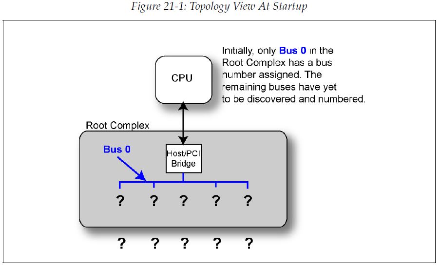
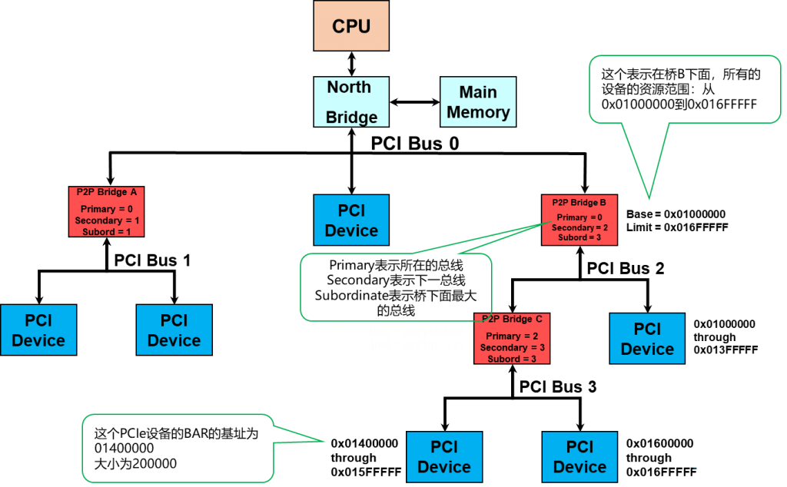

# 0x00. 导读

# 0x01. 简介

上电复位后，首先进行链路训练，之后进行枚举扫描、最后进行基地址寄存器 BAR 的配置。
完成基地址配置后，就可以通过 memory TLP 读写进行寄存器的访问了。

本文介绍 枚举扫描 和 配置空间。

# 0x02. 枚举扫描

ID、IO、Memory 三种基本资源是PCIe设备的工作基础。在系统启动时，BIOS会给各个PCIe设备分配如上三种资源，这个过程就是我们常说的枚举（Enumeration）。注意，在进入Linux系统后，内核会重新扫描总线并check资源。

整个枚举过程分为两个阶段，首先扫描设备。其次再对每个设备进行资源分配。

 一切从根开始，也就是扫描会从RootComplex开始，并且按照深度优先的方式遍历完所有的设备。在扫描过程中，如果扫描到EP，则返回。如果是桥，则继续往桥后扫描，总线号增加。扫描完成后，就得到了整个PCIe大树的整体形状，也就是我们所说的整个PCIe拓扑。资源的分配也是从RC开始，同样按照深度优先方式遍历，为每个设备分配必要的资源。

BIOS 代码在枚举设备的时候，会去读每个设备的 vendor id, 如果读到的是不是 FFFF，则表示此位置有设备存在，若为 FFFF, 则表示设备不存在。device id 和 vendor id(厂商ID) 是出厂时就固定在 PCIE 设备配置空间中的数据，表示每个不同的设备，同理，我们在 BIOS 中也可通过判断这个 ID 值来寻找指定的PCIE设备。

每个设备在出厂时，其配置空间中的值都有一些 default 值，枚举该设备时为每个设备分配 BDF 号和内存资源时，会再写入部分值到配置空间。注意，Dev 和 Fun 号应该是和硬件设计有关系，也就是硬件就已经固定，软件的枚举过程是更多的是在分配 Bus 号。

# 0x03. 配置空间
