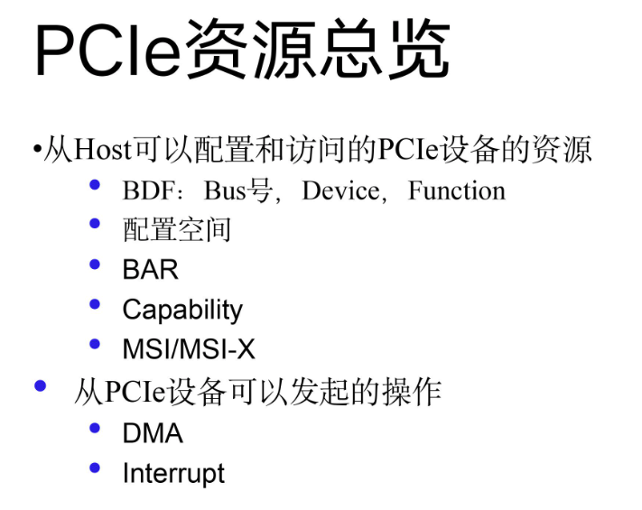

# 0x00. 导读

地址空间。

# 0x01. 简介

PCI 总线有自己的 I/O 空间（32位）和内存空间（32/64位），CPU 访问 PCI 空间需要映射，硬件上电自动完成将不同的外设映射到不同的CPU地址空间上。

PCI 设备的使用模型是这样的，外设可以抽象成一片内存或者一排连续的端口，具体而言每个功能256字节的配置内存。它们可以被排布在PCI总线地址空间上，然后映射到host CPU的地址空间里。每个PCI插槽有4个中断引脚，每个功能可以使用其中一个。每个PCI外设由domain(16位)、bus（8位）、device（5位）以及function（3位）组成的编号来标识。每个domain可以有最多256个bus，每个bus上最多可以有32个device，每个divece上最多可以有8中function。



# 0x02.

# 0x0x. 

```
当驱动程序需要访问 PCI 设备的某个 BAR（Base Address Register，基地址寄存器）所映射的资源时，它首先使用 pci_resource_start 函数来获取该资源的起始地址。这个起始地址是 PCI 设备在物理内存或 I/O 端口空间中的实际地址。

resource_size_t pci_resource_start(struct pci_dev *dev, int bar);

返回的地址是 PCI 设备在物理内存或 I/O 端口空间中的地址，而不是 CPU 可以直接访问的虚拟地址。如果程序需要访问这个地址，它还需要使用 ioremap 函数将这个物理地址转换为一个虚拟地址。

此外，pci_resource_start 函数返回的地址是在 PCI 总线域的地址，而不是在 CPU 的存储器域的地址。因此，在将这个地址用于访问 PCI 设备之前，还需要进行地址空间的转换。这通常是通过调用 pci_resource_to_user 函数来完成的。

总的来说，pci_resource_start函数是 Linux 内核中 PCI 设备驱动程序获取 PCI 设备资源起始地址的重要工具。驱动程序通过这个函数可以获取到 PCI 设备在物理内存或 I/O 端口空间中的实际地址，从而可以对设备进行访问和操作。
```


## 0000

