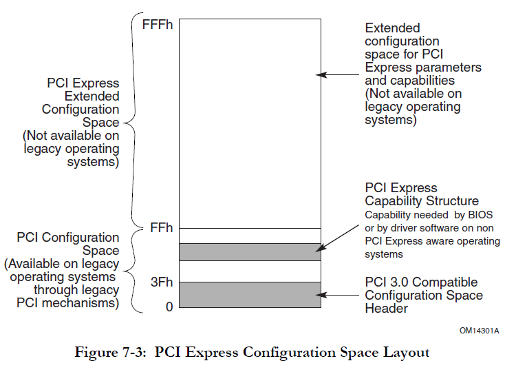
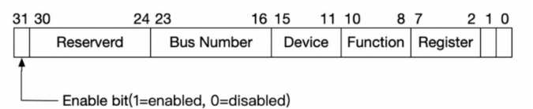
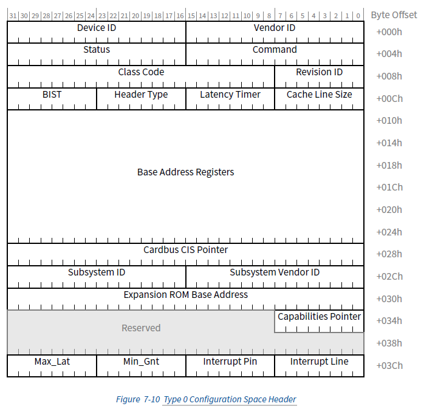
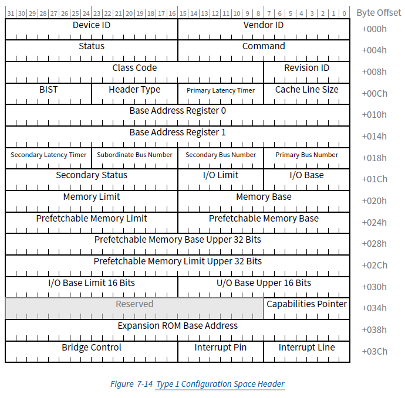
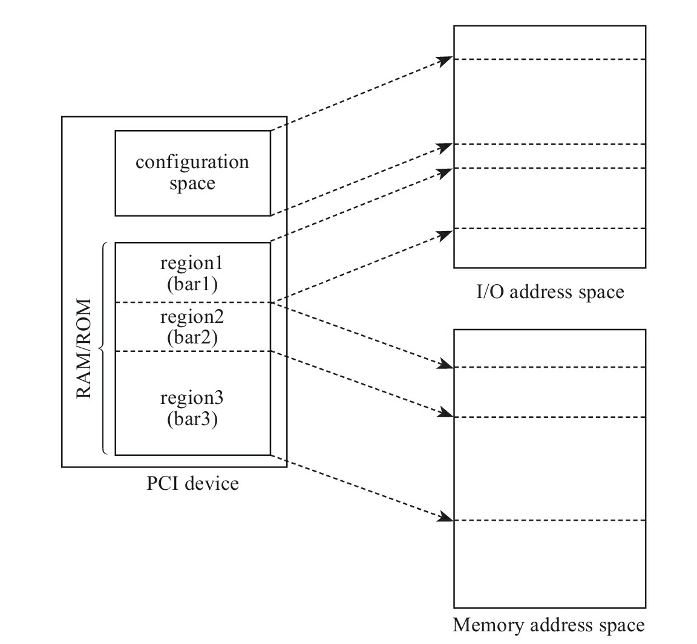
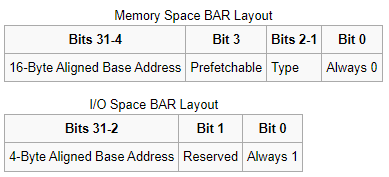

# 0x00. 导读

配置空间和 BAR。

# 0x01. 简介

- Configuration Space: 配置空间
    - 在设备端实现的一组特别的寄存器
    - 软件和设备交互的接口，软件可以用来控制设备，查看设备的状态
    - 每个设备的 Function 对应一个配置空间，而不是每个设备
- 配置空间大小
    - PCI 定义了256字节
    - PCIe 扩展到4K
- 组成结构
    - 头部: 64 字节
    - Capability Structure: 192 字节
    - PCIe 扩展空间: 4096-256 字节
        - 通常放置 PCIe 扩展 Capability



# 0x02. 访问方法

两种方法:
- 方法1，只在X86存在，I/O 访问方法
- 方法2，MMIO(Memory Mapped IO) 访问方法

## 2.1 I/O 访问方法

IO 端口访问，定义了两个 IO端口寄存器 用来访问设备的配置空间:
- CONFIG_ADDRESS(0xCF8): 地址寄存器。如图:
    
- CONFIG_DATA(0xCFC): 数据寄存器

写入数据到配置空间
- 地址客存器写入 BDF 和 register 
- 数据寄存器写入数据，完成写入

从配置空间读取数据
- 地址寄存器写入 BDF 和 register
- 然后从数据寄存器读取数据，完成读取

Linux下查看IO端口地址
```bash
$ grep conf /proc/ioports
0cf8-0cff : PCI conf1
```

## 2.2 MMIO 方法

IO 端口只能访问 256(2^6) 字节的配置空间，PCIe 的配置空间扩展到 4K, IO 端口的方法无法访问到扩展的配置空间，所以定义了一段 MMIO 空间用来访问配置空间，大小 256M(256*256*4096)，空间地址地址范围通过如下查看:
```bash
$ grep MMCONFIG -i /proc/iomem
00000000-00000000 : PCI MMCONFIG 0000 [bus 00-ff]
```

读写方法: 
- 读写和 memory 读写一样，直接向 MMIO 地址读写数据即可

# 0x03. 头部结构

配置空间头部分类可以分为两类：
- Type 0 表示终端设备
- Type 1 表示 Switch。

PCIe 上大部分我们使用的设备都是 Type 0 的终端设备。

Type 0设备的配置空间如下：


Vendor ID（厂商ID）：16 位，用于标识 PCIE 设备的制造商。由 PCI-SIG（PCI Special Interest Group）分配给厂商。

1. Device ID（设备ID）：16 位，用于标识特定厂商的不同 PCIE 设备型号。

2. Command Register（命令寄存器）：16 位，用于启用或禁用 PCIE 设备的各种功能。其中的一些标志位包括：

    - I/O Space Enable（I/O 空间使能）：启用设备的 I/O 地址空间。
    - Memory Space Enable（内存空间使能）：启用设备的内存地址空间。
    - Bus Master Enable（总线主控制使能）：允许设备成为 PCIE 总线的主控设备。
    - Memory Write and Invalidate（内存写入和失效）：允许设备进行内存写入和失效操作。

3. Status Register（状态寄存器）：16 位，用于显示设备的当前状态，例如是否支持 66MHz 时钟、是否支持 66MHz 数据传输等。

4. Revision ID（版本ID）：8 位，用于标识设备的硬件版本号。

5. Class Code（类别代码）：24 位，用于标识设备的类别和功能。例如，指示设备是网络控制器、显卡还是存储控制器等。

6. Subclass Code（子类别代码）：8 位，更详细地描述设备的类别。

7. Prog IF（接口描述符）：8 位，用于标识设备的接口类型，以及特定接口的功能。

8. BIST（Built-In Self Test）：8 位，包含一些用于自检的标志位。

9. BARs（Base Address Registers）：PCIE 设备可以使用这些 32 位或 64 位的寄存器来指定设备的 I/O 地址空间和内存地址空间的基地址。

10. Subsystem Vendor ID（子系统厂商ID）：16 位，用于标识连接到 PCIE 设备上的子系统（通常是主板）的制造商。

11. Subsystem ID（子系统ID）：16 位，用于标识连接到 PCIE 设备上的子系统的型号。

12. Expansion ROM Base Address：32 位，用于指定扩展的只读存储器（Expansion ROM）的基地址。

13. Capabilities Pointer：8 位，指向 PCIE 设备的扩展能力列表。

14. Interrupt Line 和 Interrupt Pin：用于配置设备的中断信息，包括中断线路和中断引脚。

Type 1设备的配置空间：


Vendor ID（厂商ID）：16位，用于标识PCIE设备的制造商。由PCI-SIG（PCI Special Interest Group）分配给厂商；枚举设备时通常判断此VID来判断设备是否存在。

1. Device ID（设备ID）：16位，用于标识特定厂商的不同PCIE设备型号。

2. Command Register（命令寄存器）：16位，用于启用或禁用PCIE设备的各种功能。其中的一些标志位包括：

    - I/O Space Enable（I/O空间使能）：启用设备的I/O地址空间。
    - Memory Space Enable（内存空间使能）：启用设备的内存地址空间。
    - Bus Master Enable（总线主控制使能）：允许设备成为PCIE总线的主控设备。
    - Memory Write and Invalidate（内存写入和失效）：允许设备进行内存写入和失效操作。

3. Status Register（状态寄存器）：16位，用于显示设备的当前状态，例如是否支持66MHz时钟、是否支持66MHz数据传输等。

4. Revision ID（版本ID）：8位，用于标识设备的硬件版本号。

5. Class Code（类别代码）：24位，用于标识设备的类别和功能。例如，指示设备是网络控制器、显卡还是存储控制器等。

6. Subclass Code（子类别代码）：8位，更详细地描述设备的类别。

7. Prog IF（接口描述符）：8位，用于标识设备的接口类型，以及特定接口的功能。

8. BIST (Built-In Self Test)：8位，包含一些用于自检的标志位。

9. BARs（Base Address Registers）：PCIE设备可以使用这些32位或64位的寄存器来指定设备的I/O地址空间和内存地址空间的基地址。

10. Subsystem Vendor ID（子系统厂商ID）：16位，用于标识连接到PCIE设备上的子系统（通常是主板）的制造商。

11. Subsystem ID（子系统ID）：16位，用于标识连接到PCIE设备上的子系统的型号。

12. Expansion ROM Base Address：32位，用于指定扩展的只读存储器（Expansion ROM）的基地址。

13. Capabilities Pointer：8位，指向PCIE设备的扩展能力列表。

14. Interrupt Line和Interrupt Pin：用于配置设备的中断信息，包括中断线路和中断引脚。

15. Subordinate Bus Number（下级总线号）：8位，用于指定连接到当前PCIE设备的下一级PCIE总线的总线号。当一个PCIE设备上有其他PCIE设备连接时，Subordinate Bus Number指定了这些下级设备所使用的总线号范围。这有助于系统在启动时自动分配资源和配置多级PCIE总线结构

**PCIe配置空间的布局非常灵活，主要是通过链表来串联多个Capability寄存器。在原有的配置空间中，有一个寄存器指定了第一个Capability的位置，而第一个Capability又会指向下一个Capability，从而构成了一个Capability链表**。

# 0x04. BAR(Base Address Register)

对 Type 0，提供了最多 6 个 BAR（实际应用中基本上不会用到6个，通常1~3个BAR比较常见），而对 Type 1 来说，只有 2 个。

以 Type 0 为例，BAR 是 PCI 配置空间中从 0x10 到 0x24 的 6 个 register，**用来定义PCI需要的配置空间大小以及配置PCI设备占用的地址空间**。每个PCI设备在BAR中描述自己需要占用多少地址空间，UEFI通过所有设备的这些信息构建一张完整的关系图，描述系统中资源的分配情况，然后在合理的将地址空间配置给每个PCI设备。



主要注意的是，如果某个设备的BAR没有被全部使用，则对应的BAR应被硬件全被设置为0，并且告知软件这些BAR是不可以操作的。对于被使用的BAR来说，其部分低比特位是不可以被软件操作的，只有其高比特位才可以被软件操作。而这些不可操作的低比特决定了当前BAR支持的操作类型和可申请的地址空间的大小。

一旦BAR的值确定了（Have been programmed），其指定范围内的当前设备中的内部寄存器（或内部存储空间）就可以被访问了。当该设备确认某一个请求（Request）中的地址在自己的BAR的范围内，便会接受这请求。

BAR 结构



- 最低位Bit 0：是一个标志位，用于描述地址空间的类型，0表示内存空间，1表示IO空间
- Memory Space中的Bit [2:1] - Type：用于描述内存空间的类型，00表示32位地址空间，10表示64位地址空间
- Memory Space中的Bit 3 - Prefetchable：用于描述内存空间是否支持预取，0表示不支持，1表示支持。如果一段内存空间支持预取，它意味着读取时不会产生任何副作用，所以CPU可以随时将其预取到DRAM中。而如果预取被启用，在读取数据时，内存控制器也会先去DRAM查看是否有缓存。当然，这是一把双刃剑，如果数据本身不支持预取，那么除了可能导致数据不一致，多一次DRAM的查询还会导致速度下降。

## 4.1 Linux 访问 BAR 方式

在枚举过程中，PCI 驱动已经分配了 address 给各个 BAR，通过一些接口就可以访问到 BAR Resource。位于 include/linux/pci.h ，以宏的形式提供。
```c
pci_resource_start(dev, bar)
pci_resource_end(dev, bar)
pci_resource_flags(dev, bar)
pci_resource_len(dev, bar)
```

通过 pci_resource_start 宏取得 bar 地址值之后，Linux 认为这个地址是 IO 地址，如果要访问的话可以通过 ioremap 映射到内核空间，然后通过 readl/writel 等IO接口进行操作。

```c
uint64_t reg_phy_base_addr = pci_resource_start(pdev, 0);
uint8_t* reg_vir_base_addr = ioremap(reg_phy_base_addr, pci_resource_len(pdev, 0));
```

在有MMU的计算机中，CPU看到的是虚拟地址，发给MMU后转换成物理地址，虚拟地址再经过相应的电路转换成总线地址，就是外设看到的地址。所以，DMA外设看到的地址其实是总线地址。Linux内核提供了相应的API来实现三种地址间的转换:
```c
//虚拟->物理
virt_to_phys()
//物理->虚拟
ioremap()

//虚拟->总线
virt_to_bus()
//总线->虚拟
bus_to_virt()
```