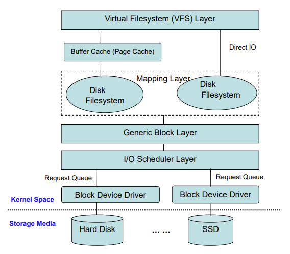
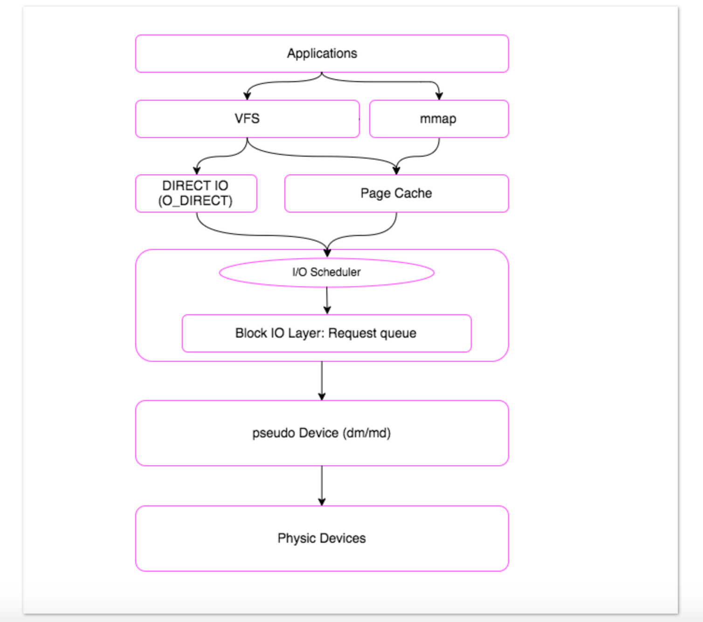
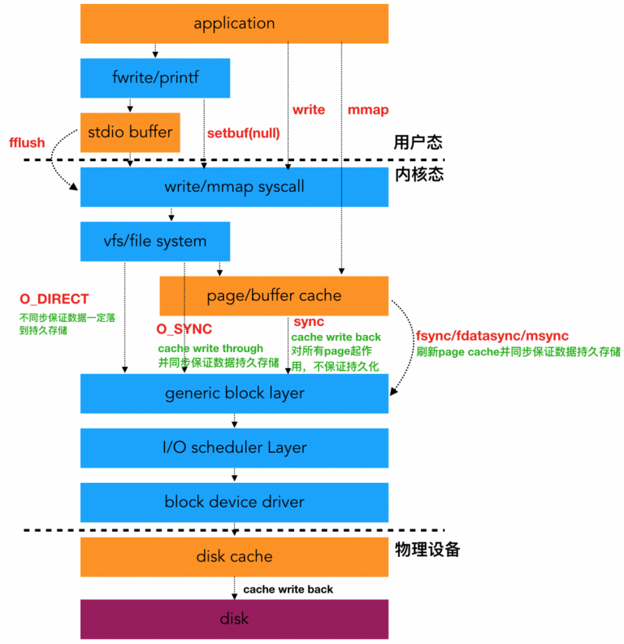

# 0x00. 导读

一次 IO 请求从上到下的经历。

# 0x01. 简介

# 0x02. IO 环游记

假设一个进程使用系统调用 `read()` 读取磁盘上的文件。下面步骤是内核响应进程读请求的步骤:

1. 系统调用 `read()` 会触发相应的 VFS函数
2. VFS 确定请求的数据是否已经在缓冲区中；若不在，向下一层请求。
3. 映射层 (Mapping Layer) 确定数据在物理设备上的位置。
4. 内核通过通用块设备层 (Generic Block Layer) 在块设备上执行读操作，启动 I/O 操作，传输请求的数据。
5. I/O 调度层 (I/O Scheduler Layer) ，根据内核的调度策略，对等待的 I/O 等待队列排序。
6. 最后，块设备驱动 (Block Device Driver) 通过向磁盘控制器发送相应的命令，执行真正的数据传输。

一个 I/O 请求进入 block layer 之后，可能会经历下面的过程：

- Remap: 可能被 DM(Device Mapper) 或 MD(Multiple Device, Software RAID) remap 到其它设备
- Split: 可能会因为 I/O 请求与扇区边界未对齐、或者 size 太大而被分拆 (split) 成多个物理 I/O
- Merge: 可能会因为与其它 I/O 请求的物理位置相邻而合并 (merge) 成一个I/O
- 被 IO Scheduler 依照调度策略发送给 driver
- 被 driver 提交给硬件，经过HBA、电缆（光纤、网线等）、交换机（SAN或网络）、最后到达存储设备，设备完成 IO 请求之后再把结果发回。

# 0x03. 详解

我们将IO路径简化如下：

当需要发起块设备读写请求时，kernel 首先根据需求构造 bio 结构，其中包含了读写的地址、长度、设备、回调函数等信息，然后 kernel 通过 submit_bio 函数将请求转发给块设备，submit_bio 的输入参数为 bio 结构，submit_bio 最终会调用 generic_make_request 函数不断转发 bio 请求。

请求到达 block 层后，把 bio 变成了 request 。具体的做法如下：如果几个 bio 要读写的区域是连续的，即积攒成一个 request （一个 request 上挂多个连续的 bio ，就是我们通常说的 合并 bio 请求 ），如果一个 bio 跟其他的 bio 都连不上，那它就自己创建一个新的 request ，把自己挂在这个 request 下。当然，合并 bio 的个数也是有限的，这个可以通过配置文件配置。

补充一点：上层的一次请求可能跨越了多个扇区，形成不连续的扇区段，那么该请求构造的每个 bio 对应着一个连续的扇区段。故一个请求可以构造出多个 bio 。

合并后的 request 放入每个设备对应的 request_queue 中。之后设备驱动调用 peek_request 从 request_queue 中取出 request ，进行下一步处理。

bio 结构中有 bio_vec 数组结构，该结构的的数组可以指向不同的 page 单元，那为什么不在 bio 这一级就做了 bio 合并工作，即把多个 bio 合并成一个 bio ，何必加入一个 request 这么麻烦？

答：每个 bio 有自己的 end_bio 回调，一旦一个 bio 结束，就会对自己进行收尾工作，如果合并了，或许有些 bio 会耽误，灵活性差。

