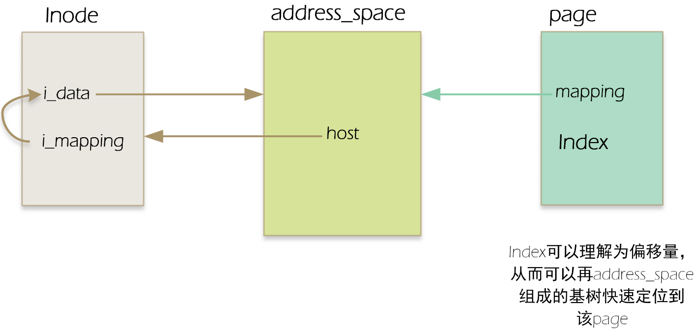
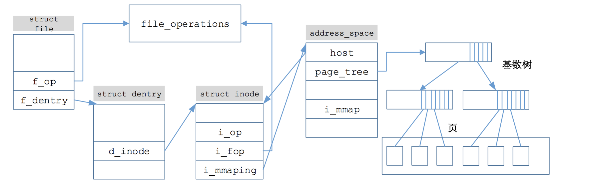
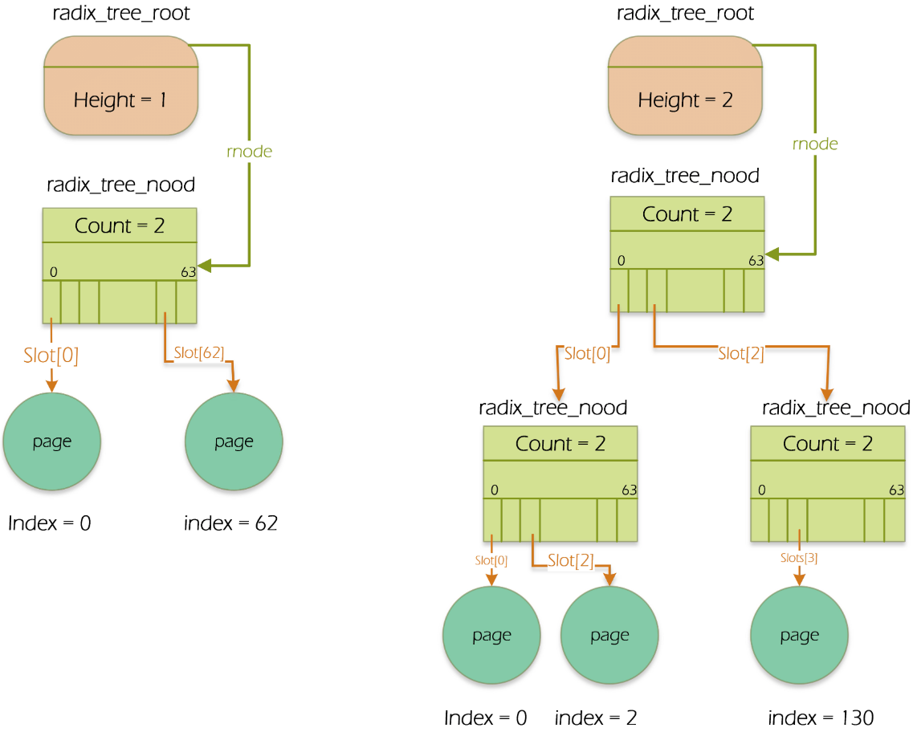

# 0x00. 导读

# 0x01. 简介

Page Cache = 页高速缓存

address_space 对象是文件系统中关于内存中页高速缓存的核心数据结构。address_space 对页高速缓存进行管理。 address_space 是沟通文件系统 inode 与磁盘的桥梁。

linux中几乎所有文件的读和写操作都依赖于页高速缓存。只有在O_DIRECT标志置为才会出现意外：此时，I/O数据的传送绕过了页高速缓存而使用了进程用户态地址空间的缓冲区；另外，少量的数据库软件为了采用自己的磁盘高速缓存算法而使用了O_DIRECT标志。

why设计页高速缓存？

答：1.快速定位所有者相关数据页的位置（基树）。2.区分不同所有者页的不同读写操作，如普通文件、块设备文件、交换区文件读一个数据页必须使用不同的方式实现，故内核根据页的不同所有者进行不同的操作。

# 0x02. 

那么一个页（page）怎么和一个address_space产生关联的呢？

page 中有两个字段： mapping 和 index 。  
其中 mapping 指向该页所有者的 address_mapping (内存inode结构有一个i_mapping指向对应address_space对象)  
index 字段表示所有者地址空间中以页大小为单位的偏移量。  
用这两个字段就能在页高速缓存中查找。（这里注意一点，一个页中所包含的磁盘块在物理上不一定是相邻的）

address_space中有一个host字段，该字段指向其所属的inode，也就是address_space中的host字段 与 对应inode中的 i_data字段形成互相指向的关系。若为普通文件，那么inode结点和address_space结构的相应指针的指向关系如下图：

# 0x03. 基树

linux支持TB级的文件，ext4甚至支持到了PB级文件，访问大文件时，高速缓存中存在着有关该文件太多的页，故设计了基树这个结构来加快查找。一个address_space对象对应一个基树。

address_space中有一个字段（page_tree）指向是基树的根（radix_tree_node）。基树根中的rnode指向基树的最高层节点（radix_tree_node）,基树节点都是radix_tree_node结构，节点中存放的都是指针，叶子节点的指针指向页描述符，上层节点指向存放其他节点的指针。一般一个radix_tree_node最多可以有64个指针，字段count表示该radix_tree_node已用节点数。

怎么快速找到所需页在基树中的位置呢？

若基树深度为1，则只能表示从0至63的索引，则页索引（上文提高的index字段）的低6位进行解析，从而对应成radix_tree_node结构中的slot下标，找到对应的页；若基树深度为2，则页索引的低12位分成0~5,6~11两个字段进行解析。分别找到第一层slot字段和第二层slot字段的值。

