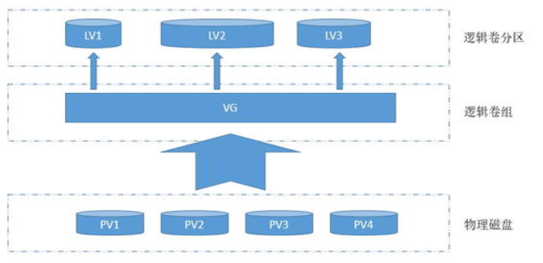

# 0x00. 导读

了解文件系统。

# 0x01. 简介

没有文件系统，访问磁盘上的数据就需要直接读写磁盘的 sector ，而文件系统存在的意义，就是能更有效的组织、管理和使用磁盘上的 raw data 。

假设有一个棋盘，上面有一百万个格子，假设每个格子对应磁盘上的一个 block 块，那么一个 file 在这些格子上该怎么映射、格子怎么查找、怎么记录空闲格子等等，这些就是文件系统要解决的问题。

文件系统，定义并实现了数据在存储介质（如硬盘等）上的存储方式和结构，以及其是如何被访问的，如索引、读取等。操作系统里，硬盘中的数据被抽象为文件的形式，并对其进行管理，比如为一块或多块数据关联一个文件名等，因此，我们称这些用于管理文件的数据结构（以及其对应的规则）为文件系统。

在文件系统里面，除了放文件本身数据以外，还需要放文件管理的数据: super block、inode bitmap、block bitmap、inode table 等等。

Linux 中的 **VFS(Virtural File System 或 Virtual FS Switch)** 作为具体的文件系统的抽象层，是非常重要的。它为各类文件系统提供了一个一致的接口，用户态的应用无需关注底层具体文件系统的区别，通过相同的系统调用请求内核即可。

# 0x02. 文件系统类型

根据存储位置的不同，可以把文件系统分为三类：

- 磁盘的文件系统，它是直接把数据存储在磁盘中，比如 Ext 2/3/4、XFS 等都是这类文件系统。
- 内存的文件系统，这类文件系统的数据不是存储在硬盘的，而是占用内存空间，我们经常用到的 /proc 和 /sys 文件系统都属于这一类，读写这类文件，实际上是读写内核中相关的数据。
- 网络的文件系统，用来访问其他计算机主机数据的文件系统，比如 NFS、SMB 等等。

下面举两个常见的文件类型：Ext4 和 XFS.

## 2.1 Ext4

Ext4(ext4日志文件系统、第四代扩展文件系统) 文件系统是 Linux 用途最广泛的日志文件系统。Ext4 可向前兼容 Ext2/Ext3 。Ext4 是很多发行版如 Debian、Ubuntu 等的默认文件系统。使用 `dumpe2fs` 命令可以查看 Ext2/3/4 文件系统详情。

### 2.1.1 Journaling

就是在数据更改正式提交至硬盘之前，先在日志区域（也是存在文件系统上的）记录变更日志，这样可以在系统崩溃或掉电后能快速恢复。现代的文件系统，甚至各类可靠的存储系统，日志存储都是必须的。而 ext3 就是在 ext2 的基础上增加了这种日志功能。

## 2.2 XFS

XFS 是 1993 年由 SiliconGraphic Inc(SGI) 公司创建的高性能的 64 位文件系统。2001年进入 Linux 内核，如今已被大多数 Linux 发行版支持。最支持的要数红帽公司，其下主打的操作系统 RHEL(Red Hat Enterprise Linux) 7 和 8 都选 XFS 为默认的文件系统，红帽的很多工程师也深度参与了 XFS 的开发和维护。使用 `xfs_info` 命令查看 XFS 文件系统详情。

# 0x03. LVM

在我们管理 Linux 磁盘的时候，通常会遇到这么一种情况。在最初规划 Linux 的磁盘的时候，我们给某个分区划分了一定量的磁盘空间，使用一段时间后，发现我们规划的磁盘空间不足了，这个时候怎么办？我们肯定要想办法给扩容呀，找一块磁盘分区，格式化，然后挂载，然后把数据拷贝到新加的磁盘上，然后把原有的磁盘卸载掉，通常我们是这样做的。这样一来虽然达到了扩容的目的，但是费时费力；如果第二次扩容，空间还是不够，我们又要重复上面的步骤；如果分配的磁盘空间过大，使用了很久才发现它根本用不到那么多空间，这个时候是不是又要调整呀，听着就感觉很繁琐。这时候你肯定要想有没有那种可挂载上一块盘，我们利用某种管理手段，可以在线的调整磁盘的空间，这样有节约了时间，也可实现弹性管理磁盘。对，lvm 就有这样的功能。

**LVM(logical volume manager)** 逻辑卷管理，它可以弹性的管理文件系统的容量， LVM 的工作原理是将一个或多个底层块设备组织成一个逻辑设备，这个逻辑设备可以在未来新增或移除其他的分区到这个逻辑设备中，从而实现了弹性管理磁盘。

- PV: 物理卷 (physical volume); 物理卷就是指硬盘分区或从逻辑上与磁盘分区具有同样功能的设备（如 raid ），是 LVM 的基本储存逻辑块，但和基本的物理存储介质（如分区，磁盘等）比较，却包含有与 LVM 相关的管理参数

- VG: 卷组 (volume group) LVM 卷组类似于非 LVM 系统中的物理硬盘，尤其物理卷组成，可以在卷组上创建一个或多个 LVM 分区（逻辑卷）， LVM 卷组由一个或多个物理卷组成

- LV: 逻辑卷 (logical volume) LVM 的逻辑卷类似非 LVM 系统中的硬盘分区，在逻辑卷之上可以创建文件系统。

LVM 就是将一些零碎的磁盘分区（PV）合并成一个较大的磁盘（VG），然后在根据需要对这个较大的磁盘（VG）进行划分成不同的大小分区（LV），这些小的分区（LV）是可以动态的扩展和缩小的，这就是 LVM 的逻辑卷管理过程。

例子可以参考 [Linux磁盘管理之LVM](https://www.cnblogs.com/qiuhom-1874/p/12156146.html)