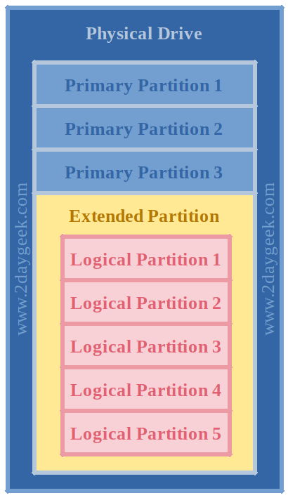
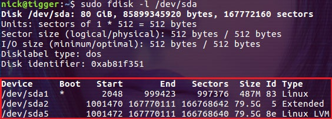
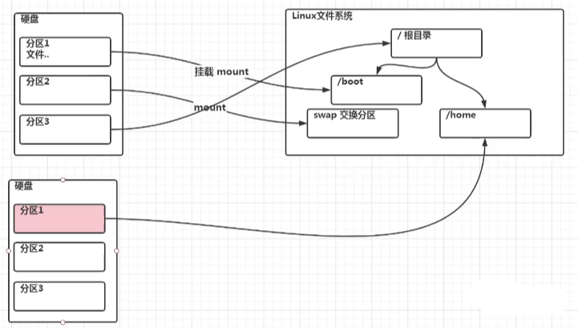
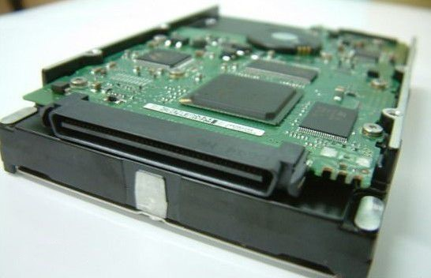
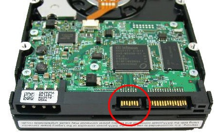
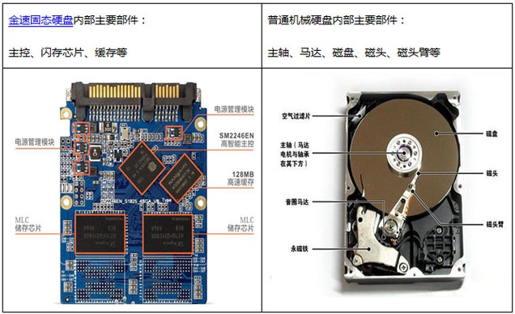
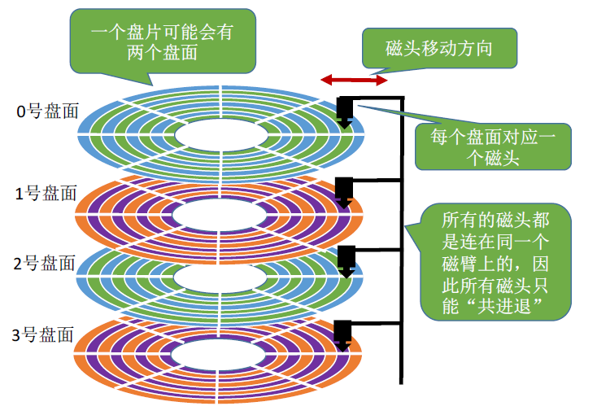
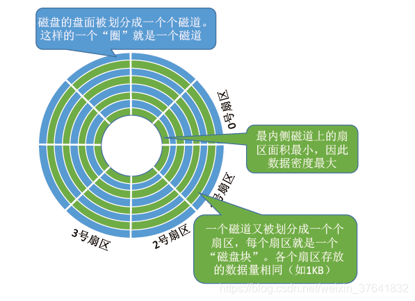
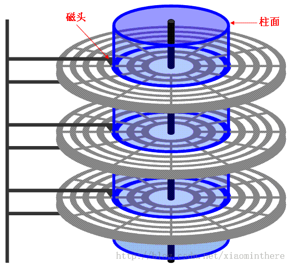

# 0x00. 导读

# 0x01. 简介

1. 新磁盘的使用步骤：磁盘分区 > 格式化分区 > 挂在磁盘分区到系统中。具体操作说明参考
    - [linux fdisk](https://gnu-linux.readthedocs.io/zh/latest/Chapter01/fdisk.html)
    - [Linux磁盘分区和挂载](https://wiki.deepin.org/zh/04_%E5%B8%B8%E8%A7%81%E9%97%AE%E9%A2%98FAQ/Linux%E7%A3%81%E7%9B%98%E5%88%86%E5%8C%BA%E5%92%8C%E6%8C%82%E8%BD%BD)

2. 机械硬盘的组成原理。

主要是明白 磁盘、分区、挂载之间的联系与原因。

# 0x02. 分区

分区有时候是名词，表示这个区A、那是区B。有时候是动词，表示在一块地方分出区A、区B等。

## 2.1 分区的组成和目的

一块硬盘可以被划分成一个或多个**逻辑磁盘**，我们将其称作**分区**。我们对硬盘进行的划分信息被储存于建立在扇区 0 的分区表 (MBR 或 GPT) 中。

Linux 需要至少一个分区来当作根文件系统，所以我们不能在没有分区的情况下安装 Linux 系统。当我们创建一个分区时，我们必须将它格式化为一个适合的文件系统，否则我们就没办法往里面储存文件了。

在 Linux 中，外围设备都位于 /dev 挂载点，内核通过以下的命名方式理解硬盘：

```
/dev/hdX[a-z]: IDE 硬盘被命名为 hdX
/dev/sdX[a-z]: SCSI 硬盘被命名为 sdX
/dev/xdX[a-z]: XT 硬盘被命名为 xdX
/dev/vdX[a-z]: 虚拟硬盘被命名为 vdX
/dev/fdN: 软盘被命名为 fdN
/dev/scdN or /dev/srN: CD-ROM 被命名为 /dev/scdN 或 /dev/srN
```

创建磁盘分区大概有下面几个目的：
- 提升数据的安全性(一个分区的数据损坏不会影响其他分区的数据)
- 多个小分区对比一个大分区会有性能提升（结合后面说的分区是指定柱面范围）
- 更好的组织数据

磁盘的分区由 主分区、扩展分区和逻辑分区 组成。在一块磁盘上，主分区的最大个数是 4，其中扩展分区也是一个主分区，并且最多只能有一个扩展分区，但可以在扩展分区上创建多个逻辑分区。因此主分区(包括扩展分区)的范围是 1-4，逻辑分区从 5 开始。对于逻辑分区，Linux 规定它们必须建立在扩展分区上，而不是建立在主分区上。 



主分区的作用是用来启动操作系统的，主要存放操作系统的启动或引导程序，因此建议操作系统的引导程序都放在主分区，比如 Linux 的 /boot 分区，最好放在主分区上

## 2.2 如何分区

很简化的操作，详细操作需要使用 `fdisk` 交互命令。

在执行操作之前，我们必须知道的是哪些磁盘被加入了系统。  
可以使用 `fdisk` 或者 `lsblk`, 查看所有存在的磁盘及分区（不管使用挂载是否）。

```bash
$ sudo fdisk -l
# 或者
$ sudo lsblk
```

`fdisk -l` 输出举例：  



输出中的前几行是磁盘的基本信息，比如总大小为 80G，一共有多少个扇区(sector)，每个扇区的大小等等。红框中的则是我们比较关注的分区信息： 

- 第一列 Device 显示了磁盘分区对应的设备文件名。  
- 第二列 Boot 显示是否为引导分区，上图中的 /dev/sda1 就是引导分区。  
- 第三列 Start 表示磁盘分区的起始位置。  
- 第四列 End 表示磁盘分区的结束位置。  
- 第五列 Sectors 表示分区占用的扇区数目。  
- 第六列 Size 显示分区的大小。  
- 第七列和第八列显示的内容相同，分别是数值 ID 及其文字描述。 Id 列显示了磁盘分区对应的 ID，根据分区的不同，分区对应的 ID 号也不相同。Linux 下用 83 表示主分区和逻辑分区，5 表示扩展分区，8e 表示 LVM 分区，82 表示交换分区，7 表示 NTFS 分区。
  
上图中的信息表明：/dev/sda1 是一个主分区并且被用作引导分区；/dev/sda2 是扩展分区，其中只有一个逻辑分区，即 /dev/sda5，这点可以通过两个分区相同的大小证明。

## 2.3 格式化分区

文件系统控制了数据的储存方式，并通过 索引节点 Inode Tables 来检索数据。如果没有文件系统，操作系统是无法找到信息储存的位置的。简单来说，磁盘分区完成后必须格式化分区才可以使用，否则磁盘将无法存储数据。

```bash
#格式化 /dev/sdb2 为 ext4 格式。
$ sudo mkfs.ext4 /dev/sdb2
#或者
$ sudo mkfs -t ext4 /dev/sdb2
```

当你在分区上建立文件系统时，以下重要信息会同时被创建：

- Filesystem UUID: UUID 代表了通用且独一无二的识别符，UUID 在 Linux 中通常用来识别设备。它 128 位长的数字代表了 32 个十六进制数。
- Superblock: 超级块储存了文件系统的元数据。如果某个文件系统的超级块被破坏，我们就无法挂载它了（也就是说无法访问其中的文件了）。
- Inode: Inode 是类 Unix 系统中文件系统的数据结构，它储存了所有除名称以外的文件信息和数据。
- Journal: 日志式文件系统包含了用来修复电脑意外关机产生下错误信息的日志。

## 2.4 如何挂载

在创建完分区和文件系统之后，我们需要挂载它们以便使用。我们需要创建一个挂载点来挂载分区，使用 mkdir 来创建一个挂载点。

```bash
$ sudo mkdir -p /mnt/lalala
```

在终端使用 `mount` 进行临时挂载，在计算机重启之后，你会丢失这个挂载点。

如果你希望永久挂载某个分区，请将分区详情加入 fstab 文件。我们既可以输入设备名称，也可以输入 UUID。

### 2.4.1 添加新硬盘直接挂载

添加一块新硬盘，注：是添加一块新硬盘，不是扩容硬盘。  
如这里添加一块sdb，没有任何操作，是没法挂载。

```bash
ubuntu@ubuntu:~$ lsblk
NAME                      MAJ:MIN RM  SIZE RO TYPE MOUNTPOINT
loop0                       7:0    0 61.9M  1 loop /snap/core20/1242
loop1                       7:1    0 70.3M  1 loop /snap/lxd/21029
loop2                       7:2    0 55.5M  1 loop /snap/core18/2253
loop3                       7:3    0 55.4M  1 loop /snap/core18/2128
loop4                       7:4    0 32.3M  1 loop /snap/snapd/12704
loop5                       7:5    0 42.2M  1 loop /snap/snapd/14066
loop6                       7:6    0 67.2M  1 loop /snap/lxd/21835
sda                         8:0    0   20G  0 disk 
├─sda1                      8:1    0    1M  0 part 
├─sda2                      8:2    0    1G  0 part /boot
└─sda3                      8:3    0   19G  0 part 
  └─ubuntu--vg-ubuntu--lv 253:0    0   19G  0 lvm  /
sdb                         8:16   0   20G  0 disk 
```

格式化，挂载。

```bash
#格式化硬盘
ubuntu@ubuntu:~$ sudo mkfs.ext4 /dev/sdb
#挂载硬盘
ubuntu@ubuntu:~$ sudo mount /dev/sdb /mnt/lalala
#查看挂载信息
ubuntu@ubuntu:~$ df -h
Filesystem                         Size  Used Avail Use% Mounted on
udev                               1.9G     0  1.9G   0% /dev
tmpfs                              391M  1.5M  390M   1% /run
/dev/mapper/ubuntu--vg-ubuntu--lv   19G  6.8G   11G  39% /
tmpfs                              2.0G     0  2.0G   0% /dev/shm
tmpfs                              5.0M     0  5.0M   0% /run/lock
tmpfs                              2.0G     0  2.0G   0% /sys/fs/cgroup
/dev/loop1                          71M   71M     0 100% /snap/lxd/21029
/dev/sda2                          976M  107M  803M  12% /boot
/dev/loop0                          62M   62M     0 100% /snap/core20/1242
/dev/loop2                          56M   56M     0 100% /snap/core18/2253
/dev/loop4                          33M   33M     0 100% /snap/snapd/12704
/dev/loop3                          56M   56M     0 100% /snap/core18/2128
/dev/loop5                          43M   43M     0 100% /snap/snapd/14066
/dev/loop6                          68M   68M     0 100% /snap/lxd/21835
tmpfs                              391M     0  391M   0% /run/user/1000
/dev/sdb                            20G   45M   19G   1% /mnt/lalala
```

最简单的方式，挂载成功，完成。

### 2.4.2 添加新硬盘分区后挂载

```bash
#对sdb硬盘分区
ubuntu@ubuntu:~$ sudo fdisk /dev/sdb

#输入m查看命令操作
Command (m for help): m
#输入n添加新分区
Command (m for help): n
Partition type
   p   primary (0 primary, 0 extended, 4 free)
   e   extended (container for logical partitions)
#输入P，类型主分区，只能4个主分区，扩展分区一般作用多为创建逻辑分区。扩展分区无法直接被使用的。
Select (default p): p
#主分区号码，默认即可，从1到4的顺序
Partition number (1-4, default 1): 
#分区开始扇区，默认2048，不要小于2048，否则有些功能异常，不支持2048以下
First sector (2048-41943039, default 2048): 2048
#接受扇区，即多大空间的分区，自己换算，这里20000000大概为9.5G左右。
Last sector, +/-sectors or +/-size{K,M,G,T,P} (2048-41943039, default 41943039): 20000000
 
Created a new partition 1 of type 'Linux' and of size 9.5 GiB.
#w保存分区
Command (m for help): w
The partition table has been altered.
Syncing disks.
#p打印显示已存在分区
Command (m for help): p
Disk /dev/sdb: 20 GiB, 21474836480 bytes, 41943040 sectors
Disk model: VMware Virtual S
Units: sectors of 1 * 512 = 512 bytes
Sector size (logical/physical): 512 bytes / 512 bytes
I/O size (minimum/optimal): 512 bytes / 512 bytes
Disklabel type: dos
Disk identifier: 0xfc5ea7ec
 
Device     Boot Start      End  Sectors  Size Id Type
/dev/sdb1        2048 20000000 19997953  9.5G 83 Linux
#q退出
```

分区后的名称，以此类推为 sdb1, sdb2, sdb3, sdb4 ...  
格式化，挂载分区
```bash
ubuntu@ubuntu:~$ sudo mkfs.ext4 /dev/sdb1
ubuntu@ubuntu:~$ sudo mount /dev/sdb1 /mnt/
```
分区挂载完成，可以操作写入数据了。

## 2.5 分区与文件系统

Linux 通过 mount 将一个分区和一个目录联系起来，组成文件系统的一部分。

分区和文件关系示意图：  



# 0x03. 磁盘

## 3.1  磁盘分类

比较常见的磁盘类型有服务器中使用的 SCSI 硬盘和消费类市场中的 SATA 硬盘，当然还有当下大热的各种固态硬盘。

### 3.1.1 SCSI 硬盘 

SCSI 硬盘即采用 SCSI 接口的硬盘。它由于性能好、稳定性高，因此在服务器上得到广泛应用。同时其价格也不菲，正因它的价格昂贵，所以在普通 PC 上很少见到它的踪迹。SCSI 硬盘使用 50 针接口，外观和普通硬盘接口有些相似：



### 3.1.2 SATA 硬盘 

SATA(Serial ATA) 口的硬盘又叫串口硬盘，Serial ATA 采用串行连接方式，串行 ATA 总线使用嵌入式时钟信号，具备了更强的纠错能力，与以往相比其最大的区别在于能对传输指令(不仅仅是数据)进行检查，如果发现错误会自动矫正，这在很大程度上提高了数据传输的可靠性。串行接口还具有结构简单、支持热插拔的优点：



### 3.1.3 固态硬盘 

固态硬盘 (Solid State Disk), 一般称之为 SSD 硬盘，固态硬盘是用固态电子存储芯片阵列而制成的硬盘，由控制单元和存储单元 (FLASH芯片、DRAM芯片) 组成。其主要特点是没有传统硬盘的机械结构，读写速度非常快：



## 3.2 磁盘物理组成

硬盘在逻辑上被划分为磁道(track)、柱面(cylinder)以及扇区(sector)。  
硬盘中一般会有多个盘片组成，每个盘片包含两个面，每个盘面都对应地有一个读/写磁头。



每个盘片被划分为一个个磁道，每个磁道又划分为一个个扇区



其中，最内侧磁道上的扇区面积最小，因此数据密度最大。


硬盘通常由重叠的一组盘片构成,每个盘面都被划分为数目相等的磁道,并从外缘的“0”开始编号,具有相同编号的磁道形成一个圆柱,称之为磁盘的柱面。



### 3.2.1 硬盘分区原因

告诉操作系统：这块区域可以访问的是从 A 柱面到 B 柱面。如此一来，操作系统才能控制硬盘磁头去 A-B 范围内的柱面上访问数据。如果没有告诉操作系统这些信息，它就无法在磁盘上存取数据。所以对磁盘分区的要点是：**记录每一个分区的起始与结束柱面。** 实际上，分区时指定的开始和结束位置是柱面上的扇区(sector)。
