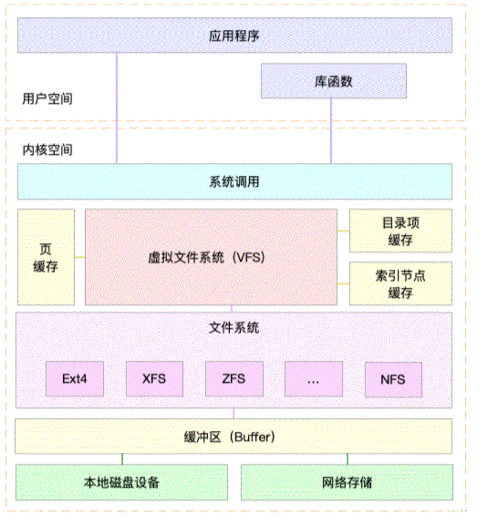

# 0x00. 导读

介绍 VFS(Virtual File System).

# 0x01. 简介

在 Linux 系统中基本上把其中的所有内容都看作文件，除了我们普通意义理解的文件之外，目录、字符设备、块设备、 套接字、进程、线程、管道等都被视为是一个文件。

是不是很神奇？！ But how ?

答案就是 **VFS(Virtual File System)**.

VFS 是一个抽象层，其向上提供了统一的文件访问接口，而向下则兼容了各种不同的文件系统。VFS 位于应用与具体文件系统之间，其主要起适配的作用。



# 0x02. 对象类型

VFS 背后的思想就是建立一个通用的文件模型，使得它能兼容所有的文件系统，这个通用的文件模型是以 Linux 的文件系统 EXT 系列为模版构建的。每个特定的文件系统都需要将它物理结构转换为通用文件模型。 VFS 非常类似于 CPP 中的基类，提供了很多“虚函数”，即面向对象中所谓的“接口”，这个类比是非常形象的，这些接口都需要“实例化”时提供具体实现。

例如，通用文件模型中，所有的目录都是文件，它包含文件和目录；而在其他的文件类型中，比如 FAT ，它的目录就不属于文件，这时，内核就会在内存中生成这样的目录文件，以满足通用文件模型的要求。同时，VFS 在处理实际的文件操作时，通过指针指向特定文件的操作函数。**可以认为通用文件模型是面向对象的设计，它实现了几个文件通用模型的对象定义，而具体的文件系统就是对这些对象的实例化**。通用文件模型包含下面几个对象：

- 超级块对象(super block)

    因为 Linux 支持多文件系统，所以在内核中必须通过一个数据结构来描述具体文件系统的信息和相关的操作等，也就是 super block, 内核是通过 super block 来认知具体的文件系统的。它代表一个具体的已安装文件系统，每次一个实际的文件系统被 mount 时，内核会读取一些控制信息来填充内存中的超级块对象。

    ```c
    struct super_block { //超级块数据结构
        struct list_head s_list;                /*指向超级块链表的指针*/
        struct file_system_type  *s_type;       /*文件系统类型*/
        struct super_operations  *s_op;         /*超级块方法*/
        struct list_head         s_instances;   /*该类型文件系统*/
    };

    struct super_operations {
        void (*read_inode) (struct inode *);        // 把磁盘中的inode数据读取入到内存中
        void (*write_inode) (struct inode *, int);  // 把inode的数据写入到磁盘中
        void (*put_inode) (struct inode *);         // 释放inode占用的内存
        void (*delete_inode) (struct inode *);      // 删除磁盘中的一个inode
        void (*put_super) (struct super_block *);   // 释放超级块占用的内存
        void (*write_super) (struct super_block *); // 把超级块写入到磁盘中
    };
    ```

- 索引节点对象(inode)

    当一个文件首次被访问时，内核会在内存中组装相应的索引节点对象，它用于描述一个文件的 meta （元）信息，其包含的是诸如文件的大小、拥有者、创建时间、磁盘位置等和文件相关的信息，所有文件都有一个对应的 inode 结构。

    ```c
    struct inode {//索引节点结构
        unsigned long       i_ino;
        atomic_t            i_count;
        kdev_t              i_dev;
        umode_t             i_mode;
        nlink_t             i_nlink;
        struct address_space *i_mapping;    // **** address_space 结构维护了一棵 radix 树，高速缓存的内存页面就挂在该树上。****
        uid_t               i_uid;          // 文件所属的用户
        gid_t               i_gid;          // 文件所属的组
        kdev_t              i_rdev;         // 文件所在的设备号
        loff_t              i_size;         // 文件的大小
        time_t              i_atime;        // 文件的最后访问时间
        time_t              i_mtime;        // 文件的最后修改时间
        time_t              i_ctime;        // 文件的创建时间
        struct inode_operations  *i_op;     // inode相关的操作列表
        struct file_operations   *i_fop;    // 文件相关的操作列表
        struct super_block       *i_sb;     // 文件所在文件系统的超级块
    };

    struct file_operations {
        struct module *owner;
        loff_t (*llseek) (struct file *, loff_t, int);
        ssize_t (*read) (struct file *, char *, size_t, loff_t *);
        ssize_t (*write) (struct file *, const char *, size_t, loff_t *);
    };
    ```

    可以用 `stat` 命令查看 inode 信息。

- 目录项对象(dentry)

    主要是出于方便查找文件的目的。一个路径的各个组成部分，不管是目录还是普通的文件，都是目录项对象。如，在路径 `/home/source/test.c` 中，目录 `/`, `home/`, `source/`, `test.c` 都对应一个目录项对象。不同于前面的两个对象，目录项对象没有对应的磁盘数据结构， VFS 在遍历路径名的过程中现场将它们逐个地解析成目录项对象。

    ```c
    struct dentry {//目录项结构
        struct inode *d_inode;           // 目录项对应的 inode
        struct dentry *d_parent;         // 当前目录项对应的父目录
        struct qstr d_name;              /*目录项的名字*/
        struct list_head d_subdirs;      /*子目录*/
        struct dentry_operations *d_op;  /*目录项操作表*/
        struct super_block *d_sb;        // 所在文件系统的超级块对象
    };

    struct dentry_operations {
        //判断目录项是否有效;
        int (*d_revalidate)(struct dentry *, struct nameidata *);
        //为目录项生成散列值;
        int (*d_hash) (struct dentry *, struct qstr *);
        int (*d_compare) (struct dentry *, struct qstr *, struct qstr *);
        int (*d_delete)(struct dentry *);
        void (*d_release)(struct dentry *);
        void (*d_iput)(struct dentry *, struct inode *);
    };
    ```

    **注意：目录是个文件，持久化存储在磁盘，而目录项是内核一个数据结构，缓存在内存。目录项这个数据结构不只是表示目录，也是可以表示文件的。**

- 文件对象(file)

    它代表已打开的文件在内存中的表示，主要用于建立进程和磁盘上的文件的对应关系。它由 `sys_open()`( open() 系统调用最终会调用内核的 sys_open() 函数) 创建，由 `sys_close()` 销毁。文件对象包含文件当前的读写偏移量，文件打开模式和文件操作函数列表等。

    ```c
    struct file {
        struct list_head         f_list;
        struct dentry           *f_dentry;  // **** 文件所属的 dentry 结构 ****
        struct file_operations  *f_op;      // 文件的操作列表
        atomic_t                 f_count;   // 计数器（表示有多少个用户打开此文件）
        unsigned int             f_flags;   // 标识位  
        mode_t                   f_mode;    // 打开模式
        loff_t                   f_pos;     // 读写偏移量
        unsigned long            f_reada, f_ramax, f_raend, f_ralen, f_rawin;
        struct fown_struct       f_owner;   // 所属者信息
        unsigned int             f_uid, f_gid;  // 打开的用户id和组id
        int                      f_error;
        unsigned long            f_version;

        /* needed for tty driver, and maybe others */
        void                    *private_data;
    };

    struct file_operations {
        //文件读操作
        ssize_t (*read) (struct file *, char __user *, size_t, loff_t *);
        //文件写操作
        ssize_t (*write) (struct file *, const char __user *, size_t, loff_t *);
        int (*readdir) (struct file *, void *, filldir_t);
        //文件打开操作
        int (*open) (struct inode *, struct file *);
    };
    ```

更详细的结构体定义参考 [filesystems/vfs](https://www.kernel.org/doc/html/latest/filesystems/vfs.html)

这几个通用文件模型中的对象之间的关系如下图所示：


# 0x03. inode 和 dentry 详解

## 3.1 inode

## 3.2 dentry

dentry 是目录项缓存，是一个存放在内存里的缩略版的磁盘文件系统目录树结构，他是 directory entry 的缩写。我们知道文件系统内的文件可能非常庞大，目录树结构可能很深，该树状结构中，可能存在几千万，几亿的文件。

假设不存在 dentry 这个数据结构，我们看下我们可能会面临什么困境：

比如我要打开 `/usr/bin/vim` 文件:
1. 首先需要去 ／ 所在的 inode 找到 ／ 的数据块，从 ／ 的数据块中读取到 usr 这个条目的 inode 
2. 跳转到 user 对应的 inode ，根据 /usr inode 指向的数据块，读取到 /usr 目录的内容，从中读取到 bin 这个条目的 inode 3 跳转到 /usr/bin/ 对应的 inode ，根据 /usr/bin/ 指向的数据块，从中读取到 /usr/bin/ 目录的内容，从里面找到 vim 的 inode

我们都知道， Linux 提供了 page cache 页高速缓存，很多文件的内容已经缓存在内存里，如果没有 dentry ，文件名无法快速地关联到 inode ，即使文件的内容已经缓存在页高速缓存，但是每一次不得不重复地从磁盘上找出来文件名到 VFS inode 的关联。

因此理想情况下，我们需要将文件系统所有文件名到 VFS inode 的关联都纪录下来，但是这么做并不现实，首先并不是所有磁盘文件的 inode 都会纪录在内存中，其次磁盘文件数字可能非常庞大，我们无法简单地建立这种关联，耗尽所有的内存也做不到将文件树结构照搬进内存。

dentry就是为了解决这个难题的。


dentry 虽然是目录的意思，但是在 vfs 中，目录和文件都有自己的 dentry 。为了加快对 dentry 的查找，内核使用 hash 表来缓存 dentry ，称为 dentry cache ， dentry 一般先在 dentry cache 中查找。 dentry 存放在 dentry_cache 的 slab 高速缓存中。

在内存中，每个文件都有一个 inode 和 dentry 结构。 dentry 记录文件名，上级目录，子目录等信息，正是我们看到的树状结构； inode 记录着文件在存储介质上的位置和分布， dentry->d_inode 指向对应的 inode 结构。 inode 代表物理意义上的文件，通过 inode 可以得到一个数组，这个数组记录文件内容的位置，若数组为 (4,5,9), 则对应数据位于硬盘的 4,5,9 块。其索引节点号为 inode->ino ，根据 ino 就可以计算出对应硬盘中 inode 的具体位置。

inode cache 是各个文件系统对 table of inodes 这部分数据的缓存，记录了每个 inode 的数据结构。
在读写文件时 inode 数据结构的访问会非常频繁，因此为了提高效率用 kmem_cache_create 创建了专用的 slab cache 去做了缓存，并且标记该部分 slab 是可以回收的。

dentry 树描绘了文件系统目录结构，但整个目录结构不能长驻内存，因为非常大。内存装不下。

初始状态下，系统只有代表根目录的 dentry 和所指向的 inode （在根文件系统中挂载生成）。此时要打开一个文件，文件路径对应的结点不存在，根目录的 dentry 无法找到需要的子节点。这时需要通过 inode->i_op 中 lookup 方法找到 inode 的子节点，找到后，再创建一个 dentry 与之关联。

假设去查找并读取 `/usr/bin/emacs` 文件，这个过程大概如下：

- 因为根 "/" 对应的 dentry->d_inode 是知道的，所以读取根的 inode 表，找到对应的 inode 结构体，读取其中 datablock 指针这部分，找到磁盘上对应的文件，读取内容，去做字符串匹配 "usr" ，找到它对应 inode2 ；
- 读取 inode cache 缓存 inode 表，找到 inode2 的结构体，读取 inode2 里面的 datablock 指针部分，找到磁盘上文件，读取内容，去做字符串匹配 "bin" ，找到它对应的 inode11 ；
- 重复 <2> 的过程，找到 "emacs" 文件对应的 inode119 ，查找 inode119 的 datablock 指针部分，找到磁盘上文件，读取/写入内容。

以上过程中会读取很多 dentry 和 inode 结构体，linux 内核都会将之保存在 slab cache 中。