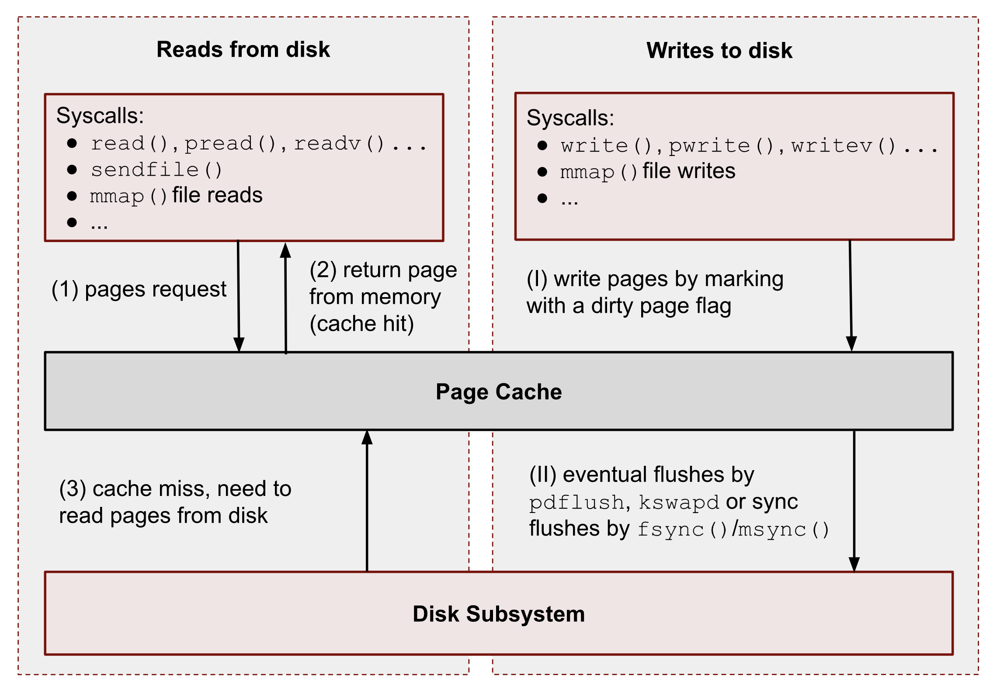

# 0x00、导读

# 0x01、简介

CPU 如果要访问外部磁盘上的文件，需要首先将这些文件的内容拷贝到内存中，由于硬件的限制，从磁盘到内存的数据传输速度是很慢的，如果现在物理内存有空余，干嘛不用这些空闲内存来缓存一些磁盘的文件内容呢，这部分用作缓存磁盘文件的内存就叫做 `page cache` 。

用户进程启动 read() 系统调用后，内核会首先查看 page cache 里有没有用户要读取的文件内容，如果有（cache hit），那就直接读取，没有的话（cache miss）再启动 I/O 操作从磁盘上读取，然后放到 page cache 中，下次再访问这部分内容的时候，就又可以 cache hit ，不用忍受磁盘的龟速了（相比内存慢几个数量级）。

相对于磁盘，内存的容量还是很有限的，所以没必要缓存整个文件，只需要当文件的某部分内容真正被访问到时，再将这部分内容调入内存缓存起来就可以了，这种方式叫做demand paging（按需调页），把对需求的满足延迟到最后一刻，很懒很实用。

如果进程在 open() 一个文件的时候指定 flags 为 O_DIRECT ，那进程和这个文件的数据交互就直接在用户提供的 buffer 和磁盘之间进行， page cache 就被 bypass 了，借用硬件 cache 的术语就是 `uncachable` ，这种文件访问方式被称为 direct I/O ，适用于用户使用自己设备提供的缓存机制的场景，比如某些数据库应用。

[vmtouch](../util/vmtouch.md)

# 0x02. Buffer Cache

Buffer cache 是指磁盘设备上的 raw data （指不以文件的方式组织）以 block 为单位在内存中的缓存，早在 1975 年发布的 Unix 第六版就有了它的雏形， Linux 最开始也只有 buffer cache 。
事实上， page cache 是 1995 年发行的 1.3.50 版本中才引入的。不同于 buffer cache 以磁盘的 block 为单位， page cache 是以内存常用的 page 为单位的，位于虚拟文件系统层（VFS）与具体的文件系统之间。

在很长一段时间内， buffer cache 和 page cache 在 Linux 中都是共存的，但是这会存在一个问题：一个磁盘 block 上的数据，可能既被 buffer cache 缓存了，又因为它是基于磁盘建立的文件的一部分，也被 page cache 缓存了，这时一份数据在内存里就有两份拷贝，这显然是对物理内存的一种浪费。更麻烦的是，内核还要负责保持这份数据在 buffer cache 和 page cache 中的一致性。所以，现在 Linux 中已经基本不再使用 buffer cache 了。

2. 
```bash
# page-type 获得步骤
$ wget https://github.com/torvalds/linux/archive/refs/tags/v5.13.tar.gz
$ tar -xzf ./v5.13.tar.gz
$ cd linux-5.13/tools/vm
$ make
$ cp page-types /usr/bin
```
[pagemap.txt](https://www.kernel.org/doc/html/v5.0/admin-guide/mm/pagemap.html)

3. `mincore()` 报告在一个虚拟地址范围中哪些分页当前驻留在 RAM 中。

x. 
- procfs files: /proc/PID/smaps, /proc/pid/pagemap, /proc/kpageflags, /proc/kpagecgroup and sysfs file: /sys/kernel/mm/page_idle;
- system calls: mincore(), mmap(), fsync(), msync(), posix_fadvise(), madvise() and others;
- different open and advise flags O_SYNC, FADV_DONTNEED, POSIX_FADV_RANDOM, MADV_DONTNEED, etc.

测试文件:
```bash
$ dd if=/dev/random of=/var/tmp/file1.db count=128 bs=1M
```

清理缓存:
```bash
$ sync; echo 3 | sudo tee /proc/sys/vm/drop_caches
```

# 0x02、理论

Page Cache 本质上是 VFS(Virtual File System) 的一部分，其主要目的是为了改善 IO 读写操作的延迟。

linux 对文件的访问除了显示使用 O_DIRECT 标志，所有的访问都会经过 page cache 。

回写缓存算法是页缓存的核心构建块。[0x01 cache 策略](../memory/cache02.md)


