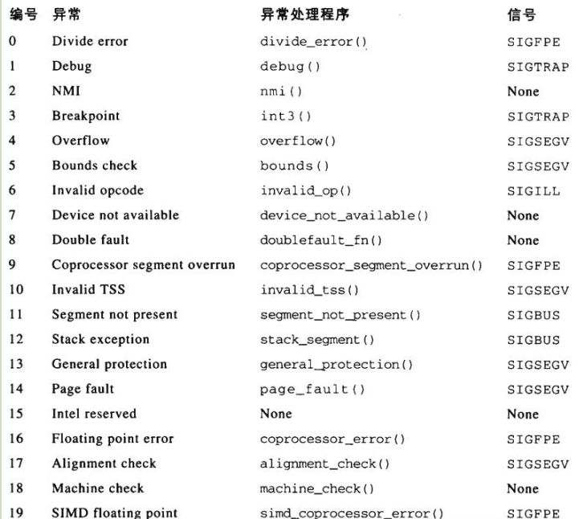
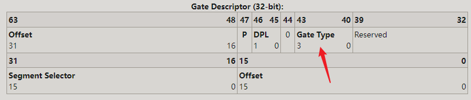
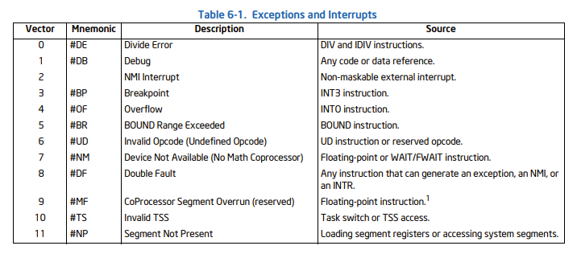
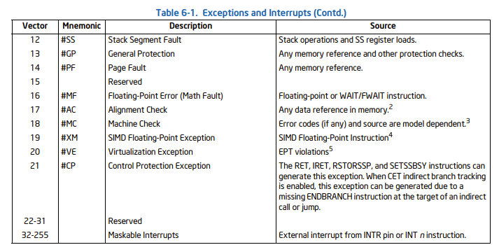
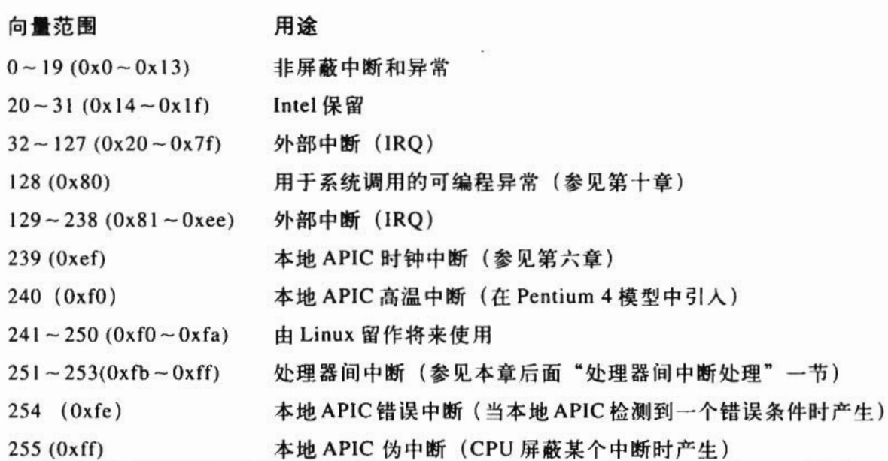
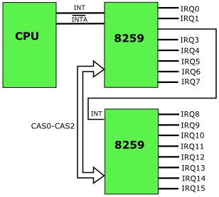
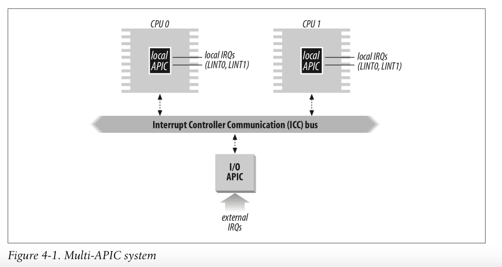
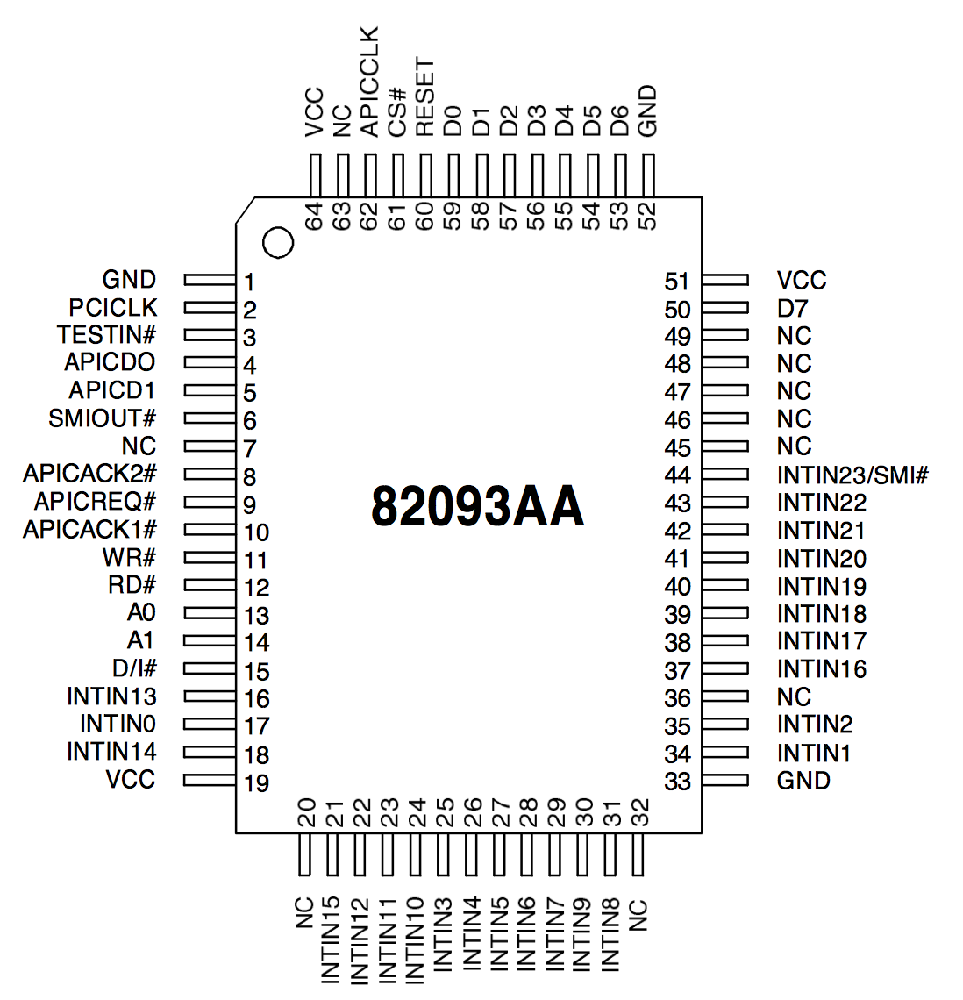

# 0x00. 导读

内容参考：  
1. [interrupts](https://linux-kernel-labs.github.io/refs/heads/master/lectures/interrupts.html) .
2. 《深入理解 Linux 内核》
3. [x86 中断](https://www.cnblogs.com/wsg1100/p/14055863.html#31-idt)

中断是一种改变程序正常执行流的事件，它可以来自硬件设备，也可以来自软件设备。  
当一个中断产生，当前程序的执行流会被挂起， interrupt handler 开始执行，执行完毕后，之前的程序执行流恢复。

# 0x01. 简介

按照来源，中断可以分为两种：
1. 同步中断。
    - 执行指令的时候由 CPU 控制单元产生，之所以称为 同步 ，是因为只有在一条指令终止执行后 CPU 才会发出中断。
    - 在 Intel 微处理手册中，将其称为 exception ，例如除零或者系统调用。
2. 异步中断。
    - 由硬件设备依照 CPU 时钟信号随机产生。
    - 在 Intel 微处理手册中，将其称为中断( interrupts )，例如网卡收到数据包。

后续我们用 中断信号 指代同步中断和异步中断。

# 0x02. 异步中断

Intel 文档把中断分为两种：
1. 可屏蔽的（通过 INT 引脚产生），可以忽略。
2. 不可屏蔽的（由 NMI 引脚产生），无法忽略。

> 某些中断信号不受中断掩码的影响，因此无法禁用;这些中断称为不可屏蔽中断 （NMI）。
```c
static inline void native_irq_disable(void) {
        asm volatile("cli": : :"memory"); // 清除 IF 标志位
}
static inline void native_irq_enable(void) {
        asm volatile("sti": : :"memory"); // 设置 IF 标志位
}
```

大多数的中断都是可屏蔽的。

主要处理三种中断：
1. I/O 中断
2. 时钟中断
    某种时钟（本地 APIC 时钟或者外部时钟）产生了一个中断；
    这种中断告诉内核一个固定的时间间隔已经过去。这种中断大部分是作为 I/O 中断处理的。
3. 处理器间中断
    一个 CPU 向另一个 CPU 发出一个中断。

# 0x03. 同步中断

由程序的错误产生，或者由内核必须处理的事件产生。  
第一种情况中，内核会发送一个信号给程序。  
第二种情况中，例如缺页，系统调用等，内核会执行必要的处理程序。

有两种 exception 来源：
1. 处理器探测异常(processor-detected exception)：**CPU 执行指令时探测到的一个反常条件所产生的异常**
    - `fault`   
        执行指令前报告产生，通常可以被修正。当 fault 被修正后，会重新执行出错的指令。(例如 page fault)
    - `trap`   
        执行指令后报告产生。处理完后，不会重新执行出错的指令。（例如 debug traps ，也就是常用的调试断点，或者系统调用）
    - `abort`   
        一般是硬件错误，不可恢复，应用程序直接结束执行。
2. 编程异常(programmed exception)：
    - 当编程者发出请求时发生，由 `int n` 指令触发。当 溢出检查和地址越界检查 出问题的时候，也会引起编程异常。
    - 一般 CPU 会把编程异常当做 trap 来处理。
    - 编程异常也被称为 `软件中断`(software interrupt) 。  
        注意，和 `软中断`(softirq) 不是一个东西，后者是 Linux 中定义的一种下半部执行方式。
    - 常用的两个用处是：系统调用或者给程序反馈一个特定的事件。

fault 和 trap 最重要的一点区别是他们发生时所保存的EIP值的不同。   
- fault 保存的 EIP 指向触发异常的那条指令；
- trap 保存的 EIP 指向触发异常的那条指令的下一条指令。

因此，当从中断返回时， fault 会重新执行那条指令；而 trap 就不会重新执行；

## 3.1 异常

80x86 微处理器发布了大约 20 种不同的异常，内核必须为每种异常提供一个专门的异常处理程序，这些异常处理程序通常会把一个 Unix 信号发送到引起异常的进程。  
对于某些异常，CPU 在开始执行异常处理程序前会产生一个硬件出错码( hardware error code ) ，并且压入内核态堆栈。

下面的表格是当某个异常发生时，负责处理的程序以及发送给进程的信号。



## 3.2 Interrupt Descriptor Table, IDT, 中断描述符表

[wiki Interrupt_Descriptor_Table](https://wiki.osdev.org/Interrupt_Descriptor_Table)

IDT 是一个系统表，它与中断向量和异常向量相关联，每个向量在表中都有相应的中断或者异常处理程序的入口地址。

IDT 是一个由 Gate Descriptors 组成的 Array 。每一个 Gate Descriptor 由 8 个字节组成。每一个 Gate Descriptor 对应一个 Interrupt/Exceptions Vector 。由于最多可能存在 256 个 Vectors 。


Linux 中 IDT 包含五种类型的描述符（Intel 的分类中只有前三种）：
- task gate
    - Task Gate 是一种通过硬件实现任务切换，将 ISR(Interrupt Service Routine) 作为一个 Task 的方法。  
        Linux 中并没有使用该机制。
- interrupt gate
    - 处理中断，Interrupt 会被 CPU 自动禁止
- trap gate
    - 处理异常，CPU 不会去禁止或打开中断，而是保留它原来的样子。
- system gate
- system interrupt gate

还有个 IVT(Interrupt Vector Table) ，类似 IDT ，只是用在 实模式 ，而 IDT 用在 保护模式 。
# 0x04. IRQ 和中断

每个中断和异常都是由 0~255 之间的一个数来标识，Intel 把这个 8bit 的无符号整数称为 vector number 。
非屏蔽中断的向量和异常的向量是固定的，**可屏蔽中断的向量可以通过 中断控制器 编程改变** 。

异常、中断向量和对应的描述( [出处](https://cdrdv2.intel.com/v1/dl/getContent/671200) )：




上面表格汇总一下



中断硬件系统主要有三种器件参与，各个外设、中断控制器和CPU。

## 4.1 IRQ

各个外设在发生中断事件的时候，通过 irq request line 上的电气信号向 CPU 系统请求处理。  

## 4.2 可编程中断控制器(Programmable Interrupt Controler, PIC)

外设的 irq request line 太多，CPU 需要一个小伙伴帮他，这就是 Interrupt controller 。 Interrupt Controller 是连接外设中断系统和 CPU 系统的桥梁:
- 其作用是监视 IRQ 线，检查产生的信号。如果有大于一条的 IRQ 线产生了信号，就选择引脚编号较小的。

可以通过 PIC 修改 IRQ 和向量之间的映射。

根据外设 irq request line 的多少， Interrupt Controller 可以`级联`。传统的 PIC 是由两片 8259A 风格的外部芯片以级联的方式连接，从PIC 的 INT 输出线连接到 主PIC 的 IRQ2 引脚，因此，可用的 IRQ 线的个数为 15 。



下图为 8259A 的样子：


每个 IRQn 关联的 Intel 缺省向量是 n+32 。例如 IRQ0 对应 32 ，可以表示为时钟中断， IRQ1 对应 33 ，可以表示为键盘中断。

## 4.3 CPU

CPU 的主要功能是运算，因此 CPU 并不处理中断优先级，那是 Interrupt controller 的事情。  
系统中有若干个 CPU block 用来接收中断事件并进行处理，若干个 Interrupt controller 形成树状的结构，汇集系统中所有外设的 irq request line ，并将中断事件分发给某一个 CPU block 进行处理。

## 4.4 I/O Advanced Programmable Interrupt Controller, I/O APIC

如果系统只有一个 CPU ，那么 主PIC 的输出线连接到 CPU 的 INTR 引脚就行。
如果系统包含两个或更多 CPU，则需要更复杂的 PIC。



### 4.4.1 LAPIC

80x86 微处理器的 CPU 都有一个本地 APIC -- LAPIC ，所有的 LAPIC 都连接到一个外部 I/O APIC 。
每个 LAPIC 都有自己的一系列寄存器、一个内部时钟、一个本地定时设备 和 两条 IRQ 线 -- LINT0 和 LINT1。

常用的寄存器包括：
- ICR(Interrupt Command Register) 用于发送 IPI
- IRR(Interrupt Request Register) 当前 LAPIC 接收到的中断请求
- ISR(In-Service Register) 当前 LAPIC 送入 CPU 中 (CPU 正在处理) 的中断请求
- TPR(Task Priority Register) 当前 CPU 处理中断所需的优先级
- PPR(Processor Priority Register) 当前 CPU 处理中断所需的优先级，只读，由 TPR 决定

### 4.4.2 I/O APIC

I/O APIC 的组成为：一组 24 条 IRQ 线、一张 24 项的中断重定向表( Interrupt Redirection Table)、可编程寄存器，以及通过 APIC 总线发送和接收 APIC 信息的一个信息单元。
IRT 中的每一项都可以被单独编程以指明中断向量和优先级、目标处理器等。 IRT 用于把每个外部 IRQ 信号转为一条消息，通过 APIC 总线把消息发送给一个或者多个 LAPIC 。



I/O APIC 起路由器作用，当一个中断来到 I/O APIC 时，就要根据 Redirection Table 发送给对应的 LAPIC . (I/O APIC全称为 82093AA I/O Advanced Programmable Interrupt Controller.)

I/O APIC (I/O Advanced Programmable Interrupt Controller) 属于 Intel 芯片组的一部分，也就是说通常位于南桥。

### 4.4.3 处理器间中断 (Inter Processor Interrupt, IPI)

除了在处理器之间分发中断，多 APIC 系统还允许 CPU 产生 IPI 。

当一个 CPU 希望把中断发给另一个 CPU 时，它就在 LAPIC 的中断指令寄存器(Interrupt Command Register, ICR) 中存放这个中断向量和目标 LAPIC 标识符，通过 APIC 总线向目标 LAPIC 发送一条消息。

一个 LAPIC 在收到一个 interrupt message 后，执行以下流程：
1. 判断自己是否属于消息指定的 destination ，如果不是，抛弃该消息
2. 如果中断的 Delivery Mode 为 NMI / SMI / INIT / ExtINT / SIPI ，则直接将中断发送给 CPU
3. 如果不是以上的 Mode ，则设置中断消息在 IRR 中对应的 bit。如果 IRR 中 bit 已被设置(没有 open slot)，则拒绝该请求，然后给 sender 发送一个 retry 的消息
4. 对于 IRR 中的中断，LAPIC 每次会根据中断的优先级和当前 CPU 的优先级 PPR 选出一个发送给 CPU，会清空该中断在 IRR 中对应的 bit，并设置该中断在 ISR 中对应的 bit
5. CPU 在收到 LAPIC 发来的中断后，通过中断 / 异常处理机制进行处理。处理完毕后，向 LAPIC 的 EOI(end-of-interrupt)寄存器进行写入(NMI / SMI / INIT / ExtINT / SIPI 无需写入)
6. LAPIC 清除 ISR 中该中断对应的 bit(只针对 level-triggered interrupts)
7. 对于 level-triggered interrupt， EOI 会被发送给所有的 IOAPIC。可以通过设置 Spurious Interrupt Vector Register 的 bit12 来避免 EOI 广播

# 0x05. 中断和异常的硬件处理

CPU 根据寄存器 CS:EIP 来准确定位一个指令。在处理新指令之前，需要检查前一条指令是否产生了中断或者异常。
如果发生了中断或者异常，则 CPU 需要执行下列操作：
1. 确定与中断或异常关联的向量 `i`( 0~255 )
2. 读取 IDT 中的第 `i` 项
3. 获取中断或异常处理程序的地址
4. 检查触发中断或异常的进程与处理程序的特权级是否符合，例如想通过 INT n 指令来干坏事是不可行的。
5. 栈中保存 eflags、cs、eip 等内容
6. 如果异常产生了硬件出错码，也保存在栈中
7. 执行处理程序

# 0x03. top half and bottom half

Linux 将中断处理过程分成了两个阶段， 也就是上半部( top half )和下半部( bottom half )：

- 上半部用来快速处理中断，主要处理跟硬件紧密相关的或时间敏感的工作。重点在，这个阶段会`关闭中断`。 

- 下半部用来延迟处理上半部未完成的工作。  
    现在主流的是三种处理方式：`softirq`、`tasklet`、`workqueue`。可以查看 /proc/softirqs 

汇总一下三种 Linux deferrable(可延迟的) actions:  
- softIRQ
    - 性能好。softirqs 是在 Linux 内核编译时就确定好的，例如网络收包对应的 NET_RX_SOFTIRQ 软中断。 因此是一种静态机制。如果想加一种新 softirq 类型，就需要修改并重新编译内核。
    - 每个 CPU 上会初始化一个 `ksoftirqd` 内核线程，负责处理各种类型的 softirq 中断事件
    - top 里面 si 字段就是系统的软中断开销
    - softirq 的种类内核的限制是不能超过32个，目前实际用到的有9个(/proc/softirqs 有完整的)。
        - 两个用来实现 tasklet(`HI_SOFTIRQ` 和 `TASKLET_SOFTIRQ`)
        - 两个用于网络的发送和接收操作(NET_TX_SOFTIRQ 和 NET_RX_SOFTIRQ)
        - 一个用于调度器(SCHED_SOFTIRQ)，实现SMP系统上周期性的负载均衡。
        - 在启用高分辨率定时器时，还需要一个 HRTIMER_SOFTIRQ。
- tasklet
    - 易用
    - 基于 softIRQ
- workqueues
    - workqueue 运行在 process context ，而 softirq 和 tasklet 运行在 interrupt context 。
    - 动态，可配置，更灵活。
    - workqueue 是将中断处理中可以延后执行的部分作为任务(work item)放在一个队列(queue)中，由一个或多个单独的内核线程(`kworker`)依次执行。

```bash
$ cat /proc/softirqs
                    CPU0       CPU1       CPU2       CPU3       
          HI:          8          0         14         12
       TIMER:  830905000  708854013  661286942  724428765
      NET_TX:          8         43         21         21
      NET_RX:  131121424    6855375    7897375    6814781
       BLOCK:     727160     725407    1248160     663358
BLOCK_IOPOLL:          0          0          0          0
     TASKLET:       1563         43        269        113
       SCHED:  222422931  176972679  182819360  167718850
     HRTIMER:          0          0          0          0
         RCU:  581858112  502101092  505596258  499985386

# HI：最高优先级的软中断类型
# TIMER：Timer 定时器的软中断
# NET_TX: 发送网络数据包的软中断
# NET_RX: 接收网络数据包的软中断
# BLOCK: 快设备的软中断
# TASKLET： 专门为 tasklet 机制准备的软中断
# SCHED：进程调度以及负载均衡
# HRTIMER：高精度定时器
# RCU：专门为 RCU 服务的软中断
```
`/proc/interrupts` 显示了中断被各 CPU 处理的次数，理应大致相等。 `/proc/irq/IRQ#/smp_affinity` 是一个 bitmap ，表示第 `IRQ#` 个 irq 应被发送到哪些 CPU 上，每个 bit 代表一个 CPU，如果有多于一个 CPU 被分配到某个 irq ，则会使用 lowest priority mode ，由硬件选取这一组 CPU 中优先级最低的 CPU 作为中断的目的地。优先级通常可以通过设置 LAPIC 的 TPR 寄存器来变更。

例如，假设有 8 个 core ，则 1111 1111 对应 8 个 core ，如果 `/proc/irq/123/smp_affinity` 等于 0010 0000 ,则 123 这个 IRQ 亲和 coreid=5 的 CPU。

# 0x04. irqbalance

irqbalance 守护进程默认启用，并定期强制 CPU 以均匀、公平的方式处理中断。

检查 irqbalance daemon 状态

```bash
$ systemctl status irqbalance
irqbalance.service - irqbalance daemon
   Loaded: loaded (/usr/lib/systemd/system/irqbalance.service; enabled)
   Active: active (running) …

```

停止它

```bash
$ systemctl stop irqbalance
```

确保 irqbalance 不会在启动时重新启动。

```bash
$ systemctl disable irqbalance
```

如果您运行的是 16 核系统并希望从 IRQ 平衡中删除 CPU 8 至 15，请执行以下操作：

```bash
$ vim /etc/sysconfig/irqbalance
# 设置 IRQBALANCE_BANNED_CPUS=0000ff00
```

如果您运行的系统最多具有 64 个 CPU 核心，请使用逗号分隔每组八个十六进制数字：

```
IRQBALANCE_BANNED_CPUS=00000001,0000ff00
```

