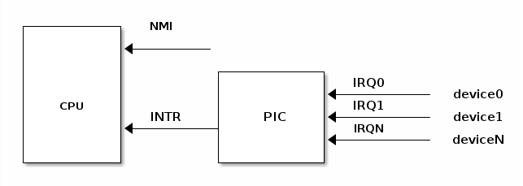
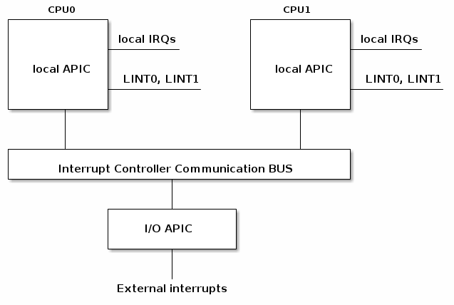
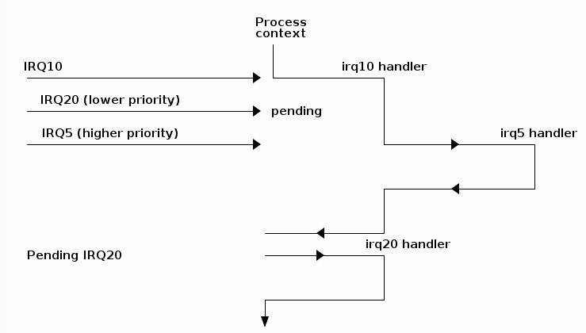
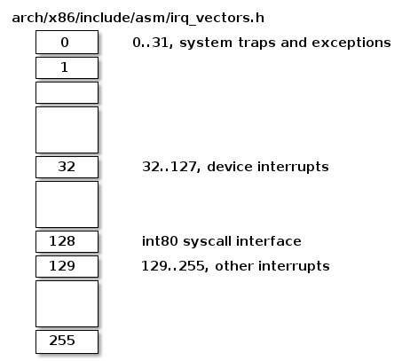
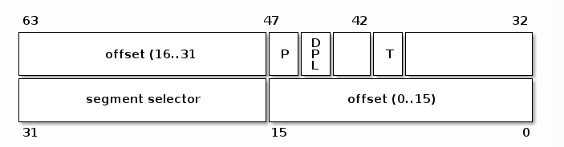

# 一、简介

内容皆来自 [interrupts](https://linux-kernel-labs.github.io/refs/heads/master/lectures/interrupts.html) .


    中断是一种改变程序正常执行流的事件，它可以来自硬件设备，也可以来自软件设备。
    当一个中断产生，当前程序的执行流会被挂起， interrupt handler 开始执行，执行完毕后，之前的程序执行流恢复。

按照来源，中断可以分为两种：
1. 同步的。来自软件。
    - 通常又称为 exception ，例如除零或者系统调用。
2. 异步的。来自硬件。
    - 通常称为中断( interrupts )，例如网卡收到数据包。

根据是否可屏蔽，也可以分为两种：
1. 可屏蔽的，可以忽略。
2. 不可屏蔽的（由 NMI 引脚产生），无法忽略。

（为了不引起混乱，后续中的中断除了特别声明，指的是大种类的中断）。   
大多数的中断都是可屏蔽的。

------

## 异常( exception )

有两种 exception 来源：
1. 处理器发现的：通常是执行指令的时候遇到了反常情况才会产生
    - faults   
        执行指令前报告产生，通常可以被修正。当 fault 被修正后，会重新执行出错的指令。(例如 page fault)
    - traps   
        执行指令后报告产生。处理完后，不会重新执行出错的指令。（例如 debug traps ，也就是常用的调试断点，或者系统调用）
    - aborts   
        一般是硬件错误，不可恢复，应用程序直接结束执行。
2. 编程得到的：
    - int n

fault 和 trap 最重要的一点区别是他们发生时所保存的EIP值的不同。   
- fault 保存的 EIP 指向触发异常的那条指令；
- trap 保存的 EIP 指向触发异常的那条指令的下一条指令。

因此，当从中断返回时， fault 会重新执行那条指令；而 trap 就不会重新执行；

---- 

## 硬件概念



支持中断的设备通常都有一个输出引脚，用来产生 中断请求( Interrupt ReQuest) 。这些中断请求引脚会通过 IRQ line 连接到 可编程中断控制器( Programmable Interrupt Controller, PIC ) ，而 PIC 又会连接 CPU 的 INTR 引脚。

当一个硬件设备对 PIC 发出 IRQ ，会发生以下事情：
- 硬件设备在对应的 IRQ 引脚产生一个中断
- PIC 将 IRQ 转换为一个向量号( vector number ) ，并将其写入，使得 CPU 能读到
- PIC 在 CPU INTR 引脚产生一个中断
- PIC 等待 CPU 处理中断，在处理之前 PIC 不会再产生另一个中断
- CPU 开始处理中断

注意，只要 CPU 开始处理中断，PIC 就可以产生另一个中断了，不管上一个中断是否处理完。当然， PIC 也可以将某一个引脚暂时禁用，这样就可以保证所有的中断都是线性执行。

-----

### SMP system

对于 SMP system ，会存在多个 APIC(Advanced Programmable Interrupt Controller) 。



为了保持同步，需要一种可控的方式来启用和禁用中断：
- 对于硬件设备   
    编程控制 device control registers
- 对于 PIC   
    编程控制引脚的启用和禁用
- 对于 CPU ，例如 x86 ，可以使用以下指令:   
    1. cli (CLear Interrupt flag)
    2. sli (SeT Interrupt flag)

----

## 中断优先级

如果有这个功能并且启用的话，那就允许中断嵌套了，低等级的中断包着高等级的中断。



-----

# 二、如何在 x86 架构上处理中断

## 中断描述符表( Interrupt Descriptor Table )

IDT 将向量数( vector number )和 interrupt/exception handler 关联。   
IDT 是一个 256 * 8 bytes 的数组，处理器通过 IDTR 找到它。前 32 个位置是给 exception 的，第 128 是给系统调用( 著名的 int 0x80 )，其余的给 hardware interrupts handlers 。



以下内容了解一下即可：
> On x86 an IDT entry has 8 bytes and it is named gate. There can be 3 types of gates:
> 
> - interrupt gate, holds the address of an interrupt or exception handler. Jumping to the handler disables maskable interrupts (IF flag is cleared).
> - trap gates, similar to an interrupt gate but it does not disable maskable interrupts while jumping to interrupt/exception handler.
> - task gates (not used in Linux)
Let's have a look at several fields of an IDT entry:
> 
> - segment selector, index into GDT/LDT to find the start of the code segment where the interrupt handlers reside
> - offset, offset inside the code segment
> - T, represents the type of gate
> - DPL, minimum privilege required for using the segments content.

Linux 将中断处理过程分成了两个阶段， 也就是上半部( top half )和下半部( bottom half )：

- 上半部用来快速处理中断，它在 中断禁止模式 下运行，主要处理跟硬件紧密相关的或时间敏感的工作。重点在，这个阶段会关闭中断。可以查看 /proc/interrupts 

- 下半部用来延迟处理上半部未完成的工作，通常以内核线程的方式运行。每个 CPU 都对应一个软中断内核线程，名字为 "ksoftirqd/CPU number"，比如说， 0 号 CPU 对应的软中断内核线程的名字就是 ksoftirqd/0。现在主流的是三种处理方式：softirq、tasklet、workqueue。可以查看 /proc/softirqs 

汇总一下三种 Linux deferrable actions:  
- softIRQ
    - runs in interrupt context
    - statically allocated
    - same handler may run in parallel on multiple cores
- tasklet
    - runs in interrupt context
    - can be dynamically allocated
    - same handler runs are serialized
- workqueues
    - run in process context

```bash
$ cat /proc/softirqs
                    CPU0       CPU1       CPU2       CPU3       
          HI:          8          0         14         12
       TIMER:  830905000  708854013  661286942  724428765
      NET_TX:          8         43         21         21
      NET_RX:  131121424    6855375    7897375    6814781
       BLOCK:     727160     725407    1248160     663358
BLOCK_IOPOLL:          0          0          0          0
     TASKLET:       1563         43        269        113
       SCHED:  222422931  176972679  182819360  167718850
     HRTIMER:          0          0          0          0
         RCU:  581858112  502101092  505596258  499985386

# HI：最高优先级的软中断类型
# TIMER：Timer 定时器的软中断
# NET_TX: 发送网络数据包的软中断
# NET_RX: 接收网络数据包的软中断
# BLOCK: 快设备的软中断
# TASKLET： 专门为 tasklet 机制准备的软中断
# SCHED：进程调度以及负载均衡
# HRTIMER：高精度定时器
# RCU：专门为 RCU 服务的软中断
```

---- 

## 中断上下文

当一个中断被处理完了( 从 CPU 跳转到 interrupt handler 指令到 interrupt handler 返回)，我们说代码运行在 中断上下文。

当代码处于 中断上下文 的时候，有如下特点：
- 不会和 进程上下文( process context )关联。这个时候中断上下文是和特定进程无关的，例如访问进程的某个地址就是非法的。
- 不允许上下文切换（也就是 no sleep, schedule( 主动发起调度(即放弃CPU) ), or user memory( 会引起调度 )）

> 用户空间的应用程序，通过系统调用，进入内核空间。这个时候用户空间的进程要传递很多变量、参数的值给内核，内核态运行的时候也要保存用户进程的一些寄存器值、变量等。   
> 所谓的“进程上下文”，可以看作是用户进程传递给内核的这些参数以及内核要保存的那一整套的变量和寄存器值和当时的环境等。
> 
> 硬件通过触发信号，导致内核调用中断处理程序，进入内核空间。这个过程中，硬件的一些变量和参数也要传递给内核，内核通过这些参数进行中断处理。   
> 所谓的“ 中断上下文”，其实也可以看作就是硬件传递过来的这些参数和内核需要保存的一些其他环境（主要是当前被打断执行的进程环境）。