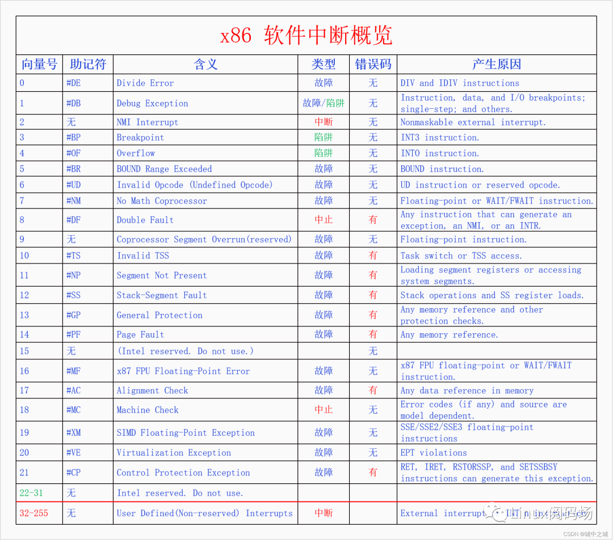

# 0x00. 导读

中断是一种改变程序正常执行流的事件，它可以来自硬件设备，也可以来自软件设备。  

中断机制：CPU在执行指令时，收到某个中断信号转而去执行预先设定好的代码，然后再返回到原指令流中继续执行，这就是中断机制。

系统调用，定时器

# 0x01. 简介

为什么需要中断？

设计中断机制有以下4个作用，这些作用可以帮助操作系统实现自己的功能。这四个作用分别是：

1. 外设异步通知CPU：外设发生了什么事情或者完成了什么任务或者有什么消息要告诉CPU，都可以异步给CPU发通知。例如，网卡收到了网络包，磁盘完成了IO任务，定时器的间隔时间到了，都可以给CPU发中断信号。

2. CPU之间发送消息：在SMP系统中，一个CPU想要给另一个CPU发送消息，可以给其发送IPI(处理器间中断)。

3. 处理CPU异常：CPU在执行指令的过程中遇到了异常会给自己发送中断信号来处理异常。例如，做整数除法运算的时候发现被除数是0，访问虚拟内存的时候发现虚拟内存没有映射到物理内存上。

4. 实现系统调用：早期的系统调用就是靠中断指令来实现的，后期虽然开发了专用的系统调用指令，但是其基本原理还是相似的。

## 1.1 中断的产生

中断信号的产生有以下4个来源：

1. 外设，外设产生的中断信号是**异步**的，一般也叫做**硬件中断(注意硬中断是另外一个概念)**。硬件中断按照是否可以屏蔽分为**可屏蔽中断**和**不可屏蔽中断**。例如，网卡、磁盘、定时器都可以产生硬件中断。

    可屏蔽中断（通过 INT 引脚产生），可以忽略，不可屏蔽中断（由 NMI 引脚产生），无法忽略。

2. CPU，这里指的是一个CPU向另一个CPU发送中断，这种中断叫做IPI(处理器间中断)。IPI也可以看出是一种特殊的硬件中断，因为它和硬件中断的模式差不多，都是**异步**的。

3. CPU异常，CPU在执行指令的过程中发现异常会向自己发送中断信号，这种中断是**同步**的，一般也叫做**软件中断(注意软中断是另外一个概念)**。CPU异常按照是否需要修复以及是否能修复分为 3 类：
    1. 陷阱(trap)，执行指令后报告产生。处理完后，不会重新执行出错的指令。（例如 debug traps ，也就是常用的调试断点，或者系统调用）
    2. 故障(fault)，执行指令前报告产生，通常可以被修正。当 fault 被修正后，会重新执行出错的指令。(例如 page fault)
    3. 中止(abort)，需要修复但是无法修复，中断处理完成后，进程或者内核将会崩溃。例如，缺页异常是一种故障，所以也叫缺页故障，缺页异常处理完成后会重新执行刚才的指令。

4. 中断指令，直接用CPU指令来产生中断信号，这种中断和CPU异常一样是同步的，也可以叫做软件中断。例如，中断指令int 0x80可以用来实现系统调用。

中断信号的4个来源正好对应着中断的4个作用。前两种中断都可以叫做**硬件中断**，都是**异步**的；  
后两种中断都可以叫做**软件中断**，都是**同步**的。  
很多书上也把硬件中断叫做中断，把软件中断叫做异常。  

后续我们用 中断信号 指代同步中断和异步中断。

## 1.2 中断的处理

执行场景(execute context): 在中断产生之前是没有这个概念的，有了中断之后，CPU就分为两个执行场景了，**进程执行场景(process context)**和**中断执行场景(interrupt context)**。

那么哪些是进程执行场景哪些是中断执行场景呢？**进程的执行是进程执行场景，同步中断的处理也是进程执行场景，异步中断的处理是中断执行场景**。可能有的人会对同步中断的处理是进程执行场景感到疑惑，但是这也很好理解，因为同步中断处理是和当前指令相关的，可以看做是进程执行的一部分。而异步中断的处理和当前指令没有关系，所以不是进程执行场景。

进程执行场景和中断执行场景有两个区别：
- 一是进程执行场景是可以调度、可以休眠的，而中断执行场景是不可以调度不可用休眠的；
- 二是在进程执行场景中是可以接受中断信号的，而在中断执行场景中是屏蔽中断信号的。

所以如果中断执行场景的执行时间太长的话，就会影响我们对新的中断信号的响应性，所以我们需要尽量缩短中断执行场景的时间。为此我们对 **异步中断** 的处理有下面两类办法：

1. 立即完全处理:

    对于简单好处理的异步中断可以立即进行完全处理。

2. 立即预处理 + 稍后完全处理:

    对于处理起来比较耗时的中断可以采取立即预处理加稍后完全处理的方式来处理。

为了方便表述，我们把立即完全处理和立即预处理都叫做中断预处理，把稍后完全处理叫做中断后处理。中断预处理只有一种实现方式，就是直接处理。但是中断后处理却有很多种方法，其处理方法可以运行在中断执行场景，也可以运行在进程执行场景，前者叫做**直接中断后处理**，后者叫做**线程化中断后处理**。

在Linux中，中断预处理叫做上半部，中断后处理叫做下半部。由于“上半部、下半部”词义不明晰，我们在本文中都用中断预处理、中断后处理来称呼。中断预处理只有一种方法，叫做 **hardirq(硬中断)**。中断后处理有很多种方法，分为两类，直接中断后处理有**softirq(软中断)**、**tasklet(微任务)**，线程化中断后处理有 **workqueue(工作队列)**、**threaded_irq(中断线程)**。（之前还有过 BH 个 task queues ，在 2.5 版本中都去除了）

汇总一下三种 Linux deferrable(可延迟的) actions:  
- softIRQ
    - 性能好。softirqs 是在 Linux 内核编译时就确定好的，例如网络收包对应的 NET_RX_SOFTIRQ 软中断。 因此是一种静态机制。如果想加一种新 softirq 类型，就需要修改并重新编译内核。
    - 每个 CPU 上会初始化一个 `ksoftirqd` 内核线程，负责处理各种类型的 softirq 中断事件
    - top 里面 si 字段就是系统的软中断开销
    - softirq 的种类内核的限制是不能超过32个，目前实际用到的有9个(/proc/softirqs 有完整的)。
        - 两个用来实现 tasklet(`HI_SOFTIRQ` 和 `TASKLET_SOFTIRQ`)
        - 两个用于网络的发送和接收操作(NET_TX_SOFTIRQ 和 NET_RX_SOFTIRQ)
        - 一个用于调度器(SCHED_SOFTIRQ)，实现SMP系统上周期性的负载均衡。
        - 在启用高分辨率定时器时，还需要一个 HRTIMER_SOFTIRQ。
- tasklet
    - 易用
    - 基于 softIRQ
- workqueues
    - workqueue 运行在 process context ，而 softirq 和 tasklet 运行在 interrupt context 。
    - 动态，可配置，更灵活。
    - workqueue 是将中断处理中可以延后执行的部分作为任务(work item)放在一个队列(queue)中，由一个或多个单独的内核线程(`kworker`)依次执行。

同步中断，慢慢处理就完事了。

硬中断、软中断是什么意思呢？本来的 **异步中断处理** 是直接把中断处理完的，整个过程是屏蔽中断的，现在，把整个过程分成了两部分，前半部分还是屏蔽中断的，叫做硬中断，处理与硬件相关的紧急事物，后半部分不再屏蔽中断，叫做软中断，处理剩余的事物。由于软中断中不再屏蔽中断信号，所以提高了系统对中断的响应性。

**注意硬件中断、软件中断，硬中断、软中断是不同的概念，分别指的是中断的来源和中断的处理方式。**

## 1.3 中断向量号

不同的中断信号需要有不同的处理方式，那么系统是怎么区分不同的中断信号呢？是靠中断向量号。每一个中断信号都有一个中断向量号，中断向量号是一个整数。CPU收到一个中断信号会根据这个信号的中断的向量号去查询中断向量表，根据向量表里面的指示去调用相应的处理函数。

中断信号和中断向量号是如何对应的呢？

- 对于CPU异常来说，其向量号是由CPU架构标准规定的。
- 对于外设来说，其向量号是由设备驱动动态申请的。
- 对于IPI中断和指令中断来说，其向量号是由内核规定的。

## 1.4 总结

中断信号的产生有两类，分别是异步中断和同步中断，异步中断包括外设中断和IPI中断，同步中断包括CPU异常和指令中断。无论是同步中断还是异步中断，都要经过中断向量表进行处理。  

- 对于同步中断的处理是异常处理或者系统调用，它们都是进程执行场景，所以没有过多的处理方法，就是直接执行。
- 对于异步中断的处理，由于直接调用处理是属于中断执行场景，默认的中断执行场景是会屏蔽中断的，这会降低系统对中断的响应性，所以内核开发出了很多的方法来解决这个问题。

# 0x02. 中断详解

CPU 收到中断信号后会首先保存被中断程序的状态，然后再去执行中断处理程序，最后再返回到原程序中被中断的点去执行。具体是怎么做呢？我们以x86为例讲解一下。

## 2.1 保存现场

CPU收到中断信号后会保存一些必要的寄存器等数据，这样中断完成后就可以返回到原执行点。

不展开讲了，有兴趣自己去看吧。

## 2.2 查找向量表

保存完被中断程序的信息之后，就要去执行中断处理程序了。CPU会根据当前中断信号的向量号去查询中断向量表找到中断处理程序。CPU是如何获得当前中断信号的向量号的呢，如果是CPU异常可以在CPU内部获取，如果是指令中断，在指令中就有向量号，如果是硬件中断，则可以从中断控制器中获取中断向量号。那CPU又是怎么找到中断向量表呢，是通过IDTR寄存器。

IDT(Interrupt Descriptor Table) 中断向量表是一个由 Gate Descriptors 组成的数组。

Linux 中 IDT 包含五种类型的描述符（Intel 的分类中只有前三种）：
- task gate
    - Task Gate 是一种通过硬件实现任务切换，将 ISR(Interrupt Service Routine) 作为一个 Task 的方法。  
        Linux 中并没有使用该机制。
- interrupt gate
    - 处理中断，Interrupt 会被 CPU 自动禁止
- trap gate
    - 处理异常，CPU 不会去禁止或打开中断，而是保留它原来的样子。
- system gate
- system interrupt gate

**中断门一般用于硬件中断，陷阱门一般用于软件中断。** 32 位下的门描述符是 8 字节，64 位是 16 字节。

CPU 现在已经把被中断的程序现场保存到内核栈上了，又得到了中断向量号，然后就根据中断向量号从中断向量表中找到对应的门描述符，**对描述符做一番安全检查之后**，CPU就开始执行中断处理函数(就是门描述符中的段偏移)。中断处理函数的最末尾执行IRET指令，这个指令会根据前面保存在栈上的数据跳回到原来的指令继续执行。

CPU 根据寄存器 CS:EIP 来准确定位一个指令。在处理新指令之前，需要检查前一条指令是否产生了中断或者异常。
如果发生了中断或者异常，则 CPU 需要执行下列操作：
1. 确定与中断或异常关联的向量 `i`( 0~255 )
2. 读取 IDT 中的第 `i` 项
3. 获取中断或异常处理程序的地址
4. 检查触发中断或异常的进程与处理程序的特权级是否符合，例如想通过 INT n 指令来干坏事是不可行的。
5. 栈中保存 eflags、cs、eip 等内容
6. 如果异常产生了硬件出错码，也保存在栈中
7. 执行处理程序

# 0x03. 软件中断

软件中断有两类：
- CPU 异常
- 指令中断

## 3.1 CPU 异常

CPU在执行指令的过程中遇到了异常就会给自己发送中断信号。注意异常不一定是错误，只要是异于平常就都是异常。有些异常不但不是错误，它还是实现内核重要功能的方法。

CPU异常分为3类：

1. 陷阱(trap)，陷阱并不是错误，而是想要陷入内核来执行一些操作，中断处理完成后继续执行之前的下一条指令

2. 故障(fault)，故障是程序遇到了问题需要修复，问题不一定是错误，如果问题能够修复，那么中断处理完成后会重新执行之前的指令，如果问题无法修复那就是错误，当前进程将会被杀死。

3. 中止(abort)，系统遇到了很严重的错误，无法修改，一般系统会崩溃。

总结一下：

x86一共有256个中断向量号，前32个(0-31)是Intel预留的，其中0-21(除了15)都已分配给特定的CPU异常。32-255是给硬件中断和指令中断保留的向量号。

## 3.2 指令中断

指令中断和CPU异常有很大的相似性，都属于同步中断，都是属于因为执行指令而产生了中断。不同的是CPU异常不是在执行特定的指令时发生的，也不是必然发生。而指令中断是执行特定的指令而发生的中断，设计这些指令的目的就是为了产生中断的，而且一定会产生中断或者有些条件成立的情况下一定会产生中断。其中指令 `INT n` 可以产生任意中断， n 可以取任意值。Linux 用 `int 0x80` 来作为系统调用的指令。

# 0x04. 硬件中断

硬件中断分为：
- 外设中断
- 处理器间中断(IPI)

## 4.1 外设中断

外设中断和软件中断有一个很大的不同，软件中断是CPU自己给自己发送中断，而外设中断是需要外设发送中断给CPU。外设想要给CPU发送中断，那就必须要连接到CPU，不可能隔空发送。那么怎么连接呢，如果所有外设都直接连到CPU，显然是不可能的。因为一个计算机系统中的外设是非常多的，而且多种多样，CPU无法提前为所有外设设计和预留接口。所以需要一个中间设备，就像秘书一样替CPU连接到所有的外设并接收中断信号，再转发给CPU，这个设备就叫做 **中断控制器(Interrupt Controller )**。

在x86上，在UP时代的时候，有一个中断控制器叫做 PIC(Programmable Interrupt Controller ) 。所有的外设都连接到 PIC 上，PIC 再连接到CPU的中断引脚上。  
外设给PIC发中断，PIC再把中断转发给CPU。由于PIC的设计问题，一个PIC只能连接8个外设，所以后来把两个PIC级联起来，第二个PIC连接到第一个PIC的一个引脚上，这样一共能连接15个外设。

每个 IRQn 关联的 Intel 缺省向量是 n+32 。例如 IRQ0 对应 32 ，可以表示为时钟中断， IRQ1 对应 33 ，可以表示为键盘中断。

到了SMP时代的时候，PIC显然不能胜任工作了，于是 Intel 开发了 APIC(Advanced PIC) ([APIC的那些事儿](https://www.binss.me/blog/what-is-apic/))。

APIC分为两个部分：
- 一部分是 Local APIC，有 NR_CPU 个，每个 CPU 都连接一个 Local APIC；
- 一部分是 IO APIC，只有一个，所有的外设都连接到这个 IO APIC 上。 

IO APIC 连接到所有的 Local APIC上，当外设向IO APIC发送中断时，IO APIC 会把中断信号转发给某个 Local APIC。

外设中断并不是直接分配中断向量号，而是直接分配 IRQ 号，然后 IRQ+32 就是其中断向量号。有些外设的IRQ是内核预先设定好的，有些是行业默认的IRQ号。

## 4.2 处理器间中断

在SMP系统中，多个CPU之间有时候也需要发送消息，于是就产生了处理器间中断(IPI)。IPI既像软件中断又像硬件中断，它的产生像软件中断，是在程序中用代码发送的，而它的处理像硬件中断，是异步的。我们这里把IPI看作是硬件中断，因为一个CPU可以把另外一个CPU看做外设，就相当于是外设发来的中断。

# 0x05. 其它

一些补充。

## 5.1 

常见的系统中断包括：

- Timer Tick – a per-core interrupt that cues the CPU to reconsider which thread should be running, catch up on read-copy-update (RCU) callbacks, and other necessary housekeeping. By default, this interrupt fires anywhere between 100 to 1000 times a second.  
    定时器 Tick – 每个核心的中断，提示 CPU 重新考虑应该运行哪个线程、RCU 回调以及其他必要的任务处理。默认情况下，此中断每秒触发 100 到 1000 次。

- Scheduler – switches both user and kernel threads on/off cores as necessary to apportion runtime fairness as much as possible.  
    调度程序 – 根据需要打开/关闭用户线程和内核线程，以尽可能分配运行时公平性。

- Device Interrupts – signals generated from peripheral devices to request service from the CPU.  
    设备中断——外围设备生成的信号，用于请求 CPU 服务。

- Inter-processor Interrupts (IPI) – special interrupts sent from one core to another core.  
    处理器间中断 (IPI) – 从一个内核发送到另一个内核的特殊中断。

- System Management Interrupts (SMI) – special interrupts originating from the underlying system (outside the Linux kernel) to provide extended system management features (e.g., DRAM ECC functions, CPU temperature and fan control, etc.). Systems BIOS and firmware routines service these interrupts, unlike device interrupts which are serviced by OS device driver routines.  
    系统管理中断 (SMI) – 源自底层系统（Linux 内核外部）的特殊中断，用于提供扩展的系统管理功能（例如 DRAM ECC 功能、CPU 温度和风扇控制等）。系统 BIOS 和固件例程为这些中断提供服务，这与由操作系统设备驱动程序例程提供服务的设备中断不同。

## 5.2 

