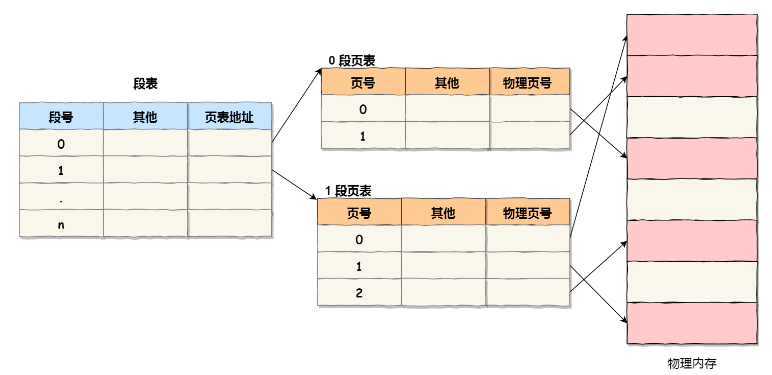
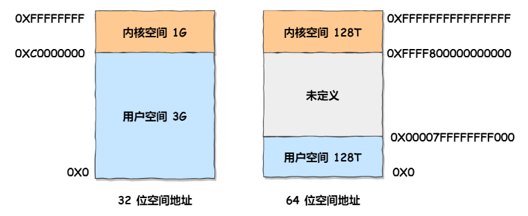
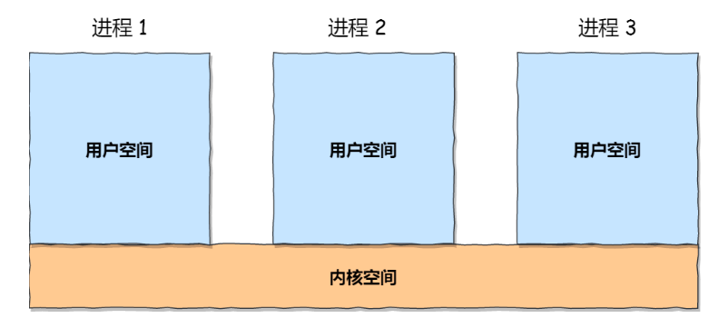
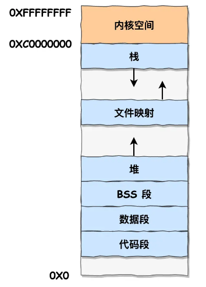

# 一、内存

## 1. 内存访问

以英特尔 32 位的 80386 型 CPU 为例，这款 CPU 有 32 个针脚可以传输地址信息。每个针脚对应了一位。如果针脚上是高电压，那么这一位是1。如果是低电压，那么这一位是0。32位的电压高低信息通过地址总线传到内存的32个针脚，内存就能把电压高低信息转换成32位的二进制数，从而知道CPU想要的是哪个位置的数据。用十六进制表示，32位地址空间就是从 0x00000000 到 0xFFFFFFFF，所以32位操作系统单个进程最大的内存使用空间一般不大于4G。

这种 **内存访问模式** 下，几乎不可能同时运行两个程序，A 刚往 0x100 写了数据，可能 B 就擦了。
所以引入了 **虚拟地址** 。

## 2. 虚拟内存地址

操作系统会提供一种机制（主要是两种方式：内存分段和内存分页），将不同进程的虚拟地址和不同内存的物理地址映射起来。

操作系统引入了虚拟内存，进程持有的虚拟地址会通过 CPU 芯片中的内存管理单元（MMU）的映射关系，来转换变成物理地址，然后再通过物理地址访问内存


先介绍内存分段和内存分页。

----
### 2.1 内存分段
不是我们的重点，已经是较老的内容了，参见 [内存分段](./内存分段.md) 。

### 2.2 内存分页

分页是把整个虚拟和物理内存空间切成一段段固定尺寸的大小。这样一个连续并且尺寸固定的内存空间，我们叫页（Page）。在 Linux 下，每一页的大小为 4KB。

这样一切分，内存碎片自然就出现的少了。另外，当需要进行内存交换的时候，需要交换写入或者从磁盘装载的数据也更少了。

虚拟地址与物理地址之间通过页表来映射，如下图：


页表是存储在内存里的，内存管理单元 （MMU）就做将虚拟内存地址转换成物理地址的工作。

当进程访问的虚拟地址在页表中查不到时，系统会产生一个缺页异常，进入系统内核空间分配物理内存、更新进程页表，最后再返回用户空间，恢复进程的运行。

缺点：因为内存分页机制分配内存的最小单位是一页，即使程序不足一页大小，我们最少只能分配一个页，所以页内会出现内存浪费，所以针对内存分页机制会有内部内存碎片（相对于前面的外部内存碎片，这里的内存碎片是在里面，给我分配了那么多，但是我用不着）的现象。

在分页机制下，虚拟地址分为两部分，页号和页内偏移。页号作为页表的索引，页表包含物理页每页所在物理内存的基地址，这个基地址与页内偏移的组合就形成了物理内存地址，见下图。


对于一个内存地址转换，其实就是这样三个步骤：

- 把虚拟内存地址，切分成页号和偏移量；
- 根据页号，从页表里面，查询对应的物理页号；
- 直接拿物理页号，加上前面的偏移量，就得到了物理内存地址。

----

### 2.3 更进一步

前面的内存分页有空间上的致命缺陷。

因为操作系统是可以同时运行非常多的进程的，那这不就意味着页表会非常的庞大。

在 32 位的环境下，虚拟地址空间共有 4GB，假设一个页的大小是 4KB（2^12），那么就需要大约 100 万 （2^20） 个页，每个「页表项」需要 4 个字节大小来存储，那么整个 4GB 空间的映射就需要有 4MB 的内存来存储页表。

这 4MB 大小的页表，看起来也不是很大。但是要知道每个进程都是有自己的虚拟地址空间的，也就说都有自己的页表。

那么，100 个进程的话，就需要 400MB 的内存来存储页表，这是非常大的内存了，更别说 64 位的环境了。

所以引入 多级页表 。

我们把 100 多万个「页表项」的单级页表再分页，将页表（一级页表）分为 1024 个页表（二级页表），每个表（二级页表）中包含 1024 个「页表项」，形成二级分页。


```
你可能会问，分了二级表，映射 4GB 地址空间就需要 4KB（一级页表）+ 4MB（二级页表）的内存，这样占用空间不是更大了吗？

如果某个一级页表的页表项没有被用到，也就不需要创建这个页表项对应的二级页表了，即可以在需要时才创建二级页表。做个简单的计算，假设只有 20% 的一级页表项被用到了，那么页表占用的内存空间就只有 4KB（一级页表） + 20% * 4MB（二级页表）= 0.804MB，这对比单级页表的 4MB 是不是一个巨大的节约？

解释的很好，那最开始的单页表不也可以这样吗，需要的时候再创建，何必还要多级页表？

问的很好，证明在瞎鸡儿想，完全不是一回事。听我说，抛开页表里面的内容（到目前位置，我也不知道是谁，以及咋填内容进去的），想象一下：

- 在单页表机制中，A 进程创建了，你是不是要给它腾出 4M 内存来放页表，先别管里面内容有没有，准不准，反正进程创建了，你得给它 4M 内存，咋用是它的事，你不能先给 1k ，然后发现不够了再加，不是这么回事，你仔细想想。
- 在多级页表下，A 进程创建了，我只需要给 4k 内存就行，剩下的，用到了再说。

```
还是没理解节省在哪的话，可以看下面的图：
- 单页表。0、1、1024 填了有效数据，其余的不填也占地方。
- 多级页表。1、2 填了有效数据，其余的不填也一样占地方，但是占的少。而没填的，对应的二级我就是可以不创建。


------

前面的内存分段和内存分页都有优缺点，我们其实可以结合一下，形成 段页式内存管理 。


段页式内存管理实现的方式：

- 先将程序划分为多个有逻辑意义的段，也就是前面提到的分段机制；
- 接着再把每个段划分为多个页，也就是对分段划分出来的连续空间，再划分固定大小的页；

这样，地址结构就由段号、段内页号和页内位移三部分组成。

用于段页式地址变换的数据结构是每一个程序一张段表，每个段又建立一张页表，段表中的地址是页表的起始地址，而页表中的地址则为某页的物理页号。



段页式地址变换中要得到物理地址须经过三次内存访问：

- 第一次访问段表，得到页表起始地址；
- 第二次访问页表，得到物理页号；
- 第三次将物理页号与页内位移组合，得到物理地址。

### 2.4 TLB

多级页表虽然解决了空间上的问题，但是虚拟地址到物理地址的转换就多了几道转换的工序，这显然就降低了这俩地址转换的速度，也就是带来了时间上的开销。于是就在 CPU 芯片中，加入了一个专门存放程序最常访问的页表项的 Cache，这个 Cache 就是 TLB（Translation Lookaside Buffer） ，通常称为页表缓存、转址旁路缓存、快表等。

在 CPU 芯片里面，封装了内存管理单元（Memory Management Unit）芯片，它用来完成地址转换和 TLB 的访问与交互。
有了 TLB 后，那么 CPU 在寻址时，会先查 TLB，如果没找到，才会继续查常规的页表。

------------------------------

## 3. Linux 内存布局

由于历史原因，了解一下逻辑地址和线性地址。


这主要是上面 Intel 处理器发展历史导致的，因为 Intel X86 CPU 一律对程序中使用的地址先进行段式映射，然后才能进行页式映射。既然 CPU 的硬件结构是这样，Linux 内核也只好服从 Intel 的选择。

    逻辑地址：就是CPU指令发出的地址。在机器语言指令中，来说明操作数或指令的地址。在x86架构中，每个逻辑地址包括两部分：段（Segment）和偏移量（Offset）。   
    线性地址：也称为虚拟地址。在32位CPU中，它是32位的无符号整型，最大可以达到4G。在x86_64 CPU中目前最大可使用48位地址线，即最大可寻址1TB。 

    逻辑地址经过段式映射（Segmentation Translation）到线性地址。线性地址经过页面映射（Page Translation）后，得到物理地址。


Linux 内存主要采用的是页式内存管理，但同时也不可避免地涉及了段机制。



注意，64 位系统其实只使用了 48 位地址。



用户空间分布的情况，以 32 位系统为例：



- 代码段，包括二进制可执行代码；
- 数据段，包括已初始化的静态常量和全局变量；
- BSS 段，包括未初始化的静态变量和全局变量；
- 堆段，包括动态分配的内存，从低地址开始向上增长；
- 文件映射段，包括动态库、共享内存等，从低地址开始向上增长；
- 栈段，包括局部变量和函数调用的上下文等。栈的大小是固定的，一般是 8 MB。当然系统也提供了参数，以便我们自定义大小；

上图中的内存布局可以看到，代码段下面还有一段内存空间的（灰色部分），这一块区域是「保留区」，之所以要有保留区这是因为在大多数的系统里，我们认为比较小数值的地址不是一个合法地址，例如，我们通常在 C 的代码里会将无效的指针赋值为 NULL。因此，这里会出现一段不可访问的内存保留区，防止程序因为出现 bug，导致读或写了一些小内存地址的数据，而使得程序跑飞。

    有几个注意的地方需要说清楚：
    1. 32位系统用户进程最大可以访问3GB，内核代码可以访问所有物理内存。
    2. x86架构中将内核地址空间划分三部分：ZONE_DMA、ZONE_NORMAL和ZONE_HIGHMEM。
        ZONE_DMA            内存开始的16MB(0x100 0000)
        ZONE_NORMAL         16MB~896MB(0x3800 0000)
        ZONE_HIGHMEM        896MB ~ 结束，是系统中剩下的可用内存,但因为内核的地址空间有限,这部分内存不直接映射到内核。

        为什么要这样划分？因为内核空间可以访问所有内存地址，如果内核空间（1G）和物理地址一一对应，那最多就是只能访问 1G 空间，所以需要一种机制来让内核空间访问所有内存地址。
        高端内存空间就是用来临时映射的，想访问一些够不着的内存了，就从它划分一块出来映射，用完了还回去。
        也是这个原因，x64 不需要高端内存，因为管够。

        高端内存的最基本思想：借一段地址空间，建立临时地址映射，用完后释放，达到这段地址空间可以循环使用，访问所有物理内存
    3. 高端内存只和物理地址有关系，和线性地址、逻辑地址没有直接关系。高端内存还分了三个部分，对应三个部分又有三种映射，感兴趣自己了解吧。
    4. 前面的 896MB ，也称为 直接映射区 ，这一块空间是连续的，和物理内存是非常简单的映射关系，其实就是虚拟内存地址减去 3G，就得到物理内存的位置。


下面这两句话，多读几遍，记住虚拟地址空间是由用户空间和内核空间组成。   

- Linux内核一般将处理器的虚拟地址空间划分为两个部分。底部比较大的部分用于用户进程，顶部则专用于内核。虽然（在两个用户进程之间的）上下文切换期间会改变下半部分，但虚拟地址空间的内核部分总是保持不变。


- Linux将虚拟地址空间划分为：0~3G为用户空间，3~4G为内核空间

--------------

## 4. 总结

为了在多进程环境下，使得进程之间的内存地址不受影响，相互隔离，于是操作系统就为每个进程独立分配一套虚拟地址空间，每个程序只关心自己的虚拟地址就可以，实际上大家的虚拟地址都是一样的，但分布到物理地址内存是不一样的。作为程序，也不用关心物理地址的事情。

每个进程都有自己的虚拟空间，而物理内存只有一个，所以当启用了大量的进程，物理内存必然会很紧张，于是操作系统会通过内存交换技术，把不常使用的内存暂时存放到硬盘（换出），在需要的时候再装载回物理内存（换入）。

那既然有了虚拟地址空间，那必然要把虚拟地址「映射」到物理地址，这个事情通常由操作系统来维护。

那么对于虚拟地址与物理地址的映射关系，可以有分段和分页的方式，同时两者结合都是可以的。

内存分段是根据程序的逻辑角度，分成了栈段、堆段、数据段、代码段等，这样可以分离出不同属性的段，同时是一块连续的空间。但是每个段的大小都不是统一的，这就会导致外部内存碎片和内存交换效率低的问题。

于是，就出现了内存分页，把虚拟空间和物理空间分成大小固定的页，如在 Linux 系统中，每一页的大小为 4KB。由于分了页后，就不会产生细小的内存碎片，解决了内存分段的外部内存碎片问题。同时在内存交换的时候，写入硬盘也就一个页或几个页，这就大大提高了内存交换的效率。

再来，为了解决简单分页产生的页表过大的问题，就有了多级页表，它解决了空间上的问题，但这就会导致 CPU 在寻址的过程中，需要有很多层表参与，加大了时间上的开销。于是根据程序的局部性原理，在 CPU 芯片中加入了 TLB，负责缓存最近常被访问的页表项，大大提高了地址的转换速度。

Linux 系统主要采用了分页管理，但是由于 Intel 处理器的发展史，Linux 系统无法避免分段管理。于是 Linux 就把所有段的基地址设为 0，也就意味着所有程序的地址空间都是线性地址空间（虚拟地址），相当于屏蔽了 CPU 逻辑地址的概念，所以段只被用于访问控制和内存保护。

另外，Linux 系统中虚拟空间分布可分为用户态和内核态两部分，其中用户态的分布：代码段、全局变量、BSS、函数栈、堆内存、映射区。

最后，说下虚拟内存有什么作用？

- 第一，虚拟内存可以使得进程对运行内存超过物理内存大小，因为程序运行符合局部性原理，CPU 访问内存会有很明显的重复访问的倾向性，对于那些没有被经常使用到的内存，我们可以把它换出到物理内存之外，比如硬盘上的 swap 区域。
- 第二，由于每个进程都有自己的页表，所以每个进程的虚拟内存空间就是相互独立的。进程也没有办法访问其他进程的页表，所以这些页表是私有的，这就解决了多进程之间地址冲突的问题。
- 第三，页表里的页表项中除了物理地址之外，还有一些标记属性的比特，比如控制一个页的读写权限，标记该页是否存在等。在内存访问方面，操作系统提供了更好的安全性。