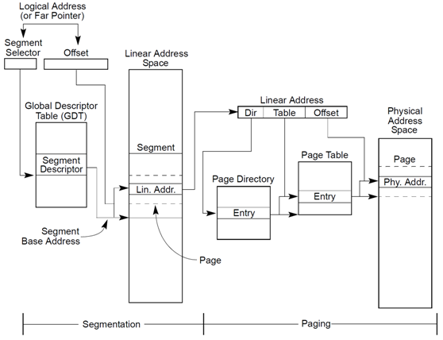

# 0x00、导读

- 内存地址介绍。   
- 三代不同的内存管理方式：直接物理内存访问模式、分段模式、分页模式。

# 0x01、内存地址

## 1. 什么是内存地址

    以英特尔 32 位的 80386 型 CPU 为例，这款 CPU 有 32 个针脚可以传输地址信息。每个针脚对应了一位。如果针脚上是高电压，那么这一位是 1 。如果是低电压，那么这一位是 0 。 32 位的电压高低信息通过地址总线传到内存的 32 个针脚，内存就能把电压高低信息转换成 32 位的二进制数，从而知道 CPU 想要的是哪个位置的数据。用十六进制表示， 32 位地址空间就是从 0x00000000 到 0xFFFFFFFF ，所以 32 位操作系统单个进程最大的内存使用空间一般不大于 4G 。

这就是那串 `0xxxxxxxxxx` 数字的由来。

在这种原始的 **内存访问模式** 下，几乎不可能同时运行两个程序，例如 A 刚往 0x10001000 写了数据，B 就覆盖了。并且内核和进程运行在一个空间中，安全性极低。

# 0x02、 内存分段

将内存分成一个一个的段，每个段都有各自的范围长度、类型和权限，通过 **逻辑地址** 进行数据/指令访问。提升了进程与进程之间、进程与内核之间的隔离性和安全性。   

参见 [内存分段](./内存分段.md) 。

# 0x03、 内存分页

内存分段不够灵活，内存颗粒度太大，使得内存利用率不高，于是产生了分页模式。

内存分页模式下将内存分成小颗粒度的页，通过使用虚拟内存地址，使得效率、安全性都大大提高。

参见 [内存分页](./内存分页.md) 。

# 0x04、 总结

## 4.1 逻辑地址、线性地址、虚拟地址

**逻辑地址：** 就是CPU指令发出的地址。在机器语言指令中，来说明操作数或指令的地址。在x86架构中，每个逻辑地址包括两部分：段（Segment）和偏移量（Offset）。   

**线性地址：** 也称为虚拟地址。在32位CPU中，它是32位的无符号整型，最大可以达到4G。在x86_64 CPU中目前最大可使用48位地址线，即最大可寻址1TB。 

逻辑地址经过段式映射（Segmentation Translation）到线性地址。线性地址经过页面映射（Page Translation）后，得到物理地址。

Linux 系统主要采用了分页管理，但是由于 Intel 处理器的发展史，Linux 系统无法避免分段管理。于是 Linux 就把所有段的基地址设为 0，也就意味着所有程序的地址空间都是线性地址空间（虚拟地址），相当于屏蔽了 CPU 逻辑地址的概念，所以段只被用于访问控制和内存保护。

x86 CPU 采用了 **段页式地址映射模型** 。进程代码中的地址为逻辑地址，经过段页式地址映射后，才真正访问物理内存。

段页式机制如下图:

## 4.2 总结

内存管理的目标：

- 减少内存碎片，包括外部碎片和内部碎片。   
    - 外部碎片是指还在内存分配器中的内存，但是由于比较分散，无法满足用户大块连续内存分配的申请。   
    - 内部碎片是指你申请了5个字节的内存，分配器给你分配了8个字节的内存，其中3个字节的内存是内部碎片。 

- 内存分配接口要灵活多样，同时满足多种不同的内存分配需求。   
    既要满足大块连续内存分配的需求，又能满足小块零碎内存分配的需求。

- 内存分配效率要高。   
    内存分配要尽量快地完成，比如说你设计了一种算法，能完全解决内存碎片问题，但是内存算法实现得特别复杂，每次分配都需要1毫秒的时间，这就不可取了。

- 提高物理内存的利用率。  
    比如及时回收物理内存、对内存进行压缩。