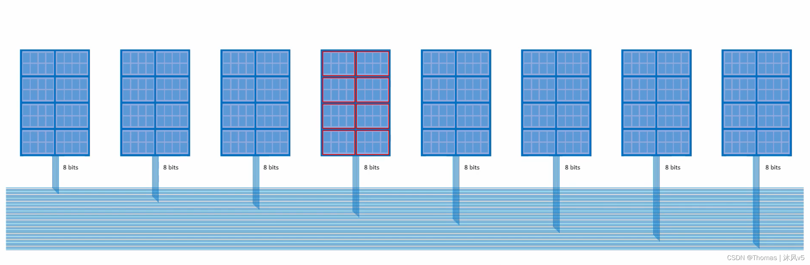
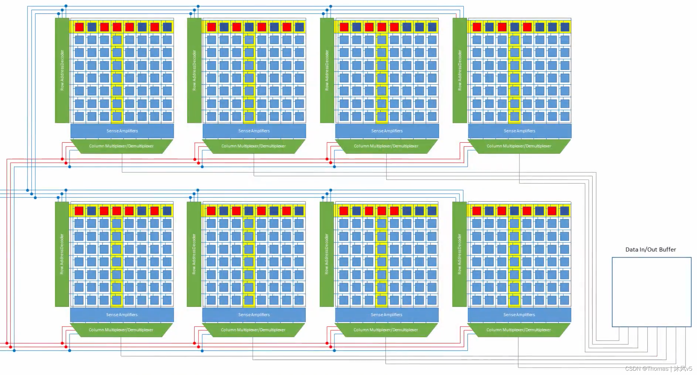
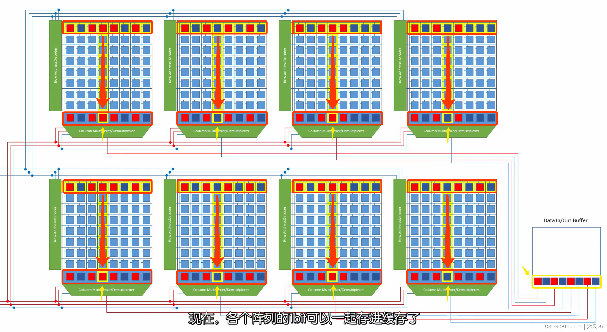
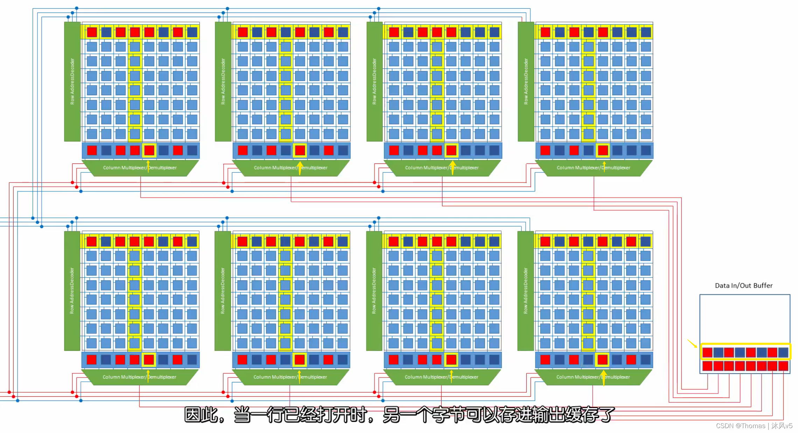
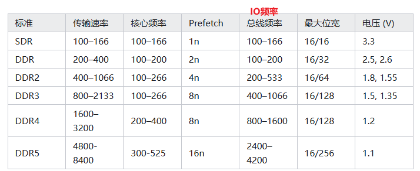
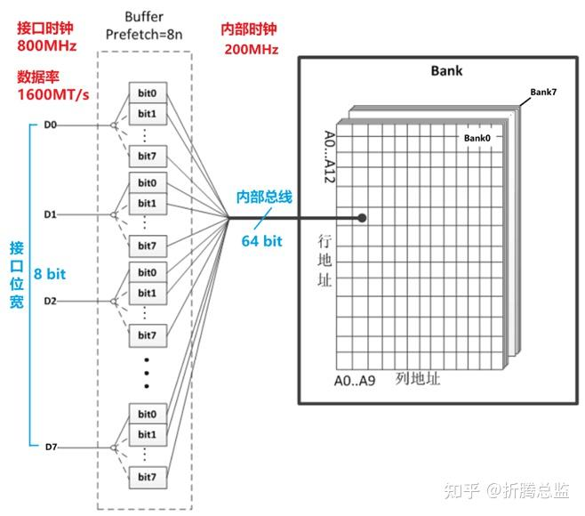
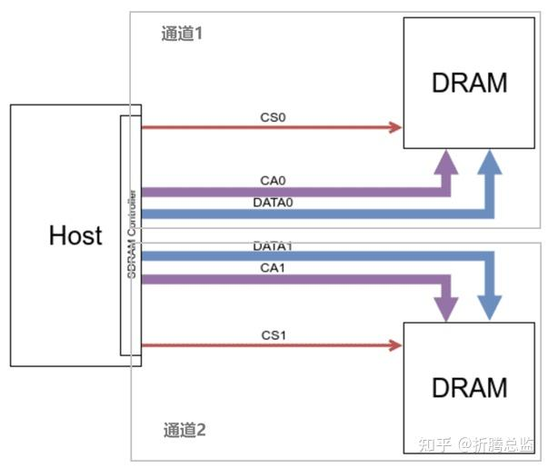

# 0x00. 导读

# 0x01. 简介

猝发长度（Burst Length, BL）是指某行打开期间，能够连续读取的列数；而预取（Prefetch）则是指在指定 BANK 和行列地址之后，可以往该地址内写入（或读取）的数据量（DDR3 是 8 Bytes）。

# 0x02. DDR 内部组织架构

常见的内存通道总线位宽是 64 bits，假设使用 x8 内存颗粒，则需要 8 颗 IC 才能组成 64 bits。这 64 bits 是同时存取的，称为一个 RANK，即 CPU 一次访问的位宽。

每颗 IC 内部一般分为 8 个 BANK（如上图红色框），CPU 访问时是以 BANK 为基本单位的。每个芯片相同位置的 BANK，它们的地址线和控制信号是一摸一样的，因此当 CPU 同时向各芯片写入 8 bits 数据时，它们写入的是相同位置的 BANK。

每个 BANK 内部包含 8 个存储阵列，每个阵列每次可存取 1 bit 数据。一个 BANK 的组成结构如下：

进一步细化：

每个存储阵列包含 8 行 8 列，共 64 个存储单元（此处为简化模型，一个实际阵列为长方形，可能包含 1024 列 16384 行），每个存储单元可存储 1 bit 数据。

 读取流程：激活行地址，锁存行数据到感测放大器 --> 激活列地址，数据送到输出缓存 --> 利用感测放大器值刷新行数据 --> 关闭位线，关闭行线，位线预充电。

由于 8 个阵列的行列地址线是共用的，指定行列地址也就指定了 8 个阵列中相同位置的存储单元，每个阵列可读取 1 bit，共 8 bits 数据。如下图所示：

举例：激活第 0 行时，8 个存储阵列的第 0 行都被打开，数据被同时锁存到感测放大器中（如上图中红色箭头，此过程非常耗时）；当激活列地址时，8 个阵列中相同位置的 1bit 数据被指定，并被同时送往输入 / 输出缓存中，这就完成了一次 8 bits 数据的读取（如上图中黄色箭头）。

注意，这里只是单颗 IC 中 1 个 BANK 的操作过程。实际工作时，CPU 每次访问一个 RANK，包含 8 颗 IC，每颗 IC 中相同位置的 BANK 都同时输出 8 bits（1 Byte），共 64 bits 数据。

# 0x03. Burst 的概念

仔细观察上述读取过程会发现，为了获取 1 bit 的数据，需要打开 BANK 中的一整行（包含 8 个存储单元，甚至 1024 个或更多）。读取完毕后需要关闭整行，然后给 bit 线预充电，再去打开另外一行，再去读取 1 bit，这个过程实在是浪费，效率非常低。

早期的 DRAM 由于上述原因，存取速率较低。实际上，当打开一行时，相邻位置的另一个 Byte 数据也可以送入输入输出缓存（如下图中黄色箭头）。

如果没有黄色箭头的数据，则 BL=8，如果算上黄色箭头的数据，则 BL=8*2=16.

**也就是说，仅提供一个行地址和一个列地址，就可以非常快速的完成一次猝发（Burst）。某行打开期间，能够连续读取的列数，称为 “猝发长度（BL）”。**

不同代 DDR 的猝发长度不同，通常 DDR 的 BL 是 2，DDR2 的 BL 是 4，DDR3 的 BL 是 8，DDR4 的 BL 也是 8。

# 0x04. Prefetch 的概念

为什么 DRAM 行业那么害怕提高核心频率？因为一片小小的芯片，内部堆了那么多晶体管，外部又没有像 CPU 那样强悍的散热系统，能不爆么。大幅提升核心频率，但短期内芯片厂商的工艺又上不去，致使芯片的发热量大幅上升，进而影响芯片的生产良率和运行可靠性，致使价格大幅提升，性能和稳定性还不及预期。

实际上，Prefetch 并不是什么新技术，在 DDR1 就开始应用了，我们以前经常能看到这样描述 DDR，“在时钟周期的上沿和下沿都能传输数据，所以传输率比 SDRAM 快了一倍”，这就说上沿传输一位数据，下沿传输一位数据，**在一个时钟周期内一共传输两位数据(2-bit)，但这 2-bit 数据得先从存储单元预取出来才行（一个时间周期）**。换句话说，一次读 2-bit 的数据，然后在 I/O 时钟上升沿和下降沿传输出去，这就是 2-bit Prefetch 技术。这儿的 2-bit，是指 2 位数据，即 2 倍芯片位宽的数据。

在 DDR2 时代，使用了 4-bit 预取技术，一次从存储单元预取 4-bit 的数据，然后在 I/O 时钟上升沿和下降沿传输出去，由于 4-bit 需要 2 个时钟周期才能完成传输，这就是为什么 DDR2 的 I/O 频率为核心频率两倍的原因。

到了 DDR3，8-bit 预取技术也自然水到渠成，一次从存储单元预取 8-bit 的数据，在 I/O 端口处上下沿触发传输，8-bit 需要 4 个时钟周期完成，所以 DDR3 的 I/O 频率是核心频率的 4 倍，由于是上下沿都在传输数据，所以实际有效的数据传输频率达到了核心频率的 8 倍。比如，核心频率为 200MHz 的 DDR3-1600，其 I/O 频率为 800MHz，有效数据传输频率为 1600MHz。

显然，通过使用 Prefetch 架构可以解决存储单元内部数据总线频率（核心频率）较低的瓶颈。 8-bit 预取，正是 DDR3 提升带宽的关键技术。同样的核心频率，DDR3 能提供两倍于 DDR2 的带宽。

核心频率就是内存的工作频率；DDR1 内存的核心频率是和时钟频率相同的，到了 DDR2 和 DDR3 时才有了时钟频率的概念，就是将核心频率通过倍频技术得到的一个频率。数据传输频率就是传输数据的频率。DDR1 预读取是 2 位，DDR2 预读取是 4 位，DDR3 预读取是 8 位。

其中，总线频率应该就是 CPU 外频，应该等于 IO 频率。

从 SDR 到 DDR3，DDR 芯片的核心频率一直维持在 100-266MHz 之间，起步频率都是 100MHz，提升数据率全靠预取技术，Prefetch 从 DDR 的 2 倍持续提升到 DDR3 的 8 倍，这意味着 DDR3 芯片内部的数据总线是 DDR 接口位宽的 8 倍，如一个 8 位的 DDR3 芯片，内部数据总线是 64 位，一次行列选择操作能同时选中 64 个 Cell，驱动 64 个读写电路同时工作，完成 64位数据的读写。读出的 64 位数据被锁存在 8 个 8 位的 FIFO 缓冲队列中，靠 4 倍于内核时钟的高速接口时钟，分 8 个上升下降沿传输完成，如下图：

# 0x05. 多通道

在 DDR1 时代，为了进一步提升 PC 对于内存带宽的要求，出现了双通道技术。所谓双通道，就是在 DRAM 控制器（集成在主板芯片组，后来挪到了 CPU）上堆了两个 DDR 通信控制电路，拉出两组独立的 DDR 通信总线（地址总线、数据总线和控制总线），能同时从两组内存中读写数据，速率自然快了一倍，如下图：

双通道就是这么简单粗暴，DRAM 芯片还是原来的芯片，但数据率就是上去了。在 DRAM 控制器多实现一条通道，其实用不了多少晶体管，但速率的提升是实实在在的，于是得到了用户的青睐。这一技术在服务器领域继续发扬光大，从双通道变为四通道，八通道。