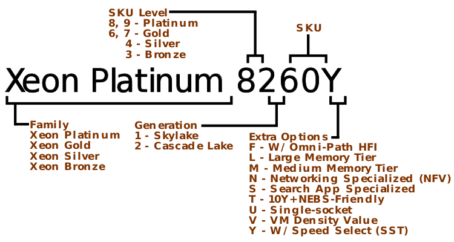
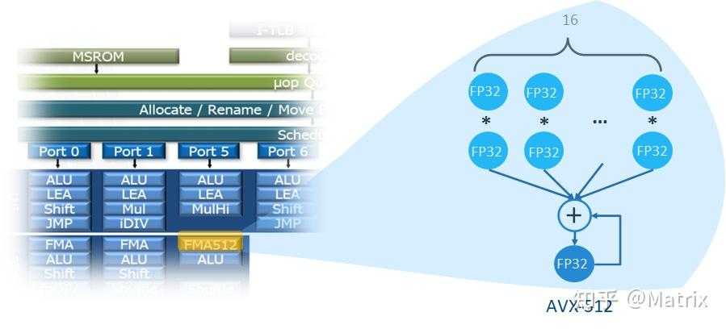

# 0x00. 导读

# 0x01. 简介

总线历史
```
1992 64 bit Data Bus Pentium
1995 Double Pumped Bus
2000 Quad Pumped Bus Pentium
2003 Dual Independent Bus (DIB)
2004 Shared Front side Bus(FSB)
2005 Dedicated High Speed Interconnects (DHSI)
2008 Quick Path Interconnect（QPI） 2018H2 诞生，NUMA环境中连接多个处理器的，高速点对点通信协议；
2017 Ultra Path Interconnect (UPI) 搭载 skylake server processor
```

在大多数普通用户眼里，CPU 也许就是一块金属盖子的电路板而已。可是如果去掉顶盖，深入正中那片小小的集成电路，我们会发现这里有着人类科技史上，最伟大的奇迹。几十亿个晶体管层层叠叠，密密麻麻挤在一起，占据着这个仅有一点几个平方厘米的狭小世界。

晶体管们在“上帝之手”的安排下，组成了各个功能模块。而这些功能模块之间，则是宽阔无比的超高速公路。这条超高速公路如此重要，以至于它的距离、速度和塞车与否，会大大影响这个小小世界的效率。这些模块就是 CPU 内部的功能模块，例如内 存控制器、L3/L2 Cache、PCU、PCIe root complex 等等，而这条高速公路，就是我们今天的主角，片内总线了。处理器内的不同模块就是通过 片内总线 进行通讯的。它的设计高效与否，会大大影响处理器的性能。如果把各个模块看做一个个节点，那么它们之间相互连接关系一般可以有以下几种：


而处理器片内总线连接就经历了从 Star Bus --> Ring Bus --> Mesh Bus 的过程。

现在处理器都有 片上网络(Network-on-Chip, NoC), 在 die, cores, cache slices (large LLC is usually divided into slices), memory controllers 等部件的内部，都是通过一个 on-chip network(e.g., a ring in old-generation Xeon, or a mesh in Xeon Scalable) 连接起来的。

人们习惯于将连接多台独立计算机的网络称为 Network, 而将芯片内部或者多个芯片之间的互联网称为 Fabric. 片外访存网络（或者说片间互联）：Intel 的 QPI、IBM 的 SMI 和 OpenCAPI、ARM 的 CCIX、HP 的 GenZ。Intel 的 QPI 经过多个版本演进，如今升级为 UPI 了。

On-Chip Interconnect, Off-Chip Interconnect

## 1.1 uncore

[Uncore](https://en.wikipedia.org/wiki/Uncore) 是 Intel 使用的一个术语，用来描述微处理器的功能，这些功能不在核心中，但必须与核心紧密相连才能实现高性能。自 **Sandy Bridge** 微体系结构发布以来，它一直被称为 系统代理(system agent)。

典型的处理器内核包含执行指令所涉及的处理器组件，包括 ALU 、 FPU 、 L1 和 L2 高速缓存。相比之下，Uncore 包括 QPI 控制器、 L3 缓存、监听代理管道、片上内存控制器、片上 PCI Express Root Complex 和T hunderbolt 控制器。 其他总线控制器（例如SPI和LPC）是芯片组的一部分。

Intel 的 uncore 设计源于北桥。Intel 的 uncore 重新组织了对核心至关重要的功能，使它们在物理上更接近片上核心，从而减少了访问延迟。

Specifically, the microarchitecture of the Intel uncore is broken down into a number of modular units. The main uncore interface to the core is the so-called cache box (**CBox**, 大话计算机2 P473 中说 CBox 是 L3 缓存控制器), which interfaces with the last level cache (LLC) and is responsible for managing cache coherency. Multiple internal and external QPI links are managed by physical-layer units, referred to as PBox. Connections between the PBox, CBox, and one or more iMCs (MBox) are managed by the system configuration controller (UBox) and a router (RBox).

## 1.2 命名规则

[Intel 处理器架构演进](https://jcf94.com/2018/02/13/2018-02-13-intel/)


英特尔旗下处理器有许多子品牌（Brand Name），包括我们熟悉的凌动（ATOM）、赛扬（CELERON）、奔腾（PENTIUM）、酷睿（CORE）、至强（XEON）等。

- 凌动（ATOM）是移动端处理器，用于平板、手机。
- 赛扬（CELERON）、奔腾（PENTIUM）、酷睿（CORE）属于桌面级(包括笔记本电脑)，多用于台式机和笔记本电脑。
- 至强（XEON）则属于企业级，多用于服务器和工作站。


品牌修饰符（Brand Modifier），例如 i3，i5，i7，i9，修饰符表示处理器在该系列中的等级。一般来说，数字越大，处理器性能越高，功能也越丰富。
- i3：低端，适合日常办公和轻度多任务处理。
- i5：中端，适合较高的多任务处理和轻度游戏。
- i7：高端，适合高性能任务，如视频编辑和游戏。
- i9：旗舰级，适合极高性能需求，如 4K 视频编辑、3D 建模和高端游戏。

**CPU代号** 代表的 CPU 的生产年份不同、生产工艺不同、架构设计的不同。各个代号除了这个数字的编号外，还会有一个英文代号。比如第 7 代的代号编号就是 Kaby Lake。注意，这和 微架构 不同。


[编程考古-CPU(上)](https://zhuanlan.zhihu.com/p/11340114858)  
[编程考古-CPU(中)](https://zhuanlan.zhihu.com/p/12540407426)  
[编程考古-CPU(下)](https://zhuanlan.zhihu.com/p/12705805467)  
[至强Xeon工作站CPU介绍，洋垃圾为何大行其道](https://zhuanlan.zhihu.com/p/12340105587)
[晶体管的奋斗史（一文搞懂芯片晶体管发展历程）](https://zhuanlan.zhihu.com/p/1688492575)

处理器列表：[List_of_Intel_processors](https://en.wikipedia.org/wiki/List_of_Intel_processors), 微架构列表：[List_of_Intel_CPU_microarchitectures](https://en.wikipedia.org/wiki/List_of_Intel_CPU_microarchitectures), 为了方便 [wiki/Xeon](https://en.wikipedia.org/wiki/Xeon).

```
64位架构：core -> Nehalem -> Sandy Bridge -> Haswell -> Skylake -> Palm Cove -> Sunny Cove -> Cypress Cove -> Willow Cove -> Golden Cove -> Raptor Cove

衍生：
core, 2006: 
    Penryn
Nehalem, 2008.11: 
    Westmere
Sandy Bridge, 2011.01: 
    Ivy Bridge
Haswell, 2013.06: 
    Broadwell
Skylake, 2015.08: 
    Kaby Lake:
        Amber Lake
        Whiskey Lake
    Skylake-X
    Coffee Lake
    Cascade Lake
    Comet Lake
    Cooper Lake
Palm Cove:
    Cannon Lake
Sunny Cove, 2019.09:
    Ice Lake
    Lakefield
    Ice Lake-SP
Cypress Cove:
    Rocket Lake
Willow Cove:
    Tiger Lake
Golden Cove:
    Alder Lake
    Sapphire Rapids
Raptor Cove, 2021.11:
    Raptor Lake
    Emerald Rapids
```


```
2006年90、65纳米工艺酷睿core Yonah上市，32位架构，仍然算是奔腾Pro系列；2006推出酷睿处理器是介于NetBurst和Core之间，其实是NetBurst的改版，Core 2是第一个基于Core架构的原生双核处理器，65nm工艺，使得AMD K8架构优势全无，直接投入开发原生四核架构K10去了。

2006年7月酷睿2处理器代号为“Conroe”，采用x86-64指令集与65纳米双核心架构。该处理器基于全新的酷睿微架构，虽然时脉大大降低，但在效率方面和性能方面有了重大改进。从这一时期开始，在深度流水线和资源混乱的运行引擎上维持每个周期的高指令（IPC）

2008年的 Nehalem （酷睿i7）是采用 45nm 工艺的新架构，主要优势来自重新设计的I/O和存储系统，这些系统具有新的Intel QuickPath Interconnect和集成的内存控制器，可支持三通道的DDR3内存。引入片内4-12MB的L3 Cache；重新加入超线程；分支预测分级；取消北桥，IMC(集成内存控制器）从北桥挪到片内

2009年的 Westmere 升级到 32nm；退出第一代I5/I3，Xeon 系列也开始推出第一代E命名的E7-x8xx系列。

2010年的 Lynnfield/Clarkdale 基于 45nm/32nm 工艺的新架构，第一代智能酷睿处理器；

2011年的 Sandy Bridge ，基于 32nm 工艺的新架构，第二代智能酷睿处理器，增加AVX指令集扩展， 对虚拟化提供更好支持；实现了GPU和CPU的融合

2012年的 IVY Bridge，是 Sandy Bridge 的 22nm 升级版，第三代智能酷睿处理器，Tick级改进；

2013年的 Haswell ，基于 22nm 工艺的新架构，第四代智能酷睿处理器，Tock级改进；

2014年的 Broadwell，是 Haswell 的 14nm 升级版，第五代智能酷睿处理器；

2015年则推出 SkyLake，基于 14nm 工艺的新架构， Tock级改进，Ring-Bus改成了Mesh架构，第6代Core i系列，8163就是这款；socket之间UPI互联，内存频率通道增强。不再使用Xeon命名，而是改用Bronze/Silver/Gold/Platinum 4个系列。青铜和白银系列支持双路（原本的 E5-24xx、E7-28xx 系列），黄金系列支持四路（原本的 E5-46xx、E7-48xx 系列），白金系列支持八路（原本的 E7-88xx 系列）；

2019年的Cascade Lake(X2XX命名)也是Skylake的优化，是Intel首个支持基于3D XPoint的内存模块的微体系结构。同年也正式宣布了十代酷睿处理器，即i9-10900k，还是Skylake微内核不变。

2020年的10nm Ice Lake自家工厂无能，改由台积电加工。

2023年 Intel 发布代号Sapphire Rapids（SPR）的第四代英特尔至强（Intel Xeon）可扩展处理器，其核心数最多可达60个，比代号Ice Lake(-SP)的第三代至强可扩展处理器高出50%。相应的，公开款的TDP指标上限，也从270瓦（W）一跃而至350瓦。这一波核数增长的关键是，大英（终于）从单片式（monolithic）的die，转为四等分的die拼接(跟随了 AMD 的策略)

Core 架构代号是 Yonah，把 NetBurst 做深了的流水线级数又砍下来了，主频虽然降下来了（而且即使后来工艺提升到 45nm 之后也没有超过 NetBurst 的水平），但是却提高了整个流水线中的资源利用率，所以性能还是提升了；把奔腾 4 上曾经用过的超线程也砍掉了；对各个部分进行了强化，双核共享 L2 cache 等等。

从 Core 架构开始是真的走向多核了，就不再是以前 “胶水粘的” 伪双核了，这时候已经有最高 4 核的处理器设计了。

Core 从 65nm 改到 45nm 之后，基于 45nm 又推出了新一代架构叫 Nehalem，新架构Nehalem采用 Intel QPI 来代替原来的前端总线，PCIE 和 DMI 控制器直接做到片内了，不再需要北桥。

2006年Intel也提出了Tick-Tock架构战略。Tick年改进制程工艺，微架构基本不做大改，重点在把晶体管的工艺水平往上提升;Tock年改进微架构设计，保持工艺水平不变，重点在用更复杂、更高级的架构设计。然后就是一代 Tick 再一代 Tock交替演进。

从2006年酷睿架构开始，基本是摁着AMD在地上摩擦，直到2017年的AMD Zen杀回来，性能暴增。
```

## 例子

工作和 Xeon 打交道较多，我多介绍一下，更多[看我](https://zh.wikipedia.org/wiki/%E8%87%B3%E5%BC%BA#Xeon%E7%B3%BB%E5%88%97)：
> Xeon（至强）主要供服务器及工作站使用。以前的 Xeon 分为 E3、E5、E7 三个系列，现在的 Xeon 分为 Xeon E、Xeon W、Xeon D、Xeon Scalable（分为青铜级 Bronze、白银级 Silver、黄金级 Gold 和铂金级 Platinum） 几个系列。另有加速卡 Xeon Phi。只有部分 Xeon E3、Xeon E 和 Xeon W 处理器内置 GPU。

通过 CPU 型号找微架构，例如 Intel Xeon W7-2495X, 首先看得出来这是 Xeon W 系列：
1. 打开 [wiki/Xeon](https://en.wikipedia.org/wiki/Xeon), 搜索 2400 ，得到答案 Sapphire Rapids-based Xeon
2. **推荐**：直接搜 Intel Xeon W7-2495X 的 [Intel 官方](https://www.intel.com/content/www/us/en/products/sku/233416/intel-xeon-w72495x-processor-45m-cache-2-50-ghz/specifications.html), Code Name Products formerly Sapphire Rapids, 得到答案
3. 打开 [wiki/List_of_Intel_processors](https://en.wikipedia.org/wiki/List_of_Intel_processors)， 搜索 Xeon W 得到答案。

例如 Intel Platinum 8580, 直接谷歌进入 [Intel 官网](https://www.intel.com/content/www/us/en/products/sku/237250/intel-xeon-platinum-8580-processor-300m-cache-2-00-ghz/specifications.html)，得到 Code Name Products formerly Emerald Rapids, 答案 Emerald Rapids.

注意，Intel 官网使用 "Products formerly xxx" 来描述 Code Name, 原因是 [Why use the ‘formerly’ word for something that is still around?](https://www.quora.com/Why-does-Intel-mark-their-CPUs-as-Products-formerly-Kaby-Lake-etc-even-for-the-series-that-are-still-in-production-Why-use-the-formerly-word-for-something-that-is-still-around)
> Kaby Lake、Skylake、Haswell 等是英特尔设计芯片时使用的开发名称。官方说法，Intel 将 Kaby Lake 一代称为“第七代核心架构”，而不是 Kaby Lake。英特尔所说的“以前的 kabylake”指的是这些芯片的开发代号是kabylake。
> 以前叫五道口技术学院，现在叫清华。
> 神经病




## core 架构

[core 架构](https://en.wikipedia.org/wiki/Intel_Core_(microarchitecture))


相对上一代的主要改进：

- 引入了片内 4-12 MB 的 L3 cache！！！
- 重新加入超线程（奔腾 4 时代有，后来砍掉了，这一代开始重新引入）
- Intel Turbo Boost 1.0！！！
- 分支预测器分级！！！
- 二级的 TLB
- 每个核上有 3 个整数 ALU, 2 个向量 ALU and 2 个 AGU
- 采用 Intel QPI 来代替原来的前端总线！！！
- PCIE 和 DMI 控制器直接做到片内了，不再需要北桥
- IMC（集成内存控制器），内存控制也从北桥移到了片内
- 第二代的 Intel 虚拟化技术
- 流水线加到 20 到 24 级
- 其他指令扩展升级等等

## Sandy Bridge 架构

[Nehalem 架构](https://en.wikipedia.org/wiki/Sandy_Bridge)

- Intel Turbo Boost 2.0
- 增大了 L1 和 L2 cache
- 共享的 L3 cache 也同时支持片上的核芯显卡
- IMC 强化成了 GMCH（integrated graphics and memory controller），片上显卡共用主存作为它的显存
- 每个核上的运算部件增强
- 分支预测增强
- 微操作译码部分新增了一个 cache（uop cache）
- 14 到 19 级指令流水线！！！（长度区别基于上面那个 uop cache 是否命中）
- 多个核间、核芯显卡、cache 间用了**环状总线（ring bus）**
- Intel Quick Sync Video，支持视频的硬解码
- 其他指令扩展升级等等


## Skylake 架构

从 Skylake-X 开始，之后的系列开始全面**改用 Mesh 结构**。


## 总线变化

服务器上高核数 CPU 的设计，简要的说，为了在一块 CPU 里塞进越来越多的核心数，Intel 的多核 CPU 引入了 **ring bus** 的设计，核心、LLC、QPI 控制器分布于环上，内存控制器和 QPI 总线分布在环的两端，然而这样的结构随着核心的增加，延迟也会增加，于是从 Haswell 开始，高核心数的服务器 CPU 开始使用 **双环+双内存控制器** 的架构，在 LCC 中是单环， MCC 中是一个完整环和一个半环，HCC 中则是两个完整的环，半环和完整的环都带有一个独立的内存控制器。（LCC=low core count, MCC=medium, HCC=high, XCC=extreme. 参考：LCC: < 10, MCC: 10 - 15, HCC: 15 - 20, XCC: 20 - 28）

ring bus 架构的缺点很明显，即便是分成了两个环，依旧会有核心越多延迟越大的问题，且跨环访问时会增加一个额外的 CPU cycle 的延迟，所以 Broadwell 算是把 ring bus 续命做到了极致最多也只塞到了 22 个核心，为了塞进更多的核心数、更大的内存带宽，Intel 把 Xeon Phi 上最早出现过的 **mesh** 架构搬到了 Skylake 上， mesh 架构最多六行六列，其中一行被 UPI 和 PCI 控制器占据，另有两个位置是内存控制器，故最多塞进（6*6-6-2=28）个核心，同时还把 Cache 控制器、I/O 控制器等分布到了各个核心之间，新的控制器称为 CHA(cache home agent)，这个 CHA 同时还提供了不同核心之间寻路的路由功能。很直观的可以发现，由于 mesh 结构避免了顺着环进行顺序访问的问题，核心-缓存延迟和核心-内存延迟会降低；除此之外，I/O 操作的初始化延迟也会改善。

# 0x02. FSB

众所周之，前端总线（Front Side Bus，简称 FSB）是将 CPU 连接到北桥芯片的系统总线，它是 CPU 和外界交换数据的主要通道。前端总线的数据传输能力对计算机整体性能影响很大，如果没有足够带宽的前端总线，即使配备再强劲的 CPU，用户也不会感觉到计算机整体速度的明显提升。　

目前 intel 处理器主流的前端总线频率有 800MHz、1066MHz、1333MHz 几种，而就在 2007 年 11 月，intel再度将处理器的前端总线频率提升至 1600MHz（默认外频 400MHz），这比 2003 年最高的 800MHz FSB 总线频率整整提升了一倍。这样高的前端总线频率，其带宽多大呢？前端总线为 1333MHz 时，处理器与北桥之间的带宽为 10.67GB/s，而提升到 1600MHz 能达到 12.8GB/s，增加了 20%。

虽然 intel 处理器的前端总线频率看起来已经很高，但与同时不断提升的内存频率、高性能显卡（特别是双或多显卡系统）相比，CPU 与芯片组（南北桥）存在的前端总线瓶颈仍未根本改变。例如 1333MHz 的 FSB 所提供的内存带宽是 1333MHz × 64bit / 8 = 10667 MB/s = 10.67GB/s，与双通道的 DDR2-667 内存刚好匹配，但如果使用双通道的 DDR2-800、DDR2-1066 的内存，这时 FSB 的带宽就小于内存的带宽。更不用说和未来的三通道和更高频率的 DDR3 内存搭配了（Nehalem平台三通道DDR3-1333内存的带宽可达32GB/s）。

Intel 推出新的总线技术势在必行。　

# 0x03. 计算架构的演进

[计算架构的演进](https://zhuanlan.zhihu.com/p/17277378229)

## 3.1 super-scalar 时期（1990s）

超标量时期主要关注单核性能，主要使用的方法有：
- ILP（Instruction Level Parallelism）
- DLP（Data Level Parallelism）

### 3.1.1 ILP

ILP 顾名思义就是挖掘指令性并行的机会，从而增加指令吞吐。指令吞吐的度量是: IPC（Instructions Per Cycle） 即每个时钟周期可以执行的指令数。在未做 ILP 的时候 IPC = 1

增加 IPC 主要通过 pipeline 技术来完成。pipeline 技术把指令的执行过程分成多个阶段（stages），然后通过一个同步时钟来控制，使得每过一拍，指令都会往前行进到 pipeline 的下一个阶段，这样，理想情况下可以保证同一个周期可容纳 $d$ 条指令在 pipeline 内，使得 pipeline 的所有 stage 都是忙碌的， $d$ 称为 pipeline 的深度（depth）。

有了 pipeline，就可以通过增加 pipeline width 的方式提高指令并行度，即：使得 pipeline 可以在同一个时钟周期取、译、发射（issue, 即将指令提交给 execution engine 执行）多个指令的方式来达成 ILP。物理上，需要多路 ID/IF 以及多个 execution engine。如果一个核在一个时钟周期最多可以 issue $m$ 条指令，我们就叫这个架构为 m-wide 的 multi-issue core，也叫 superscalar core。

下图为 x86 SunnyCove core（Skylake 的 core）示意图。可以看到，它有 4 个计算 ports（即 execution engine），我们可以称它为 4-wide multi-issue core，即它的最大可达 IPC 为 4。


### 3.1.2 DLP

提高数据并行度的主要方式是增加 execution engine 每个时钟周期能处理的数据个数。传统的 CPU 每个时钟周期只能处理一个标量的运算，我们叫它 scalar core。增加 DLP 的方式是使得每个时钟周期能处理一个特定长度的向量数据，这就是 vector core。目前 vector core 主要通过 SIMD（Single Instruction Multiple Data） 技术来实现数据并行，如 ARM 的 NEON，X86 的 SSE、AVX（Advanced Vector eXtensions）、AVX2、AVX512，以及 GPU SIMT（Single Instruction Multiple Data） 技术的 execution engine 其实都是 SIMD。

下图 SunnyCove core 的 port 5 有一个 AVX512 的 FMA512（512-bit Fused MultiplyAdd） 它可以带来 16 个 FP32 乘加运算的 DLP。



## 3.2 Heterogeneous Parallelism, 异构并行

主要体现在标量和向量的异构并行上。

## 3.3 Multi Core 时期（2000s）

多核时期在继续抠 ILP、DLP 的同时，慢慢开始重视 TLP（Thread Level Parallelism）。主要想法是通过堆同构（homogeneous）核，横向扩展并行计算能力。

Physical Multi-Core 就很简单了，就是纯氪金，对 CPU 和 GPU 而言都是堆核，只不过 GPU 把核叫作 SM（Streaming Multiprocessor，NV），SubSlice（Intel）或 Shader Array（AMD）。

相比 Physical Multi-Core，Hardware Threading 就是挖掘存量了。它的基本假设是：现有单程序会因为各种依赖会造成各种 pipeline stall，导致 pipeline bubble，从而很难打满 pipeline 的利用率。所以，需要考虑跨程序挖掘并行度。基于这个假设，一个自然的想法就是增加多个程序 context，如果一个程序 stall 了，pipeline 就切到另一个，从而增加打满 pipeline 的概率。


这就可以看出为啥叫 threading 了，就是不增加实际 pipeline 硬件，只增加 execution context 的白嫖，这是 threading 的精髓。跟 software threading 不一样的地方是，这个 execution context 的维护和使用是硬件做的，而不是软件做的，因此叫 hardware threading。

因为有多个 context 对应于同一个 pipeline，因此如何调度 Front End 间的 issue 指令方式也有两种方式：

- SMT（Simultaneous Multi-Threading）

    Each clock, the pipeline chooses instructions from multiple threads to run on ALUs。典型的 SMT 就是 Intel X86 CPU 的 Hyper Threading Technology（HT or HTT），每个核有 2 个 SMT threads；另一个例子是 NV GPU 的 warp。

- IMT（Interleaved Multi-Threading）

    Each clock, the pipeline chooses a thread, and runs an instruction from the thread on the core's ALUs.

Intel Gen GPU 采用的 SMT 和 IMT 的混合技术。

## 3.4 Heterogeneous Computing 时期（2010s+）