# 0x00. 导读

[DRAM原理](https://www.bilibili.com/video/BV1T3411T73E/?spm_id_from=333.788.top_right_bar_window_custom_collection.content.click&vd_source=55019cf38cd2bfef2ff9bcd83a1f91df)

[DDR 探密二：深入剖析 DRAM 芯片的存储原理](https://zhuanlan.zhihu.com/p/663697786)

解释 memory cell, memory array, bank, chip, rank, channel 分别是什么。

解释 位线、字线、读取放大器的作用，预充电、刷新的概念。

# 0x01. 简介

DRAM 的层级从宏观到微观大致分为: channel，rank，DRAM chip，bank，memory array，memory cell。其中，memory cell 的存储对象为 1 或 0，是最基础的存储单元；bank 为最小可控制单元；rank 基本相当于一个 内存条 (一个内存条内也可以存在多个 rank)； channel 则大致对应内存条的数量。

# 0x02. 名词解释

DRAM, 全称为 Dynamic Random Access Memory, 中文名是 动态随机存取存储器。  
SRAM, 全称为 Static Random Access Memory, 中文名是 静态随机存取存储器。

Random Access 的意思是，读取/改写其中任何一个 bit 所需要的时间是一样的。

笼统地说，DRAM 的结构比 SRAM 更简单，面积占用更小，适合制作大容量的存储芯片；而 SRAM 结构复杂一些，一般使用六个晶体管，面积消耗大，但是读写速度快，而且因为 SRAM 只用到晶体管，所以在工艺上和逻辑芯片相兼容，我们可以在逻辑芯片上直接集成 SRAM 。因为 DRAM 结构简单、面积消耗小，所以一般用 DRAM 制作逻辑芯片外的大容量存储芯片，比如内存芯片。

## 2.1 cell 阵列

所有现代的 DRAM 均采用 1T1C 单元，也就是 1 个晶体管和 1 个电容器。晶体管负责控制对单元的访问，电容器则以小电荷的形式存储信息。

简单来说，CMOS 晶体管是一个电子开关，当给晶体管最上面的一端（称作 **栅极（Gate）**）通以高电平，MOS 管就会打开，漏极（Drain）和源极（Source）就会导通，电容器中存储的电荷，就会像池子中的水一样，在压力（电压）的作用下，流经漏极来到源极。如果我们在源极接一个读写驱动电路，那么，这个驱动电路就能感知电容器上的电平（压力）状态，完成信息的读取，如电容有电压则表示 1，无电压则表示 0；或者驱动电路向 MOS 管源极输出一个高电平或低电平（GND），那么，在这个更高或更低的压力作用下，电荷就会流入或流出电容器上，完成对电容的充电（1）或放电（0），完成信息的写入。

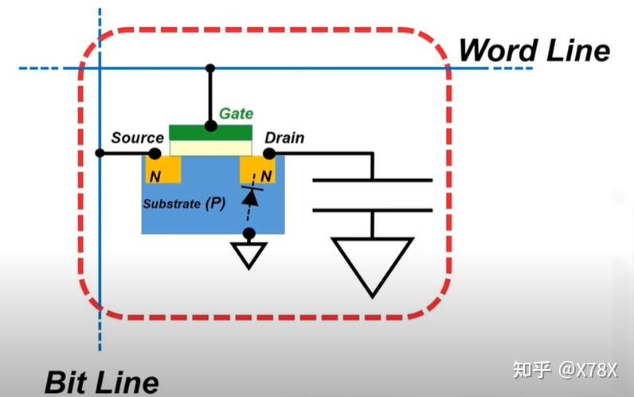

- a. 当 WordLine 激活时, Gate ON, Source 和 Drain 联通，电容与 BitLine 接通；
- b. 当 WordLine 不激活, Gate OFF, Source 和 Drain 阻断，电容与 BitLine 阻断；
- 当电容中充满正电荷的时候，表示为1；否则为0

一个 cell 只能存储一比特信息，即“ 0 ”和“ 1 ”，为了存储大量信息，我们必须构建起 cell 阵列。

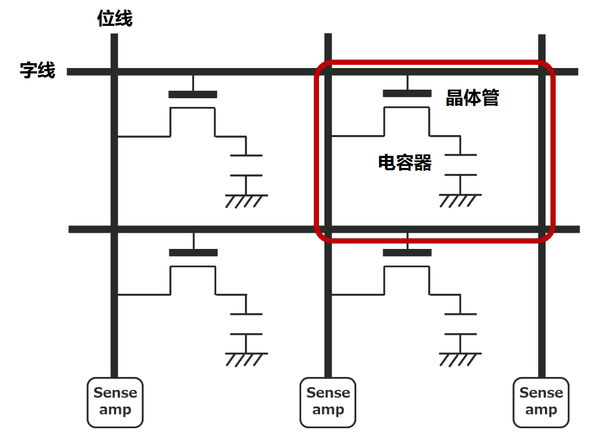

TODO: bank, chip, rank, channel

## 2.2 读写数据原理

可以看到每行 cell 的晶体管的栅极都是连在一起的，即都连在字线上，这意味着给字线施加电压，字线对应的一行 cell 都会被打开。当一行 cell 被打开，cell 电容就会向位线充放电，一行中的每个 cell 都与一条位线直接相连，读取位线的电压变化，即可知道 cell 的存储信息（**注意字线和位线的配合**）。如果电容器有电荷，当晶体管导通时，电荷流入位线，位线的电位暂时升高。如果电容器没有电荷，则当晶体管导通时，电荷从位线流向电容器，导致位线的电位暂时下降。

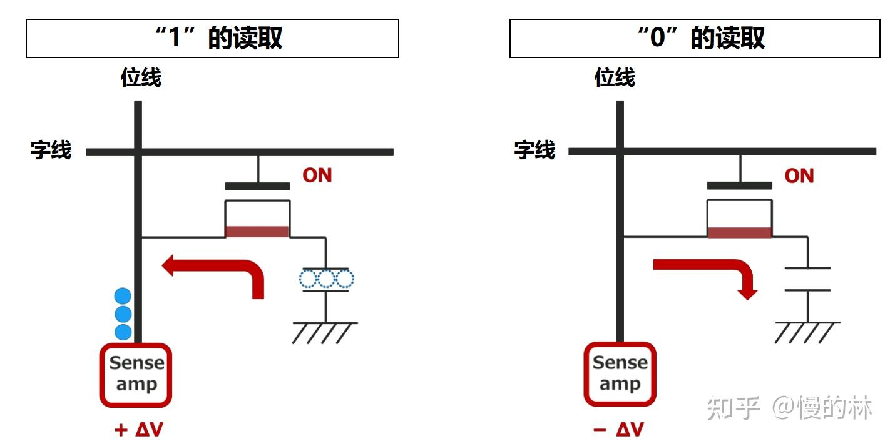

由于位线上的电位变化很小，因此必须通过与位线连接的 **读出放大器（ sense amplifier ）或者叫 差分感知放大电路（Differential Sense Amplifier）** 来放大以确定 1 或 0 。如果位线的电位上升为 +ΔV，则放大到 VDD，如果为 -ΔV，则放大到 GND，分别判断为 1 或 0。

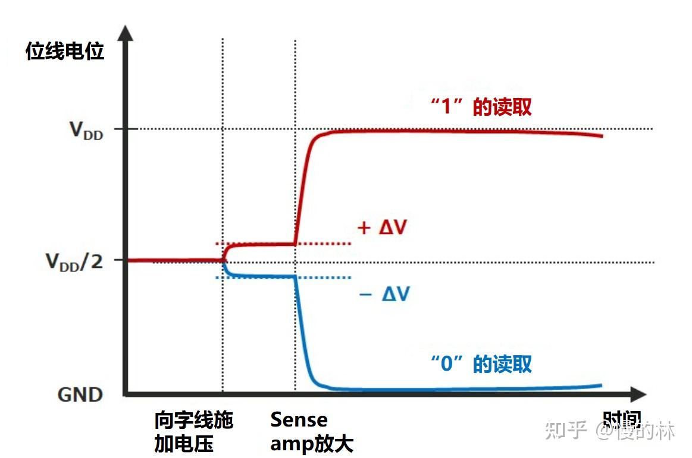

通过对电容器充电或放电来写入数据。写入“1”时，字线上的电压升高，晶体管导通，同时位线上的电压升高，位线对电容器充电；写入“0”时，字线上的电压升高，晶体管导通，通过位线对电容器进行放电。

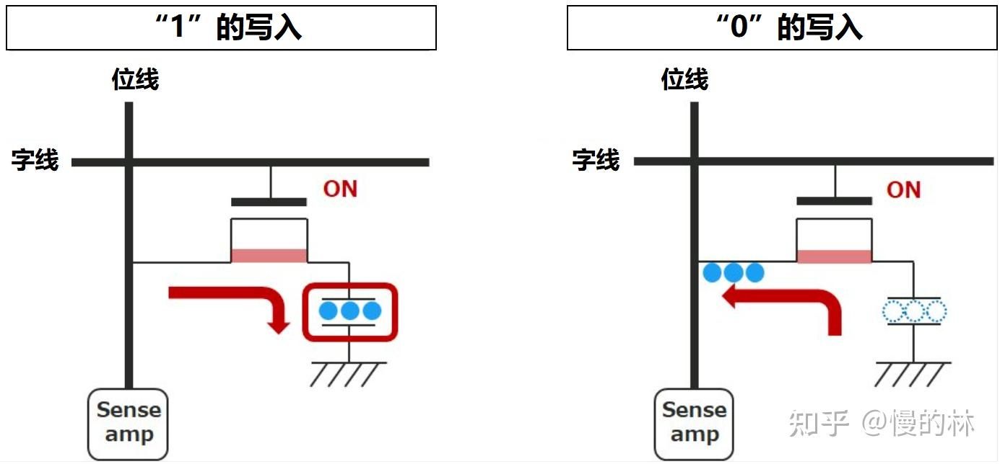

在读取 cell 行（之后也称作单元行）前，需要把每根位线都 **precharge（预充电）** 到电容电压/供电电压最大值的一半，如果供电电压是 3 V，那么就预充电到 1.5 V。预充电完毕后打开字线，单元行中每个 cell 电容或是向位线放电，或是由位线充电。放电则位线电压上升一点，充电则位线电压下降一点。放大器可以捕捉位线上的电压波动，继而在本地还原、暂存对应 cell 电压。

在 DRAM 芯片中，读出放大器把 cell 阵列分成了两半。如图：
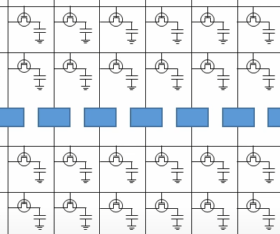

为什么要把 cell 阵列分成两半？因为一个放大器需要同时接入两根位线。为什么一个放大器要接两根位线？因为放大器在捕捉、放大其中一条位线的电压波动时需要另一条位线的帮助。DRAM 芯片用到的放大器是“差分感测放大器”，它在放大信号波动时需要用一个基准和待测线作“比较”，此时接到放大器上的两条位线的其中一条就是所谓的基准，这条基准线经过预充电之后，其电压恒等于供电电压的一半。

还有一个问题：在读取单元行时，读取行的 cell 电容经过充/放电之后，原本的信息就丢失了，即原来有的电荷现在放掉了，而原来没有电荷的现在却有了电荷。这种会造成信息丢失的读取行为称为 破坏性读出。

破坏性读出是不行的，因此在读取单元行之后我们还要恢复单元行的信息。如何恢复？在读取时，放大器还原并暂存了单元行每个 cell 的电容电压，因此可以在输出完毕之后再把这些暂存电压写回原单元行。

具体做法是在读出数据之后，根据放大器锁存的值，把各条位线拉到供电电压或接到地，然后 cell 电容就会根据位线电压进行充电或放电，当 cell 电容充放电结束，就可以断开字线，断开字线也就宣告本次 DRAM 读取结束。

## 2.3 刷新

cell 电容的电容值很小，存储电荷不多，无论是充电还是放电都很快，而先进 CMOS 工艺有“电流泄漏”问题，因此即使不打开字线，cell 电容也会缓慢损失电荷，久而久之信息就丢失了（为了更好解释问题，我们假设电容充满电的时候的电压为 1V ，而随着时间的流逝，电容中的电荷也随着缓慢泄露，电压随之降低。等降低到 0.5V 以下的时候，我们就无法有效检测了，“1”也就变成了“0”）。解决这个问题的办法是 刷新 电容，即根据电容的旧值重新向 cell 写入数据。**因为要经常动态地刷新电容，所以 DRAM 叫做动态随机存储器**。

> 电流泄漏 是指即使晶体管没有打开，晶体管仍然可以通过极小的电流。

刷新电容如何实现的？在谈论“破坏性读出”时说过放大器可以还原并暂存 cell 信息，并把暂存的信息写回到 cell 电容，因此刷新电容也可以借助放大器。具体做法是对于每个单元行，每过一段时间就自主地进行读取，等放大器暂存好信息后就立刻写回。关于单元行的刷新时机也很有讲究，一般每 64ms 内就要对 cell 阵列进行一次全面刷新（JEDEC（Joint Electron Tube Engineering Council）指定了一个标准，DRAM 的刷新时间间隔要小于等于 64ms）。

在对 32G 的 DRAM 进行测试时，我们发现当刷新时间间隔为 256ms 时，仅有 1000 个 cell 会出错；而 128ms 时，会出错的 cell 数量进一步下降到了 30 个；刷新间隔为 64ms 时，出错 cell 的数量才小于 1 。更为激进地，如果我们把刷新间隔调整到 1000 ms, 出错的 cell 比例也小于十万分之一。也就是说，大部分 cell 一秒钟不刷新都是没问题的， 64ms 刷新仅仅是为了保证仅少数的 cell 不会出错。

刷新也有很多缺点：
1. 会使得能量损耗变多，增加散热负担；
2. 由于刷新期间，bank 处于不可连接状态，所以相对应地降低了计算机的性能；
3. 限制了DRAM进一步地增加容量。因为容量越大，刷新时间就要越久，损耗的能量也要越多。

# 0x03. DRAM 芯片的读写

为实现单个比特的读写，必须为 cell 阵列配备一系列周围逻辑电路。下图是一个简单的示范。其中 cell 阵列左边的绿色标记模块是“字线译码模块”，下面的蓝色模块是“读出放大器”，读出放大器下面的模块是“多到一选择器”和“一到多分配器”的集合，最左边的蓝色模块依次是“行地址缓存”、“列地址缓存”。

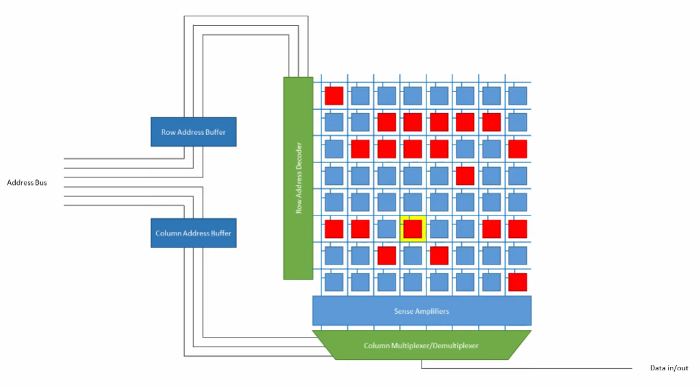

## 3.1 详解

为找到二维阵列中的某一个单元，必须给出该单元的行号/行地址和列号/列地址，行地址缓存保存从地址总线上获取的行号，列地址缓存保存从地址总线上获取的列号。

其中，行地址会送往“字线译码模块”。字线译码模块是一个译码器，可以把短行号译码成长的独热码，独热码会开启一条字线，并打开该字线对应的单元行。

> 独热码是一串只有 1 位是 1 ，其余全是 0 的二进制码字

单元行开启后，放大器捕捉位线上的电压波动，从而还原、暂存数据到放大器本地。

之后放大器把暂存的数据送到选择器，同时列地址也会被送到选择器，选择器根据列地址把数据中的某一位送到输出线。

输出数据之后，还要把单元行数据写回。

在上图的示范中，行地址和列地址是分别用两组总线送到 DRAM 芯片上的，这意味着 DRAM 芯片要为行地址和列地址准备两组输入口/ pin 口。而 cell 阵列越大，地址的位数就越多，当 cell 阵列很大时，准备两组输入口的代价十分昂贵，因此现代 DRAM 芯片让行地址和列地址共用一组总线，其效果图如下图。

下图行、列地址线各有三条，但它们对外只需要三个 pin 口，外界到 DRAM 芯片的三根地址线直接接到“时序控制模块”上，这个模块会选择性地把地址送到行地址缓存或是列地址缓存。在实际操作时，可以先给 DRAM 芯片输入行地址，然后再输入列地址。
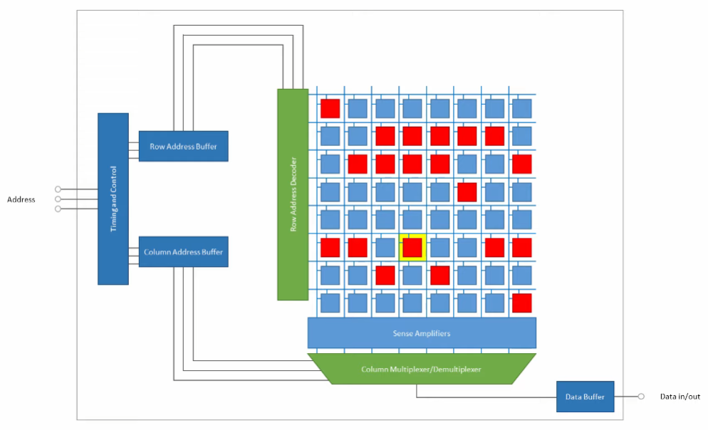

想要把地址选择性地送到地址缓存中，还需要一些控制线，即 **RAS（row address select）** 和 **CAS（colum address select）**，这两个控制信号指出当前地址线上的地址是行地址还是列地址。另外，为了向 DRAM 芯片写入数据，还需要 **写使能** 信号（ WE，write enable ）。把控制线和写使能加入芯片，效果图如图。

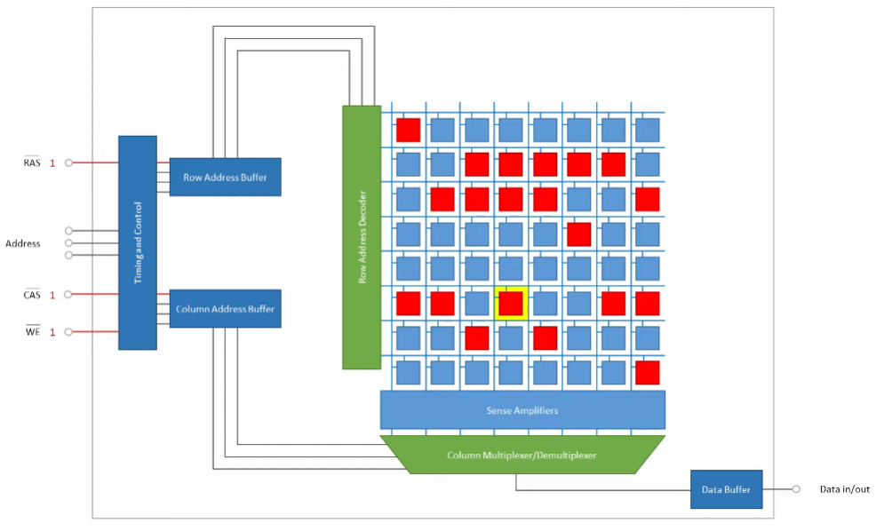

既然说到了写使能，那我们是如何往 DRAM 芯片写入数据的呢？写入数据时，首先输入行号，打开目标单元行，把单元行数据缓存到放大器本地；然后输入列地址和写入数据，一到多分配器根据列地址把写入数据写入到放大器中，然后放大器把本地缓存写到单元行；写完后关闭单元行字线。

## 3.2 完整的读过程

在读取 DRAM 芯片单个比特数据时：

1. 读取前，首先给各条位线预充电（也称为 precharge ），即把位线电压拉高到供电电压的一半，拉高到一半的目的是和 cell 电容电压形成电压差，从而在打开单元行时产生电压波动，注意，预充电完成后，就可以断开位线与预充电电源的连接，此时位线处于悬空态，电压仍然保持为供电电压的一半；

2. 开始读取，首先在地址总线上输入行地址，稍后立刻置“行地址选通”（即RAS）有效，置 RAS 有效后， DRAM 芯片就把行地址缓存下来；

3. 缓存好行地址之后，就把行地址送入译码模块，译码模块把行地址译码成独热码，独热码的每一位都接到对应的字线，理所当然的，独热码会把其中一条字线的电压值拉高；

4. 拉高的字线所对应的单元行被打开，即单元行的晶体管导通，单元行的各个 cell 电容和位线连通。如果 cell 保存比特信息 1，即 cell 电容的电压等于供电电压，此时 cell 电容电压高于位线电压，电容放电，位线的电压稍稍上升；如果 cell 保存比特信息 0，即 cell 电容的电压等于地电压，即 0 电压，此时位线电压高于 cell 电容电压，位线向 cell 电容充电，位线电压稍稍下降；

5. 放大器捕捉位线上的微弱电压波动，通过“差分感测”在本地生成并暂存 cell 电容电压。举个例子，如果 cell 电容等于供电电压，那么位线电压稍稍上升，放大器比较此位线和另一条基准线的电压，通过模拟电路的反馈来放大两者的电压差，最终在本地生成一个等于供电电压的输出电压，并用锁存器把输出电压锁存下来。同理，如果 cell 电容电压等于 0，放大器最终生成等于0的输出电压，并用锁存器把 0 电压锁存下来；

6. 放大器锁存好行数据之后，把行数据送往多到一选择器；

7. 多到一选择器根据列地址，把单元行中的某一位送到输出线；

8. 输出之后，还需要把放大器的数据写回到单元行，即根据放大器的锁存值把位线拉高到供电电压或是 0 电压，位线向 cell 电容充放电，充放电结束之后，就可以关闭字线；

9. 写回数据并关闭字线之后，连接位线和预充电电源，给位线预充电到供电电压的一半，为下一次读写做好准备。

请注意，上面的过程没有提到列地址哪里来的，实际上，在行地址被缓存下来之后，外界会把地址线上的地址从行地址转换成列地址，转换成列地址之后外界会置“列地址选通”有效，然后 DRAM 会把列地址缓存起来，等到第 6 步放大器送数据过来时，列地址缓存就把列地址送到多到一选择器，参与输出比特的选择。更清楚地说，列地址的缓存发生在第 2 步之后、第 7 步之前。

RAS 和 CAS 头上有一条横线，这代表它们是低电平有效信号。

## 3.3 完整的写过程

写过程和读过程有很多相似之处：

1. 位线预充电到供电电压的一半；

2. 输入、缓存行地址，译码行地址，开通单元行，开通单元行后位线产生电压波动，放大器捕捉电压波动并还原、暂存行数据到本地；

3. 输入. 缓存列地址，与此同时置写使能有效，并在 Data Buffer 存进写入比特，注意，Data Buffer 在读取 DRAM 时用来暂存输出比特，而在写 DRAM 时则用来暂存写入比特；

4. 把写入比特送到一到多分配器，分配器根据列地址把写入比特送到对应的放大器中，放大器根据写入比特改写本地暂存值；

5. 放大器根据暂存的电压值刷新单元行，刷新完毕后断开单元行的字线；

6. 刷新完毕后，重新给位线预充电，为下一次读写做好准备。

## 3.4 耗时分析

总的来说，读取一个比特的总体流程是：获得行号，译码行号，开启单元行，放大位线电压波动并暂存数据到放大器，获得列号并根据列号选择一位进行输出，写回数据，关闭字线，重新预充电。

写一个比特的总体流程是：获得行号，译码行号，开启单元行，放大位线电压波动并暂存数据到放大器，获得列号并输入写入数据，根据列号把写入数据送到放大器并改写暂存值，写回数据，关闭字线，重新预充电。

在以上两个流程中，时间花费的大头是“开启单元行”、“放大电压波动并暂存数据”。

“开启单元行”之所以花费时间，是因为行地址译码器需要拉高一条字线，然后用这一条字线拉高单元行上所有晶体管的栅极电压，而拉高这么多的栅极电压很耗时间。为什么？现在我们可以把这些栅极抽象成一个一个电容，如果大家学过电路分析，就知道拉高电容的电压是需要时间的，电容越大，所需时间越长，而单元行上的栅极可以整体抽象成一个很大的电容， DRAM 读写就是用一根字线给这个很大的电容充电，因此时间消耗很大。如果cell阵列设计的不合理，即单元行上的 cell 数量太多，那么“开启单元行”会变得很昂贵。

放大器放大电压波动并暂存数据也很消耗时间，因为放大器大部分是模拟电路，工作速度不快。

通过上面的分析，我们可以推导出一个结论：在读写 DRAM 时，最好不要频繁地开启新单元行和使用放大器。可是怎样才能避免这么做呢？上面的读写过程不是包含有这两步操作吗？

解密的关键在于放大器的缓存区。我们前面总在说数据会被缓存到放大器本地，用术语来说，这个本地缓存叫做 **row buffer** ，即“行缓存”。前面说的读写过程都是针对一个比特的，读写一个比特需要把一行数据全部读下来，并在操作完毕之后写回单元行，这么做就相当于每次读写操作都要经历“开启单元行、放大、读数写数、写回”的全流程，这太浪费时间，为节省时间我们应当尽可能多地利用这一行数据，具体方法就是不要每读写完一个比特就把 row buffer 里的数据写回，而是先保持 row buffer 数据，等待后续指令，如果后续指令还要读写这一行的数据，那么就可以直接操作 row buffer ，而不需要开启单元行并抓取数据。

在允许 row buffer 长时间保持行数据的情况下，如果读写请求发生在 row buffer 保存的单元行中（这种情况称为“行命中”），那么 DRAM 的读写速度会很快，因为 DRAM 可以直接操作 row buffer ，而不需要读取新的单元行；而如果读写请求发生在 row buffer 之外的单元行中（这种情况称为“行缺失”），那么 DRAM 就要把 row buffer 写回并读取新的单元行，这样做速度会很慢。

在猝发（burst）模式里，每当我们读取 cell 阵列中的一个比特，我们不仅把这个比特送到输出缓存中，而且紧接着把这个比特所在缓存行的各个比特都送到输出缓存，这样就完成了一次 猝发 ，即把目标比特周围的多个比特连续地读出（因为在现实中，CPU 在访问内存单个字的时候，不仅需要访问这个字，还需要把这个字所在的缓存行全部搬进 cache 中，因此内存不仅要一次提供一个字，还要提供一个缓存行（ cache line ））。输出 bit 的长度叫 **burst length**。这个长度并不是确定的，不同的内存采取了不同的策略: DDR2=4, DDR3=8, DDR4=16, DDR5>=16.

更进一步。

光速是 3×10^8m/s，而高性能 CPU 的频率可达 3GHz ，即 3×10^9Hz ，那么在 CPU 的一个时钟周期内，光可以运动 10cm 。“But electricity travels about fifth as far as light in sillicon”，即“但是**电在硅中的传播距离大约是光的五分之一**”，内容参考自 [Stephen Jones GTC 2021](https://www.bilibili.com/video/BV17L4y1a7Xy?t=447.6)，这里的 electricity 我认为其实是指电压最高点，Stephen 总结道：“**而在电子线路中 electricity 的运动则更加受限，经过测量，在电子线路中 electricity 在一个CPU时钟周期内只能运动 20mm 左右。**”换句话说，每个时钟周期线路上的电压只能向前推进 20mm ，而 CPU 和内存芯片之间的距离远不止 20mm ，因此数据在总线上移动需要花费多个 CPU 时钟周期。

总的来说，CPU 访存大概要经过 5 个步骤：
1. CPU 发送指令给内存控制器；
2. 内存控制器解析指令，并把“解析到的控制信息”发送到控制总线；
3. bank 接收控制信息，并读取数据；
4. 内存芯片把读取出的数据放到数据总线；
5. 内存控制器收取数据，并将其交给 CPU。

所以，1、2、4、5 步的时间消耗其实也很多（1、5的时间开销要比2、4大），数据在总线上移动需要花费多个 CPU 时钟周期。因此让 CPU 、内存控制器、总线和 bank 串行操作是不明智的，我们要实现 bank 间并行，即让一个 chip 内的不同 bank 并行工作，让它们各干各的。为此 CPU 要连续、依次向不同的 bank 发送读取指令，这样在同一时间很多 bank 都在工作，第一个 bank 可能在输出，第二个 bank 可能在放大电压，第三个 bank 可能在开启单元行。当第一个 bank 猝发输出完毕，第二个 bank 刚好可以输出；当第二个 bank 猝发输出完毕，第三个 bank 刚好可以输出.......通过这样让“ bank 读取”和“ CPU 、内存控制器、总线工作”在时间上相互重叠的方式，我们可以成功地把 CPU 、内存控制器和总线的工作时间隐藏起来，从而打造出一种 CPU 无延迟访问内存、多个 bank 连续、依次“泵”出数据的理想情况。这种通过“ bank 间并行”实现“连续泵出数据”的方法，就是所谓的 **内存交错（memory interleave）**。

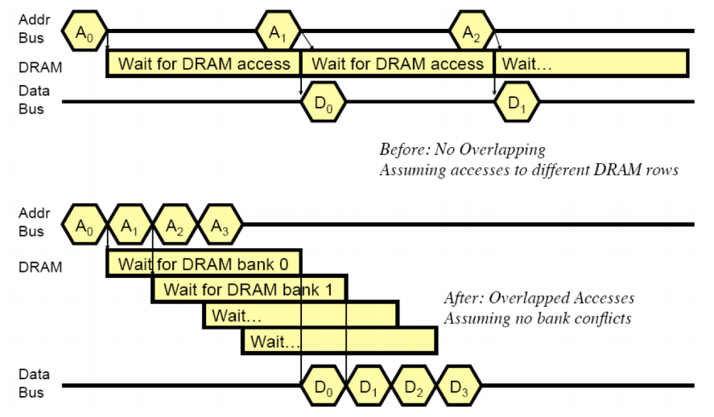

在对 cell 进行读取之前，首先要满足位线预充电完毕，且电容的电荷重新充满电，而读写的时候均会改变位线和电容的状态。这也就意味着，每次 DRAM 的数据读取完毕后，都需要对位线进行重新预充电和对电容的重新充电，这段恢复时间内对应的 bank 是无法再次被访问的。但是，如果所有访问的数据都精确落到了同个 bank 中，那么只好在每次访问的时候都要等待 bank 的 restore，这种现象叫做 DRAM 的 **bank conflict**。这种现象会极大地增加我们访问DRAM的速度，应当尽量避免。不友好的 DRAM 访问方式可能会造成最高近 20 倍的性能降低。

# 0x04. DRAM 系统层次

一个 cell 阵列一次可以提供一个比特，那么多个 cell 阵列就可以一次提供多个比特。假如 CPU 一次读写 8 个比特，那么我们就可以用 8 个 cell 阵列。查找 cell 阵列中的一个单元需要有其行号和列号，那 CPU 是否需要给 8 个 cell 阵列提供 8 组地址呢？不需要，8 个 cell 阵列可以共享一组行地址和列地址。共享行、列地址的一组 cell 阵列被称作一个 **bank**. 例如一个含有 8 个 cell 阵列的 bank, 它们共用行地址、列地址和地址选通、写使能，每个阵列提供一条输出线，8 个阵列最终组成 8 根输出线，可以输出 8 个比特。

一个 8 阵列 bank 一次读写 8 个比特，一颗存储芯片（ **chip** ）上一般含有多个 bank。芯片每次读写都只针对一个 bank ，因此读写地址必须包含一个 bank 号，bank 号用于开启目标 bank，目标 bank 之外的 bank 是不工作的。

电路板上的芯片，这就是所谓的内存条，也称为 DIMM 条（全称 Dual-Inline-Memory-Modules ，中文名叫双列直插式存储模块）。内存条通过 **内存通道（channel）** 连接到内存控制器，一组可以被一个内存通道同时访问的芯片称作一个 **rank** 。一个 rank 中的每个芯片都共用内存通道提供的地址线、控制线和数据线，同时每个芯片都提供一组输出线，这些输出线组合起来就是内存条的输出线。

下图是一个包含 8 颗芯片的 DIMM 条。这 8 颗芯片被一个内存通道同时访问，所以它们合称为一个 rank 。有的 DIMM 条有两面，即两面都有内存芯片，这种 DIMM 条拥有两个 rank 。
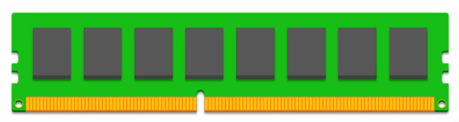

假设上图中的每个芯片都包含 8 个 bank，每个 bank 都包含 8 个阵列，那么这条内存条就可以一次读写 8×8=64 比特，**其中第一个 8 是指每个芯片输出 8 位，第二个 8 是指这个 rank 总共有 8 颗芯片**，因为这 8 颗芯片被同一个内存通道访问，所以其被访问的 bank 和 bank 内的行地址、列地址都是完全一致的。下图是一个描述这个过程的简图：显然，我们在读写 8 颗芯片同一个 bank 同一个位置的 cell ，注意，图中没有显示不在工作状态的 bank。

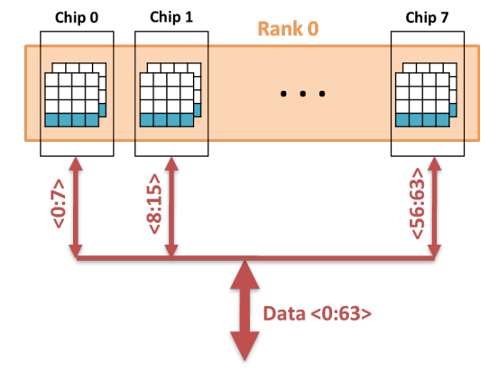

电脑有时候可以插入多个内存条，多个内存条有助于提升电脑的内存容量，但是未必能提高电脑的速度。电脑的速度受 **内存通道** 数限制，如果电脑有四个插槽，却只有一个内存通道，那么 CPU 仍然只能一次访问一个 rank ；但如果电脑有四个插槽的同时还有四个内存通道，那么 CPU 就可以一次访问四个 rank ，很显然，四并行访问明显比串行访问快，假设每个 rank 可以输出 64 比特，那么四通道就可以一次访问 4×64=256 比特，而单通道只能访问 64 比特。

平常听到的所谓 x 通道内存就是指电脑有 x 个内存通道，很显然，这个 x 越大越好，不过仅有通道也不够，还得为通道提供 rank ，即为电脑插上足够多的内存条。

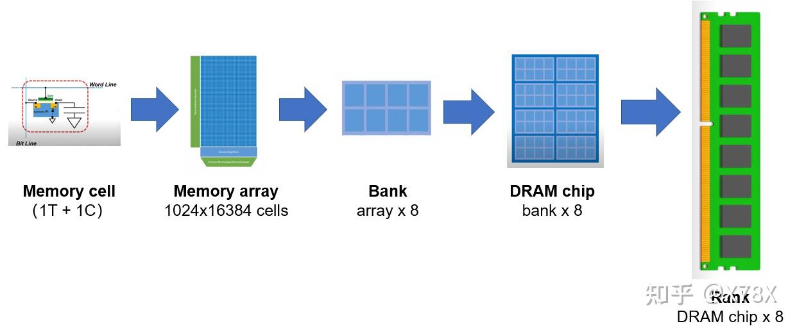
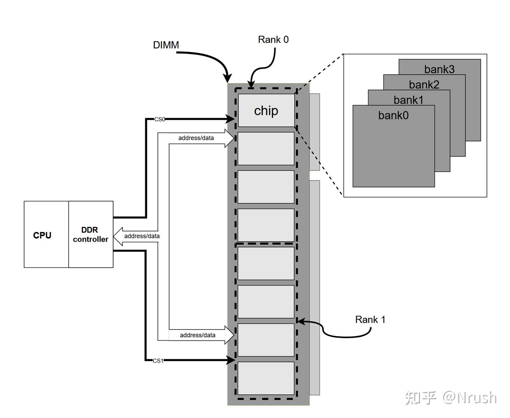

从 Memory controller 出来先到 Channel，每个 Channel 都要有一组控制寄存器用于配置和操作 memory 芯片。每个 channel 上能够拥有多组 DIMM（Dual In-line Memory Module）,DIMM 就是我们通常所说的内存条。

TODO: Linux 上如何查看这些信息？

## 4.1 数据传输

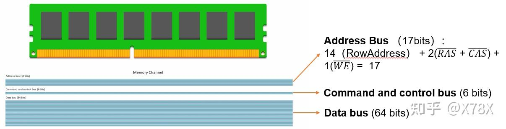

在早期的 PC 中，data bus 为 32 条线，即可以同时传输 32bits 的数据，被称为 Single Inline Memory Module, SIMM。现在的 PC 中的 data bus 普遍变成了 64 条线，同时可传 64bits 的数据，被称为 Dual Inline Memory Module, DIMM.

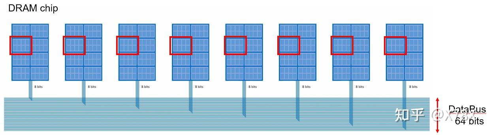

在 64bits 的 data bus 中，我们需要对 8 个 DRAM chip 的一个 bank 进行同时访问，输出 8x8bits，填满整个 Data Bus。

# 0x05. 频率

DRAM 是一种与时钟同步运行的同步存储器。时钟同步方法有 SDR（单倍数据速率）和 DDR（双倍数据速率）。SDR 每个时钟周期可以传输一个数据，DDR 每个时钟周期可以传输两个数据。具体来说，SDR 仅与时钟的上升沿同步，但对于 DDR，数据传输与时钟(DQS)的上升沿和下降沿同步，从而可以实现以时钟频率的两倍的速度来传输数据。

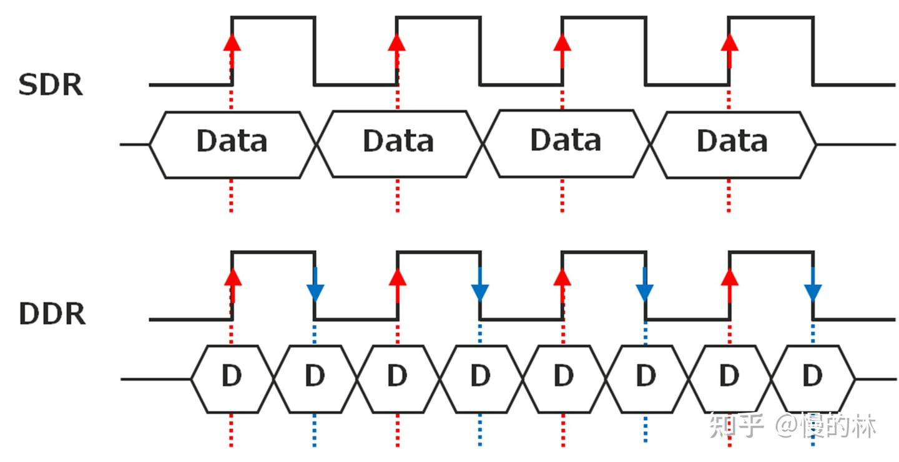