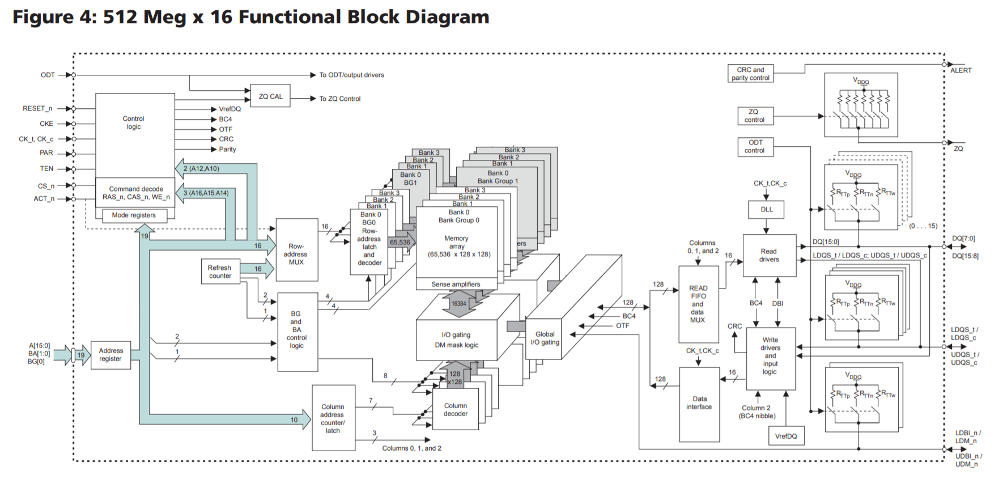

# 0x00. 导读

# 0x01. 简介

# 0x02. 频率

Intel 内存控制器集成于主板北桥，内存与主板北桥之间（内存控制器）之间为**内存通道**，主板北桥与处理器之间是**前端总线**，**内存中的数据经由内存通道到达主板北桥（内存控制器），再经由前端总线达到处理器进行处理**，这就要求内存通道的内存总线与前端总线频率处在一个合理的范围内，否则造成瓶颈。目前 PC 机上 CPU 前端总线频率有 533MHz、800MHz、1066MHz、1333MHz、1600MHz 等几种，前端总线频率越高，代表着 CPU 与内存之间的数据传输量越大。


内存本身并不具备晶体振荡器，因此内存工作时的时钟信号是由主板芯片组的北桥或直接由主板的时钟发生器提供的，也就是说内存无法决定自身的工作频率，其实际工作频率是由主板来决定的。内存的性能资源是通过主板提供给 CPU ，主板提供一个传输的通道，所以无论内存频率多高，都尽量不要超过主板支持的工作频率上限，当然如果支持超频，要将超频后的工作频率也考虑进去。举个例子，假设主板支持的内存频率是2133MHz，那如果选用2400的内存，内存就会降频到2133，并不会以2400工作。但如果主板可以支持超频到2400甚至2666，那么就没有问题，不会造成性能浪费，而2133的内存和2400、2666肯定在价格上是有区别的。内存频率 这些数字是怎么来的呢？我们来一起抽丝剥茧，追溯到源头的话，其实是因为位于主板上的一颗小小的晶振。

一般主板上都会有两个以上的晶振，而在这几个晶振中最重要的就是 [XTAL（石英晶体谐振器）](https://zh.wikipedia.org/wiki/%E7%9F%B3%E8%8B%B1%E6%99%B6%E4%BD%93%E8%B0%90%E6%8C%AF%E5%99%A8)，它能够提供基准的 24MHz 频率，它接入南桥 PCH 的嵌入式时钟控制器 ICC 经过其中的 PLL 和差分器，输出 100MHz 的时钟信号 `CLKOUT_CPUBCLK_PIN` ，这也就是 BCLK 基频了。[更详细生动的解释](./频率.md)

Base Clock 基频的工作机制也比较简单，举个例子，它就像溪水，从南桥流出然后汇入CPU，然后开始逐渐分出支流，浇灌到内核、核显、内存等组件。也就是说它是基准频率，其他各组件的 Multiplier(倍频) 都是在此基础上变化而来。

## 2.1 前端总线

[Front-side_bus](https://en.wikipedia.org/wiki/Front-side_bus)

前端总线( FSB ) 是一种计算机通信接口 (总线)，在 20 世纪 90 年代和 2000 年代经常用于基于 Intel 芯片的计算机。 EV6 总线为 AMD CPU 提供相同的功能。两者通常在 CPU 和内存控制器集线器（称为北桥）之间传输数据。这种前端总线架构被 HyperTransport 、 Intel QuickPath Interconnect 和 Direct Media Interface 所取代了，再后来就是 Intel Ultra Path Interconnect 和 AMD 的 Infinity Fabric 了。

更多的时候我们称 Infinity Fabric 叫做 CCX 总线。其实 Infinity Fabric 并不是什么深奥的东西，它由 HT 总线衍生而来，但是相比 HT 总线技术对外开放，Infinity Fabric 总线则是 AMD 的专利技术，你想用，先交授权费。Infinity Fabric 可以说是 AMD 这个时代的基石，它的传速速率从 30GB/s 到 512GB/s，并且不和 HT 总线兼容。Infinity Fabric 分为 SCF 和 SDF。SDF 负责数据传输，而 SCF 则负责控制传输命令。SDF 部分就是 HT 总线衍生的产物了。而 Infinity Fabric 和 HT 总线一样，也不仅仅限制于 CPU 上进行使用，包括 CPU，GPU，APU 这些都可以使用，只不过它们的 SDF 层是不一样的。

前端总线有时也称为 系统总线。

从前的时候，前端总线通常通过芯片组（chipset）来连接 CPU 和其余硬件，这个所谓的 chipset 英特尔将其实现为北桥和南桥。外围组件互连(PCI)、加速图形端口(AGP) 和内存总线等其他总线都连接到芯片组，以便数据在连接的设备之间流动。这些辅助系统总线通常以源自前端总线时钟的速度运行，但不一定与其同步。


### 2.1.1 相关组件速度

- CPU

    在某些情况下，CPU 运行的频率是通过对前端总线 (FSB) 速度应用时钟倍频来确定的。例如，以 3200 MHz 运行的 CPU 可能使用 400 MHz FSB。这意味着内部时钟倍频设置为 8。不同的 CPU 速度是通过改变 FSB 频率或 CPU 倍频来实现的。

- Memory

    内存总线连接北桥和RAM，就像前端总线连接CPU和北桥一样。通常，这两条总线必须以相同的频率运行。在大多数情况下，将前端总线增加到 450 MHz 也意味着以 450 MHz 运行内存。在较新的系统中，可以看到 4:5 等内存比率。在这种情况下，内存的运行速度将是 FSB 的 5/4 倍，这意味着 400 MHz 总线可以与 500 MHz 的内存一起运行。这通常被称为 异步 系统。由于 CPU 和系统架构的差异，随着 FSB 与内存比率的不同，整体系统性能可能会出现意想不到的变化。


前端总线在设计之初就具有灵活性高、成本低的优点。简单的对称多处理器将多个 CPU 放置在共享 FSB 上，但由于带宽瓶颈，性能无法线性扩展。如果 CPU 无法非常快的获取指令和数据，那么更快的 CPU 的潜力就会被浪费。 CPU 在等待读取或写入主内存中的数据时可能会花费大量空闲时间，因此高性能处理器需要对内存的高带宽和低延迟访问。更现代的设计使用点对点和串行连接，例如 AMD 的 HyperTransport 和 Intel 的 DMI 2.0 或 QuickPath Interconnect (QPI)。这些实现消除了传统的北桥，使得 CPU 直接连接到系统内存、高速外设、平台控制器集线器、南桥或 I/O 控制器。

在传统架构中，前端总线充当 CPU 与系统中所有其他设备（包括主内存）之间的直接数据链路。在基于 HyperTransport 和 QPI 的系统中，系统内存通过集成到 CPU 中的内存控制器独立访问，从而将 HyperTransport 或 QPI 链路上的带宽留作其他用途。这增加了 CPU 设计的复杂性，但在多处理器系统中提供了更大的吞吐量和卓越的扩展性。


前端总线的最大理论带宽由其数据路径的宽度、时钟频率（每秒周期）和每个时钟周期执行的数据传输数量的乘积决定。例如，以 100 MHz 频率运行、每个周期执行 4 次传输的 64位（8字节）宽 FSB 的带宽为每秒 3200 兆字节 (MB/s)：
```
8 bytes/transfer × 100 MHz × 4 transfers/cycle = 3200 MB/s
```

每个时钟周期的传输数量取决于所使用的技术。例如，GTL+ 执行 1 transfer/cycle， EV6 执行 2 transfer/cycle， AGTL+执行 4 transfer/cycle。英特尔将 每周期四次传输 的技术称为 Quad Pumping 。

许多制造商以 MHz 为单位发布前端总线的频率，但经销商通常列出理论有效信号传输速率（通常称为  megatransfers per second 或 MT/s）。例如，如果主板（或处理器）的总线设置为 200 MHz，并且每个时钟周期执行 4 次传输，则 FSB 的额定值为 800 MT/s。

# 0x03. 内存时序

除了内存频率，内存时序是另外一个关键参数，其表现形式往往是 `A-B-C-D` ，他们分别对应的参数是 `CL-tRCD-tRP-tRAS` ，注意单位是时钟周期个数（要想转换成以 秒 计量，需要乘以内存频率的倒数），通过调整这 4 项时序参数，可以提升内存性能，相关设定需要在主板 BIOS 中进行设定。

- CL：内存 CAS 延迟时间
- tRCD：内存行地址传输到列地址的延迟时间
- tRP：内存行地址选通脉冲预充电时间
- tRAS：内存行地址选通延迟

**实际上随着 DDR 的一步步进化，这些延迟的时钟周期个数也在步步提高，但由于频率的加快，实际上时间是在慢慢的减少的。**

例如某 DDR4 内存频率 3600MHz, CL16. 它的每 时钟周期 时长是 2.7ns, 延迟 16 周期，延迟时长 43.2ns。某 DDR5 内存 CL32, 若要保持延迟时长与 DDR4 相等，则 DDR5 的每 时钟周期 时长只能有 1.35ns，算下来该 DDR5 的频率需要去到 7200MHz。


XMP 和 AMP: Intel 的 XMP 全称是 `Intel Extreme Memory Profile`, AMD 对应叫做 `AMP–AMD Memory Profiles`, 这个主要就是方便用户超频，让内存超频变得简单，不再需要像以前那样自己一个个参数去调节，用户直接在 BIOS 里面开启 XMP ，选择对应的频率就行了，有这个功能的内存更好。

## 3.1 CL：列寻址所需的**时钟周期**（表示延迟的长短）

指 CAS 发出之后，仍要经过一定的时间才能有数据输出。由于 CL 只在读取时出现，所以 CL 又被称为读取时延（RL，Read Latency）。CL 是延迟里面最重要的参数，有时会单独在内存标签上标出如 CLx。它告诉我们多少个时钟周期后我们才能拿到数据，CL7 的内存会延迟 7 个周期才能给我们数据，CL9 的则要等 9 个。


**同一代产品在同频率下**，CL 值越小内存条性能越好。我们可以发现从 DDR1 到 DDR4，随着内存条的频率的提高，内存标示的 CL 值也越大，但是不同代的产品，不能简单的通过标示的 CL 值来对比其真实的 CL 延迟（因为 CL 值虽然大了，但是频率变高了，也就是 cycle 小了），从 DDR1 到 DDR4 真实的 CL 延迟时间几乎没有什么变化。

我们通过计算 DDR1 到 DDR4 内存的 CL 延迟时间，计算公式 `延迟 = CAS延迟 * 2 / 模块速度`

- DDR-400 3-3-3-8：3*2/400=15 ns
- DDR2-800 6-6-6-18：6*2/800=15 ns
- DDR3-1333 9-9-9-24：9*2/1333=13.5 ns
- DDR4-2133 15-15-15-35：15*2/2133=14 ns
- DDR4-2400 16-16-16-39: 16*2/2400=13.3 ns

根据上面的计算，可以看出历代产品的真实 CL 延迟差距并不大，根据 DDR1 到 DDR4 内存 CL 值与频率的关系，我们可以得出 CL 越大，能上去的频率越高的结论，所以我们在对内存进行超频时，可以通过调高 CL 值，获得更高的频率，或者通过降低 CL 值来提升延迟性能。

## 3.2 tRCD：行寻址和列寻址时钟周期的差值

Row Address to Column Address Delay.

tRCD 值对内存最大频率影响很大，一般来说这个值也是越小性能越好。当对内存进行超频的时候，可以通过加大电压和提高 CL 值，如果不希望对电压和 CL 值进行调整，那就只能把 tRCD 值增大。所以有时候 tRCD 值大不代表内存条差，反而代表内存条可以超频的空间更大。


## 3.3 tRP：在下一周期之前，预充电需要的时钟周期

理论上来说这个值也是越低越好，不过加大 tRP 有利于提高行址激活、关闭的命中率和正确率，可让内存条的兼容性更好，也就是说如果内存不稳定，可以尝试将这个值加大一些。

## 3.4 tRAS：对某行的数据进行存储时，从操作开始到寻址结束需要的总时间周期

理论上 tRAS 值越小越好，不过该值太小可能导致数据错误或丢失，太大会影响内存性能。同样的考虑到稳定性和兼容性，我们可以在内存不稳定的时候通过稍微放宽 tRAS 值来提升稳定性。

## 3.5 其它参数

前提名词解释：
- DQ 和 DQS: Data signals are called DQ and data strobe is DQS. data strobe 数据闪存，一种同步信号，用于在计算机内存中传输数据。
  来源：[Data Strobe in DDR memory](https://electronics.stackexchange.com/questions/408458/data-strobe-in-ddr-memory) and [Rams and DQ lines](https://electronics.stackexchange.com/questions/281813/rams-and-dq-lines)
  
- Device Width：颗粒位宽/芯片位宽，另一种说法是配置模式（Configuration），常见为 4/8/16bit。对一个 X4 位宽的 DDR 颗粒，如果给出行地址和列地址，就会同时输出 4 个 Bit 到 DQ 数据线上。

一些性能参数：
- 传输速率 (MT/s)：为每秒发生的 Transfer 的数量，通常也是 DRAM 的标称速率，最常用，如 DDR3-800 中的 800 指的就是传输速率
- Data Rate：数据传输速率，单位 Mbps。
  
- 核心频率 (MHz)：DRAM 芯片内部控制逻辑和存储阵列的工作时钟的频率。
- CLK frequency：DDR 时钟频率，单位 Mhz。
  
- prefetch：为了弥补内存核心频率低而推出的技术。常见有 2n/4n/8n, 这里的数字指的就是并行取出的位数，这里的 n, 就是 device width（x4/x8/x16）。所以 DDR3 16bit SDRAM 内存颗粒，16bit 指的是位宽，其一次读写访问的数据量是 8*16=128bit, 前面的 8 是 8n 的 8, 后面的 16 是 16bit 位宽。
- burst length: 一次访问连续操作的数据量，数据量 = BL * data bus 位宽（现在通常是 64bit）。
  
- tRC: 同一个 bank 中不同行被激活的最小时间间隔。
- tRP: 预充电有效周期（Precharge command Period）。在上一次传输完成后到下一次行激活前有个预充电过程，要经过一段充电时间才能允许发送 RAS


- Bank：DDR4以前是没有Bank Group的，所以该值就表示整个颗粒中Bank数量。但是在DDR4和DDR5中，就表示每个Bank Group中Bank的数量，整个颗粒Bank数量 = Bank Group * Bank。
- Bank Group：Bank分组数量，该特性只存在于DDR4和DDR5中。

- AL: 在读写操作中，内存控制器可以连续发送多个读写命令，这样即可连续读写数据。连续发送的命令之间必须要有一个时间延迟，这样确保两个命令间的数据不会重叠，这个时间称为 Additive Latency，简称 AL。


# 0x04. 芯片的内部功能框图

下面，我们来考虑 DRAM 芯片对外应该提供怎么样的通信接口，才能实现最基本的内存读写功能。

下图是一个 32 位物理地址映射的一个例子（以 SDR SDRAM为例，DDR 版本的 Bank 地址和行地址会更宽）：


上例中，CPU 使用了 27 位地址总线来连接内存，所以支持 2^27 = 128 * 1024 * 1024 = 128MB 可寻址空间。具体分配如下：

- 采用了两位的芯片选择地址（CS, Chip Select），能解码出 4 根片选信号，连接 4 个 DRAM 芯片（Rank 组）。芯片应该拉出一个片选信号，让 CPU 可以选中它。
- 采用了两位 Bank 地址，能解码出 4 个 Bank 选择信号。所以，芯片内部应该有 4 个 Bank，并拉出两位 Bank 地址。
- 行地址共设 13 位，能解码出 2^13 = 8192 条 Wordline 信号线。
- 列地址共设 10 位，能解码出 2^10 = 1024 条 CSL 列选信号线。
- 第 0 位地址没作映射，这意味着最小可寻址单位是 16 位的字（Word），而非 8 位的字节（Byte）。

如果 CPU 要在一个时钟周期把整个地址传输过来，除了 CS 和 Bank 地址外，一次要传输 23 位地址，这意味着我们要在芯片上引出 23 根地址线。为了缩减芯片对外的引脚数量，我们通常采用分时传输技术，即地址分两次传输，第一次把 13 位的行地址传过来，作行选操作，第二次把 10 位的列地址传过来，作列选操作。这样的话，我们的芯片只需要引出 13 根地址总线即可。不过，我们需要额外增加两根控制线来配合，以区分当前是行选操作（RAS）还是列选操作（CAS），地址总线上传输的是行地址还是列地址。

因为 CPU 访问地址的第 0 位没作映射，最小可寻址单位是 16(13 + 2 + 1) 位的字，那么一次内存操作的字长是 16 位，我们的芯片一次要能操作 16 位（假如我们只接了一颗 DRAM 芯片），芯片要拉出 16 位数据总线出来，所以 CPU 每次读取或写入操作，都是一次性传输两个字节（16位）。

但多字节字长在写入单字节数据时，会有些麻烦，比如 CPU 只想写入一个字节（比如高8位），它把数据加载到 16 位数据总线的高 8 位，如果不告诉 DRAM 芯片只写高 8 位，芯片仍然会把总线的两个字节（此时低8位是脏数据）写入到指定的地址单元，那么原来的低 8 位就会被脏数据冲刷掉。为了解决这个问题，芯片还需要引出高字节屏蔽信号线 DQMH 和低字节屏蔽信号线 DQML，有了这两根信号线的加持，CPU 就可以指定屏蔽掉数据总线上无效的高字节或低字节，只写入其中一个字节了。注意，对于芯片来说，如果芯片只提供 8 位数据总线，则仅需引出一根 DQM 信号即可。

另外，还需要一根写使能控制线，来区分 CPU 的本次内存操作是读还是写。

综上所述，作为一颗正经的 DRAM 芯片，与 DRAM 控制器（CPU）的通信接口至少应包括这三类信号线：控制信号（包含时钟）、地址信号和数据信号，具体的信号如下表所示（带 # 或 _N 表示低电平有效，也有 ）

控制信号和地址信号总线有时简作 CA 总线，在后来的 DDR 版本中，有些控制信号被复用作地址信号。

除了通信之外，DRAM 芯片还需要供电，而且需要两路电源，一路是主电源 Vcc，一路是参考电压（半电压） Vref = Vcc / 2。

## 4.1 x16 图示



其引脚按照功能可以分为7类：前 3 类为电源、地、配置。


后4类为：控制信号、时钟信号、地址信号、数据信号


电源、地、配置信号的功能很简单，在此不赘述。控制信号主要是用来完成 DDR4 与 DDR4 Controller 之间的状态切换。DDR4中最重要的信号就是 **地址信号** 和 **数据信号**。

DDR4 芯片有 20 根地址线（ 17 根 Address、2 根 BA、1 根 BG ），16 根数据线。在搞清楚这些信号线的作用以及地址信号为何还有复用功能之前，我们先抛出一个问题：

假如我们用20根地址线，16根数据线，设计一款DDR，我们能设计出的DDR寻址容量有多大？

我们知道 20 根地址线（连读写控制信号都不考虑了）的寻址空间为 2^20, 16 根数据线可以 1 次传输 16 位数据，我们能很容易计算出 DDR 芯片的最大存储容量为：
```
Size（max）=(2^20)*16=1048576*16=16777216bit=2097152B=2048KB=2MB。
```

但是事实上，该 DDR 最大容量可以做到 1GB，比传统的单线编码寻址容量大了整整 512 倍，它是如何做到的呢？答案很简单，分时复用。

我们把DDR存储空间可以设计成如下样式：
首先将存储空间分成两个大块，分别为 BANK GROUP0 和 BANK GROUP1，再用 1 根地址线（还剩19根），命名为 BG，进行编码。若 BG 拉高选择 BANK GROUP0，拉低选择 BANK GROUP1（当然你也可以划分成4个大块，用2根线进行编码）。再将 1 个 BANK GROUP 区域分成 4 个 BANK 小区域，分别命名为 BANK0、BANK1、BANK2、BANK3。然后我们挑出 2 根地址线（还剩余 17 根）命名为 BA0 和 BA1，为 4 个小 BANK 进行地址编码。


此时，我们将 DDR 内存颗粒划分成了 2 个 BANK GROUP, 每个 BANK GROUP 又分成了 4 个 BANK, 共 8 个 BANK 区域，分配了 3 根地址线，分别命名为 BG0，BA0，BA1. 然后我们还剩余 17 根信号线，每个 BANK 又该怎么设计呢？这时候，就要用到分时复用的设计理念了。

剩下的 17 根线，第一次用来表示行地址，第二次用来表示列地址。

原本传输 1 次地址，就传输 1 次数据，寻址范围最多 16KB（不要读写信号）。

现在修改为传输 2 次地址，再传输 1 次数据，寻址范围最多被扩展为 2GB。虽然数据传输速度降低了一半，但是存储空间被扩展了很多倍。这就是改善空间。

所以，剩下的 17 根地址线，留 1 根用来表示传输地址是行地址还是列地址。

在第 1 次传输时，行地址选择使能，剩下 16 根地址线，可以表示行地址范围，可以轻松算出行地址范围为 2^16 = 65536个 = 64K个。

在第 2 次传输时，行地址选择禁用，剩下 16 根地址线，留 10 根列地址线表示列地址范围，可以轻松表示的列地址范围为 2^10 = 1024个 = 1K个，剩下 6 根用来表示读写状态/刷新状态/行使能、等等复用功能。

这样，我们可以把 1 个 BANK 划分成 65536*1024=67108864个=64M 个地址编号。如下所示：


在每个地址空间中，我们一次存储 16 位数据（前面说了是 16 根数据线）。


所以 1 个 BANK 可以分成 65536 行，每行 1024 列，每个存储单元 16bit。每行可以存储 1024*16bit=2048bit=2KB。每行的存储的容量，称为 **Page Size**。

单个 BANK 共 65536 行，所以每个 BANK 存储容量为 65536*2KB=128MB。单个 BANK GROUP 共 4 个 BANK，每个 BANK GROUP 存储容量为 512MB。单个 DDR4 芯片有 2 个 BANK GROUP ，故单个 DDR4 芯片的存储容量为 1024MB=1GB。

至此，20 根地址线和 16 根数据线全部分配完成。
