# 0x00. 导读

# 0x01. 简介

镁光（Micron）

# 0x02. 

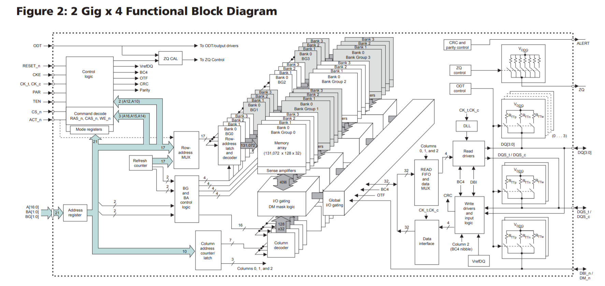

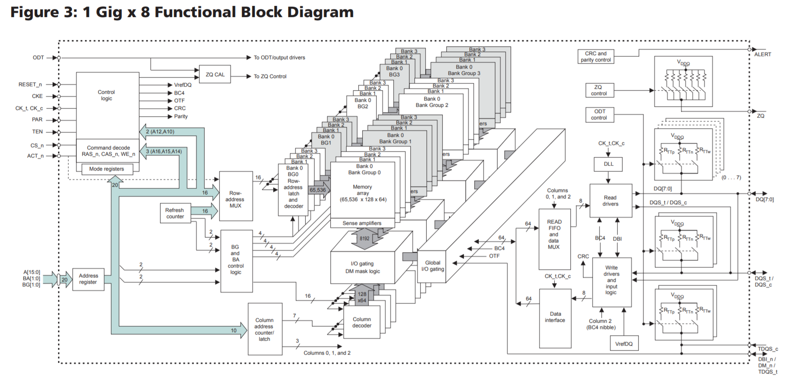

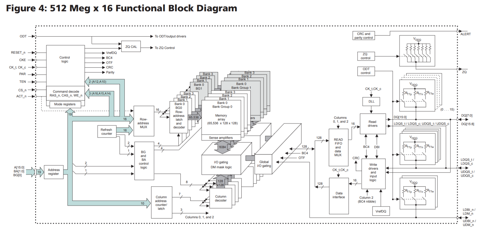

# 0x04. 

在实际制造过程中，我们并不会无限制的在 Bitline 上挂接 Cells。因为 Bitline 挂接越多的 Cells（即挂接越多的 Wordline），Bitline 的长度就会越长，也就意味着 Bitline 的寄生电容值会更大，这会导致 Bitline 的信号边沿翻转速率下降（电平从高变低或者从低变高的速率），最终导致性能的下降。为此，我们需要限制一条 Bitline 上挂接的 Cell （也即 Wordline） 的总数，将更多的 Cells 挂接到其他的 Bitline 上去。

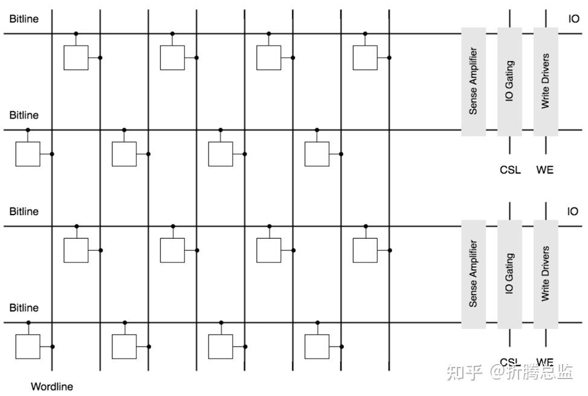

------

DRAM 存储阵列中的 Row 与 Wordline 是一一对应的，一个 Row 本质上就是所有接在同一根 Wordline 上的 Cells，如下图红色标记所示。

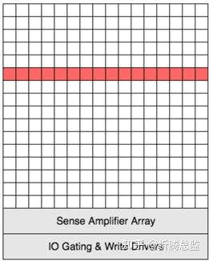

DRAM 在进行数据读写时，选中某一 Row，实质上就是控制该 Row 所对应的 Wordline，打开 Cells，并将 Cells 上的数据缓存到 Bitline 上，通过 Sense Amplifiers 进行感知放大。

Row Size 即为一个 Row 上面的 Cells 的数量，也称为 Page Size。其中一个 Cell 存储 1 Bit 的信息，也就是说，Row Size 即为一个 Row 所存储的总位数。

----------------

列元（Column）是存储阵列中可寻址的最小单元。一个 Row 中有 n 个 Column，其中 Column 的数量 n = Row Size / Data Width，即为 CSL 和 WE 控制信号合并后的数量。下图是 Row Size 为 32，Data Width 为 8 时，Column 的示例（4个 Column）。

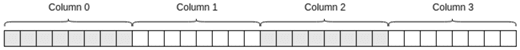

Column Size 即为该 Column （列元）上所包含的 Cells 的数量，与 Data Width 相同。Column Size 和 Data Width 在本质上是一样的，代表有多少个 CSL 和 WE 控制线合并在一起。

-------

随着 Wordline 数量的不断增加，一条 Bitline 上面挂接的 Cells 也会越来越多，Bitline 会越来越长，继而也会导致寄生电容变大，边沿速率变慢，性能变差。另一方面，增加一对 Bitline 就意味着要为其增加一套读写驱动电路，意味着成本、体积和功耗增大，因此，Bitline 也不能无限增加。我们认识到一个事实：一个存储阵列（Memory Array） 不能无限制地扩大。

为了在不减损性能的基础上进一步增加容量，DRAM 在设计上将多个存储阵列堆叠到一起，如下图所示：

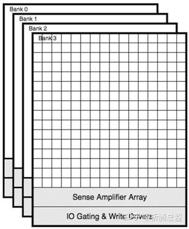

其中的每一个存储阵列（Memory Array）称为一个 Bank，每一个 Bank 的 Rows、Columns、Data Width 都是一样的。在 DRAM 的数据访问时，只有一个 Bank 会被激活，进行数据的读写操作。

DDR4 引入了 Bank Group 概念，Bank Group 由多个 Bank 组成，但多个Bank Group 可以同时工作，如果我们的数据十分凑巧分布在不同的 Group 中，Bank Group 会带来巨大的性能提升。

-------

我们知道，一个存储阵列（Memory Array）有很多行和列，为此我们需要给行和列都编上唯一的地址，才能实现行选和列选操作。通常片内还会有多个 Bank，每个 Bank 也会被编上唯一地址，通过 Bank 地址能唯一选中一个 Bank。

那行选或列选或Bank选择操作具体是怎么实现的？怎么在给定一个地址的情况下，让众多的选择信号线的一根有效？

在数字电路中，有一种神奇的器件，叫解码器/译码器（Decoder），它能根据输入的值，来决定在多个输出端中，哪一个需要被激活。下图是一个 3-8 解码器（3 输入 8 输出）功能示意图：

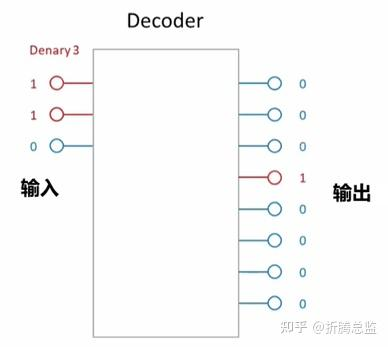

如上图，当左边输入的三个引脚构成二进制 000 时，右边第 1个管脚（最顶部）被激活；当输入为 001 时，输出的第 2 个管脚被激活；当输入为 011 时（如上图所示），输出的第 4 个管脚被激活。具体来说，输入的每一种二进制组合，都对应到输出的一个管脚被激活。

如果我们的 DRAM 芯片刚好有 8 个 Bank，那么就可以用这个解码器，把 3 位地址解码成具体的 Bank 的激活信号。如果我们的存储阵列有 65536 行，就可以用 16-65536 解码器，完成从 16 位地址到 65536 根行选信号线（Wordline）的转换。

# 0x05. 例子

以 DDR4 SDRAM 为例，下面是 MT40A1G8 芯片的结构图：
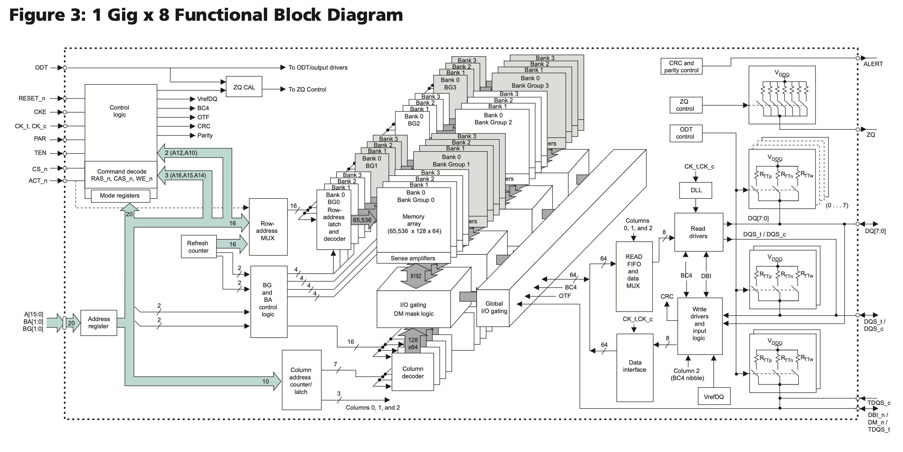
[图片来源](https://jia.je/kb/hardware/sdram.html#read-leveling)

保存数据的是中间的 Memory array，每个 Memory array 的规格是 65536 x 128 x 64，称为一个 Bank；四个 Bank 组成一个 Bank Group，一共有 4 个 Bank Group，所以总容量是 $65536 * 128 * 64 * 4 * 4 = 8 \mathrm{Gb}$
。

具体地，每个 Memory array 的 65536 x 128 x 64 的规格里，65536 表示 row 的数量，每个 row 保存了 $128 * 64 = 8192$ 位的数据，同时也是图中 `Sense amplifier` 到 `I/O gating, DM mask logic` 之间传输的位宽。每个 row 有 1024 个 column，每个 column 保存了 8 位的数据（对应 1 Gig x 8 中的 8）。由于 DDR4 的 prefetch 宽度是 8n，所以一次访问会取出 8 个 column 的数据，也就是 64 位。那么每个 row 就是 128 个 64 位数据，这就是上面所说的 65536 x 128 x 64 的 128 x 64 的来源。

每个 row 有 1024 个 column，所以 column 地址就有 10 位。但实际上，因为 Burst Length 是 8，所以实际上高 7 位（对应 128 x 64 的 128）会选择出 8 个 column，低 3 位决定了这些 column 的传输顺序，这是为了方便缓存 refill 的优化，把要读取的部分先取出来：

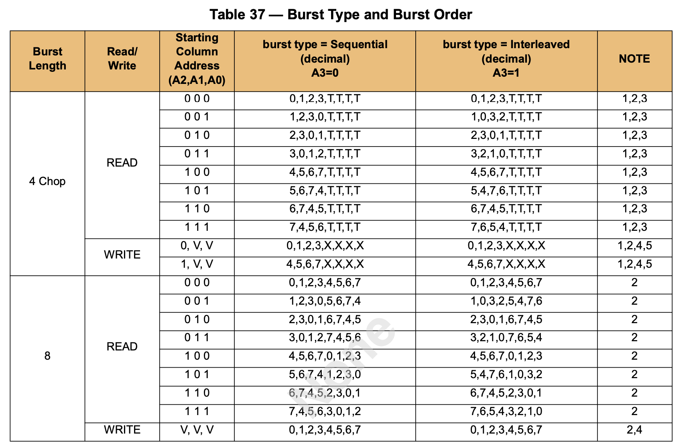

## 5.1 访问模式

SDRAM 的访问模式比较特别，它的 Memory array 每次只能以整个 row 为单位进行存取。在前面的例子（1 Gig x 8）中，一个 row 有 8192 位的数据，但是一次读或写操作只涉及 64 位的数据，因此一次读操作需要：

1. 第一步，先把数据所在的整个 row 取出来
2. 第二步，在 row 里读出想要的数据
   
但是每个 Bank 同时只能取出来一个 row，所以如果两次读涉及到了不同的 row，那么需要：

1. 第一步，先把第一次读的数据所在的整个 row 取出来
2. 第二步，在 row 里读出想要的数据
3. 第三步，把第一次读的 row 放回去
4. 第四步，把第二次读的数据所在的整个 row 取出来
5. 第五步，在 row 里读出想要的数据

用 SDRAM 的术语来讲，1 4 叫做 `Activate`，2 5 叫做 `Read`，3 叫做 `Precharge`。

SDRAM 定义了下列的时序参数，描述了这三个操作之间的时序要求：

1. CL（CAS Latency）：发送读请求，到输出第一个数据的时间
2. RCD（ACT to internal read or write delay time）：从 Activate 到下一个读或写请求的时间
3. RP（RRE command period）：发送 Precharge 命令到下一个命令的时间
4. RAS（ACT to PRE command period）：从 Activate 到 Precharge 之间的时间
5. RC（ACT to ACT or REF command period）：从 Activate 到下一个 Activate 或者 Refresh 之间的时间
6. RTP（Internal READ Command to PRECHARGE command delay）：从 Read 到 Precharge 之间的时间

于是上面的流程需要的时间要求就是：

1. 第一步，Activate，取出第一个 row
2. 第二步，Read，第一步和第二步之间要隔 `RCD` 的时间，从 Read 发送地址到得到数据要等待 `CL` 的时间
3. 第三步，Precharge，第一步和第三步之间要隔 `RAS` 的时间，第二步和第三步之间要隔 `RTP` 的时间
4. 第四步，Activate，取出第二个 row，第一步和第四步之间要隔 `RC` 的时间，第三步和第四步之间要隔 `RP` 的时间
5. 第五步，Read，第四步和第五步之间要隔 `RCD` 的时间，从 Read 发送地址到得到数据要等待 `CL` 的时间
根据这个流程，可以得到以下的结论：

1. 访问带有局部性的数据性能会更好，只需要连续地进行 Read，减少 Activate 和 Precharge 次数
2. 不断访问不同的 row 的数据，会导致需要来回地 Activate，Read，Precharge 循环
3. 访问 row 和访问 row 中的数据分成两个阶段，两个阶段可以使用同样的地址信号，使得内存总容量很大
4. 而如果访问总是命中同一个 row，就不需要 Activate 和 Prechage，可以持续 Read，获得接近理论的传输速率

为了缓解第二点带来的性能损失，引入了 Bank 的概念：每个 Bank 都可以取出来一个 row，那么如果要访问不同 Bank 里的数据，在第一个 Bank 进行 Activate/Precharge 的时候，其他 Bank 可以进行其他操作，从而掩盖 row 未命中带来的性能损失。

在 DDR SDRAM 内部的层次从大到小有：

- Bank Group：DDR4 引入，通过 Bank Group 掩盖 DDR4 同一个 Bank Group 内连续读的延迟 tCCD_L
- Bank：每个 Bank 同时只有一个 Row 被激活，通过多个 Bank 掩盖 Activate/Precharge 的延迟
- Row：Activate/Precharge 的单位
- Column：每个 Column 保存 n 个 Cell，n 是 SDRAM 的位宽
- Cell：每个 Cell 保存 1 bit 的数据

实际上，SDRAM 外部还有一些层次：

- Channel：处理器的内存控制器的通道数量
- Module：内存条，可以有多个内存条连接到同一个 Channel 上
- Rank：多个 DDR SDRAM 芯片在宽度上拼接起来，一个 Module 上可以放下一到四个 Rank，这些 Rank 共享总线，每个 Rank 都有自己的片选信号 CS_n，实际上就是在深度上拼接 SDRAM 芯片
- Chip：也就是一个 DDR SDRAM 芯片，例如一个数据位宽是 64 位的 Rank，是使用 8 个 x8 的 Chip 在宽度上拼接而成

下面列出 DDR4 的主要时序参数：

- tCCD_S: 对不同 Bank Group 进行 CAS 时，CAS 到 CAS 的延迟（CAS to CAS delay short），如 4 周期
- tCCD_L: 对相同 Bank Group 进行 CAS 时，CAS 到 CAS 的延迟（CAS to CAS delay long），如 6 周期
- tRRD_S: 对不同 Bank Group 进行 ACTIVATE 时，ACT 到 ACT 的延迟（ACT to ACT delay short），如 4 周期
- tRRD_L: 对相同 Bank Group 进行 ACTIVATE 时，ACT 到 ACT 的延迟（ACT to ACT delay long），如 6 周期
- tWTR_S：对不同 Bank Group 先 WRITE 后 READ 时，WRITE 完成写入（最后一个数据写入完成）到 READ 的延迟（Write to Read short）
- tWTR_L：对相同 Bank Group 先 WRITE 后 READ 时，WRITE 完成写入（最后一个数据写入完成）到 READ 的延迟（Write to Read long）
- tREFI：内存控制器需要按照 tREFI 的间隔发送 REFRESH 命令（Refresh Interval）
- tRFC：两次 REFRESH 命令的最小间隔（Refresh Cycle）
- tFAW: 在连续的 FAW 时间内，最多发送四个 ACTIVATE 命令（Four Activate Window），换句话说，第 i 次 ACTIVATE 和第 i+4 次 ACTIVATE 至少间隔 tFAW 时间
- tRP：PRECHARGE 命令发送以后，到对同一个 Bank 的下一个命令的延迟（Precharge）
- tRTP：对同一个 Bank 的 READ 到 PRE 的最小间隔（Read to Precharge）
- tRAS：对同一个 Bank 的 ACT 到 PRE 的最小间隔（RAS active time，Activate to Precharge）
- tRCD：对同一个 Bank 的 ACT 到 READ/WRITE 的最小间隔（Activate to Read/Write delay）
- tRC：对同一个 Bank 的 ACT 到 ACT/PRE 的最小间隔（Activate to Activate/Precharge delay）
- CL：CAS Latency，用于计算 Read Latency
- CWL：CAS Write Latency，用于计算 Write Latency
- AL：Additive Latency，用于计算 Read Latency
- RL：Read Latency
- WL：Write Latency

DDR3 和 DDR4 的不同点：

- 地址信号：DDR3 是 A0-A14，DDR4 是 A0-A17，其中 A14-A16 复用了引脚
- DDR4 引入了 Bank Group，所以多出了 BG0-BG1 引脚作为 Bank Group 地址
- DDR4 引入了 Bank Group 后，总 Bank 数量是 $4*4=16$；DDR3 的 Bank 数量是 8
- DDR3 中的 RAS_n、CAS_n 和 WE_n 在 DDR4 中被复用为了 A14-A16，目的是更大的容量
- DDR4 额外添加了 ACT_n 控制信号

实际上地址和控制信号是采用了串联的方式连接（Fly-by topology），也就是下图的右边的连接方式：
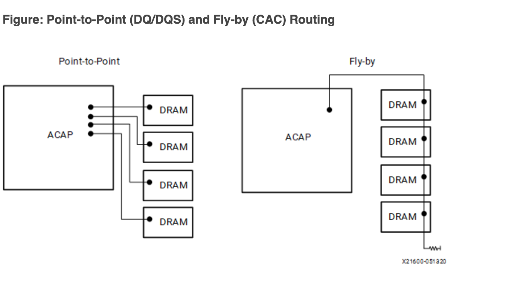

# 0x06.

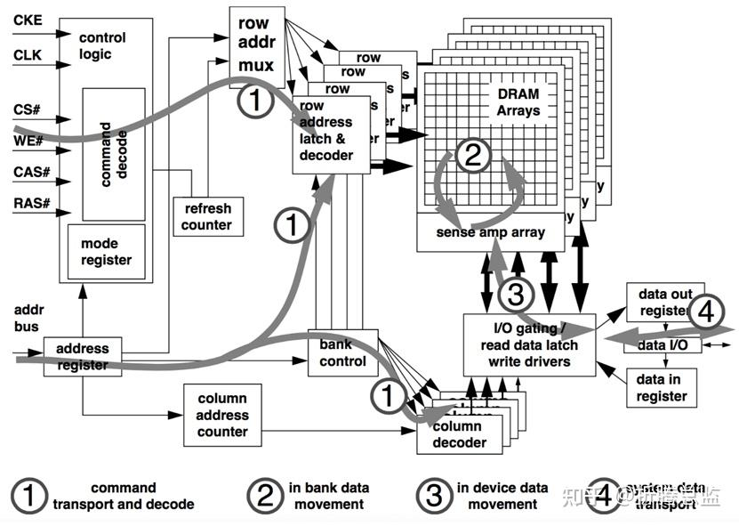

如上图，SDRAM 的相关操作在内部大概可以分为以下的几个阶段：

1. 命令传输和解码 Command transport and decode

    在这个阶段，Host 端会通过命令总线（CS#、WE#、CAS#、RAS#）和 地址总线将具体的命令以及相应参数传递给 SDRAM。SDRAM 接收并解析这个命令，接着驱动内部模块进行相应的操作。
2. Bank 内操作 In bank data movement
    
    在这个阶段，SDRAM 主要是将 Memory Array 中的数据从 DRAM Cells 中读出到 Sense Amplifiers，或者将数据从 Sense Amplifiers 写入到 DRAM Cells。
3. 芯片内操作 In device data movement

    这个阶段中，数据将通过 IO 电路缓存到 Read Latchs（读取锁存） 或者通过 IO 电路和 Write Drivers 更新到 Sense Amplifiers。
4. 接口数据传输 System data transport
    
    在这个阶段，进行读数据操作时，SDRAM 会将数据输出到数据总线上，进行写数据操作时，则是 Host 端的 Controller 将数据输出到总线上。

在上述的四个阶段中，每个阶段都会有一定的耗时，例如数据从 DRAM Cells 搬运到 Read Latchs 的操作需要一定的时间，因此在一个具体的操作需要按照一定时序进行。

同时，由于内部的一些部件可能会被多个操作使用，例如读数据和写数据都需要用到部分 IO 电路，因此多个不同的操作通常不能同时进行，也需要遵守一定的时序。

此外，某些操作会消耗很大的电流，为了满足 SDRAM 设计上的功耗指标，可能会限制某一些操作的执行频率。

基于上面的几点限制，SDRAM Controller 在发出命令时，需要遵守一定的时序和规则，这些时序和规则由相应的 SDRAM 标准定义。

下面，我们将对各个 命令的时序进行详细的介绍。

## 6.1 Row Active 命令

在进行数据的读写前，Controller 需要先发送 Row Active Command，打开 DRAM Memory Array 中的指定的 Row。Row Active Command 的时序如下图所示：

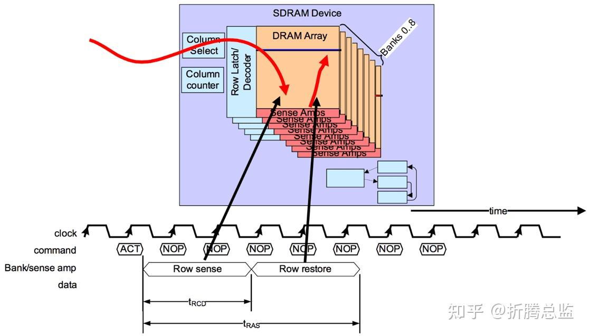

Row Active Command 可以分为两个阶段：Row Sense 和 Row Restore 。

- Row Sense

    Row Active 命令通过地址总线（BA[1:0] 和 A[12:0]）指明需要打开某一个 Bank 的某一个 Row。

    DRAM 在接收到该命令后，通过地址解码器，将 Bank 地址和行地址解码成具体某一 Bank 上的某一行对应的 Wordline，这将激活该行挂载的所有 Cell，通过 Sense Amplifiers，将该行所有 Cell 电容的电平放大到对应的 Bitline 线上。这一时间定义为 `tRCD` (Row Address to Column Address Delay)。

    DRAM 在完成 Row Sense 阶段后，Controller 就可以发送 Read 或 Write Command 进行数据的读写了。这也意味着，Controller 在发送 Row Active Command 后，需要等待 tRCD 时间才能接着发送 Read 或者 Write Command 进行数据的读写。

- Row Restore

    由于 DRAM 的特性，Row 中的数据在被读取到 Sense Amplifiers 后，Bitline 会对存储电容进行充电。经过特定的时间后，电容的电荷就可以恢复到读取操作前的状态。Restore 操作可以和数据的读取同时进行，即在这个阶段，Controller 可能发送了 Read Command 进行数据读取。

    DRAM 接收到 Row Active Command 到完成 Row Restore 操作所需要的时间定义为 `tRAS` (Row Address Strobe)。

    Controller 在发出一个 Row Active Command 后，必须要等待 tRAS 时间后，才可以发起另一次的 Precharge 和 Row Access。

## 6.2 Column Read 命令

Controller 发送 Row Active 命令并等待 tRCD 时间后，再发送 Column Read 命令进行数据读取。

数据突发 Burst Length 为 8 （字）时的读时序如下图所示：

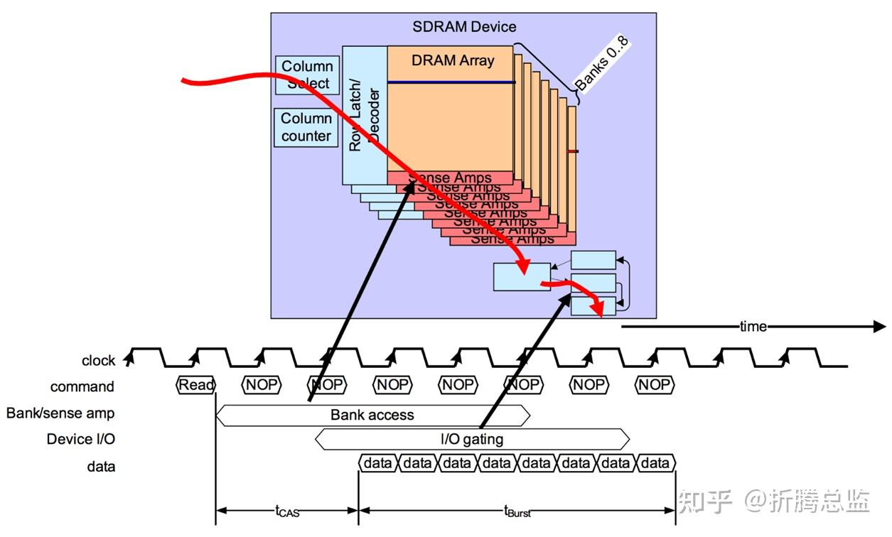

本命令通过地址总线 A[0:9] 指明需要读取的列起始地址。DRAM 在接收到该命令后，I/O gating 电路将指定的列的所有 Bitline 连通到数据总线，并把数据锁存起来。

DRAM 从接收到命令到第一组数据从数据总线上输出的时间称为 `tCAS` (Column Address Strobe)，也称为 tCL (CAS Latency)，这一时间可以通过 mode register 进行配置，通常为 3~5 个时钟周期。

DRAM 在接收到 Column Read 命令的 tCAS 时间后，会通过数据总线，将 n 个 Column 的数据逐个发送给 Controller，其中 n 由 mode register 中的 burst length 决定，通常设定为 Prefetch-N 的倍数 (1N、2N、0.5N)，如 2、4 或者 8，单位是字，字的长度是 DRAM 接口的数据总线宽度，并非内部总线宽度。即是说，一次 Burst 操作通常是一次预取操作。

开始发送第一个 Column 数据，到最后一个 Column 数据的时间定义为 `tBurst`。

## 6.3 Column Write 命令

Controller 发送 Row Active Command 并等待 tRCD 时间后，再发送 Column Write Command 进行数据写入。 数据 Burst Length 为 8 时的 Column Write Command 时序如下图所示：