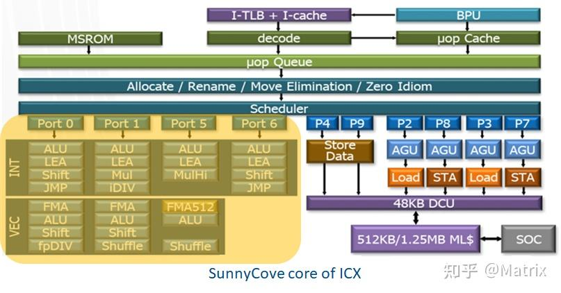

# 0x00. 导读

[11](https://jia.je/kb/hardware/sdram.html#bank-group)

# 0x01. 简介

镁光（Micron）

一个字有多少位被称为字长。存储器中的字长概念和 CPU 的字长有出入，如 64 位的 CPU，字长是 64，但作为存储芯片，（接口）字长可能只有 16位、8位或4位，而内部总线字长通常是接口字长的成倍数量。

存储阵列（Memory Array）的数据位宽（Data Width）是指对该阵列进行一次读写操作所访问的位数（Bits），是数据总线宽度的简称。芯片内部的数据总线宽度与芯片对外接口的数据总线宽度是两个概念。对于 SDR DARM 芯片来说，它们是相同的，但对于 DDR 芯片来说，内部的数据总线宽度是接口的数据总线宽度的 N 倍，这是因为 DDR 采用了 Prefetch 预取技术来适配较快的双边沿接口时钟和较慢的内核时钟。比如 DDR3 的 Prefetch 为 8N，意味着芯片内部的数据总线宽度是接口总线宽度的 8 倍。假设某一 DDR3 芯片对外的接口位宽被设计为 16 位，那么，其内部的数据总线宽度是 128 位，有 128 个 CSL/WE 控制线合并在一起，一次行列选择操作将同时选通 256 根 Bitline 连接到 128 个读写驱动电路上，同时完成 128 个 Cell 的访问，也将有 128 位 Prefetch 寄存器来缓存这次读取的数据，以供 CPU 的 DRAM 控制器分 4 个时钟周期传输完成。4 个时钟周期内，控制器对 16 位的数据总线（接口）采了 8 次样 ，每个时钟的上升下降沿都参与采样，这也是 DDR 的根源。一次的读取操作，在接口上要分4个时钟周期才传输完，根本原因是，DDR3 芯片内部的时钟频率比外部接口的时钟频率慢了 4 倍！DRAM 芯片的 Data Width 一般被设计为 4 位、8 位或16 位，这指的是接口的位宽，而非内部的位宽。

# 0x02. 

一些性能参数：
- 传输速率 (MT/s)：为每秒发生的 Transfer 的数量，通常也是 DRAM 的标称速率，最常用，如 DDR3-800 中的 800 指的就是传输速率
- 核心频率 (MHz)：DRAM 芯片内部控制逻辑和存储阵列的工作时钟的频率。
- prefetch：等于内部数据总线和数据总线的位宽倍数关系。为了弥补核心频率低的缺陷而推出的技术，以匹配 DDR 总线时钟与核心时钟频率间的差异。2n / 4n / 8n。这里的数字指的就是并行取出的位数。这里的n，就是DQ位宽，即后面的device width（x4/x8/x16）。所以DDR3 16bit SDRAM内存颗粒，16bit指的是位宽，其一次读写访问的数据量是8*16=128bit
- burst length: 一次访问连续操作的数据量，数据量 = BL * 数据总线位宽。
- 最大位宽：指 DRAM 芯片支持的对外接口的最大数据总线宽度、和对应芯片内部数据总线的宽度，最大总线数据位宽即为接口定义的数据总线 DQ 的位宽，而内部数据总线的位宽是接口位宽的 Prefetch N 倍；注意这个指标是对芯片来说的，控制器的最大位宽可达 64 位，可分为多部分接到多个芯片上；
- Data Rate：数据传输速率，单位 Mbps。
- CLK frequency：DDR时钟频率，单位 Mhz。
- tRC: 同一个 bank 中不同行被激活的最小时间间隔。
- CL (CAS Latency)：列选通后数据从存储单元到数据IO的时间。
- Device Width：颗粒位宽/芯片位宽，另一种说法是配置模式（Configuration），常见为 4/8/16bit。一个 Memory Array 中由行地址和列地址的交叉选中一个位，若2个Array叠加在一起，就同时选中了2个Bit，位宽是X2。若4个Array叠加到一起，就能够同时选中4个Bit，位宽则是X4。也就是说，对一个X4位宽的DDR 颗粒，如果给出行地址和列地址，就会同时输出4个Bit到DQ（数据输入、输出：双向数据总线）数据线上。
- Bank：DDR4以前是没有Bank Group的，所以该值就表示整个颗粒中Bank数量。但是在DDR4和DDR5中，就表示每个Bank Group中Bank的数量，整个颗粒Bank数量 = Bank Group * Bank。
- Bank Group：Bank分组数量，该特性只存在于DDR4和DDR5中。
- DQ 和 DQS 的缩写，Data signals are called DQ and data strobe is DQS. from: [Data Strobe in DDR memory](https://electronics.stackexchange.com/questions/408458/data-strobe-in-ddr-memory) and [Rams and DQ lines](https://electronics.stackexchange.com/questions/281813/rams-and-dq-lines)
- AL: 在读写操作中，内存控制器可以连续发送多个读写命令，这样即可连续读写数据。连续发送的命令之间必须要有一个时间延迟，这样确保两个命令间的数据不会重叠，这个时间称为Additive Latency，简称AL。

# 0x03. 信号

下面，我们来考虑 DRAM 芯片对外应该提供怎么样的通信接口，才能实现最基本的内存读写功能。

作为一个与 CPU （DRAM Controler）协同的 DRAM 芯片，首先需要一个与 CPU 同步的时钟信号，这也是 SDRAM 中 S （同步）的含义。同时，我们考虑在适当时候（如自刷新模式），能禁用芯片内部通信接口电路的时钟，来降低功耗，这可以引入一个时钟使能信号线来实现。

然后，一个 DRAM 芯片由多个 Bank 组成，每个 Bank 就是一个存储阵列，要选中阵列中的具体存储单元（最小可寻址单元为 Word 字，字长通常是 2、4、8、16），还需要行地址和列地址。

## 3.1 

显然，我们需要设计一种寻址体系，方便 DRAM Controller （CPU的内存控制器）对内存的指定的物理地址进行访问操作。在实际的产品中，通常需要考虑 CPU 中的物理地址到 SDRAM 的 CS、Bank Group（DDR4/DD5）、 Bank、Row 和 Column 地址映射。

下图是一个 32 位物理地址映射的一个例子（以 SDR SDRAM为例，DDR 各版本的Bank地址和行地址会更宽）：

上例中，CPU 使用了 27 位地址总线来连接内存，所以支持 2^27 = 128MB 可寻址空间。具体分配如下：

- 采用了两位的芯片选择地址（CS），能解码出 4 根片选信号，连接 4 个 DRAM 芯片（Rank 组）。芯片应该拉出一个片选信号，让 CPU 可以选中它。
- 采用了两位 Bank 地址，能解码出 4 个 Bank 选择信号。所以，芯片内部应该有 4 个 Bank，并拉出两位 Bank 地址。
- 行地址共设 13 位，能解码出 2^13 = 8192 条 Wordline 信号线。
- 列地址共设 10 位，能解码出 2^10 = 1024 条 CSL 列选信号线。
- 第 0 位地址没作映射，这意味着最小可寻址单位是 16 位的字（Word），而非 8 位的字节（Byte）。

如果 CPU 要在一个时钟周期把整个地址传输过来，除了 CS 和 Bank 地址外，一次要传输 23 位地址，这意味着我们要在芯片上引出 23 根地址线。为了缩减芯片对外的引脚数量，我们通常采用分时传输技术，即地址分两次传输，第一次把 13 位的行地址传过来，作行选操作，第二次把 10 位的列地址传过来，作列选操作。这样的话，我们的芯片只需要引出 13 根地址总线即可。不过，我们需要额外增加两根控制线来配合，以区分当前是行选操作（RAS）还是列选操作（CAS），地址总线上传输的是行地址还是列地址。

因为 CPU 访问地址的第 0 位没作映射，最小可寻址单位是 16(13 + 2 + 1) 位的字，那么一次内存操作的字长是 16 位，我们的芯片一次要能操作 16 位（假如我们只接了一颗 DRAM 芯片），芯片要拉出 16 位数据总线出来，所以 CPU 每次读取或写入操作，都是一次性传输两个字节（16位）。

但多字节字长在写入单字节数据时，会有些麻烦，比如 CPU 只想写入一个字节（比如高8位），它把数据加载到 16 位数据总线的高 8 位，如果不告诉 DRAM 芯片只写高 8 位，芯片仍然会把总线的两个字节（此时低8位是脏数据）写入到指定的地址单元，那么原来的低 8 位就会被脏数据冲刷掉。为了解决这个问题，芯片还需要引出高字节屏蔽信号线 DQMH 和低字节屏蔽信号线 DQML，有了这两根信号线的加持，CPU 就可以指定屏蔽掉数据总线上无效的高字节或低字节，只写入其中一个字节了。注意，对于芯片来说，如果芯片只提供 8 位数据总线，则仅需引出一根 DQM 信号即可。

另外，还需要一根写使能控制线，来区分 CPU 的本次内存操作是读还是写。

综上所述，作为一颗正经的 DRAM 芯片，与 DRAM 控制器（CPU）的通信接口至少应包括这三类信号线：控制信号（包含时钟）、地址信号和数据信号，具体的信号如下表所示（带 # 或 _N 表示低电平有效，也有 ）：

| SDR | DDR-DDR3 | 类型 | 描述 |
| :----: | :----: | :----: | :----: |
| CK|CK,CK#|Input|时钟信号，DDR引入差分时钟，进行双边沿触发的校准|
| CKE|CKE|Input|时钟使能信号，SDRAM 会根据此信号进入或者退出 Power down、Self-refresh 等模式|
| CS#|CS#|Input|片选(chip select)信号，控制器选中的一个或一组(Rank) DRAM 芯片共享地址和数据总线|
| RAS#|RAS#|Input|Row Address Strobe， 行地址选通信号|
| CAS#|CAS#|Input|Column Address Strobe，列地址选通信号
| WE#|WE#|Input|Write Enable，写使能信号
| BA[1:0]|BA[2:0]|Input|Bank Address，用于选择操作的 Memory Bank
| A[12:0]|A[14:0]|Input|Address 总线，用于传输行列地址
| DQ[15:0]|DQ[15:0]|I/O|Data 总线，用于传输读写的数据内容
| DQML|LDM|Input|低字节掩码，为高时 DQ[7:0] 写入无效
| DQMH|UDM|Input|高字节掩码，为高时 DQ[15:8] 写入无效
| |LDQS,LDQS#|I/O|低字节数据时钟，为高时 DQ[7:0] 有效，由发送端驱动，DDR2引入差分
| |UDQS,UDQS#|I/O|高字节数据时钟，为高时 DQ[15:8] 有效，由发送端驱动

控制信号和地址信号总线有时简作 CA 总线，在后来的 DDR 版本中，有些控制信号被复用作地址信号。

除了通信之外，DRAM 芯片还需要供电，而且需要两路电源，一路是主电源 Vcc，一路是参考电压（半电压） Vref = Vcc / 2。

A[0:16]：地址线，为 ACTIVATE 命令提供行地址，为 READ/WRITE 命令提供列地址，以从相应存储区的存储器阵列（Bank）中选择一个位置 （A10/AP、A12/BC_n、WE_n/A14、CAS_n/A15、RAS_n/A16 这几个信号有复用功能）。它还可以为模式寄存器提供设置信息。

BA[0:1]：Bank Address，除了表示执行ACTIVATE,READ, WRITE, or PRECHARGE 等命令的Bank地址，还可以表示在设置模式寄存器期间，访问哪个寄存器。

BG[0:1]：Bank Group Address，表示Bank Group地址的信号。它可以在一个存储芯片内部实现多个Bank Group，每个Bank Group内部又可以划分成多个Bank。一个Bank Group可以包含多个Bank，Bank Group与Bank的关系就如同硬盘的分区一样。在同一个Bank Group中，各个Bank之间共享一些电路资源，例如地址线、数据线、写使能信号等。而不同Bank Group之间的资源则是独立的，这样就可以有效提高SDRAM的并发读写能力。

RAS#：Row Address Strobe，行地址选通信号，需配合ACT_n和CS_n信号使用。

CAS#：Column Address Strobe，列地址选通信号，需配合ACT_n和CS_n信号使用。

WE#：Write Enable，写使能信号，需配合ACT_n和CS_n信号使用。

CS#：Chip Select，芯片选通信号。

CK、CK#：Clock，差分时钟信号。

CKE：Clock Enable，时钟使能信号。

DQ[0:63]：Data input/output，双向数据总线。DQ[3:0]、DQ[7:0] 和 DQ[15:0] 分别表示 x4、x8 和 x16 的配置 。

DQS：Data Strobe，数据选择信号，用来控制读写数据。读命令时，将由SDRAM控制作为输出信号，用来通知内存控制器何时读取DQ数据；写命令时，将作为SDRAM的输入信号，控制将DQ数据同步写入SDRAM中。DQ信号在读写操作中是共用的，其数据流向是不确定的，如在读操作中，内存控制器并不知道DQ上是否有数据，且数据是否有效。此时就需要一个信号来告知内存控制器，什么时候读取数据，读取哪些数据，DQS便是充当这样的角色。

ACT_n：Command，用于触发SDRAM设备的行激活命令（ACTIVATE command）。当ACT_n信号为低电平，同时CS_n信号也为低电平时，SDRAM设备将把RAS_n/A16、CAS_n/A15和WE_n/A14信号视为行地址输入，并执行行激活操作。当ACT_n信号为高电平，同时CS_n信号为低电平时，SDRAM设备将把RAS_n/A16、CAS_n/A15 和 WE_n/A14视为常规命令信号，并执行相应的操作，这些命令使用 RAS_n、CAS_n 和 WE_n 信号。

# 0x04. 

在实际制造过程中，我们并不会无限制的在 Bitline 上挂接 Cells。因为 Bitline 挂接越多的 Cells（即挂接越多的 Wordline），Bitline 的长度就会越长，也就意味着 Bitline 的寄生电容值会更大，这会导致 Bitline 的信号边沿翻转速率下降（电平从高变低或者从低变高的速率），最终导致性能的下降。为此，我们需要限制一条 Bitline 上挂接的 Cell （也即 Wordline） 的总数，将更多的 Cells 挂接到其他的 Bitline 上去。

------

DRAM 存储阵列中的 Row 与 Wordline 是一一对应的，一个 Row 本质上就是所有接在同一根 Wordline 上的 Cells，如下图红色标记所示。

DRAM 在进行数据读写时，选中某一 Row，实质上就是控制该 Row 所对应的 Wordline，打开 Cells，并将 Cells 上的数据缓存到 Bitline 上，通过 Sense Amplifiers 进行感知放大。

Row Size 即为一个 Row 上面的 Cells 的数量，也称为 Page Size。其中一个 Cell 存储 1 Bit 的信息，也就是说，Row Size 即为一个 Row 所存储的总位数。

----------------

列元（Column）是存储阵列中可寻址的最小单元。一个 Row 中有 n 个 Column，其中 Column 的数量 n = Row Size / Data Width，即为 CSL 和 WE 控制信号合并后的数量。下图是 Row Size 为 32，Data Width 为 8 时，Column 的示例（4个 Column）。

Column Size 即为该 Column （列元）上所包含的 Cells 的数量，与 Data Width 相同。Column Size 和 Data Width 在本质上是一样的，代表有多少个 CSL 和 WE 控制线合并在一起。

-------

随着 Wordline 数量的不断增加，一条 Bitline 上面挂接的 Cells 也会越来越多，Bitline 会越来越长，继而也会导致寄生电容变大，边沿速率变慢，性能变差。另一方面，增加一对 Bitline 就意味着要为其增加一套读写驱动电路，意味着成本、体积和功耗增大，因此，Bitline 也不能无限增加。我们认识到一个事实：一个存储阵列（Memory Array） 不能无限制地扩大。

为了在不减损性能的基础上进一步增加容量，DRAM 在设计上将多个存储阵列堆叠到一起，如下图所示：

其中的每一个存储阵列（Memory Array）称为一个 Bank，每一个 Bank 的 Rows、Columns、Data Width 都是一样的。在 DRAM 的数据访问时，只有一个 Bank 会被激活，进行数据的读写操作。

DDR4 引入了 Bank Group 概念，Bank Group 由多个 Bank 组成，但多个Bank Group 可以同时工作，如果我们的数据十分凑巧分布在不同的 Group 中，Bank Group 会带来巨大的性能提升。

-------

我们知道，一个存储阵列（Memory Array）有很多行和列，为此我们需要给行和列都编上唯一的地址，才能实现行选和列选操作。通常片内还会有多个 Bank，每个 Bank 也会被编上唯一地址，通过 Bank 地址能唯一选中一个 Bank。

那行选或列选或Bank选择操作具体是怎么实现的？怎么在给定一个地址的情况下，让众多的选择信号线的一根有效？

在数字电路中，有一种神奇的器件，叫解码器/译码器（Decoder），它能根据输入的值，来决定在多个输出端中，哪一个需要被激活。下图是一个 3-8 解码器（3 输入 8 输出）功能示意图：

如上图，当左边输入的三个引脚构成二进制 000 时，右边第 1个管脚（最顶部）被激活；当输入为 001 时，输出的第 2 个管脚被激活；当输入为 011 时（如上图所示），输出的第 4 个管脚被激活。具体来说，输入的每一种二进制组合，都对应到输出的一个管脚被激活。

如果我们的 DRAM 芯片刚好有 8 个 Bank，那么就可以用这个解码器，把 3 位地址解码成具体的 Bank 的激活信号。如果我们的存储阵列有 65536 行，就可以用 16-65536 解码器，完成从 16 位地址到 65536 根行选信号线（Wordline）的转换。

# 0x05. 例子

以 DDR4 SDRAM 为例，下面是 MT40A1G8 芯片的结构图：

[图片来源](https://jia.je/kb/hardware/sdram.html#read-leveling)

保存数据的是中间的 Memory array，每个 Memory array 的规格是 65536 x 128 x 64，称为一个 Bank；四个 Bank 组成一个 Bank Group，一共有 4 个 Bank Group，所以总容量是 $65536 * 128 * 64 * 4 * 4 = 8 \mathrm{Gb}$
。

具体地，每个 Memory array 的 65536 x 128 x 64 的规格里，65536 表示 row 的数量，每个 row 保存了 $128 * 64 = 8192$ 位的数据，同时也是图中 `Sense amplifier` 到 `I/O gating, DM mask logic` 之间传输的位宽。每个 row 有 1024 个 column，每个 column 保存了 8 位的数据（对应 1 Gig x 8 中的 8）。由于 DDR4 的 prefetch 宽度是 8n，所以一次访问会取出 8 个 column 的数据，也就是 64 位。那么每个 row 就是 128 个 64 位数据，这就是上面所说的 65536 x 128 x 64 的 128 x 64 的来源。

每个 row 有 1024 个 column，所以 column 地址就有 10 位。但实际上，因为 Burst Length 是 8，所以实际上高 7 位（对应 128 x 64 的 128）会选择出 8 个 column，低 3 位决定了这些 column 的传输顺序，这是为了方便缓存 refill 的优化，把要读取的部分先取出来：

## 5.1 访问模式

SDRAM 的访问模式比较特别，它的 Memory array 每次只能以整个 row 为单位进行存取。在前面的例子（1 Gig x 8）中，一个 row 有 8192 位的数据，但是一次读或写操作只涉及 64 位的数据，因此一次读操作需要：

1. 第一步，先把数据所在的整个 row 取出来
2. 第二步，在 row 里读出想要的数据
   
但是每个 Bank 同时只能取出来一个 row，所以如果两次读涉及到了不同的 row，那么需要：

1. 第一步，先把第一次读的数据所在的整个 row 取出来
2. 第二步，在 row 里读出想要的数据
3. 第三步，把第一次读的 row 放回去
4. 第四步，把第二次读的数据所在的整个 row 取出来
5. 第五步，在 row 里读出想要的数据

用 SDRAM 的术语来讲，1 4 叫做 `Activate`，2 5 叫做 `Read`，3 叫做 `Precharge`。

SDRAM 定义了下列的时序参数，描述了这三个操作之间的时序要求：

1. CL（CAS Latency）：发送读请求，到输出第一个数据的时间
2. RCD（ACT to internal read or write delay time）：从 Activate 到下一个读或写请求的时间
3. RP（RRE command period）：发送 Precharge 命令到下一个命令的时间
4. RAS（ACT to PRE command period）：从 Activate 到 Precharge 之间的时间
5. RC（ACT to ACT or REF command period）：从 Activate 到下一个 Activate 或者 Refresh 之间的时间
6. RTP（Internal READ Command to PRECHARGE command delay）：从 Read 到 Precharge 之间的时间

于是上面的流程需要的时间要求就是：

1. 第一步，Activate，取出第一个 row
2. 第二步，Read，第一步和第二步之间要隔 `RCD` 的时间，从 Read 发送地址到得到数据要等待 `CL` 的时间
3. 第三步，Precharge，第一步和第三步之间要隔 `RAS` 的时间，第二步和第三步之间要隔 `RTP` 的时间
4. 第四步，Activate，取出第二个 row，第一步和第四步之间要隔 `RC` 的时间，第三步和第四步之间要隔 `RP` 的时间
5. 第五步，Read，第四步和第五步之间要隔 `RCD` 的时间，从 Read 发送地址到得到数据要等待 `CL` 的时间
根据这个流程，可以得到以下的结论：

1. 访问带有局部性的数据性能会更好，只需要连续地进行 Read，减少 Activate 和 Precharge 次数
2. 不断访问不同的 row 的数据，会导致需要来回地 Activate，Read，Precharge 循环
3. 访问 row 和访问 row 中的数据分成两个阶段，两个阶段可以使用同样的地址信号，使得内存总容量很大
4. 而如果访问总是命中同一个 row，就不需要 Activate 和 Prechage，可以持续 Read，获得接近理论的传输速率

为了缓解第二点带来的性能损失，引入了 Bank 的概念：每个 Bank 都可以取出来一个 row，那么如果要访问不同 Bank 里的数据，在第一个 Bank 进行 Activate/Precharge 的时候，其他 Bank 可以进行其他操作，从而掩盖 row 未命中带来的性能损失。

在 DDR SDRAM 内部的层次从大到小有：

- Bank Group：DDR4 引入，通过 Bank Group 掩盖 DDR4 同一个 Bank Group 内连续读的延迟 tCCD_L
- Bank：每个 Bank 同时只有一个 Row 被激活，通过多个 Bank 掩盖 Activate/Precharge 的延迟
- Row：Activate/Precharge 的单位
- Column：每个 Column 保存 n 个 Cell，n 是 SDRAM 的位宽
- Cell：每个 Cell 保存 1 bit 的数据

实际上，SDRAM 外部还有一些层次：

- Channel：处理器的内存控制器的通道数量
- Module：内存条，可以有多个内存条连接到同一个 Channel 上
- Rank：多个 DDR SDRAM 芯片在宽度上拼接起来，一个 Module 上可以放下一到四个 Rank，这些 Rank 共享总线，每个 Rank 都有自己的片选信号 CS_n，实际上就是在深度上拼接 SDRAM 芯片
- Chip：也就是一个 DDR SDRAM 芯片，例如一个数据位宽是 64 位的 Rank，是使用 8 个 x8 的 Chip 在宽度上拼接而成

下面列出 DDR4 的主要时序参数：

- tCCD_S: 对不同 Bank Group 进行 CAS 时，CAS 到 CAS 的延迟（CAS to CAS delay short），如 4 周期
- tCCD_L: 对相同 Bank Group 进行 CAS 时，CAS 到 CAS 的延迟（CAS to CAS delay long），如 6 周期
- tRRD_S: 对不同 Bank Group 进行 ACTIVATE 时，ACT 到 ACT 的延迟（ACT to ACT delay short），如 4 周期
- tRRD_L: 对相同 Bank Group 进行 ACTIVATE 时，ACT 到 ACT 的延迟（ACT to ACT delay long），如 6 周期
- tWTR_S：对不同 Bank Group 先 WRITE 后 READ 时，WRITE 完成写入（最后一个数据写入完成）到 READ 的延迟（Write to Read short）
- tWTR_L：对相同 Bank Group 先 WRITE 后 READ 时，WRITE 完成写入（最后一个数据写入完成）到 READ 的延迟（Write to Read long）
- tREFI：内存控制器需要按照 tREFI 的间隔发送 REFRESH 命令（Refresh Interval）
- tRFC：两次 REFRESH 命令的最小间隔（Refresh Cycle）
- tFAW: 在连续的 FAW 时间内，最多发送四个 ACTIVATE 命令（Four Activate Window），换句话说，第 i 次 ACTIVATE 和第 i+4 次 ACTIVATE 至少间隔 tFAW 时间
- tRP：PRECHARGE 命令发送以后，到对同一个 Bank 的下一个命令的延迟（Precharge）
- tRTP：对同一个 Bank 的 READ 到 PRE 的最小间隔（Read to Precharge）
- tRAS：对同一个 Bank 的 ACT 到 PRE 的最小间隔（RAS active time，Activate to Precharge）
- tRCD：对同一个 Bank 的 ACT 到 READ/WRITE 的最小间隔（Activate to Read/Write delay）
- tRC：对同一个 Bank 的 ACT 到 ACT/PRE 的最小间隔（Activate to Activate/Precharge delay）
- CL：CAS Latency，用于计算 Read Latency
- CWL：CAS Write Latency，用于计算 Write Latency
- AL：Additive Latency，用于计算 Read Latency
- RL：Read Latency
- WL：Write Latency

DDR3 和 DDR4 的不同点：

- 地址信号：DDR3 是 A0-A14，DDR4 是 A0-A17，其中 A14-A16 复用了引脚
- DDR4 引入了 Bank Group，所以多出了 BG0-BG1 引脚作为 Bank Group 地址
- DDR4 引入了 Bank Group 后，总 Bank 数量是 $4*4=16$；DDR3 的 Bank 数量是 8
- DDR3 中的 RAS_n、CAS_n 和 WE_n 在 DDR4 中被复用为了 A14-A16，目的是更大的容量
- DDR4 额外添加了 ACT_n 控制信号

实际上地址和控制信号是采用了串联的方式连接（Fly-by topology），也就是下图的右边的连接方式：

# 0x06.

如上图，SDRAM 的相关操作在内部大概可以分为以下的几个阶段：

1. 命令传输和解码 Command transport and decode

    在这个阶段，Host 端会通过命令总线（CS#、WE#、CAS#、RAS#）和 地址总线将具体的命令以及相应参数传递给 SDRAM。SDRAM 接收并解析这个命令，接着驱动内部模块进行相应的操作。
2. Bank 内操作 In bank data movement
    
    在这个阶段，SDRAM 主要是将 Memory Array 中的数据从 DRAM Cells 中读出到 Sense Amplifiers，或者将数据从 Sense Amplifiers 写入到 DRAM Cells。
3. 芯片内操作 In device data movement

    这个阶段中，数据将通过 IO 电路缓存到 Read Latchs（读取锁存） 或者通过 IO 电路和 Write Drivers 更新到 Sense Amplifiers。
4. 接口数据传输 System data transport
    
    在这个阶段，进行读数据操作时，SDRAM 会将数据输出到数据总线上，进行写数据操作时，则是 Host 端的 Controller 将数据输出到总线上。

在上述的四个阶段中，每个阶段都会有一定的耗时，例如数据从 DRAM Cells 搬运到 Read Latchs 的操作需要一定的时间，因此在一个具体的操作需要按照一定时序进行。

同时，由于内部的一些部件可能会被多个操作使用，例如读数据和写数据都需要用到部分 IO 电路，因此多个不同的操作通常不能同时进行，也需要遵守一定的时序。

此外，某些操作会消耗很大的电流，为了满足 SDRAM 设计上的功耗指标，可能会限制某一些操作的执行频率。

基于上面的几点限制，SDRAM Controller 在发出命令时，需要遵守一定的时序和规则，这些时序和规则由相应的 SDRAM 标准定义。

下面，我们将对各个 命令的时序进行详细的介绍。

## 6.1 Row Active 命令

在进行数据的读写前，Controller 需要先发送 Row Active Command，打开 DRAM Memory Array 中的指定的 Row。Row Active Command 的时序如下图所示：

Row Active Command 可以分为两个阶段：Row Sense 和 Row Restore 。

- Row Sense

    Row Active 命令通过地址总线（BA[1:0] 和 A[12:0]）指明需要打开某一个 Bank 的某一个 Row。

    DRAM 在接收到该命令后，通过地址解码器，将 Bank 地址和行地址解码成具体某一 Bank 上的某一行对应的 Wordline，这将激活该行挂载的所有 Cell，通过 Sense Amplifiers，将该行所有 Cell 电容的电平放大到对应的 Bitline 线上。这一时间定义为 `tRCD` (Row Address to Column Address Delay)。

    DRAM 在完成 Row Sense 阶段后，Controller 就可以发送 Read 或 Write Command 进行数据的读写了。这也意味着，Controller 在发送 Row Active Command 后，需要等待 tRCD 时间才能接着发送 Read 或者 Write Command 进行数据的读写。

- Row Restore

    由于 DRAM 的特性，Row 中的数据在被读取到 Sense Amplifiers 后，Bitline 会对存储电容进行充电。经过特定的时间后，电容的电荷就可以恢复到读取操作前的状态。Restore 操作可以和数据的读取同时进行，即在这个阶段，Controller 可能发送了 Read Command 进行数据读取。

    DRAM 接收到 Row Active Command 到完成 Row Restore 操作所需要的时间定义为 `tRAS` (Row Address Strobe)。

    Controller 在发出一个 Row Active Command 后，必须要等待 tRAS 时间后，才可以发起另一次的 Precharge 和 Row Access。

## 6.2 Column Read 命令

Controller 发送 Row Active 命令并等待 tRCD 时间后，再发送 Column Read 命令进行数据读取。

数据突发 Burst Length 为 8 （字）时的读时序如下图所示：

本命令通过地址总线 A[0:9] 指明需要读取的列起始地址。DRAM 在接收到该命令后，I/O gating 电路将指定的列的所有 Bitline 连通到数据总线，并把数据锁存起来。

DRAM 从接收到命令到第一组数据从数据总线上输出的时间称为 `tCAS` (Column Address Strobe)，也称为 tCL (CAS Latency)，这一时间可以通过 mode register 进行配置，通常为 3~5 个时钟周期。

DRAM 在接收到 Column Read 命令的 tCAS 时间后，会通过数据总线，将 n 个 Column 的数据逐个发送给 Controller，其中 n 由 mode register 中的 burst length 决定，通常设定为 Prefetch-N 的倍数 (1N、2N、0.5N)，如 2、4 或者 8，单位是字，字的长度是 DRAM 接口的数据总线宽度，并非内部总线宽度。即是说，一次 Burst 操作通常是一次预取操作。

开始发送第一个 Column 数据，到最后一个 Column 数据的时间定义为 `tBurst`。

## 6.3 Column Write 命令

Controller 发送 Row Active Command 并等待 tRCD 时间后，再发送 Column Write Command 进行数据写入。 数据 Burst Length 为 8 时的 Column Write Command 时序如下图所示：