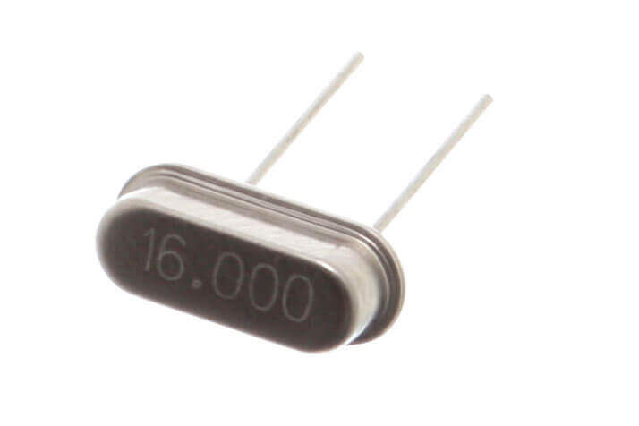
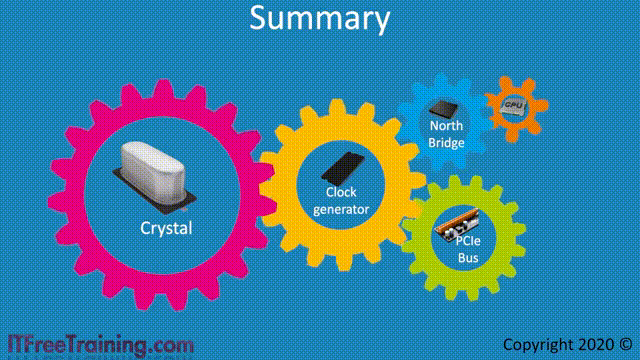

# 0x00. 导读

[Linux 时钟源之 TSC：软硬件原理、使用场景、已知问题（2024）](https://arthurchiao.art/blog/linux-clock-source-tsc-zh/)

# 0x01. 简介

# 0x02. 计算机组件的运行频率

[What is a CPU clock physically?](https://cs.stackexchange.com/questions/153752/what-is-a-cpu-clock-physically?newreg=7d921f97e33c4216ad8e44443482756b)
> 现代时钟最初是由 ~20MHz 左右的 石英晶体振荡器/石英晶体谐振器 产生，然后通过一个或多个 [锁相环（Phase-locked loop, PLL）](https://en.wikipedia.org/wiki/Phase-locked_loop) 倍频，产生系统不同部分的时钟信号。（例如 CPU 核心为 4GHz）。
> the frequency is multiplied by one or more phase-locked loops to generate the clock signals for different parts of the system

## 2.1 时钟源：~20MHz 的石英晶体谐振器（quartz crystal resonator）

[石英晶体谐振器](https://zh.wikipedia.org/zh-cn/%E7%9F%B3%E8%8B%B1%E6%99%B6%E4%BD%93%E8%B0%90%E6%8C%AF%E5%99%A8) 或晶体振荡器（英文 crystal oscillator ），简写为晶振，英文简写为 Xtal 或 X'tal（或全大写），是利用石英晶体（又称水晶）的压电效应 来产生高精度振荡频率的一种电子器件。

一般长这样，焊在计算机主板上



受物理特性的限制，只有 几十 MHz。

## 2.2 Clock generator：针对不同部分（内存、PCIe、CPU 等）倍频

计算机的内存、PCIe 设备、CPU 等等组件需要的工作频率不一样（主要原因之一是其他组件跟不上 CPU 的频率）， 而且都远大于几十 MHz，因此需要对频率做提升。

下面的 [gif（强烈推荐看）](https://www.youtube.com/watch?v=B7djs4zSbuU&t=150s&ab_channel=ITFreeTraining) 解释地很形象：



图中的 [clock generator](https://en.wikipedia.org/wiki/Clock_generator) 是个专用芯片，也是焊在主板上，一般跟晶振挨着，产生用于同步电路操作的时钟信号。

CPU 频率是如何从 ~20MHz 提升到 ~3GHz 的呢？结合上面的图，时钟信号的传递/提升路径：

1. 晶振（~20MHz）
2. 主板上的 clock generator 芯片
3. 北桥芯片
4. CPU

最终时钟信号连接到 CPU 的一个名为 **CLK** 的引脚。

现代 CPU **内部**（注意，这是 CPU 内部，不是上图的外部）一般还有一个 clock generator，可以继续提升频率， 最终达到厂商宣传里的基频（base frequency）或标称频率（nominal frequency），例如 EPYC 6543 的 2795MHz。 这跟原始晶振频率比，已经提升了上百倍。

# 0x03. TSC, 时间戳计数器 

x86 架构的寄存器有 通用目的寄存器 和 特殊目的寄存器。后者大致分为几类：
- control registers
- debug registers
- mode-specific registers (MSR)

我们主要讲 MSR ，MSR 是 x86 架构中的一组控制寄存器（control registers）， 设计用于 debugging/tracing/monitoring 等等目的。

MSR 相关的几个指令：
- RDMSR/WRMSR 指令：读写 MSR registers；
- CPUID 指令：检查 CPU 是否支持某些特性。

RDMSR/WRMSR 指令使用方式：
- 需要 priviledged 权限。
- Linux msr 内核模块创建了一个伪文件 `/dev/cpu/{id}/msr`，用户可以读写这个文件。还有一个 `msr-tools` 工具包。

MSR 中与时间有关的一个寄存器，叫 `TSC (Time Stamp Counter)`。在多核情况下（如今几乎都是多核了），每个物理核（processor）都有一个 TSC register， 或者说这是一个 per-processor register。

## 3.1 

时钟信号经过层层提升之后，最终达到 CPU 期望的高运行频率，然后就会在这个频率上工作。

TSC 作用：记录 cpu 启动以来累计的 cycles 数量。实际上经常被当做（高精度）时钟用，如果 CPU 频率恒定（也就是没有超频、节能之类的特殊配置，cycles 就是以恒定速率增加的， 这时 TSC 确实能跟时钟保持同步，所以可以作为一种获取时间或计时的方式）且不存在 CPU 重置的话：

- TSC 记录的就是系统启动以来的 cycles 数量；
- cycles 可以精确换算成时间；
- 这个时间的精度还非常高！；
- 使用开销还很低（这涉及到操作系统和内核实现了）。

所以无怪乎 TSC 被大量用户空间程序当做开销地高精度的时钟。

```c
unsigned long long rdtsc() {
    unsigned int lo, hi;
    __asm__ volatile ("rdtsc" : "=a" (lo), "=d" (hi));
    return ((unsigned long long)hi << 32) | lo;
}

start = rdtsc();
// business logic here
end = rdtsc();
elapsed_seconds = (end-start) / cycles_per_sec;
```

乱序执行会导致 RDTSC 的执行顺序与期望的顺序发生偏差，导致计时不准，两种解决方式：

- 插入一个同步指令（a serializing instruction），例如 CPUID，强制前面的指令必现执行完，才能才执行 RDTSC；
- 使用一个变种指令 RDTSCP，但这个指令只是对指令流做了部分顺序化（partial serialization of the instruction stream），并不完全可靠。

如果一台机器只有一个处理器，并且工作频率也一直是稳定的，那拿 TSC 作为计时方式倒也没什么问题。 但随着下面这些技术的引入，TSC 作为时钟就不准了：

- 多核处理器：意味着每个核上都有一个 TSC，如何保持这些 TSC 寄存器值的严格同步；
- 不同处理器的温度差异也会导致 TSC 偏差；
- 超线程：一个处理器上两个硬件线程（Linux 中看就是两个 CPU）；
- 超频、降频等等功耗管理功能：导致时钟不再是稳定的；
- CPU 指令乱序执行功能：获取 TSC 的指令的执行顺序和预期的可能不一致，导致计时不准；
- 休眠状态：恢复到运行状态时重置 TSC；

还有其他一些方面的挑战，都会导致无法保证一台机器多个 CPU 的 TSC 严格同步。

解决方式之一，是一种称为恒定速率（constant rate） TSC 的技术，

- 在 Linux 中，可以通过 `cat /proc/cpuinfo | grep constant_tsc` 来判断；
- 有这个 flag 的 CPU，TSC 以 CPU 的标称频率（nominal frequency）累积；超频或功耗控制等等导致的实际 CPU 时钟频率变化，不会影响到 TSC。

较新的 Intel、AMD 处理器都支持这个特性。**但是，constant_tsc 只是表明 CPU 有提供恒定 TSC 的能力， 并不表示实际工作 TSC 就是恒定的。**

## 3.2 

注意：不要把 tsc 作为时钟来看待，它只是一个计数器。但另一方面，内核确实需要一个时钟：

- 内核自己的定时器、调度、网络收发包等等需要时钟；
- 用户程序也需要时间功能，例如 gettimeofday() / clock_gettime()。

在底层，内核肯定是要基于启动以来的计数器，这时 tsc 就成为它的备选之一（而且优先级很高）。
```bash
$ cat /sys/devices/system/clocksource/clocksource0/available_clocksource
tsc hpet acpi_pm

$ cat /sys/devices/system/clocksource/clocksource0/current_clocksource
tsc
```

tsc 优先，hpet 性能开销太大：
- 高精度：基于 cycles，所以精度是几个 GHz，对应 ns 级别；
- 低开销：跟内核实现有关。

用户空间程序写几行代码就能方便地获取 TSC 计数。所以对监控采集来说，还是很方便的。我们甚至不需要自己写代码获取 TSC，一些内核的内置工具已经实现了这个功能，简单地执行一条 shell 命令就行了。turbostat 查看实际 TSC 计数（可能不准）：
```bash
$ turbostat --quiet --show CPU,TSC_MHz --interval 1 --num_iterations 1
```

## 3.3 

```c
#include <stdio.h>
#include <time.h>
#include <unistd.h>

// https://stackoverflow.com/questions/16862620/numa-get-current-node-core
unsigned long rdtscp(int *chip, int *core) {
    unsigned a, d, c;
    __asm__ volatile("rdtscp" : "=a" (a), "=d" (d), "=c" (c));

    *chip = (c & 0xFFF000)>>12;
    *core = c & 0xFFF;
    return ((unsigned long)a) | (((unsigned long)d) << 32);;
}

int main() {
    int sleep_us = 100000;
    unsigned long tsc_nominal_hz = 2795000000;
    unsigned long expected_inc = (unsigned long)(1.0 * sleep_us / 1000000 * tsc_nominal_hz);
    unsigned long low = (unsigned long)(expected_inc * 0.95);
    unsigned long high = (unsigned long)(expected_inc * 1.05);
    printf("Sleep interval: %d us, expected tsc increase range [%lu,%lu]\n", sleep_us, low, high);

    unsigned long start, delta;
    int start_chip=0, start_core=0, end_chip=0, end_core=0;

    while (1) {
        start = rdtscp(&start_chip, &start_core);
        usleep(sleep_us);
        delta = rdtscp(&end_chip, &end_core) - start;

        if (delta > high || delta < low) {
            time_t seconds = time(NULL); // seconds since Unix epoch (1970.1.1)
            struct tm t = *localtime(&seconds);
            printf("%02d-%02d %02d:%02d:%02d TSC jitter: %lu\n",
                    t.tm_mon + 1, t.tm_mday, t.tm_hour, t.tm_min, t.tm_sec, delta);
            fflush(stdout);
        }
    }

    return 0;
}
```

几点说明：
1. 程序 hardcode 了预期的 TSC 频率是 2795MHz；
2. 每 100ms 采集一次 TSC 计数，如果 TSC 计数的偏差超过 +/- 5%，就将这个异常值打印出来；
3. 在哪个 chip/cpu 上执行的，这里没打印出来，有需要可以打印；
4. 这个程序虽然采集很频繁，但开销很小，主要是因为 rdtscp 指令的开销很小。

```bash
$ gcc tsc-checker.c -o tsc-checker

# print to stdout and copy to a log file, using stream buffer instead of line buffers
$ stdbuf --output=L ./tsc-checker | tee tsc.log
Sleep interval: 100000 us, expected tsc increase range [265525000,293475000]
08-05 19:46:31 303640792
08-05 20:13:06 301869652
08-05 20:38:27 300751948
08-05 22:40:39 324424884
...
```

可以看到这台机器（真实服务器）有偶发 TSC 抖动， 能偏离正常范围 324424884/2795000000 - 1 = 16%， 也就是说 100ms 的时间它能偏离 16ms，非常离谱。TSC 短时间连续抖动时， 机器就会出现各种奇怪现象，比如 load 升高、网络超时、活跃线程数增加等等，因为内核系统因为时钟抖动乱了。