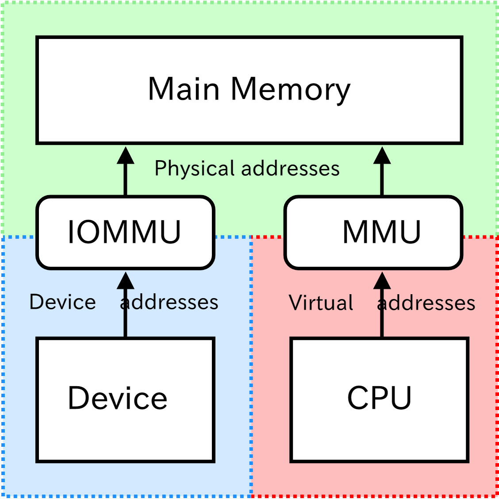

# 0x00. 导读

# 0x01. 简介

IOMMU(Input/Output Memory Management Unit, 输入输出的内存管理单元) 是一种 内存管理单元 (MMU，Memory Management Unit) ，它将具有 直接存储器访问（DMA） 能力的 I/O总线 连接至 主内存（Main Memory）。



说明：
- MMU（Memory Management Unit，内存管理单元） 支持多进程的虚拟地址共享同一个物理内存，以及对物理地址的访问进行权限检查的一个硬件单元
- 传统的MMU（内存管理单元）会把 CPU 访问的 虚拟地址 转化成为 物理地址
- IOMMU 把 设备（device） 访问的 虚拟地址 转化成 物理地址
- 有些 IOMMU 提供了访问内存保护机制防止错误地访问内存

使用场景：  
在虚拟化技术（virtualization）：虚拟机操作系统（Guest OS） 通常不知道它所访问的宿主机物理内存地址。如果对物理内存进行 DMA（Direct Memory Access） 操作，有可能破坏内存，因为硬件不知道给定 Guest OS 与宿主机物理地址之间的映射关系。IOMMU 可以依靠将客户机物理地址映射到宿主机物理地址的相同或兼容转换表（translation table） 映射（re-mapping）硬件访问地址，从而解决延迟问题。

# 0x02. 

# 0x03. 配置方法

1. 修改 /etc/default/grub，在字段 GRUB_CMDLINE_LINUX 后添加：
    ```
    # intel
    GRUB_CMDLINE_LINUX="... intel_iommu=on"

    # amd
    GRUB_CMDLINE_LINUX="... amd_iommu=on"
    ```
2. 修改 grub
    ```
    grub2-mkconfig -o /boot/grub2/grub.cfg
    # or
    grub-mkconfig -o /boot/grub/grub.cfg
    ```
3. 重启
    ```
    reboot
    ```