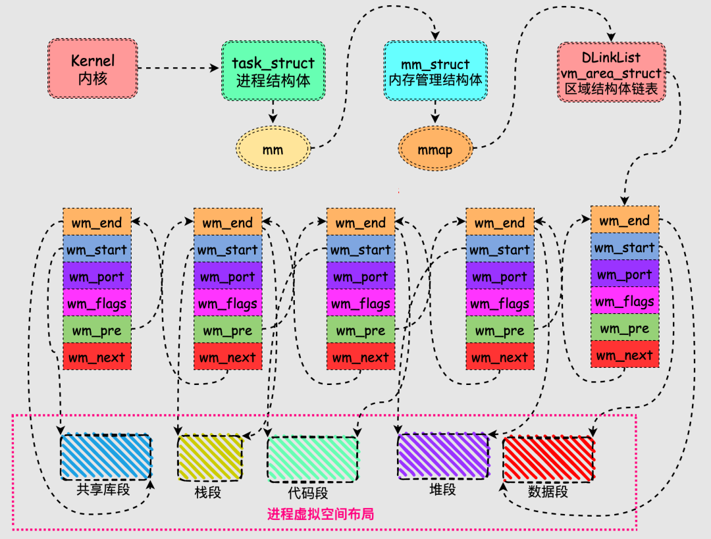

# 0x00、导读


# 0x01、简介

1. 物理内存分为三个层级：节点(node)、管理区(zone)、页面(page) ，类似国家的省、县、乡。

2. 提供不同的内存获取：buddy system、slab allocator和kmalloc。就像超市、批发部、小卖店去进货一样。

3. 物理内存有分配也有释放，内存不够的时候就要进行内存回收。  
    - 内存规整，也就是内存碎片整理。  
    - 页帧( page frame )回收。
        - 内核的物理内存是不换页的，所以内核只会进行缓存回收。
        - 用户空间的物理内存是可以换页的，所以会对用户空间的物理内存进行换页以便回收其物理内存。用户空间的物理内存分为文件页和匿名页。对于文件页，如果其是 clean 的，可以直接丢弃内容，回收其物理内存，如果其是 dirty 的，则会先把其内容写回到文件，然后再回收内存。对于匿名页，如果系统配置的有 swap 区的话，则会把其内容先写入 swap 区，然后再回收，如果系统没有 swap 区的话则不会进行回收。
    
    把进程占用的但是当前并不在使用的物理内存进行回收，并分配给新的进程来使用的过程就叫做换页。进程被换页的物理内存后面如果再被使用到的话，还会通过缺页异常再换入内存。
    -  OOM Killer  
        OOM Killer会按照一定的规则选择一个进程将其杀死，然后其物理内存就被释放了。

4. 内核页表建立好了之后就不会再取消了，所以内核是不换页的，用户页表建立之后可能会因为内存回收而取消，所以用户空间是换页的。  
内核页表是在内核启动时建立的，所以内核空间的映射是线性映射，用户空间的页表是在运行时动态创建的，不可能做到线性映射，所以是随机映射。

5. 进程的虚拟地址空间是由用户空间和内核空间组成，底部 0~3G 为用户空间，顶部 3~4G 为内核空间。
虽然（在两个用户进程之间的）上下文切换期间会改变下半部分，但虚拟地址空间的内核部分总是保持不变。

# 0x02、层级

## 2.1 NODE

UMA 只有一个节点， NUMA 可以有多个节点。
`ls /sys/devices/system/node/node*`

## 2.2 ZONE

物理内存划分了六个 ZONE 。
`cat /proc/zoneinfo | grep zone`

    除了第一个节点能包含所有的区域类型之外，其它的节点并不能包含所有的区域类型，因为有些区域类型( DMA、DMA32 )必须从物理内存的起点开始。

1. ZONE_DMA  
    - 由配置项 CONFIG_ZONE_DMA 决定是否存在。
    - 在 x86 上 DMA 内存区域是物理内存的前 16M ，这是因为早期的 ISA 总线上的 DMA 控制器只有 24 根地址总线，只能访问 16M 物理内存。为了兼容这些老的设备，所以需要专门开辟前 16M 物理内存作为一个区域供这些设备进行DMA操作时去分配物理内存。

2. ZONE_DMA32   
    - 由配置项 CONFIG_ZONE_DMA32 决定是否存在。
    - 后来的 DMA 控制器有 32 根地址总线，可以访问 4G 物理内存了。但是在 32 位的系统上最多只支持 4G 物理内存，所以没必要专门划分一个区域。但是到了 64 位系统时候，很多CPU能支持 48 位到 52 位的物理内存，于是此时就有必要专门开个区域给 32 位的 DMA 控制器使用了。

3. ZONE_NORMAL   
    - 常规内存，无配置项控制，必然存在，除了其它几个内存区域之外的内存都是常规内存 ZONE_NORMAL 。

4. ZONE_HIGHMEM   
    - 由配置项 CONFIG_HIGHMEM 决定是否存在。
    - 只在 32 位系统上有，因为内核的虚拟地址空间只有 1GB ，但它需要访问整个 4GB 的物理空间:
        - 从物理地址 0~896MB 的部分（ZONE_DMA+ZONE_NORMAL) ，直接加上 3GB 的偏移（在 Linux 中用 PAGE_OFFSET 表示），就得到了对应的虚拟地址，这种映射方式被称为线性/直接映射 (Direct Map) 。

        - 而 896M~4GB 的物理地址部分 (ZONE_HIGHMEM) 需要映射到 (3G+896M) ~ 4GB 这 128MB 的虚拟地址空间，显然也按线性映射是不行的。
        采用的是做法是，ZONE_HIGHMEM 中的某段物理内存和这 128M 中的某段虚拟空间建立映射，完成所需操作后，需要断开与这部分虚拟空间的映射关系，以便 ZONE_HIGHMEM 中其他的物理内存可以继续往这个区域映射，即动态映射的方式。

        - 对于虚拟地址空间，0 ~ 3G 是用户空间，3G ~ 3G + 896Mb 称为 LowMem ，3G + 896 Mb ~ 4G 称为 HighMem 。

5. ZONE_MOVABLE   
    - 可移动内存，无配置项控制，必然存在，用于可热插拔的内存。
    - 内核启动参数 movablecore 用于指定此区域的大小。内核参数 kernelcore 也可用于指定非可移动内存的大小，剩余的内存都是可移动内存。如果两者同时指定的话，则会优先保证非可移动内存的大小至少有 kernelcore 这么大。如果两者都没指定，则可移动内存大小为 0 。

6. ZONE_DEVICE   
    - 设备内存，由配置项 CONFIG_ZONE_DEVICE 决定是否存在，用于放置持久内存(也就是掉电后内容不会消失的内存)。
    - 一般的计算机中没有这种内存，默认的内存分配也不会从这里分配内存。持久内存可用于内核崩溃时保存相关的调试信息。


## 2.3 PAGE

物理内存页面也叫做页帧( page frame )。  
物理内存从开始起每 4K 构成一个个页帧，这些页帧的编号依次是 0、1、2、3... 。页帧的编号也叫做 PFN(page frame number)。  
很显然，一个页帧的物理地址和它的 PFN 有一个简单的数学关系，那就是其物理地址除以 4096(4K) 就是其 PFN ，其 PFN 乘以 4096(4K) 就是其物理地址。
```C
// PAGE_SHIFT 是 12
#define PFN_PHYS(x) ((phys_addr_t)(x) << PAGE_SHIFT)
#define PHYS_PFN(x) ((unsigned long)((x) >> PAGE_SHIFT))
```

# 0x03、段( segment )

`0x08048000` 是 `text` 段的起始位置，后面分别跟着 `data` 段、 `bss` 段。

每个 segment 用一个 vm_area_struct (以下简称vma) 结构体表示。 /proc/PID/maps ( 解析详情参见 [proc下的文件](./proc%E4%B8%8B%E7%9A%84%E6%96%87%E4%BB%B6.md) )查看一个进程的所有 vma 在虚拟地址空间的分布情况，其内部实现靠的就是对这个链表的遍历。
```C
struct vm_area_struct 
{ 
    // vma 所指向区域的起始地址和结束地址
	unsigned long vm_start; 
	unsigned long vm_end;  
    // 前后另一个 vma 节点
	struct vm_area_struct *vm_next, *vm_prev; 
	rb_node_t vm_rb; 
    /* 
     * 描述的是vma的属性， flag 可以是 VM_READ 、 VM_WRITE 、 VM_EXEC 、 VM_SHARED ，分别指定 vma 的内容是否可以读、写、执行，或者由几个进程共享。
     * vma 由许多的虚拟 pages 组成，每个虚拟 page 需要经过 page table 的转换才能找到对应的物理页面。这个地方的属性会复制到这个 vma 所含 pages 的 PTE 中。
    */
    unsigned long vm_flags;
    /*
     * 可执行文件和动态链接库的 text 段和 data 段是基于 elf 文件的，
     * mmap 对文件的映射也是对应外部存储介质中这个被映射的文件的，
     * 这两种情况下， vm_file 指向这个被映射的文件，进而可获得该文件的 inode 信息，
     * 而 vm_pgoff 是这个段在该文件内的偏移。

     * 对于 text 段，一般偏移就是 0 。对于 heap 段， stack 段以及 mmap 的匿名映射，
     * 没有与之相对应的文件实体，此时 vm_file 就为 NULL ， vm_pgoff 的值没有意义。
    */
    struct file * vm_file;
    unsigned long vm_pgoff;
	struct mm_struct * vm_mm; 
	...
}
```



# 0x04、虚拟地址空间详解


## 1. 保留区

0x08048000 ，因为“历史原因”前面 128.28125MB 属于保留空间。  

[On Linux, why does the text segment start at 0x08048000? What is stored below that address?](https://www.quora.com/On-Linux-why-does-the-text-segment-start-at-0x08048000-What-is-stored-below-that-address)  
[Where are "the kernel stack", "Frames for C run-time startup functions", and "Frame for main()" in the memory layout of a program?](https://unix.stackexchange.com/questions/466389/where-are-the-kernel-stack-frames-for-c-run-time-startup-functions-and-fr)

## 2. 代码段( TEXT )

代码段也称正文段或文本段，通常用于存放程序执行代码(即CPU执行的机器指令)。通常代码段是可共享的，因此频繁执行的程序只需要在内存中拥有一份拷贝即可。代码段通常属于只读，以防止其他程序意外地修改其指令(对该段的写操作将导致段错误)。某些架构也允许代码段为可写，即允许修改程序。

代码段指令中包括操作码和操作对象(或对象地址引用)。若操作对象是立即数(具体数值)，将直接包含在代码中；若是局部数据，将在栈区分配空间，然后引用该数据地址；若位于BSS段和数据段，同样引用该数据地址。

## 3. 数据段( DATA )

数据段通常用于存放程序中已初始化且初值不为0的全局变量和静态局部变量。数据段属于静态内存分配(静态存储区)，可读可写。

数据段与BSS段的区别如下：

- BSS段不占用物理文件尺寸，但占用内存空间；  
    数据段占用物理文件，也占用内存空间。  
    对于大型数组如 int ar0[10000] = {1, 2, 3, ...} 和 int ar1[10000] ，ar1 放在 BSS 段，只记录共有 10000*4 个字节需要初始化为 0，而不是像 ar0 那样记录每个数据 1、2、3... ，此时 BSS 为目标文件所节省的磁盘空间相当可观。

- 当程序读取数据段的数据时，系统会出发缺页故障，从而分配相应的物理内存；当程序读取BSS段的数据时，内核会将其转到一个全零页面，不会发生缺页故障，也不会为其分配相应的物理内存。

## 4. BSS

BSS(Block Started by Symbol)段中通常存放程序中以下符号：

- 未初始化的全局变量和静态局部变量
- 初始值为0的全局变量和静态局部变量(依赖于编译器实现)
- 未定义且初值不为0的符号(该初值即common block的大小)

## 5. LowMem( 3G ~ 3G + 896Mb )

内核也是由一个 elf 文件（比如 vmlinux ）加载启动的，加载后也有 text 段， data 段， bss 段等。
## 6. vmalloc

系统会在 low memory 和 VMALLOC 区域留 8M ，防止访问越界。

VMALLOC_START 到 VMALLOC_END 之间称为内核动态映射空间，也即内核想像用户态进程一样 malloc 申请内存，在内核里面可以使用 vmalloc。

## 7. 持久映射

内核专门为此留出一块线性空间，从 PKMAP_BASE 到 FIXADDR_START ，用于映射高端内存。  
这个空间起叫”内核永久映射空间”或者”永久内核映射空间”。  
通过 kmap()，可以把一个 page 映射到这个空间来。由于这个空间是 4M 大小，最多能同时映射 1024 个 page。因此，对于不使用的的 page，及应该时从这个空间释放掉（也就是解除映射关系），通过 kunmap() ，可以把一个 page 对应的线性地址从这个空间释放出来。

## 8. 固定映射/临时映射

FIXADDR_START 到 FIXADDR_TOP(0xFFFF F000) 的空间，称为固定映射区域，主要用于满足特殊需求。  
这块空间具有如下特点：  
1. 每个 CPU 占用一块空间
2. 在每个 CPU 占用的那块空间中，又分为多个小空间，每个小空间大小是 1 个 page，每个小空间用于一个目的，这些目的定义在 kmap_types.h 中的 km_type 中。

固定映射地址的优点在于，在编译时对此类地址的处理类似于常数，内核一启动即为其分配了物理地址。此类地址的解引用比普通指针要快速。内核会确保在上下文切换期间，对应于固定映射的页表项不会从 TLB 刷出，因此在访问固定映射的内存时，总是通过 TLB 高速缓存取得对应的物理地址。

对每个固定映射地址都会创建一个常数，加入到 fixed_addresses 枚举值列表中。