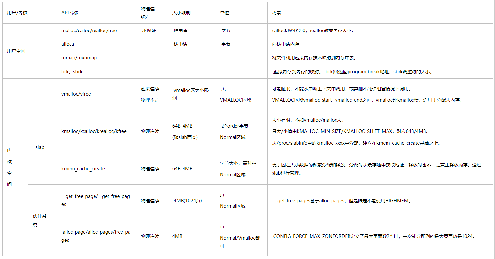

# 0x00. 导读

[Buddy Allocator](./alloc_memory01.md)  
[Slab Allocator](./alloc_memory02.md)  
[mmap](./alloc_memory03.md)  
[malloc](./alloc_memory04.md)  


# 0x01. 简介

页是 Linux 内核进行内存管理的基本单元。绝大部分的情况是 32-bit 使用 4KB 页大小， 64-bit 使用 8KB 页大小。这意味着如果一台机器的物理内存为 1GB 大小，大小为 4KB ，那么它的物理内存会被分为 262144 个页。

page 结构体只表示物理内存的 page frame.

```c
struct page
{
    unsigned long flags;
    atomic_t _count;
    atomic_t _mapcount;
    unsigned long private;
    struct address_space *mapping;
    pgoff_t index;
    struct list_head lru;
    void *virtual;
}
```

- `flags` 域存储 page 的状态，比如 page 是否 dirty ，是否被锁在内存中。
- `_count` 域存储该 page 的引用计数。为负时表示该 page 未被使用，正数则表示该页正在被使用。一个页可能被 page cache 使用，也可能被 page table 映射，或者作为私有数据，内核一般不会直接访问 __count 域，而是使用 page_count() 函数来获得，该函数在 _count 为负时会返回 0 。
- `virtual` 域存储该 page 的虚拟地址，high memory 不能永久地映射到内存的地址空间中，这种情况下 virtual 域将被置为 NULL.

对于内核空间，根据不同的映射规则，可以将整个内核空间划分为四大部分：直接映射区、vmalloc区、永久内核映射区和固定映射的线性地址区域。第一个称为 LowMem ，后面三个称为 HighMem 。


**对于 ZONE_HIGH, 并没有和内核地址空间建立一一对应的关系(即虚拟地址=物理地址 + PAGE_OFFSET 这样的关系)，所以不能使用 get_free_pages() 这样的页分配器进行内存的分配，而必须使用 alloc_pages() 这样的伙伴系统算法的接口得到 page 结构，然后将其映射到内核地址空间，注意这个时候映射后的地址并非和物理地址相差 PAGE_OFFSET.**

对应高端内存的3部分，高端内存映射有三种方式：
- 映射到”内核动态映射空间”（noncontiguous memory allocation）（VMALLOC_START - VMALLOC_END）

- 持久内核映射（permanent kernel mapping）  

- 临时映射（temporary kernel mapping） 

# 0x02. 物理页分配

[内核空间物理页分配](./alloc_memory05.md)

# 0x03. 字节分配

[内核空间字节分配](./alloc_memory06.md)

# 0x04. slab 层

[slab 分配器](./alloc_memory02.md)

# 0x05. 高端内存的映射

[HighMem 映射](./alloc_memory07.md)


# 0x06. 总结

- 需要连续的物理页: kmalloc()，这是内核中内存分配的常用的方法。通过 GFP_ATOMIC 或 GFP_KERNEL 等标志指示是分配时的行为，如是否允许休眠、访问 I/O 等。
- 需要高端内存: alloc_pages()。高端内存可能没有映射到虚拟地址空间，只能通过 page 结构的方式返回，然后可以通过 kmap 函数将其永久或临时映射到虚拟地址空间。
- 如果不要求连续的物理页，仅要求虚拟地址连续: vmalloc()，这会把离散的物理地址映射到连续的虚拟地址上，底层需要借助页表，会比 kmalloc() 来的慢
- 需要频繁分配和释放较大的对象(数据结构)，使用: slab cache。slab 会预分配一块空间，并划分出一个个对象容器，并用链表连接，分配和释放对象并不需要经常 malloc，而是填充或释放这些对象容器。
- 如果已经分配好了物理内存（比如 alloc_page() 后），只是想建立映射，则可以使用 vmap() 。 vmap() 算是 vmalloc() 的一个组成部分。


