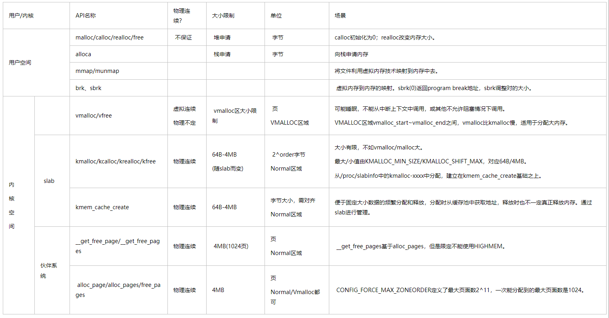

# 0x00. 导读

介绍 Buddy Allocator.

# 0x01. 简介

# 0x02. Buddy System

buddy算法的数学原理：
任何一个正整数都可以拆解成多个2^n之和这种多项式的表示形式。

1. 伙伴系统的基本管理单位是 zone，最小分配粒度是 page。
2. 伙伴系统并不是直接管理一个个页帧的，而是把页帧组成页块( pageblock )来管理。
    - 页块是由连续的 2^n 个页帧组成， n 叫做这个页块的阶，范围是 0 到 10 。
    - 对齐，n 阶的页块首页帧的页帧号( PFN )必须是 2^n 的倍数。  
        比如 3 阶页块的首页帧( PFN )必须除以 8(2^3) 能除尽， 10 阶页块的首页帧必须除以 1024(2^10) 能除尽。 0 阶页块只包含一个页帧，任意一个页帧都可以构成一个 0 阶页块，而且符合对齐要求，因为任何整数除以 1(2^0) 都能除尽。
3. 分配 n 阶页块的过程如下： 
    - 查看是否有空闲的 n 阶页块，如果有直接分配；否则，继续执行下一步；
    - 查看是否存在空闲的（n+1）阶页块，如果有，把（n+1）阶页块分裂为两个 n 阶页块，一个插入空闲 n 阶页块链表，另一个分配出去；否则继续执行下一步。如果没有，继续查看更高阶是否存在空闲页块。
3. `/proc/buddyinfo` 可以查看各个 n 阶页块空闲数量。

## vmalloc

1. 内核申请非常大块内存的接口，申请的内存使用的虚拟地址空间是“vmalloc映射区”
2. 特点：内核空间使用，虚拟地址连续。

## malloc

2. 特点：用户空间使用，虚拟地址连续。

## CMA

连续内存分配器， continuous memory allocater ，它并非独立存在而是与 DMA 的 API 结合在一起的，是 DMA 内存申请 API 的后端。

目的是为 DMA 提供连续的物理地址空间，避免因 buddy 内存碎片化导致 DMA 无法使用内存的情况。

