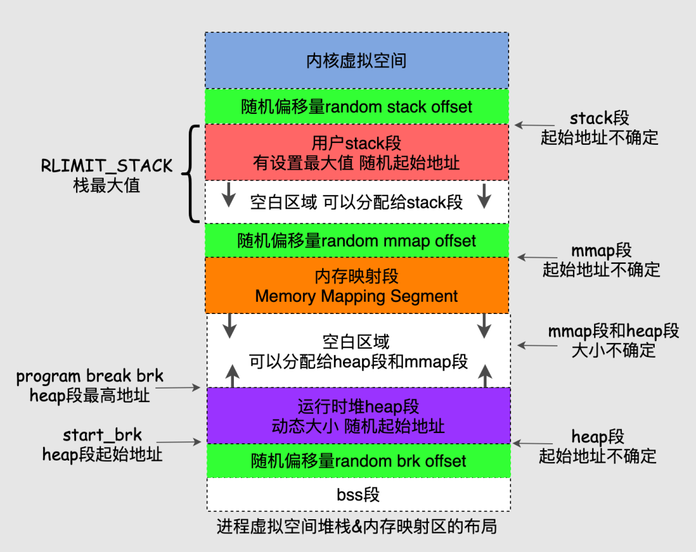

# 0x00. 导读

介绍 malloc.  

[Linux内存背后的那些神秘往事](http://www.uml.org.cn/embeded/202203021.asp)

# 0x01. 简介

- 在用户态层面，进程使用库函数 malloc 分配的是虚拟内存，并且系统是延迟分配物理内存的，由缺页中断来完成分配
- 在内核态层面，内核也需要物理内存，并且使用了另外一套不同于用户态的分配机制和系统调用函数


- buddy system 和 slab 属于内核级别的内存分配器，同时为内核层面内存分配和用户层面内存分配提供服务，算是终极 boss
- 内核有自己单独的内存分配函数 kmalloc/vmalloc ，和用户态的不一样，毕竟是中枢机构
- 用户态的进程通过库函数 malloc 来玩转内存， malloc 调用了 brk/mmap 这两个系统调用，最终触达到伙伴系统实现内存分配
- 内存分配器分为两大类：用户态和内核态，用户态分配和释放内存最终还是通过内核态来实现的，用户态分配器更加贴合进程需求，有种社区居委会的感觉

进程的内存分配器工作于内核和用户程序之间，主要是为了实现用户态的内存管理。

分配器响应进程的内存分配请求，向操作系统申请内存，找到合适的内存后返回给用户程序，当进程非常多或者频繁内存分配释放时，每次都找内核老大哥要内存/归还内存，可以说十分麻烦。

总麻烦大哥，也不是个事儿，于是分配器决定自己搞管理！

- 分配器一般都会预先分配一块大于用户请求的内存，然后管理这块内存
- 进程释放的内存并不会立即返回给操作系统，分配器会管理这些释放掉的内存从而快速响应后续的请求


说到管理能力，每个人每个国家都有很大差别，分配器也不例外，要想管好这块内存也挺难的，场景很多要求很多，于是就出现了很多分配器：


malloc 函数是 glibc 提供的库函数， glibc 的内存管理使用的方法是 ptmalloc2:
```
dlmalloc  – General purpose allocator, 鼻祖级别
ptmalloc2 – glibc, 认为是 dlmalloc 的扩展版本
jemalloc  – FreeBSD and Firefox
tcmalloc  – Google
libumem   – Solaris
```


把heap段、stack段、mmap段再细化一张图：



# 0x02. 两条路

```c
#include <unistd.h>
int brk(void *addr);
void *sbrk(intptr_t increment);
```
- brk 函数将 break 指针直接设置为某个地址，相当于绝对值
- sbrk 将 break 指针从当前位置移动 increment 所指定的增量，相当于相对值
本质上 brk 和 sbrk 作用是一样的都是移动 break 指针的位置来扩展内存

malloc 的核心工作就是组织管理内存，高效响应进程的内存使用需求，同时保证内存的使用率，降低内存碎片化。


当开辟的空间小于 128K 时，调用 brk() 函数；当开辟的空间大于 128K 时，调用 mmap() 函数。

## 2.1 (s)brk 这条路

对于堆的操作，操作系统提供了 brk 函数，glibc 库提供了 sbrk 函数，我们可以通过增加 brk 的大小来向操作系统申请内存。

初始时，堆的起始地址 start_brk 以及堆的当前末尾 brk 指向同一地址。根据是否开启 ASLR，两者的具体位置会有所不同
- 不开启 ASLR 保护时，start_brk 以及 brk 会指向 data/bss 段的结尾。
- 开启 ASLR 保护时，start_brk 以及 brk 也会指向同一位置，只是这个位置是在 data/bss 段结尾后的随机偏移处。

```c
/* sbrk and brk example */
#include <stdio.h>
#include <unistd.h>
#include <sys/types.h>

int main()
{
    void *curr_brk, *tmp_brk = NULL;

    printf("Welcome to sbrk example:%d\n", getpid());

    /* sbrk(0) gives current program break location */
    tmp_brk = curr_brk = sbrk(0);
    printf("Program Break Location1:%p\n", curr_brk);
    getchar();

    /* brk(addr) increments/decrements program break location */
    brk(curr_brk+4096);

    curr_brk = sbrk(0);
    printf("Program break Location2:%p\n", curr_brk);
    getchar();

    brk(tmp_brk);

    curr_brk = sbrk(0);
    printf("Program Break Location3:%p\n", curr_brk);
    getchar();

    return 0;
}
```

在第一次调用 brk 之前

从下面的输出可以看出，并没有出现堆。
```
start_brk = brk = end_data = 0x804b000

$ ./sbrk
Welcome to sbrk example:6141
Program Break Location1:0x804b000
...
$ cat /proc/6141/maps
...
0804a000-0804b000 rw-p 00001000 08:01 539624     /home/centos/test/sbrk
b7e21000-b7e22000 rw-p 00000000 00:00 0
...
$
```
第一次增加 brk 后，从下面的输出可以看出，已经出现了堆段
```
start_brk = end_data = 0x804b000
brk = 0x804c000

$ ./sbrk
Welcome to sbrk example:6141
Program Break Location1:0x804b000
Program Break Location2:0x804c000
...
$ cat /proc/6141/maps
...
0804a000-0804b000 rw-p 00001000 08:01 539624     /home/centos/test/sbrk
0804b000-0804c000 rw-p 00000000 00:00 0          [heap]
b7e21000-b7e22000 rw-p 00000000 00:00 0
...
```

## 2.2 mmap 这条路

malloc 会使用 mmap 来创建独立的匿名映射段。匿名映射的目的主要是可以申请以 0 填充的内存，并且这块内存仅被调用进程所使用。

```c
/* Private anonymous mapping example using mmap syscall */
#include <stdio.h>
#include <sys/mman.h>
#include <sys/types.h>
#include <sys/stat.h>
#include <fcntl.h>
#include <unistd.h>
#include <stdlib.h>

void static inline errExit(const char* msg)
{
    printf("%s failed. Exiting the process\n", msg);
    exit(-1);
}

int main()
{
    int ret = -1;
    printf("Welcome to private anonymous mapping example::PID:%d\n", getpid());
    printf("Before mmap\n");
    getchar();
    char* addr = NULL;
    addr = mmap(NULL, (size_t)132*1024, PROT_READ|PROT_WRITE, MAP_PRIVATE | MAP_ANONYMOUS, -1, 0);
    if (addr == MAP_FAILED)
            errExit("mmap");
    printf("After mmap\n");
    getchar();

    /* Unmap mapped region. */
    ret = munmap(addr, (size_t)132*1024);
    if(ret == -1)
            errExit("munmap");
    printf("After munmap\n");
    getchar();
    return 0;
}
```

在执行 mmap 之前，我们可以从下面的输出看到，目前只有 .so 文件的 mmap 段。
```
$ cat /proc/6067/maps
08048000-08049000 r-xp 00000000 08:01 539691     /home/centos/test
08049000-0804a000 r--p 00000000 08:01 539691     /home/centos/test
0804a000-0804b000 rw-p 00001000 08:01 539691     /home/centos/test
b7e21000-b7e22000 rw-p 00000000 00:00 0
...
```

mmap 后，从下面的输出可以看出，我们申请的内存与已经存在的内存段结合在了一起构成了 b7e00000 到 b7e21000 的 mmap 段( 135168 = 0x21000 = 1024 * 132)。

```
$ cat /proc/6067/maps
08048000-08049000 r-xp 00000000 08:01 539691     /home/centos/test
08049000-0804a000 r--p 00000000 08:01 539691     /home/centos/test
0804a000-0804b000 rw-p 00001000 08:01 539691     /home/centos/test
b7e00000-b7e22000 rw-p 00000000 00:00 0
...
$
```

munmap 后，从下面的输出，我们可以看到我们原来申请的内存段已经没有了，内存段又恢复了原来的样子了。

```
$ cat /proc/6067/maps
08048000-08049000 r-xp 00000000 08:01 539691     /home/centos/test
08049000-0804a000 r--p 00000000 08:01 539691     /home/centos/test
0804a000-0804b000 rw-p 00001000 08:01 539691     /home/centos/test
b7e21000-b7e22000 rw-p 00000000 00:00 0
...
```

# 0x03. malloc 的背后

事情没有一蹴而就，我们很难理解内存分配器设计者面临的复杂问题，因此当我们看到 malloc 底层复杂的设计逻辑时难免没有头绪，所以要忽略细节抓住主线多看几遍。

malloc 将内存分成了大小不同的 chunk ， malloc 将相似大小的 chunk 用双向链表链接起来，这样一个链表被称为一个 bin。

这些空闲的不同大小的内存块 chunk 通过 bin 来组织起来，换句话说 bin 是空闲内存块 chunk 的容器。

malloc 一共维护了 128 个bin，并使用一个数组来存储这些 bin。


malloc中128个bin的bins数组存储的chunk情况如下：


- bins[0] 目前没有使用
- bins[1] 的链表称为 unsorted_list ，用于维护 free 释放的 chunk。
- bins[2,63] 总计长度为 62 的区间称为 small_bins ，用于维护 ＜512B 的内存块，其中每个 bin 中对应的链表中的 chunk 大小相同，相邻 bin 的大小相差 8 字节，范围为 16 字节 到 504 字节。


- bins[64,126] 总计长度为 63 的区间称为 large_bins ，用于维护大于等于 512 字节的内存块，每个元素对应的链表中的 chunk 大小不同，数组下标越大链表中 chunk 的内存越大， large bins 中的每一个 bin 分别包含了一个给定范围内的 chunk ，其中的 chunk 按大小递减排序，最后一组的 large_bin 链中的 chunk 大小无限制，该 bins 的使用频率低于 small bins。

malloc 中还有几种特殊的 bin 和 chunk:
- fast bin
- unsorted bin
- top chunk
- last remainder chunk


