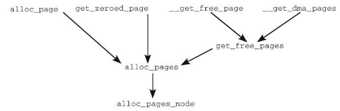

# 0x00. 导读

内核空间物理页分配。

# 0x01. 简介

# 0x02. 函数

两个基本函数是：
```c
struct page * alloc_pages(gfp_t gfp_mask, unsigned int order)
unsigned long __get_free_pages(gfp_t gfp_mask, unsigned int order) 
```

`__get_free_pages` 是基于 `alloc_pages` ，但是 `__get_free_pages` 限定了是不能使用 HighMem ，而是使用内核的直接映射区。分配页面物理连续。

`alloc_pages` 是直接映射区和 VMALLOC 都可以。分配页面物理连续。

```c
// 分配 2^order 个连续的物理页，返回指向第一个页的指针
struct page * alloc_pages(gfp_t gfp_mask, unsigned int order)	

// 分配单个物理页，返回指向该页的指针
#define alloc_page(gfp_mask)    \
        alloc_pages(gfp_mask, 0)

#ifdef CONFIG_NUMA
    extern struct page *alloc_pages_current(gfp_t gfp_mask, unsigned order);

    static inline struct page *
    alloc_pages(gfp_t gfp_mask, unsigned int order)
    {
        return alloc_pages_current(gfp_mask, order);
    }
#else
    #define alloc_pages(gfp_mask, order) \
            alloc_pages_node(numa_node_id(), gfp_mask, order)
// alloc_pages_node -> __alloc_pages_node(nid, gfp_mask, order) -> __alloc_pages -> __alloc_pages_nodemask
#endif

```

```c
// 分配 2^order 个连续的物理页，返回第一个页映射后的虚拟地址。 __get_free_pages() 就是比 alloc_pages() 多了一个地址转换的工作，因为 CPU 直接使用的是虚拟地址，这样做也是为了给调用者提供更大的方便。
unsigned long __get_free_pages(gfp_t gfp_mask, unsigned int order)	

// alloc_pages 和 __get_free_pages 这 2 个函数都会获得 2^order 个 page frames, 这些 pages 在物理地址上是连续的。
// 之所以要求是 2 的 n 次方，这是由底层的 buddy 分配机制决定的。
// order 需大于或等于 0，如果只需要一个 page ，可设置 order 为 0 ，也可以直接调用现成的 alloc_page(gfp_mask)。

// 那谁会放着可以一口气分配多个 page frames 的 alloc_pages() 不用，而是去调用 alloc_page() 一个个的分呢？那就是 vmalloc() 啦，因为 vmalloc() 分配的物理内存可能是不连续的，所以不能直接使用 alloc_pages()

// 分配单个物理页，并返回该页的逻辑地址
#define __get_free_page(gfp_mask) \
		__get_free_pages((gfp_mask), 0)

// 分配单个物理页，将页内容置为0，并返回该页的逻辑地址
unsigned long get_zeroed_page(gfp_t gfp_mask)
{
	return __get_free_pages(gfp_mask | __GFP_ZERO, 0);
}

// 从DMA内存分区进行内存分配。
#define __get_dma_pages(gfp_mask, order) \
		__get_free_pages((gfp_mask) | GFP_DMA, (order))


// 传入参数为页指针，返回参数为逻辑地址。
void * page_address(struct page *page)
```



## 2.1 gfp 参数

gfp 是 get free page 的缩写，这个参数由 3 种 flag 组成，分别为 `action modifier`, `zone modifier`, `type` 。

- `actions modifier` 规定了内核应该如何分配内存（比如中断处理程序获取内存时要求不能睡眠）

    - __GFP_WAIT: The allocator can sleep.
    - __GFP_HIGH: The allocator can access emergency pools.
    - __GFP_IO: The allocator can start disk I/O.
    - __GFP_FS: The allocator can start filesystem I/O.
    - __GFP_COLD: The allocator should use cache cold pages.
    - __GFP_NOWARN: The allocator does not print failure warnings.
    - __GFP_REPEAT: The allocator repeats the allocation if it fails, but the allocation can potentially fail.
    - __GFP_NOFAIL: The allocator indefinitely repeats the allocation. The allocation cannot fail.
    - __GFP_NORETRY: The allocator never retries if the allocation fails.
    - __GFP_NOMEMALLOC: The allocator does not fall back on reserves.
    - __GFP_HARDWALL: The allocator enforces “hardwall” cpuset boundaries.
    - __GFP_RECLAIMABLE: The allocator marks the pages reclaimable.
    - __GFP_COMP: The allocator adds compound page metadata (used internally by the hugetlb code).

- `zone modifyer` 规定了从哪个区域（zone）分配内存

    - __GFP_DMA: Allocates only from ZONE_DMA
    - __GFP_DMA32: Allocates only from ZONE_DMA32
    - __GFP_HIGHMEM: Allocates from ZONE_HIGHMEM or ZONE_NORMAL  
    未指定 zone modifier 默认从 ZONE_DMA 或者 ZONE_NORMLA 分配，会优先选择 ZONE_NORMAL


- `type flags` 实际上是前两者的组合，是为了方便某些场合下规定特定的 flags 而设计的，简化了 flags 的指定，减少错误的发生。

    - GFP_ATOMIC: The allocation is high priority and must not sleep. This is the flag to use in interrupt handlers, in bottom halves, while holding a spinlock, and in other situations where you cannot sleep.
    - GFP_NOWAIT: Like GFP_ATOMIC, except that the call will not fallback on emergency memory pools. This increases the liklihood of the memory allocation failing.
    - GFP_NOIO: This allocation can block, but must not initiate disk I/O. This is the flag to use in block I/O code when you cannot cause more disk I/O, which might lead to some unpleasant recursion.
    - GFP_NOFS: This allocation can block and can initiate disk I/O, if it must, but it will not initiate a filesystem operation. This is the flag to use in filesystem code when you cannot start another filesystem operation.
    - GFP_KERNEL: This is a normal allocation and might block. This is the flag to use in process context code when it is safe to sleep. The kernel will do whatever it has to do to obtain the memory requested by the caller. This flag should be your default choice.
    - GFP_USER: This is a normal allocation and might block. This flag is used to allocate memory for user-space processes.
    - GFP_HIGHUSER: This is an allocation from ZONE_HIGHMEM and might block. This flag is used to allocate memory for user-space processes.
    - GFP_DMA: This is an allocation from ZONE_DMA. Device drivers that need DMA-able memory use this flag, usually in combination with one of the preceding flags.

    其中最常使用的是 GFP_KERNEL 、 GFP_ATOMIC 、 GFP_DMA.  
    GPF_KERNEL 表明分配过程是可以阻塞的，进程可以进入睡眠状态，这种情况下分配成功率最高，因为内核可以进行内存的 swap （在内存不足是将物理页的内容保存到磁盘上，释放内存空间）等操作。

    GPF_ATOMIC 表明分配过程不能阻塞，进程不能进入睡眠状态，常见于中断处理程序中。因为进程不能被阻塞，所以内核无法进行内存 swap 等操作，成功率相对于 GPF_KERNEL 低一些。

    GFP_DMA 表明这个内存将用于 DMA 操作，分配的内存必须要在 ZONE_DMA 区域中
