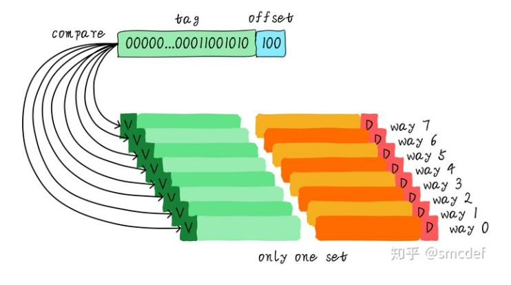

# 0x00 导读

1. cache 简介
2. cache placement: 直接映射、组相连、全相连

[CPU缓存一致性协议](https://icefrozen.github.io/article/why-memory-barriers-1/)

# 0x01 简介

当 CPU 试图从某地址 load 数据时，首先从 L1 cache 中查询是否命中，如果命中则把数据返回给 CPU 。如果 L1 cache 缺失，则继续从 L2 cache 中查找。当 L2 cache 命中时，数据会返回给 L1 cache 以及 CPU 。如果 L2 cache 也缺失，则需要从主存中 load 数据，将数据返回给 L2 cache 、 L1 cache 及 CPU 。


## 1.1 Cache

Cache 的主要原理是利用:  
- `Spatial Locality` ( 空间局部性：引用过的位置很可能在不远的将来会再引用旁边的位置 )   
- `Temporal Locality` ( 时间局部性：引用了一次很可能在不远的将来还会再引用一次 )。

可以使用 `lscpu` 查看 cpu cache.
```bash
$ lscpu
...
Caches (sum of all):
  L1d:               384 KiB (12 instances)
  L1i:               384 KiB (12 instances)
  L2:                3 MiB (12 instances)
  L3:                40 MiB (2 instances)
...
```

或者

```bash
# 查看 cache line 的大小
$ getconf -a | grep CACHE
LEVEL1_ICACHE_SIZE                 32768
LEVEL1_ICACHE_ASSOC                8
LEVEL1_ICACHE_LINESIZE             64
LEVEL1_DCACHE_SIZE                 32768
LEVEL1_DCACHE_ASSOC                8
LEVEL1_DCACHE_LINESIZE             64
LEVEL2_CACHE_SIZE                  1048576
LEVEL2_CACHE_ASSOC                 16
LEVEL2_CACHE_LINESIZE              64
LEVEL3_CACHE_SIZE                  37486592
LEVEL3_CACHE_ASSOC                 11
LEVEL3_CACHE_LINESIZE              64
LEVEL4_CACHE_SIZE                  0
LEVEL4_CACHE_ASSOC                 0
LEVEL4_CACHE_LINESIZE              0
```

现代的超标量处理器都是哈佛结构，为了增加流水线的执行效率，L1 Cache 一般都包括两个物理的存在：指令 Cache(I-Cache) 和数据 Cache(D-Cache), 本质上来说，它们的原理都是一样的，但是 D-Cache 不仅需要读取，还需要考虑写入，而 I-Cache 只会被读取，因此 D-Cache 要复杂些。

对于 L1 Cache 来说，**快**就是硬道理，一旦不能和处理器保持速度上的相近，L1 Cache 就失去了意义（所以注定其容量不会很大，因为容量大的 SRAM 需要更长的时间来找到一个指定地址的内容）。

L2 Cache 则是为了求 **全**，一般情况下，L2 Cache 都是指令和数据共享，它和处理器的速度不必保持同样的步调，可以容忍更慢一些，它的主要功能是为了尽量保存更多的内容，一般 L2 Cache 都是以 MB 为单位。


Cache 主要由两部分组成，Tag 部分和 Data 部分：
- Data 部分用来保存一片连续地址的数据
- Tag 部分存储这片连续数据的公共地址

一个 Tag 和它对应的所有数据组成的行称为一个 Cache line. Cache line 中的数据部分称为 数据块（Cache data block 或者 Cache block 或者 Data block）。

## 1.1 cache 相关定义

1. cache 种类：
    - **`inclusive cache`** ，其中某一地址的数据可能存在多级缓存中，是目前常见的形式。  
    - **`exclusive cache`**，这种 cache 保证某一地址的数据缓存只会存在于多级 cache 其中一级。也就是说，任意地址的数据不可能同时在 L1 和 L2 cache中缓存。

2. cache 的大小称之为 **`cahe size`** ，代表 cache 可以缓存最大数据的大小。  
我们将 cache 平均分成相等的很多块，每一个块称为 **`cache line`** ，其大小是 **`cache line size`** 。  

3. **cache line size 是 cache 和主存之间数据传输的最小单位**。  
    例如， cache line size 是 8 字节， CPU 即使读取 1 byte ，在 cache 缺失后， cache 会从主存中 load 8 字节填充整个 cache line 。

4. Cache缺失(miss)的3C定理:
    - Compulsory, 第一次访问失效，可以使用 prefetch 来解决
    - Capcity, 由于 cache 满引发的 miss
    - Conflict, 有多个数据映射到 cache 同一个位置，可以使用 Victim Cache 来解决

# 0x02. Cache Placement

如何在 Cache 中放置数据。Cache 有三种主要的实现方式：直接映射（direct-mapped）、组相连（set-associative）、全相连（fully-associative）。

直接映射和全相连这两种结构的 Cache 实际上是 组相连 Cache 的两种特殊情况。

现代处理器中的 Cache 一般属于上述三种方式中的某一个，例如 TLB 和 Victim Cache 多采用 全相连 结构，而 I-Cache 和 D-Cache 多采用组相连 结构。

## 2.1 直接映射缓存(Direct mapped cache)

64 Bytes 大小的 cache ， cache line 大小是 8 字节。  
我们可以类似把这块 cache 想象成一个数组，数组总共 8 个元素，每个元素大小是 8 字节。

假如 CPU 从 0x0654(0110 0101 0100) 地址读取一个字节，如何判断数据是否在 cache 中命中呢？

1. 第一步，利用地址 3 bits（下图，地址黄色部分）查找某一行，这部分 bit 称之为 **index**。  
    其大小和 cache line 的数量有关，是其对数。假设有 16 行 cache line ，则 index 应该是 4 位。
2. 第二步，查看 valid bit ，这个 bit 用来表示 cache line 中数据是否有效（例如：1代表有效；0代表无效），如果有效，则比较 tag 是否相等
3. 第三步，如果相等，利用地址 3 bits（下图，地址蓝色部分）用来寻找这一行中 8 个字节的某一字节，我们称这部分 bit 组合为 **offset**。   
    其大小和 cache line 的大小有关，是其对数。假设有 cache line size 等于 64 ，则 offset 应该是 6 位。

    

这样我们就找到了第 3 行数据的第 5 个字节。

再看一个例子：512 Bytes cache size, 64 Bytes cache line size。根据之前的地址划分方法， offset、index 和 tag 分别使用 6 bits、3 bits 和 39 bits(假设地址宽度是 48 bits)。


512 / 64 = 8, 8 个 cacheline, 所以 index 只需要 3 位，cache line size 等于 64, 所以 offset 只需要 6 位。

### 2.2.3 cache thrashing

我们现在思考一个问题，对于地址 0x00 、 0x40 、 0x80 地址中 index 部分是一样的。因此，这 3 个地址对应的 cache line 是同一个。所以:
- 当我们访问 0x00 地址时， cache 会缺失，然后数据会从主存中加载到 cache 。
- 当我们访问 0x40 地址时，此时 cache line 中存储的是地址 0x00 地址对应的数据，所以此时依然会 cache 缺失。然后从主存中加载 0x40 地址数据到 cache 中。
- 同理，继续访问 0x80 地址，依然会 cache 缺失。
  
这就相当于每次访问数据都要从主存中读取， cache 的存在并没有对性能有什么提升。访问 0x40 地址时，就会把 0x00 地址缓存的数据替换。这种现象叫做 `cache 颠簸`（`cache thrashing`）。针对这个问题，我们引入 **`多路组相连缓存`**。


## 2.2 两路组相连缓存(Two-way set associative cache)

我们依然假设 64 Bytes cache size ， cache line size 是 8 Bytes 。  
什么是路（way）的概念。我们将 cache 平均分成多份，每一份就是一路。因此，两路组相连缓存就是将 cache 平均分成 2 份，每份 32 Bytes 。


cache 被分成 2 路，每路包含 4 行 cache line 。我们将所有索引一样的 cache line 组合在一起称之为 `组`（图中的 set）。


例如，上图中一个组有两个 cache line ，总共 4 个组。我们依然假设从地址 0x0654 (0110 0101 0100) 地址读取一个字节数据。由于 cache line size 是 8 Bytes，因此 offset 需要 3 bits。在两路组相连缓存中， index 只需要 2 bits ，因为一路只有 4 行 cache line 。
- 第一步，根据 index 找到第 3 行 cache line ，对应 2 个 cache line ，分别对应 way 0 和 way 1 。因此 index 也可以称作 `set index` （组索引）。
- 第二步，查看 valid bit ，如果有效，将组内的所有 cache line 对应的 tag 取出来和地址中的 tag 部分对比，如果其中一个相等就意味着命中。
- 第三部，取数据

**组(set) 是横着的，等于 cache line 的条数。**  
**路(way) 是竖着的，等于 data array 的个数。**

对于上一个例子，假如 0x00 被加载到 way0 ，0x40 被加载到 way1 ，这样就降低了颠簸。

### 2.2.1

在现实的处理器中应用最广泛，其中的 tag 和 data 通常分成两个 SRAM, 称为 tag sram 和 data sram, 可以同时访问这两个部分，这种方式称为 并行访问，如果先访问 tag sram 部分，根据 tag 比较结果再去访问 data sram 部分，这种方式就称为 串行访问，两种方式各有优缺点。

## 2.3 全相连缓存(Full associative cache)

既然组相连缓存那么好，如果所有的 cache line 都在一个组内。岂不是性能更好。是的，这种缓存就是全相连缓存。  
也就是 `set = 1 ，way = cache size / cache line size`

这种方式相当于直接使用存储器的内容来寻址，从存储器中找到匹配想项，这其实就是内容寻址的存储器（Content Address Memory, CAM），实际当中，都是使用 CAM 存储 tag 的值，用普通 SRAM 存储数据。TLB 就是使用全相连的方式实现。

我们依然以 64 Byts 大小 cache 为例说明。



由于所有的 cache line 都在一个组内，因此地址中不需要 set index 部分。因为，只有一个组让你选择，间接来说就是你没得选。我们根据地址中的 tag 部分和所有的 cache line 对应的 tag 进行比较（硬件上可能并行比较也可能串行比较）。哪个 tag 比较相等，就意味着命中某个 cache line 。因此，在全相连缓存中，任意地址的数据可以缓存在任意的 cache line 中。所以，这可以最大程度的降低 cache 颠簸的频率。但是硬件成本上也是更高。


## 2.4 思考

考虑这么一个问题，32 KB 大小 4 路组相连 cache ， cache line 大小是 32 Bytes 。请思考以下2个问题：

1. 多少个组(set)？
2. 假设地址宽度是 48 bits ， index 、 offset 以及 tag 分别占用几个 bit ？


答案: 总共 4 路，因此每路大小是 8 KB 。 cache line size 是 32 Bytes ，因此一共有 256 组（ 8 KB / 32 Bytes）。由于 cache line size 是 32 Bytes ，所以 offset 需要 5 位。一共 256 组，所以 index 需要 8 位，剩下的就是 tag 部分，占用 35 位。

# 0x03. 总结

## 3.1

`N-way set associative cache` ：
- N = 1, `Direct mapped cache`, 每个 `Set` 只有一个 `Cacheline`。
- N = 2, `Two-way set associative cache`, 多个 `Set` ，每个 `Set` 有多个 `Cacheline` ，数目等于 `way` 的数目。
- N = cache size / cache line size, `Full associative cache`, 只有一个 `Set` ，所有 `Cacheline` 都在这个 `Set` 中。

`N` 值越大，冲突越低，定位越慢；所以 `Direct-Mapped Cache` 定位最快，冲突最严重；`Full Associative Cache` 冲突最低，定位最慢；


## 3.2 

`Cacheline` 中包含 `valid` 、 `tag` 和 `data` .   

地址被分成了 `3` 段用来查找 `cacheline`:
- `offset` 是表示该内存数据在 `Cacheline` 中 `data` 中的 `offset` 。
- `index` 是用来定位 `Set` 的。
- `tag` 是和 `Cacheline` 中的 `tag` 做匹配的。

记得 `index` 和 `offset` 位数的计算方法，后续的 `VIPT` 什么时候不出现别名情况用得上。


