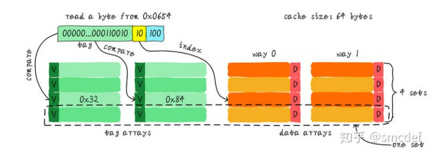

# 0x00 导读

主要参考知乎专栏 [高速缓存与一致性专栏](https://zhuanlan.zhihu.com/p/136300660) 。

[CPU-Cache-and-Memory-Ordering.pdf](http://www.valleytalk.org/wp-content/uploads/2013/07/CPU-Cache-and-Memory-Ordering.pdf)

[CPU_cache](https://en.wikipedia.org/wiki/CPU_cache)

[Cache_(computing)](https://en.wikipedia.org/wiki/Cache_(computing))

[memory-ordering](http://gavinchou.github.io/summary/c++/memory-ordering)

# 0x01 简介

当 CPU 试图从某地址 load 数据时，首先从 L1 cache 中查询是否命中，如果命中则把数据返回给 CPU 。如果 L1 cache 缺失，则继续从 L2 cache 中查找。当 L2 cache 命中时，数据会返回给 L1 cache 以及 CPU 。如果 L2 cache 也缺失，则需要从主存中 load 数据，将数据返回给 L2 cache 、 L1 cache 及 CPU 。

## 1.1 Cache

1. Cache 的主要原理是利用:  
     `Spatial Locality`( 空间局部性：引用过的位置很可能在不远的将来会再引用旁边的位置 )   
     `Temporal Locality`( 时间局部性：引用了一次很可能在不远的将来还会再引用一次 )。

2. Cache 分为三层: `L1`、`L2`、`L3`.

3. 可以使用 `lscpu` 查看 cpu cache.

## 1.1 cache 相关定义

1. **`inclusive cache`** ，其中某一地址的数据可能存在多级缓存中。  
**`exclusive cache`**，这种 cache 保证某一地址的数据缓存只会存在于多级 cache 其中一级。也就是说，任意地址的数据不可能同时在 L1 和 L2 cache中缓存。

    `inclusive cache` 是目前常见的形式，虽然浪费了空间，但是效率高。例如当多个 core 之间协作的时候，core 0 只需要访问大家共用的 L3 就知道某个数据是否存在于其它 core 中。

2. cache 的大小称之为 **`cahe size`** ，代表 cache 可以缓存最大数据的大小。  
我们将 cache 平均分成相等的很多块，每一个块大小称之为 **`cache line`** ，其大小是 **`cache line size`** 。  

3. **cache line 是 cache 和主存之间数据传输的最小单位**。  
    例如， cache line 大小是 8 字节， CPU 即使读取 1 byte ，在 cache 缺失后， cache 会从主存中 load 8 字节填充整个 cache line 。

# 0x02 直接映射缓存(Direct mapped cache)

## 2.1 例子
64 Bytes 大小的 cache ， cache line 大小是 8 字节。我们可以类似把这块 cache 想象成一个数组，数组总共8个元素，每个元素大小是8字节。

假如 CPU 从 0x0654 地址读取一个字节，如何判断数据是否在 cache 中命中呢？

1. 利用地址 3 bits（下图，地址黄色部分）查找某一行，这部分 bit 称之为 **index**。  
    其大小和 cache line 的数量有关，是其对数。假设有 16 行 cache line ，则 index 应该是 4 位。
2. 利用地址 3 bits（下图，地址蓝色部分）用来寻找这一行中 8 个字节的某一字节，我们称这部分 bit 组合为 **offset**。   
    其大小和 cache line 的大小有关，是其对数。假设有 cache line size 等于 64 ，则 offset 应该是 6 位。

这样我们就找到了第 3 行数据的第 5 个字节。

## 2.2 tag array

### 2.2.1 介绍

`tag array` 和 `data array` 一一对应。**每一个 cache line 都对应唯一一个 tag** ， tag 中保存的是整个地址位宽去除 index 和 offset 使用的 bit 剩余部分（如上图地址绿色部分）。

`tag` 、 `index` 和 `offset` 三者组合就可以唯一确定一个地址了。

当我们根据地址中 index 位找到 cache line 后，取出当前 cache line 对应的 tag ，然后和地址中的 tag 进行比较，如果相等，这说明 cache 命中。如果不相等，说明当前 cache line 存储的是其他地址的数据，这就是 cache 缺失。  

在上述图中，我们看到 tag 的值是 0x19 ，和地址中的 tag 部分相等，因此在本次访问会命中。

我们可以从图中看到 tag 旁边还有一个 valid bit ，这个 bit 用来表示 cache line 中数据是否有效（例如：1代表有效；0代表无效）。所以，上述比较 tag 确认 cache line 是否命中之前还会检查 valid bit 是否有效。只有在有效的情况下，比较 tag 才有意义。如果无效，直接判定 cache 缺失。

再看一个例子：512 Bytes cache size，64 Bytes cache line size。根据之前的地址划分方法， offset、index 和 tag 分别使用 6 bits、3 bits 和 39 bits。

### 2.2.2 注意

`tag array` 存储在硬件 cache 里，占用真实 cache 内存。但是我们提到 cache size 的时候，并没有考虑 tag 的占用。所以计算时，请忽略 tag 占用。

## 2.3 cache thrashing

我们现在思考一个问题，对于地址 0x00 、 0x40 、 0x80 地址中 index 部分是一样的。因此，这 3 个地址对应的 cache line 是同一个。所以，当我们访问 0x00 地址时， cache 会缺失，然后数据会从主存中加载到 cache 中第 0 行 cache line 。当我们访问 0x40 地址时，依然索引到 cache 中第 0 行 cache line ，由于此时 cache line 中存储的是地址 0x00 地址对应的数据，所以此时依然会 cache 缺失。然后从主存中加载 0x40 地址数据到第一行 cache line 中。同理，继续访问 0x80 地址，依然会 cache 缺失。这就相当于每次访问数据都要从主存中读取，所以 cache 的存在并没有对性能有什么提升。访问 0x40 地址时，就会把 0x00 地址缓存的数据替换。这种现象叫做 `cache 颠簸`（`cache thrashing`）。针对这个问题，我们引入 **`多路组相连缓存`**。

-----

# 0x03 两路组相连缓存(Two-way set associative cache)

## 3.1 way

我们依然假设 64 Bytes cache size ， cache line size 是 8 Bytes 。
什么是路（way）的概念。我们将 cache 平均分成多份，每一份就是一路。因此，两路组相连缓存就是将 cache 平均分成 2 份，每份 32 Bytes 。

cache 被分成 2 路，每路包含 4 行 cache line 。我们将所有索引一样的 cache line 组合在一起称之为`组`（图中的 set）。

## 3.2 例子

例如，上图中一个组有两个 cache line ，总共 4 个组。我们依然假设从地址 0x0654 地址读取一个字节数据。由于 cache line size 是 8 Bytes，因此 offset 需要 3 bits，这和之前直接映射缓存一样。不一样的地方是 index ，在两路组相连缓存中， index 只需要 2 bits ，因为一路只有 4 行 cache line 。上面的例子根据 index 找到第 4 行 cache line ，第 4 行对应 2 个 cache line ，分别对应 way 0 和 way 1 。因此 index 也可以称作 set index （组索引）。先根据 index 找到 set ，然后将组内的所有 cache line 对应的 tag 取出来和地址中的 tag 部分对比，如果其中一个相等就意味着命中。

## 3.3 
**组(set) 是横着的，等于 cache line 的条数。**  
**路(way) 是竖着的，等于 data array 的个数。**

对于上一个例子，假如 0x00 被加载到 way0 ，0x40 被加载到 way1 ，这样就降低了颠簸。

# 0x04 全相连缓存(Full associative cache)

既然组相连缓存那么好，如果所有的 cache line 都在一个组内。岂不是性能更好。是的，这种缓存就是全相连缓存。  
也就是 `set = 1 ，way = cache size / cache line size`

我们依然以 64 Byts 大小 cache 为例说明。

由于所有的 cache line 都在一个组内，因此地址中不需要 set index 部分。因为，只有一个组让你选择，间接来说就是你没得选。我们根据地址中的 tag 部分和所有的 cache line 对应的 tag 进行比较（硬件上可能并行比较也可能串行比较）。哪个 tag 比较相等，就意味着命中某个 cache line 。因此，在全相连缓存中，任意地址的数据可以缓存在任意的 cache line 中。所以，这可以最大程度的降低 cache 颠簸的频率。但是硬件成本上也是更高。

## 4.1 思考

考虑这么一个问题，32 KB 大小 4 路组相连 cache ， cache line 大小是 32 Bytes 。请思考以下2个问题：

1. 多少个组(set)？
2. 假设地址宽度是 48 bits ， index 、 offset 以及 tag 分别占用几个 bit ？

答案: 总共 4 路，因此每路大小是 8 KB 。 cache line size 是 32 Bytes ，因此一共有 256 组（ 8 KB / 32 Bytes）。由于 cache line size 是 32 Bytes ，所以 offset 需要 5 位。一共 256 组，所以 index 需要 8 位，剩下的就是 tag 部分，占用 35 位。

# 0x05 总结

## 5.1

`N-way set associative cache` ：
- N = 1, `Direct mapped cache`, 每个 `Set` 只有一个 `Cacheline`。
- N = 2, `Two-way set associative cache`, 多个 `Set` ，每个 `Set` 有多个 `Cacheline` ，数目等于 `way` 的数目。
- N = cache size / cache line size, `Full associative cache`, 只有一个 `Set` ，所有 `Cacheline` 都在这个 `Set` 中。

`N` 值越大，冲突越低，定位越慢；所以 `Direct-Mapped Cache` 定位最快，冲突最严重；`Full Associative Cache` 冲突最低，定位最慢；

## 5.2 

`Cacheline` 中包含 `valid` 、 `tag` 和 `data` .   

地址被分成了 `3` 段用来查找 `cacheline`:
- `offset` 是表示该内存数据在 `Cacheline` 中 `data` 中的 `offset` 。
- `index` 是用来定位 `Set` 的。
- `tag` 是和 `Cacheline` 中的 `tag` 做匹配的。

记得 `index` 和 `offset` 位数的计算方法，后续的 `VIPT` 什么时候不出现别名情况用得上。