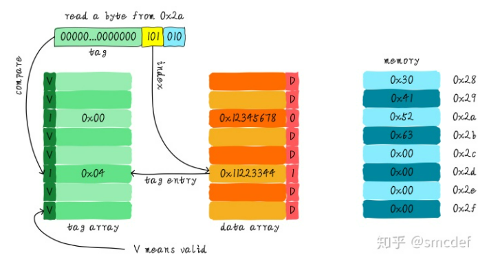
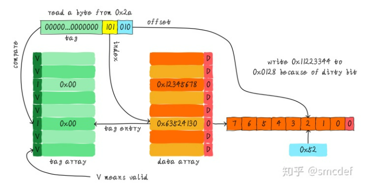

# 0x00. 导读

cache 策略: Cache update policy and Cache allocation policy

# 0x01. 简介

# 0x02. cache 策略

[Cache wiki](https://en.wikipedia.org/wiki/Cache_(computing))

## 2.1 Cache 更新策略( Cache update policy )

指当发生 `cache hit` 时，数据已经写入 cache 了，何时更新内存数据。 

- `write through` (写直通)  
    write is done synchronously both to the cache and to the backing store. 
- `write back` (写回)  
    initially, writing is done only to the cache. The write to the backing store is postponed until the modified content is about to be replaced by another cache block. 

## 2.2 Cache 分配策略( Cache allocation policy )

指当发生 `cache miss` 时，是否需要将数据加载到 cache 。

- `no write allocate policy`( `write around` )   
    写指令直接更新主存数据。
- `write allocate policy`( `fetch on write` )   
    首先从主存中加载数据到 cache line 中（相当于先做个读分配动作，因为 cache line 中没有想要写的地址的，所以先加载，再写），然后会更新 cache line 中的数据。

## 2.3 wiki 流程图

一般是 `write-back + write allocate` ，也就是说，当 write miss 的时候用 write allocate ，当 write hit 的时候用 write-back 。   
`write-through + no-write allocate` 。也就是说，当 write miss 的时候用 no-write allocate ，当 write hit 的时候用 write-through 。   

下图源自 [wiki Cache_](https://en.wikipedia.org/wiki/Cache_(computing))

图1 `Write-back_with_write-allocation`

图2 `Write-through_with_no-write-allocation`

## 2.4 例子

有一个 64 Bytes 大小直接映射缓存， cache line 大小是 8 Bytes ，采用 `write-back + write allocate`。

当 CPU 从地址 0x2a 读取一个字节， cache 中的数据将会如何变化呢？假设当前 cache 状态如下图所示( tag 旁边 valid 一栏的数字 1 代表合法。 0 代表非法。后面 Dirty 的 1 代表dirty， 0 代表没有写过数据，即非 dirty )。

根据 index 找到对应的 cache line ，对应的 tag 部分 valid bit 是合法的，但是 tag 的值不相等，因此 hit miss。

此时我们需要从地址 0x28 （因为 cache 和 memory 之间通信的最小单位是 cache line 。 0x2a 二进制是 101010 ， index 是 101 ，所以从主存中取出地址为 101000~101111 的 8 字节写入 cache line ）加载 8 字节数据到该 cache line 中。

但是，我们发现当前 cache line 的 dirty bit 置位。因此， cache line 里面的数据不能被简单的丢弃，由于采用 `write-back` 机制，所以我们需要将 cache 中的数据 0x11223344 写到地址 0x0128(0001 0010 1000) 地址（旧数据 tag 是 0x4 ，也就是 100 ， index 是 101 ，加上最后三位 offset 应该是 000 ，因为要将全部 8 字节数据都写回主存，所以旧数据的地址是 0001 0010 1000 ）。

当写回操作完成，我们将主存中 0x28 地址开始的 8 个字节加载到该 cache line 中( 更新 entry )，并清除 dirty bit 。然后按照 cache hit  流程将找到 0x52 返回给 CPU 。
