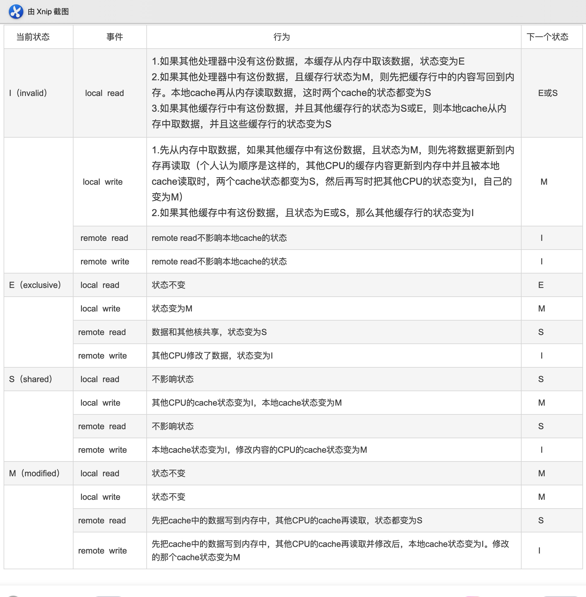

# 0x00. 导读

多核 cache 如何保持一致性。  

[Yizhou Shan's Home Page Practical Cache Coherence](http://lastweek.io/notes/cache_coherence/)

# 0x01. 简介

我们知道每个 CPU 都有一个私有的 L1 Cache 。假设一个 2 核的系统，我们将会有 2 个 L1 Cache 。这就引入了一个问题，不同 CPU 之间的 L1 Cache 如何保证一致性呢？

# 0x02. MESI

## 2.1 Bus Snooping

当 CPU0 修改自己私有的 Cache 时，硬件就会广播通知到总线上其他所有的 CPU 。对于每个 CPU 来说会有特殊的硬件监听广播事件，并检查是否有相同的数据被缓存在自己的 CPU 。如果 CPU1 私有 Cache 已经缓存即将修改的数据，那么 CPU1 的私有 Cache 也需要更新对应的 cache line 。这个过程就称作 `bus snooping` 。

## 2.2 MESI Protocol

这种 `bus snooping` 方法简单，但要需要每时每刻监听总线上的一切活动。我们需要明白的一个问题是不管别的 CPU 私有 Cache 是否缓存相同的数据，都需要发出一次广播事件。这在一定程度上加重了总线负载，也增加了读写延迟。

针对该问题，提出了一种状态机机制降低带宽压力。这就是 `MESI protocol`（协议）。
简单说就是每个 cache line 都具有状态， cpu cache line 之间通过消息发送与回复通信。

**MESI是现在一种使用广泛的协议，用来维护多核 Cache 一致性。**

我们可以将 MESI 看做是状态机。我们将每一个 cache line 标记状态，并且维护状态的切换。

## 2.3 例子

1. 当 `CPU0` 读取 0x40 数据，数据被缓存到 `CPU0` 私有 Cache ，此时 `CPU1` 没有缓存 0x40 数据，所以我们标记 `cache line` 状态为 `Exclusive` 。 

    `Exclusive` 代表 `cache line` 对应的数据仅在数据只在一个 CPU 的私有 Cache 中缓存，并且其在缓存中的内容与主存的内容一致。

2. 然后 `CPU1` 读取 0x40 数据，发送消息给其他 `CPU` ，发现数据被缓存到 `CPU0` 私有 Cache ，数据从 `CPU0 Cache` 返回给 `CPU1` 。此时 `CPU0` 和 `CPU1` 同时缓存 0x40 数据，此时 `cache line` 状态从 `Exclusive` 切换到 `Shared` 状态。

    `Shared` 代表 `cache line` 对应的数据在 "多" 个 CPU 私有 Cache 中被缓存，并且其在缓存中的内容与主存的内容一致。

3. 继续 `CPU0` 修改 0x40 地址数据，发现 0x40 内容所在 `cache line` 状态是 `Shared` 。 `CPU0` 发出 `invalid` 消息传递到其他 `CPU` ，这里是 `CPU1` 。 `CPU1` 接收到 `invalid` 消息。将 `0x40` 所在的 `cache line` 置为 `Invalid` 状态。

    `Invalid` 状态表示表明当前 cache line 无效。
    
4. 然后 `CPU0` 收到 `CPU1` 已经 `invalid` 的消息，修改 0x40 所在的 `cache line` 中数据。并更新 `cache line` 状态为 `Modified` 。 

    `Modified` 表明 `cache line` 对应的数据仅在一个CPU私有Cache中被缓存，并且其在缓存中的内容与主存的内容不一致，代表数据被修改。

    如果 `CPU0` 继续修改 0x40 数据，此时发现其对应的 `cache line` 的状态是 `Modified` 。因此 `CPU0` 不需要向其他 `CPU` 发送消息，直接更新数据即可。

5. 如果 0x40 所在的 `cache line` 需要替换，发现 `cache line` 状态是 `Modified` 。所以数据应该先写回主存。

以上是 `cache line` 状态改变的举例。我们可以知道 `cache line` 具有4中状态，分别是 `Modified` 、 `Exclusive` 、 `Shared` 和 `Invalid` 。取其首字母简称 `MESI` 。当 `cache line` 状态是 `Modified` 或者 `Exclusive` 状态时，修改其数据不需要发送消息给其他 `CPU` ，这在一定程度上减轻了带宽压力。

# 0x03. MESI Protocol Messages

`Cache` 之间数据和状态同步沟通，是通过发送 `message` 同步和沟通。 `MESI` 主要涉及一下几种 `message` 。

1. `Read`: 如果 CPU 需要读取某个地址的数据。
2. `Read Response`: 答复一个读消息，并且返回需要读取的数据。
3. `Invalidate`: 请求其他 `CPU invalid` 地址对应的 `cache line` 。
4. `Invalidate Acknowledge`: 回复 `invalidate` 消息，表明对应的 `cache line` 已经被 `invalidate` 。
5. `Read Invalidate`: `Read` + `Invalidate` 消息的组合。
6. `Writeback`: 该消息包含要回写到内存的地址和数据。

继续以上的例子，我们有 5 个步骤。现在加上这些 `message` ，看看消息是怎么传递的。

1. `CPU0` 发出 `Read` 消息。主存返回 `Read Response` 消息，消息包含地址 0x40 的数据。
2. `CPU1` 发出 `Read` 消息， `CPU0` 返回 `Read Response` 消息，消息包含地址 0x40 数据。
3. `CPU0` 发出 `Invalidate` 消息， `CPU1` 接到消息后，返回 `Invalidate Acknowledge` 消息。
4. 不需要发送任何消息。
5. 发送 `Writeback` 消息。

# 0x04. atomic

我们可以借助 MESI 实现原子操作。

## 4.1 Bus Lock

当 `CPU` 发出一个原子操作时，可以先锁住 `Bus（总线）` 。这样就可以防止其他 `CPU` 的内存操作。等原子操作结束，释放 `Bus` 。这样后续的内存操作就可以进行。这个方法可以实现原子操作，但是锁住 `Bus` 会导致后续无关内存操作都不能继续。实际上，我们只关心我们操作的地址数据。只要我们操作的地址锁住即可，而其他无关的地址数据访问依然可以继续。

## 4.2 Cacheline Lock

我们知道 `Cache line` 的状态处于 `Exclusive` 或者 `Modified` 时，可以说明该变量只有当前 CPU 私有 Cache 缓存了该数据。所以我们可以直接修改 Cache line 即可更新数据。

我们依然假设只有 2 个 CPU 的系统。当 `CPU0` 试图执行原子递增操作时。
1. `CPU0` 发出 `Read Invalidate` 消息，其他 `CPU` 将原子变量所在的缓存无效，并从 `Cache` 返回数据。 `CPU0` 将 `Cache line` 置成 `Exclusive` 状态。然后将该 `cache line` 标记 `locked` 。
2. 然后 `CPU0` 读取原子变量，修改，最后写入 `cache line` 。
3. 将 `cache line` 置位 `unlocked` 。

在步骤 `1` 和 `3` 之间，如果其他 CPU（例如 CPU1 ）尝试执行一个原子递增操作， CPU1 会发送一个 `Read Invalidate` 消息， `CPU0` 收到消息后，检查对应的 `cache line` 的状态是 `locked` ，暂时不回复消息（ `CPU1` 会一直等待 `CPU0` 回复 `Invalidate Acknowledge` 消息）。直到 `cache line` 变成 `unlocked` 。这样就可以实现原子操作。我们称这种方式为 `锁cache line` 。
**这种实现方式必须要求操作的变量位于一个 `cache line` 。**

# 0x05 总结

多核 Cache 一致性由硬件保证，对软件来说是透明的。因此我们不用再考虑多核 Cache 一致性问题。另外，现在 CPU 硬件采用的一致性协议一般是 MESI 的变种。例如 ARM64 架构采用的 MOESI Protocol 。多一种 Owned 状态。多出来的状态也是为了更好的优化性能。