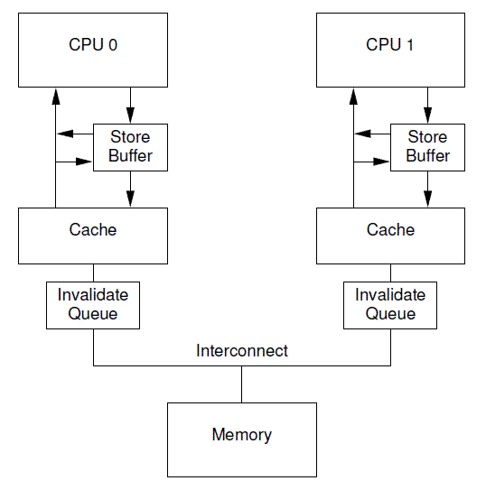

# 0x00. 导读

# 0x01. 简介


# 0x02. store buffer

`L1 Cache` 命中的情况下，访问数据一般需要 `2` 个指令周期。而且当 `CPU` 遭遇 `write cache miss` 时，内存访问延迟增加很多（发出 `invalidate` 消息并等待大家回复 `invalidate acknowledge` ）。

硬件工程师为了追求极致的性能，在 `CPU` 和 `L1 Cache` 之间又加入一级缓存，我们称之为 `store buffer` 。

`store buffer` 只缓存 `CPU` 的 **写操作**（因为 `CPU` 没必要在那等 `invalidate acknowledge` 的回复，浪费时间，叫一个小弟去等就好）。
`store buffer` 访问一般只需要 `1` 个指令周期，这在一定程度上降低了内存写延迟。不管 `cache` 是否命中， `CPU` 都是将数据写入 `store buffer` 。 `store buffer` 负责后续以 `FIFO` 次序写入 `L1 Cache` 。

## 2.1 内存一致性问题

但是，又引入了新的问题
```c++
/*
 * 假设 thread_cpu0 在 CPU0 上执行， thread_cpu1 在 CPU1 上执行。
 * 因为 store buffer ，我们竟然可能得到 r1 = 0, r2 = 0
*/
static int x = 0, y = 0;
static int r1, r2;


static void int thread_cpu0(void)
{
        x = 1;    /* 1) */
        r1 = y;   /* 2) */
}


static void int thread_cpu1(void)
{
        y = 1;    /* 3) */
        r2 = x;   /* 4) */
}


static void check_after_assign(void)
{
        printk("r1 = %d, r2 = %d\n", r1, r2);
}
```
1. 当 `CPU0` 执行 `x = 1` 时， `x` 的值会被写入 `CPU0` 的 `store buffer` 。
2. `CPU1` 指令 `y = 1` 操作，同样 `y` 的值会被写入 `CPU1` 的 `store buffer` 。
3. `r1 = y` 执行时， `CPU0` 读取 `y` 的值，由于 `y` 的新值依然在 `CPU1` 的 `store buffer` 里面，所以 `CPU0` 看到 `y` 的值依然是 `0` 。所以 `r1` 的值是 `0` 。为什么 `CPU0` 看到 `y` 的值是 `0` 呢？ **因为硬件 `MESI` 协议只会保证 `Cache` 一致性，只要值没有被写入 `Cache` (依然躺在 `store buffer` 里面)， `MESI` 就管不着。** 同样的道理， `r2` 的值也会是 `0` 。
    
    此时我们看到了一个意外的结果。

注意：虽然 `store buffer` 主要是用来缓存 `CPU` 的 **写操作**，但是 CPU 自己**读取数据**时也会检查 **私有** `store buffer` 是否命中，如果没有命中才会查找 `L1 Cache` 。这主要是为了 `CPU` 自己看到自己写进 `store buffer` 的值。

所以 `CPU0` 是可以看到 `x` 值更新，但是 `CPU1` 不能及时看到 `x` 。同样， `CPU1` 可以看到 `y` 值更新，但是 `CPU0` 不能及时看到 `y` 。所以，我们经常说 **“单核乱序对程序员是透明的，只有其他核才会受到乱序影响”**。

# 0x03. Store Forwarding 和 Invalid Queue

因为 store buffer 的存在，导致了乱序问题，为了解决问题，又引入新的技术。

## 3.1 Store Forwarding

从上面的例子中我们可以看出，`store buffer` 可能导致破坏程序顺序的问题，所以硬件工程师在 `store buffer` 的基础上，又实现了 `store forwarding` 技术。也叫 `Store to load forwarding(STLF)` .

> If the load reads its data from the memory/cache, it will read an old value that would have been overwritten by the preceding store.

> data from the store is forwarded directly to the load without having to wait for it to be written to memory/cache.

`Store Forwarding`: cpu 可以直接从 store buffer 中加载数据，即支持将 cpu 存入 store buffer 的数据传递 (forwarding) 给后续的加载操作，而不经由 cache 。

## 3.2 Invalid Queue

CPU0 收到 CPU1 发出的 `Invalidate` 消息的时候需要将对应的 `cache line` 置为 `Invalid` ，然后回复 `Invalidate ACK` 给 CPU1 ，然后 CPU1 才会继续干活，这个地方就有优化，思路还是同步转异步: 

    cpu 不必要处理了 cache line 之后才回 Invalidate ACK ，而是可以先将 Invalid 消息放到 Invalid Queue ，然后就返回 Invalidate ACK 。后续再处理 Invalid Queue 中的消息，大幅度降低 Invalidate ACK 响应时间。

加入了 `Invalid queue` 之后， cpu 在处理任何 cache line 的 `MSEI` 状态前，都必须先看 `invalid queue` 中是否有该 cache line 的 `Invalid` 消息没有处理。



# 0x04. 读写屏障

## 4.1 smp_wmb

cpu 执行 `smp_wmb()` 的思路是: 

先把当前 `store buffer` 中的数据刷到 `cache` 之后，再执行屏障后的“写入操作”，该思路有两种实现方式: 
- 一是简单地刷 `store buffer` 到 `cache line` 。
- 二是将当前 `store buffer` 中的条目打上标记，然后将屏障后的 `store` 也写到 `store buffer` 中， cpu 继续干其他的事，当被打上标记的条目全部刷到 `cache line` ，之后再刷后面的条目。（注意，屏障后的 write 即使可以直接写 cache 也不会让它写，而是只写到 store cache 中）。

## 4.2 smp_rmb

cpu 执行 `smp_rmb()` 的思路是：

会先把当前 `invalidate queue` 中的数据处理掉之后，再执行屏障后的“读取操作”。

## 4.3 smp_mb
`smp_mb()` : 同时具有读屏障和写屏障功能

```
store---------------------+
load----------+           |
              |           |
              v           v
-----------------smp_mb()--------------
              ^           ^
              |           |
load----------+           |
store---------------------+
```

`smp_mb()` 就像是不可逾越的屏障，后面的 `load/store` 绝不允许越过 `smp_mb()` 前执行。前面的 `load/store` 也不能越界到它的后面执行。

## 4.5 例子

[内存屏障的来历](https://zhuanlan.zhihu.com/p/125549632)

文章详细举例说了 store buffer 、 invalidate queue 、 r/wmb 的产生解决了什么问题以及带来了什么问题。

# 0x05. 内存模型

一致性分为两种，一种是 **`cache`一致性 **，一种是**内存一致性**。

cache 一致性和内存一致性有什么区别呢？  
- cache 一致性关注的是多个 CPU 看到一个地址的数据是否一致。  
- 内存一致性关注的是多个 CPU 看到多个地址数据读写的次序。

一个关注的是一个地址，一个关注的是多个地址的顺序。

针对内存一致性问题，提出内存模型的概念。为什么需要内存模型呢？我觉得主要是为了方便软件工程师在不理解硬件的情况下，还能理解代码执行是怎么回事，并编写正确的并行代码。


当我们思考内存一致性问题时，我们应该关注的是内存模型。根据内存模型理论，就可以指导我们写出正确的代码。


smp_wmb() 的作用是阻止它后面的写操作不会乱序到宏前面的写操作指令前执行。它就像是个屏障，写操作不容逾越。smp_wmb() 充当的就是一个 store-store 屏障。但是这个屏障只针对 store 操作，对 load 操作不影响。

```
store---------+
              |
              v
-------store-store barrier--------
              ^
              |
store---------+
```


smp_rmb() 保证屏障后的读操作不会乱序到屏障前的读操作，只针对读操作，不影响写操作。

```
store--------------------------+
load----------+                |
              |                |   ^
              v                |   |
------------smp_rmb()----------|---|------
              ^                |   |
              |                v   |
load----------+                    |
store------------------------------+
```