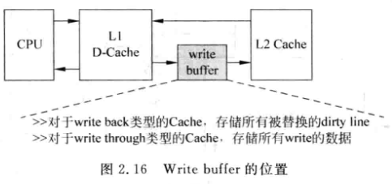
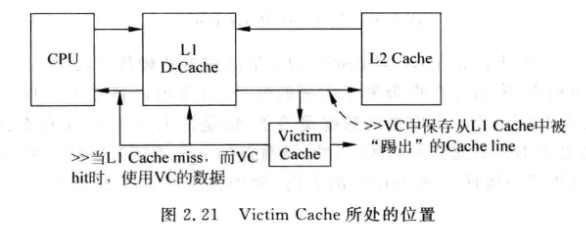
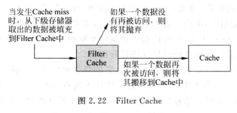

# 0x00. 导读

# 0x01. 简介

在真实世界的处理器中，会采用更复杂的方法来提高 Cache 的性能，这些方法包括 **写缓存(write buffer)、流水线(pipelined Cache)、多级结构(multilevel Cache)、Victim Cache和预取(prefetching)**等方法，不管是顺序执行还是乱序执行的处理器，都可以从这些方法中受益，这些方法将在本节进行介绍。除此之外，对于乱序执行的超标量处理器来说，根据它的特点，还有一些其他的方法来提高 Cache 的性能，例如**非阻塞(non-blocking)Cache、关键字优先(critical word first)和提前开始(early restart)**等方法。

# 0x02. 写缓存（write buffer）

L2-Cache 一般只有一个读写端口， 当 D-Cache 发生缺失， 需要从下级存储读取数据， 并写到 Cache line 中， 如果这个 line 是脏的， 需要先将其写回下级存储，对 L2-Cache 来说，需要将它先写到下级存储器中，再读， 串行完成. 这样增加了从下级存储读入数据到 Cache 的延迟

解决: (写延迟策略) 增加一个 write buffer， 当脏的 line需 要写回时先放到 write buffer 中， 等到下级存储有空的时候才会将 write buffer 中的数据写回下级存储。

使用写缓存之后，可以将 D-Cache 中的数据写到下级存储器的时间进行隐藏
- 对于写回(write back)类型的 D-Cache 来说，当一个脏状态的 Cache line 被替换的时候，这个 line 中的数据会首先放到写缓存中，然后就可以从下级存储器中(例如 L2 Cache )读数据了，而写缓存中的数据会择机写到下级存储器中，例如当下级存储器的接口空闲的时候。
- 对于写通(write through)类型的 D-Cache 来说，采用写缓存之后，每次当数据写到 D-Cache 的同时，并不会同时也写到下级存储器中，而是将其放到写缓存中，这样就减少了写通类型的 D-Cache 在写操作时需要的时间，从而提高了处理器的性能，而写通类型的 Cache 由于便于进行存储器一致性(coherence)的管理，所以在多核的处理器中，L1 Cache会经常采用这种结构。

当然，加入写缓存之后，会增加系统设计的复杂度，举例来说，当读取 D-Cache 发生缺失时，不仅需要从下级存储器中查找这个数据，还需要在写缓存中也进行查找，这需要在写缓存中加入地址比较的 CAM 电路，很显然，写缓存中存储的数据是最新的，如果在其中发现了缺失的数据，那么就需要使用它，而抛弃从下级存储器中读取的数据。

总结来看，写缓存就相当于是 L1Cache 到下级存储器之间的一个缓冲，通过它，向下级存储器中写数据的动作会被隐藏，从而可以提高处理器执行的效率，尤其是对于写通(write through)类型的 D-Cache 来说，写缓存尤为必要。

# 0x03. 流水线

对读 Cache 来说， 可以实现 tag SRAM 和 data SRAM 的读取并行。但是对于写 Cache 需要先比较 tag， 通过之后才能写入 data， 所以需要串行。只有通过 Tag 比较，确认要写的地址在 Cache 中之后，才可以写 Data SRAM，在主频比较高的处理器中，这些操作很难在一个周期内完成，这就需要对 D-Cache 的写操作采用流水线的结构，流水线的划分有很多种方式，比较典型的方式是将 Tag SRAM 的读取和比较放在一个周期，写 Data SRAM 放在下一个周期，这样对于一条 store 指令来说，即使在 D-Cache 命中的时候，最快也需要两个周期才可以完成写操作，但是整体来看，如果连续地执行 store 指令，那么仍可以获得每周期执行一条 store 指令的效果。

# 0x04. 多级结构

L1 Cache -> L2 Cache -> DRAM

这会涉及到一个 exclusive（数据只有一份） 和 inclusive（数据有多份） cache 分类。
- Exclusive : 避免浪费, 可以获得更大的 Cache 可用容量, 提高处理器性能
- Inclusive : 写数据时可以直接写入 L1 Cache, 不需要再读下级存储出来合并后再写入, 且一致性管理更简单

现代的大多数处理器都采用了 Inclusive 类型的 Cache 。

# 0x05. Victim Cache

cache 中被踢出的数据可能马上又要被用, 又不能增加 cache 的 way 数, 可以采用 VC. VC 用于保存最近被踢出的数据, 本质是相当与增加了 way 数。

通常 Victim Cache 才用全相连方式，容量都比较小（一般存 4~16 个数据）。

还有一种和 Victim Cache 类似的设计思路，称为 Filter Cache ，只不过它使用在 Cache“之前”，而 Victim Cache 使用在 Cache“之后”。当一个数据第一次被使用时，它并不会马上放到 Cache 中，而是首先会被放到 Filter Cache 中，等到这个数据再次被使用时，它才会被搬移到 Cache 中，这样做可以防止那些偶然被使用的数据占据 Cache ，因为这样的数据在以后的时间并不会继续被使用，因此它最好不要放在 Cache 中，使用 Filter Cache 可以过滤掉这些偶然使用的数据，从而提高 Cache 的利用效率，这种设计思路如图所示。

# 0x06. 预取

之前讲过影响 Cache 缺失率的 3C 定理，其中有一项是 Compulsory，当处理器第一次访问一条指令或者一个数据时，这个指令或数据肯定不会在 Cache 中，这样看起来，这种情况引起的缺失似乎是不可避免的，但是实际上，使用 预取(prefetching) 可以缓解这个问题，所谓预取，本质上也是一种**预测技术**，它猜测处理器在以后可能使用什么指令或数据，然后提前将其放到 Cache 中，这个过程可以使用硬件完成，也可以使用软件完成，它们最终的目的都是一样的，下面分别进行介绍。

## 6.1 硬件预取

对于指令来说，猜测后续会执行什么指令相对是比较容易的，因为程序本身就是串行执行的，因此只需要在访问 I-Cache 中的一个数据块(data block)的时候，将它后面的数据块也取出来放到 I-Cache 中就可以了，当然，由于程序中存在分支指令，所以这种猜测有时候也会出错，导致不会被使用的指令进人了 I-Cache，这一方面降低了 I-Cache 实际可用的容量，一方面又占用了本来可能有用的指令，这称为 Cache污染，不仅浪费了时间，还会影响处理器的执行效率，为了避免这种情况的发生，可以将预取的指令放到一个单独的缓存中。

当 I-Cache 发生缺失时，除了将需要的数据块(datablock)从下级存储器(例如 L2-Cache)取出来并放到 I-Cache 中，还会将下一个数据块也读取出来，只不过它不会放到 L1-Cache 中，而是放到一个称为 Stream Buffer 的地方，在后续执行时，如果在 I-Cache 中发生了缺失，但是在 Stream Buffer 中找到了想要的指令，那么除了使用 Stream Buffer 中读取的指令之外，还会将其中对应的数据块搬移到 L1-Cache 中，同时继续从 L2-Cache 中读取下一个数据块放到 Stream Buffer 中，当程序中没有遇到分支指令时，这种方法会一直正确地工作，从而使 I-Cache 的缺失率得到降低，当然，分支指令会导致 Stream Buffer 中的指令变得无效，此时的预取相当于做了无用功，浪费了总线带宽和功耗，事实上，使用预取的方法是一把双刃剑，它可能会减少 Cache 的缺失率，也可能由于错误的预取而浪费功耗和性能，这种情况对于数据的预取尤为明显，需要在设计的时候仔细进行权衡。

数据的预取规律就比较难以琢磨了。

## 6.2 软件预取

编译器知道程序的细节， 所以可以通过编译器控制程序进行预取。

有几点需要注意：

1. 预取的时机。
   
   如果预取数据的时间太晚，那么当真正需要使用数据时，有可能还没有被预取出来，这样的预取就失去了意义;
   如果预取的时间太早，那么就有可能踢掉 D-Cache 中一些本来有用的数据，造成 Cache 的“污染”。要选择一个合适的时机进行预取，也就是要决定程序中P的取值，不过，这并没有一个准确的答案，需要根据实际的设计情况来决定。

2. 非阻塞
   
   使用软件预取的方法，当执行预取指令的时候，处理器需要能够继续执行，也就是继续能够从 D-Cache 中读取数据，而不能够让预取指令阻碍了后面指令的执行，这就要求 D-Cache 是非阻塞(non-blocking)结构

3. 异常处理
   
   在实现了虚拟存储器(Virtual Memory)的系统中，预取指令有可能会引起一些异常(exception)，例如发生 Page Fault、虚拟地址错误(Virtual Address Fault)或者保护违例(Protection Violation)等。此时有两种选择：
   - 如果对这些异常进行处理，就称这种预取指令为 **处理错误的预取指令(Faulting Prefetch Instruction)**
   - 如果不对这些异常进行处理并抛弃掉这条预取指令，就称这种预取指令为 **不处理错误的预取指令(Nonfaulting PrefetchInstruction)**，此时发生异常的预取指令就会变成一条空指令，这种方法符合预取指令的定位，使预取指令悄无声息的执行，对于程序员来说是不可见的，现代的很多处理器都采用这种方式。